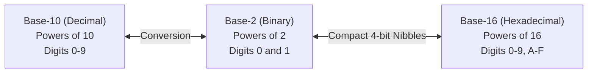
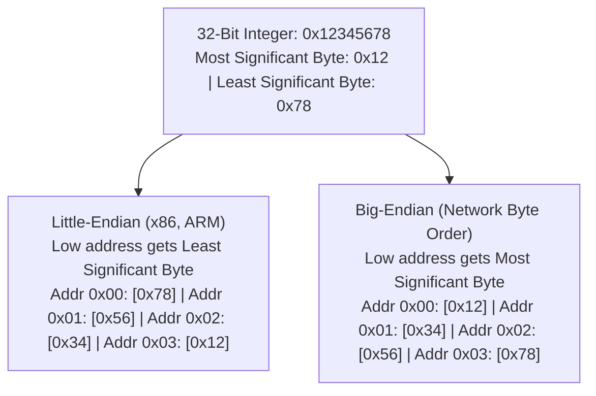

<Concepts items={["binary & hexadecimal", "ASCII & Unicode", "variable-length UTF-8", "two's complement", "IEEE 754 floats", "endianness"]} />

<LessonIntro>

Inside system RAM, a byte is just an anonymous physical pattern of eight microscopic switches: `01000001`. On its own, this byte has no intrinsic meaning. Is it the integer number $65$? Is it the capital letter `"A"`? Is it a pixel's opacity channel, an audio wave sample, or an opcode instructing the CPU to halt?

Meaning is not inherent to the hardware — it is created entirely by **Encoding**: a shared, rigorous agreement on how software interprets sequences of bits. Without encoding standards, computers are merely engines of random electrical noise.

</LessonIntro>

## Why this matters

Almost every high-profile data corruption incident, garbled international email, corrupted database record with diamond question marks (``), broken string truncation bug, and catastrophic financial rounding error in production software traces directly back to an encoding or type interpretation mistake. 

Computers do not natively understand "text" or "decimal currency" — they only evaluate bit patterns. Mastering the layer where bits become symbols and numbers is essential for every systems, backend, and security engineer.

---

## 01 — Number Systems: From Binary to Hexadecimal

Humans count in base-10 (decimal) because biology provided us with ten fingers. Computers count in base-2 (binary) because silicon transistors possess only two stable states: non-conducting (`0`) and conducting (`1`).



### Binary Place Values

In decimal, every column moving left multiplies by 10 ($10^0 = 1, 10^1 = 10, 10^2 = 100$). In binary, every column moving left multiplies by 2 ($2^0 = 1, 2^1 = 2, 2^2 = 4, 2^3 = 8, \dots$):

| $2^7$ ($128$) | $2^6$ ($64$) | $2^5$ ($32$) | $2^4$ ($16$) | $2^3$ ($8$) | $2^2$ ($4$) | $2^1$ ($2$) | $2^0$ ($1$) | Decimal Calculation | Total Value |
| :---: | :---: | :---: | :---: | :---: | :---: | :---: | :---: | :--- | :--- |
| `0` | `0` | `0` | `0` | `0` | `0` | `0` | `0` | $0$ | **$0$** |
| `0` | `0` | `0` | `0` | `0` | `0` | `0` | `1` | $1 \times 1$ | **$1$** |
| `0` | `0` | `0` | `0` | `0` | `0` | `1` | `0` | $1 \times 2$ | **$2$** |
| `0` | `0` | `0` | `0` | `0` | `0` | `1` | `1` | $1 \times 2 + 1 \times 1$ | **$3$** |
| `0` | `1` | `0` | `0` | `0` | `0` | `0` | `1` | $1 \times 64 + 1 \times 1$ | **$65$** |
| `1` | `1` | `1` | `1` | `1` | `1` | `1` | `1` | $128 + 64 + 32 + 16 + 8 + 4 + 2 + 1$ | **$255$** |

### Hexadecimal: The Ergonomic Shorthand

Reading strings of binary like `0100000111111111` quickly exhausts human working memory. Because $16 = 2^4$, **one hexadecimal digit represents exactly four bits (a nibble)**.

Hexadecimal uses digits `0` through `9`, followed by letters `A` ($10$) through `F` ($15$):

$$\text{Binary } \underbrace{0100}_{4} \quad \underbrace{0001}_{1} \longrightarrow \mathbf{0x41} \text{ (Hexadecimal)}$$

$$\text{Binary } \underbrace{1111}_{\text{F}} \quad \underbrace{1111}_{\text{F}} \longrightarrow \mathbf{0xFF} \text{ (Decimal } 255\text{)}$$

Two hex characters cleanly represent one full byte ($8\text{ bits}$). This is why hex is universally used for memory addresses (`0x7FFEE4`), cryptographic hashes (SHA-256), and CSS color codes (`#FF6600`).

---

## 02 — Text Encoding: ASCII, Unicode & Variable-Length UTF-8

Computers cannot store letters; they only store numbers. To store text, we must construct a **Character Encoding Table** mapping numeric code points to visual glyphs.


*Figure 2.1 — The 7-bit ASCII standard. Code point 65 maps to 'A', 97 to 'a', and 32 to space.*

### The Limitations of ASCII

Created in 1963, **ASCII (American Standard Code for Information Interchange)** utilized 7 bits, providing $2^7 = 128$ character positions. This easily handled standard English letters (`A-Z`, `a-z`), decimal numerals (`0-9`), punctuation, and terminal control characters (`\n`, `\t`).

However, ASCII failed globally:
* Extended ASCII utilized the 8th bit for 256 characters, but spawned dozens of mutually incompatible code pages (ISO-8859-1, Windows-1252, KOI8-R).
* Opening a document encoded in Russian KOI8-R on a Greek or French system yielded unintelligible gibberish known as **Mojibake** (``).

### Unicode: One Table for Humanity

**Unicode** solved this chaos by abandoning code pages. It is an universal consortium-maintained catalog assigning a unique integer identifier called a **Code Point** (written like `U+0041` for "A", or `U+1F600` for "😀") to every character in every historic and modern world language, mathematical notation, and emoji.

### UTF-8: The Ingenious Solution

Unicode defines the code point numbers, but **UTF-8 (Unicode Transformation Format — 8-bit)** dictates how those code points are physically packed into byte streams.

UTF-8 is a **variable-length encoding** ranging from 1 to 4 bytes:

| Code Point Range | Bytes Used | Byte 1 Format | Byte 2 Format | Byte 3 Format | Byte 4 Format | Target Scripts |
| :--- | :---: | :---: | :---: | :---: | :---: | :--- |
| `U+0000` to `U+007F` | **1** | `0xxxxxxx` | — | — | — | Standard ASCII (English) |
| `U+0080` to `U+07FF` | **2** | `110xxxxx` | `10xxxxxx` | — | — | Latin accents, Greek, Arabic |
| `U+0800` to `U+FFFF` | **3** | `1110xxxx` | `10xxxxxx` | `10xxxxxx` | — | Chinese, Japanese, Korean |
| `U+10000` to `U+10FFFF`| **4** | `11110xxx` | `10xxxxxx` | `10xxxxxx` | `10xxxxxx` | Emoji, historic scripts, symbols |

> [!IMPORTANT] Backward Compatibility & Self-Synchronization
> 1. **100% ASCII Compatible:** Any pure 7-bit ASCII document is already a valid UTF-8 document, as single-byte characters always start with a leading `0`.
> 2. **Self-Synchronizing:** Multibyte continuation bytes always start with `10xxxxxx`. If a network connection drops mid-character, the parser skips ahead to the next byte starting with `0` or `11` and immediately recovers without corrupting the rest of the file.

---

## 03 — Numeric Representation: Integers & IEEE 754 Floats

### Signed Integers & Two's Complement

To store positive and negative integers in fixed-width registers, hardware uses **Two's Complement** notation. 

In an 8-bit signed integer:
* The most significant bit (MSB) acts as a negative sign weight ($-128$).
* Positive numbers ($0\text{ to }127$): `00000000` to `01111111`.
* Negative numbers ($-128\text{ to }-1$): `10000000` ($-128$) up to `11111111` ($-1$).

Two's complement is ubiquitous because CPU ALUs can perform subtraction using standard addition circuitry without needing separate arithmetic paths ($A - B = A + (\sim B + 1)$).

### Floating-Point Numbers & The $0.1 + 0.2$ Trap

Why does `0.1 + 0.2` equal `0.30000000000000004` in JavaScript, Python, and C++?

Computers represent real numbers using the **IEEE 754 Floating-Point Standard**. A 64-bit float (double precision) splits its bits into three distinct fields:

```
[ 1 bit: Sign ] [ 11 bits: Exponent ] [ 52 bits: Mantissa / Fraction ]
```

$$\text{Value} = (-1)^{\text{Sign}} \times (1 + \text{Mantissa}) \times 2^{\text{Exponent} - 1023}$$

Just as $\frac{1}{3}$ cannot be written finitely in base-10 decimal ($0.333333\dots$), numbers like $\frac{1}{10}$ ($0.1$) cannot be represented finitely in base-2 binary ($0.0001100110011\dots_2$). The finite 52-bit mantissa truncates the repeating pattern, resulting in minute precision rounding errors.

> [!CAUTION] Production Financial Software
> **Never store currency or financial balances in floating-point types (`float`, `double`).** 
> Accumulating minute precision errors across millions of transactions leads to auditing discrepancies and balance drift. Always represent currency as **integer cents** (e.g. `$19.99` $\rightarrow$ `1999`) or utilize arbitrary-precision decimal libraries (`BigDecimal` in Java, `decimal` in Python).

---

## 04 — Memory Layout & Endianness

When storing multi-byte values (such as a 32-bit integer `0x12345678`) in sequential byte addresses, the CPU must choose an internal storage direction:



* **Little-Endian:** Places the least significant byte (LSB) at the lowest memory address. Used by virtually all modern consumer hardware (Intel/AMD x86-64 and Apple/ARM).
* **Big-Endian:** Places the most significant byte (MSB) first, mirroring human reading order. Used in network protocol headers (IP, TCP), which is why Big-Endian is officially known as **Network Byte Order**.

When transmitting data across networks, systems call `htons()` (Host to Network Short) or `htonl()` to ensure communicating machines agree on byte order regardless of CPU architecture.

---

## 05 — Production Case Study & Practical Examples

The exact same byte pattern means completely different things depending on the interpretive lens:

```python
value = 65

# 1. Base conversions
print(bin(value))          # 0b1000001  (Binary)
print(hex(value))          # 0x41       (Hexadecimal)

# 2. Text interpretation
print(chr(value))          # 'A'        (ASCII / UTF-8 glyph)
print(ord("A"))            # 65         (Code point)

# 3. Floating-point imprecision
print(0.1 + 0.2)           # 0.30000000000000004

# 4. Multi-byte UTF-8 string length trap
emoji = "😀"
print(len(emoji))                 # 1 (Python character count)
print(len(emoji.encode("utf-8"))) # 4 (Physical bytes in UTF-8: 0xF0 0x9F 0x98 0x80)
```

> [!TIP] The String Slicing Trap
> If you slice a string by raw byte offsets instead of character boundaries in languages like C, Go, or Rust:
> ```rust
> let s = "Café";
> // Slicing 4 bytes slices through the 2-byte 'é' (0xC3 0xA9), producing invalid UTF-8!
> ```
> Always slice on **grapheme cluster** or **Unicode scalar** boundaries to avoid creating corrupted glyphs.

---

## Summary Checklist: Data Representation Mental Model

1. **A byte has no inherent meaning:** `01000001` is only `65`, `"A"`, `#41`, or an opcode because an application or hardware controller applies a specific encoding rule.
2. **Hexadecimal is an ergonomic view:** $1\text{ hex digit} = 4\text{ bits}$ (nibble); $2\text{ hex digits} = 1\text{ byte}$.
3. **UTF-8 is variable-length:** ASCII takes 1 byte, European scripts take 2 bytes, Asian scripts take 3 bytes, and emoji take 4 bytes. Slicing raw bytes breaks text.
4. **Binary floating-point is approximate:** Powers of 2 cannot represent decimal tenths precisely. Never use standard floats for financial transactions.
5. **Endianness dictates byte direction:** Little-endian stores least-significant bytes first; big-endian (network byte order) stores most-significant bytes first.
