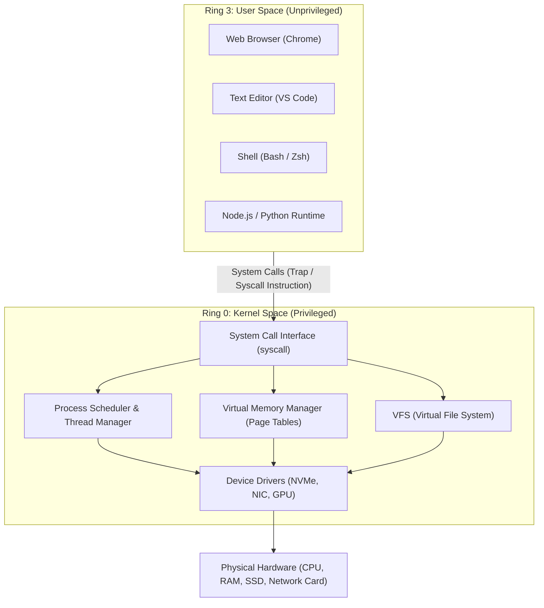
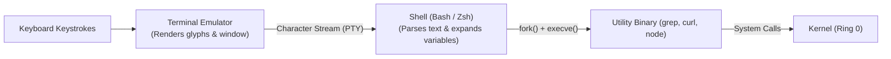
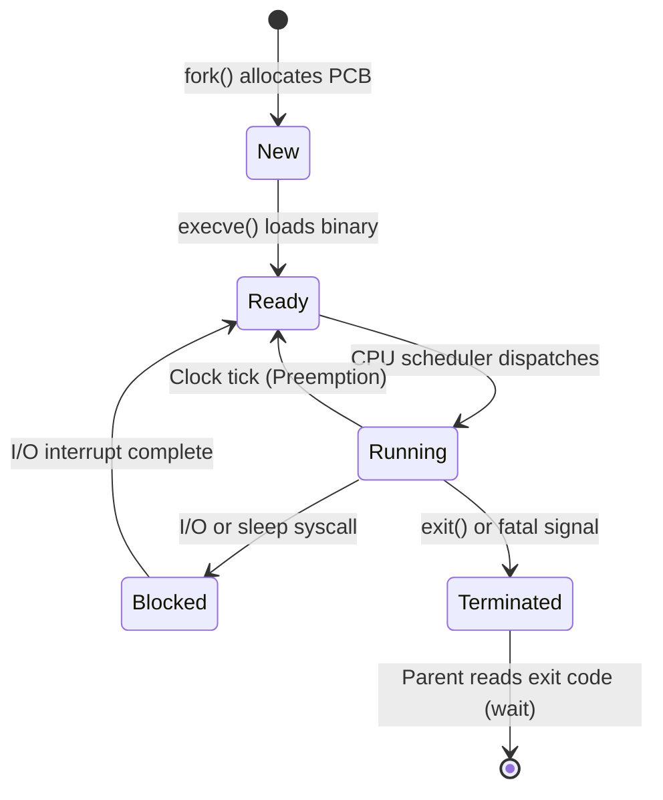
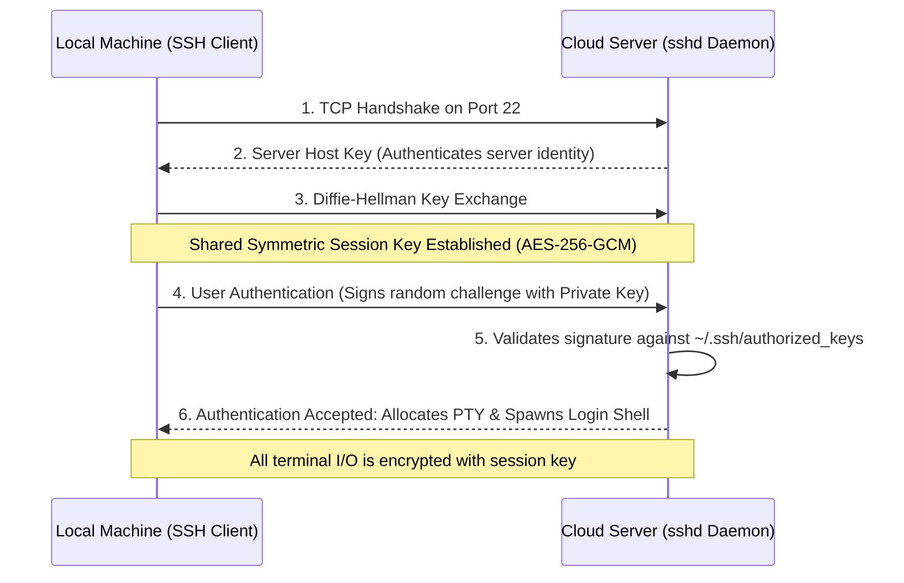

<Concepts items={["OS kernel & Ring 0", "system calls (syscalls)", "shell & standard streams", "process signals & lifecycle", "SSH cryptography & tunnels"]} />

<LessonIntro>

When you sit at a modern computer or connect to a remote cloud instance, you never touch silicon directly. Between your software code and the physical microchips sits the **Operating System Kernel** — Linux, Windows NT, or Darwin (macOS). 

The kernel is the ultimate referee: it decides which process gets CPU execution time, isolates memory pages between competing programs, and translates generic user operations into device-specific electrical bus signals through **device drivers**. Above this kernel sits the **Shell** — a text-driven command interface enabling developers to compose complex software pipelines, manipulate filesystems, and administer servers across the globe via encrypted **SSH** tunnels.

</LessonIntro>

## Why this matters

Virtually every backend server, microservice container (Docker/Kubernetes), and CI/CD deployment pipeline executes inside an operating system commanded through a shell. 

When a production pod crashes with exit code 137 (OOM killed), when permissions prevent an API from reading a secret key, or when a database backup pipeline stalls due to an unhandled broken pipe, graphical user interfaces cannot help you. Understanding the boundaries between user space, the shell, system calls, and remote SSH tunnels is the hallmark of a resilient software engineer.

---

## 01 — The OS Kernel & Hardware Privilege Rings

Modern microprocessors enforce hardware-level privilege boundaries known as **CPU Protection Rings**:



### User Space vs Kernel Space

* **Ring 3 (User Space):** All everyday software runs here. Code running in Ring 3 is physically prevented by the CPU from executing privileged instructions (such as disabling interrupts or modifying page tables) and cannot access physical memory outside its assigned address space.
* **Ring 0 (Kernel Space):** The core OS kernel executes here with unlimited, bare-metal hardware access. It is responsible for memory isolation, thread scheduling, file access, and hardware communication.

### System Calls: The Controlled Gateway

Whenever a user-space application needs to allocate memory, write to a disk file, or open a network socket, it must issue a **System Call (syscall)**:

1. The program populates CPU registers with the syscall number and arguments (e.g., `sys_read = 0`, `sys_write = 1` on x86-64 Linux).
2. The program issues a special CPU instruction (`syscall` or `int 0x80`), which triggers a hardware context switch.
3. The CPU elevates privilege from Ring 3 to Ring 0 and jumps to the kernel's registered **System Call Handler**.
4. The kernel validates the calling process's permissions, executes the request via device drivers, and transitions back to Ring 3 with the return value.

> [!NOTE] GUI vs CLI: The Same Kernel Underneath
> Whether you click a folder icon in macOS Finder or type `cd /var/log` in a terminal, both actions ultimately invoke the exact same underlying `chdir()` system call. The CLI and GUI are simply two different user-space user interfaces wrapping the identical kernel interface.

---

## 02 — The Shell & The Unix Philosophy

A **Terminal** is not a shell, and a shell is not a terminal:

* **Terminal Emulator:** The graphical window program (e.g., iTerm2, Alacritty, Windows Terminal) that handles font rendering, colors, and captures your raw keyboard keystrokes.
* **Shell:** The text-based command language interpreter running *inside* the terminal (e.g., `bash`, `zsh`, `fish`, `powershell`).



### The Read-Eval-Print Loop (REPL)

When you type a command and hit Enter, the shell performs five distinct operations:
1. **Lexing & Parsing:** Tokenizes the command string into executable commands, arguments, and flags.
2. **Expansion:** Expands environment variables (`$HOME`), wildcards (`*.log`), and command substitutions (`$(date)`).
3. **Path Resolution:** Checks if the command is a shell built-in (`cd`, `echo`). If not, it searches the directories listed in the `$PATH` environment variable in sequential order.
4. **Execution:** Forks a new child process and replaces its memory image with the binary executable (`execve`).
5. **Waiting:** Waits for the child process to complete and captures its numeric **Exit Code** ($0 = \text{success}$, non-zero = failure).

### Standard Streams & Unix Pipelines

The Unix philosophy states: *Write programs that do one thing well, and write programs that work together using text streams as the universal interface.*

Every process is automatically initialized with three open file descriptors:

| File Descriptor | Stream Name | Default Source / Destination | Redirection Syntax |
| :---: | :--- | :--- | :---: |
| `0` | **`stdin`** (Standard Input) | Keyboard input stream | `< file.txt` |
| `1` | **`stdout`** (Standard Output) | Terminal display screen | `> out.txt` (overwrite) / `>> out.txt` (append) |
| `2` | **`stderr`** (Standard Error) | Terminal display screen | `2> errors.log` |

```bash
# Complex pipeline chaining simple single-purpose tools via streams
cat server.log | grep "500 Internal Server Error" | awk '{print $4}' | sort | uniq -c > summary.txt
```

In the pipeline above, the pipe operator (`|`) connects the `stdout` (FD 1) of the left program directly into the `stdin` (FD 0) of the right program entirely in memory without writing temporary files to disk.

---

## 03 — Process Lifecycle & Signals

Every running program on an operating system is a **Process** with its own isolated virtual memory space, file descriptor table, and unique numeric **Process ID (PID)**.



### Process Management & IPC Signals

Processes communicate and handle lifecycle events using asynchronous notifications called **Signals**:

| Signal Name | Number | Keyboard Trigger | Can Be Caught? | Purpose & Behavior |
| :--- | :---: | :---: | :---: | :--- |
| **`SIGINT`** | `2` | `Ctrl + C` | Yes | Interrupt request; cleanly stops interactive foreground programs. |
| **`SIGQUIT`**| `3` | `Ctrl + \` | Yes | Quits program and dumps core memory for debugging. |
| **`SIGKILL`**| `9` | — | **NO** | Kernel immediately and unconditionally terminates the process. |
| **`SIGTERM`**| `15` | `kill <pid>` | Yes | Graceful termination request (default); allows cleanup before exiting. |
| **`SIGHUP`** | `1` | Terminal Close | Yes | Hangup signal sent to child processes when controlling terminal closes. |

> [!CAUTION] The SSH Disconnect Trap (SIGHUP)
> When you start a long-running process (like a database migration or build script) on a remote server over SSH and close your laptop, the controlling pseudo-terminal terminates, broadcasting `SIGHUP` to all child processes and killing your work!
> To prevent this, decouple the process using `nohup <command> &` or run inside a persistent terminal multiplexer like **`tmux`** or **`screen`**.

---

## 04 — Secure Shell (SSH): Cryptography Across Untrusted Networks

Administering remote cloud servers requires running shell commands across untrusted public networks. The **Secure Shell (SSH)** protocol (standardized on TCP port 22) guarantees confidentiality, integrity, and authentication.



### How Public-Key Authentication Works

Instead of vulnerable passwords, production SSH uses **Asymmetric Cryptography** (e.g., Ed25519 or RSA-4096):

1. **Key Generation:** You generate a pair: a private key (`~/.ssh/id_ed25519`, never leaves your machine) and a public key (`~/.ssh/id_ed25519.pub`).
2. **Server Trust:** You append your public key to the remote user's `~/.ssh/authorized_keys` file.
3. **The Challenge:** During login, the server generates a random cryptographic nonce, encrypts or hashes it, and challenges the client to sign it.
4. **Verification:** The client signs the challenge using its local private key. The server verifies the signature using the stored public key. At no point is the private key transmitted across the wire.

### Advanced SSH Capabilities: Port Forwarding

SSH can tunnel arbitrary TCP traffic inside its encrypted pipeline:

* **Local Port Forwarding (`ssh -L 5432:localhost:5432 user@server`):** Forwards a port on your local machine to a port on the remote host, allowing you to access a private database bound to the server's `127.0.0.1`.
* **Remote Port Forwarding (`ssh -R 8080:localhost:3000 user@server`):** Exposes your local development server to the remote server's network.

---

## 05 — End-to-End Trace: Executing a Remote Command

To tie this architecture together, consider what happens when you run `grep "error" app.log` on a remote cloud server:

```
[Local Keyboard] 
      │ (Keystrokes: 'g','r','e','p'...)
      ▼
[Local Terminal & SSH Client]
      │ (Encrypts payload with symmetric session key)
      ▼
[Global Internet TCP/IP Port 22]
      │
      ▼
[Remote Host: sshd Daemon]
      │ (Decrypts payload; forwards to PTY driver)
      ▼
[Remote Pseudo-Terminal (/dev/pts/1)]
      │
      ▼
[Remote Shell (Bash / Zsh)]
      │ (Parses arguments; calls fork() + execve("/usr/bin/grep"))
      ▼
[Child Process (grep)]
      │ (Calls sys_open() and sys_read() on app.log)
      ▼
[Linux Kernel (Ring 0) & Storage Driver]
      │ (Reads sectors from NVMe SSD into page cache)
      ▼
[grep matches filtered text]
      │ (Writes output to stdout / FD 1)
      ▼
[sshd encrypts stdout -> sends across network -> local terminal renders text]
```

---

## Summary Checklist: OS, Shell & SSH Mental Model

1. **Privilege separation protects the system:** User applications operate in unprivileged Ring 3 and must request hardware operations through system calls (`syscall`) to the kernel in Ring 0.
2. **The terminal is a viewport; the shell is the interpreter:** The terminal emulator renders text; the shell parses commands, expands variables, resolves paths, and spawns processes.
3. **Unix pipelines connect streams:** Standard Input (`stdin` 0), Output (`stdout` 1), and Error (`stderr` 2) enable small utilities to compose into complex data pipelines via `|`.
4. **Processes are isolated units of execution:** Every process has a unique PID and isolated virtual memory. Signals (`SIGINT`, `SIGTERM`, `SIGKILL`, `SIGHUP`) govern process lifecycle.
5. **SSH provides end-to-end cryptographic control:** Public-key cryptography authenticates sessions without passwords, creating an encrypted symmetric tunnel over TCP port 22 for remote shells and port forwarding.
