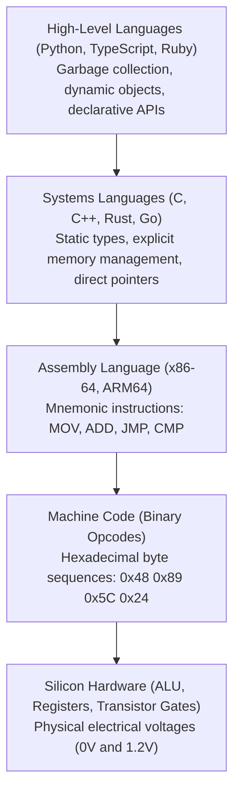
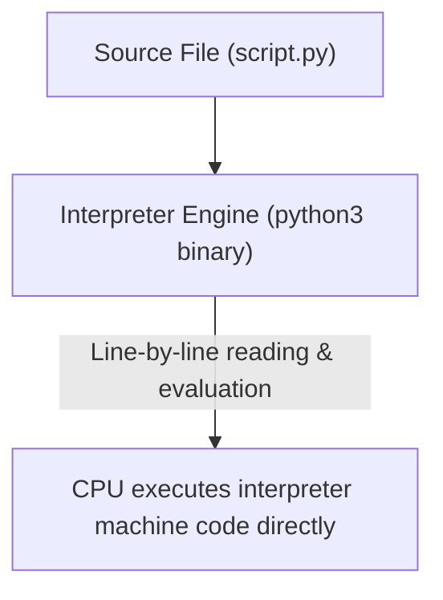
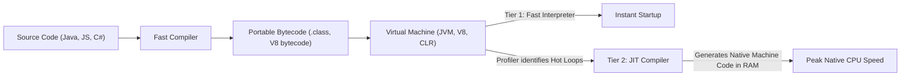

<Concepts items={["abstraction ladder", "compiler pipeline (AST)", "interpreted vs compiled", "intermediate bytecode & VM", "Just-In-Time (JIT) compilation"]} />

<LessonIntro>

A silicon CPU is capable of executing billions of operations per second, but its vocabulary is shockingly primitive: it recognizes only numeric opcodes like `0x89` (MOV) and `0x01` (ADD). No human software engineer can build a modern web platform or game engine by manually keying hexadecimal instructions into memory cells.

A **Programming Language** is an intellectual lever governed by the **Abstraction Principle**: it hides the chaotic, low-level mechanical substrate of memory buses, register allocations, and CPU cycles behind clean, human-readable syntax. Whether through ahead-of-time compilation, runtime interpretation, or hybrid JIT virtual machines, languages translate abstract human logic into raw silicon execution.

</LessonIntro>

## Why this matters

Understanding how your programming language executes is the difference between guessing why a production service is slow and mathematically diagnosing the bottleneck. 

It explains why a Go or Rust service boots in $5\text{ ms}$ while a Java or Python service takes seconds to warm up, why dynamically typed languages consume $4\times$ to $10\times$ more memory for identical data structures, and why a single unexpected polymorphic call in JavaScript can cause the V8 engine to de-optimize a hot loop and tank application throughput.

---

## 01 — The Abstraction Ladder: From Transistors to Syntax

Software engineering is built upon layers of abstractions, each insulating the developer from the physical machinery beneath:

When you write `users.filter(u => u.active)` in TypeScript or `print("Hello World")` in Python, you are perched atop forty years of computer engineering abstractions. You do not need to track which CPU register holds a pointer, how the OS allocates virtual memory pages, or how display hardware renders letterforms.

> [!NOTE] The Law of Leaky Abstractions (Joel Spolsky)
> *All non-trivial abstractions, to some degree, are leaky.* 
> When your high-level code encounters a memory limit, cache miss, floating-point rounding error, or network timeout, the abstraction cracks open, and the mechanical reality underneath reveals itself.

---

## 02 — Ahead-of-Time (AOT) Compilation: The Native Pipeline

In a pure **Compiled Language** (such as C, C++, Rust, or Go), translation happens entirely **Ahead-of-Time (AOT)** before the program is ever executed.

### The Seven Stages of Compilation

1. **Lexical Analysis (Lexing / Scanning):** Converts raw character streams into meaningful grammar tokens (identifiers, keywords like `if`/`return`, string literals, operators).
2. **Syntactic Analysis (Parsing):** Verifies syntax rules against formal grammar and organizes tokens into a hierarchical **Abstract Syntax Tree (AST)**.
3. **Semantic Analysis:** Validates variable scope, checks types, and confirms functions are called with correct parameter counts and signatures.
4. **Intermediate Representation (IR):** Translates the AST into an architecture-neutral intermediate language (such as LLVM IR).
5. **Optimization:** Performs dead code elimination, constant folding, loop unrolling, and function inlining to maximize hardware performance.
6. **Code Generation:** Translates optimized IR into target-specific assembly instructions for the host CPU (x86-64, ARM64, or RISC-V).
7. **Linking:** Combines compiled object files with external libraries, resolves cross-file function calls, and emits a standalone executable binary (ELF on Linux, Mach-O on macOS, PE `.exe` on Windows).

**Advantages:** Maximum execution speed, zero runtime translation overhead, compact memory footprint, and compile-time error detection.

---

## 03 — Interpretation: The Dynamic Execution Loop

In a pure **Interpreted Language** (such as classic Ruby, PHP, or baseline Python), no standalone machine executable is ever compiled to disk.

### How an Interpreter Works

1. The user launches the interpreter binary passing the script: `python script.py`.
2. The interpreter reads the source file from disk, parses it into an in-memory representation, and walks the syntax tree or internal virtual instructions line by line.
3. For every statement encountered, the interpreter executes its own pre-compiled native machine instructions to fulfill the command.

| Feature | Ahead-of-Time Compilation (C, Rust) | Dynamic Interpretation (Python, Ruby) |
| :--- | :--- | :--- |
| **Translation Phase** | Once before execution | Repeated continuously at runtime |
| **Output File** | Standalone native binary | None (requires runtime interpreter installed) |
| **Execution Speed** | Extremely fast ($1\times$ baseline) | Slower ($10\times\text{ to }50\times$ overhead) |
| **Development Loop**| Slower (recompilation step needed) | Instant (edit file and re-run immediately) |
| **Type Checking** | Static (caught before runtime) | Dynamic (caught during execution) |

---

## 04 — The Hybrid Paradigm: Bytecode, Virtual Machines & JIT

Modern high-performance languages reject the false dichotomy of pure compilation versus pure interpretation. Instead, they use a **Hybrid Architecture** combining intermediate bytecode with **Just-In-Time (JIT) compilation**.

### What is Bytecode?

**Bytecode** is an intermediate, highly compact instruction set designed for an idealized abstract computer known as a **Virtual Machine (VM)** (e.g., the Java Virtual Machine, .NET Common Language Runtime, or Python's CPython VM).

* Bytecode is architecture-independent: a `.class` or `.pyc` file compiled on an Intel MacBook runs unmodified on an ARM Linux server or a Windows desktop.
* The VM translates this uniform bytecode into host-specific machine instructions on the fly.

### Just-In-Time (JIT) Compilation: The Best of Both Worlds

Engines like Google Chrome's **V8** (JavaScript) and Oracle's **HotSpot** (Java) achieve near-native performance using JIT:

1. **Baseline Interpretation:** The engine immediately starts interpreting bytecode to guarantee instant application startup.
2. **Profiling (Warmup):** A background profiler monitors execution, tallying function call frequencies and tracking variable types (e.g., "Loop counter `i` is always a 32-bit integer").
3. **JIT Machine Code Generation:** When a function crosses a designated execution threshold (a **hot path**), the JIT compiler generates heavily optimized native machine code directly into RAM.
4. **On-Stack Replacement (OSR):** The engine seamlessly swaps execution from the slow bytecode interpreter to the blazing-fast native machine code in the middle of a running loop!

> [!CAUTION] The JIT De-Optimization Penalty
> If your JavaScript code passes an integer through a function $100{,}000$ times, the JIT optimizes it assuming parameter `x` is always a number. If you suddenly pass a string `x = "hello"`, the optimized assumption shatters. The engine triggers an expensive **Bailout / De-optimization**, throwing away the native code and dropping back to the slow interpreter. Keep hot functions monomorphic!

---

## 05 — Architecture Comparison & Trade-Off Matrix

| Dimension | AOT Compiled (Go, Rust, C++) | Bytecode Interpreted (CPython) | JIT Compiled (Java JVM, V8 JS) |
| :--- | :--- | :--- | :--- |
| **Startup Latency** | Instantaneous ($< 5\text{ ms}$) | Fast ($20\text{--}50\text{ ms}$) | Slower (requires VM warmup) |
| **Peak Throughput** | Maximum ($1\times$ baseline) | Modest ($15\text{--}40\times$ slower) | Near-native ($1.2\text{--}2.5\times$ baseline) |
| **Memory Footprint**| Tiny ($1\text{--}15\text{ MB}$) | Moderate ($20\text{--}50\text{ MB}$) | Heavy ($50\text{--}300\text{ MB}+$ for VM runtime) |
| **Portability** | Requires cross-compilation | Portable with Python runtime | "Write once, run anywhere" |
| **Error Discovery** | Compile-time static analysis | Runtime exceptions | Mixed (static for Java, runtime for JS) |

---

## Summary Checklist: Languages & Compilation Mental Model

1. **Languages climb the abstraction ladder:** They translate human intent into binary CPU opcodes (`0x89`, `0x01`), hiding register allocation and bus communication.
2. **AOT compilers do the heavy lifting upfront:** C, C++, Go, and Rust produce standalone platform-specific binaries with zero runtime translation overhead.
3. **Interpreters trade raw performance for agility:** They evaluate code on the fly, providing rapid iteration at the cost of continuous translation overhead.
4. **Bytecode achieves platform neutrality:** Intermediate instructions target an idealized Virtual Machine (JVM, CLR) rather than a physical CPU socket.
5. **JIT compilers optimize running code dynamically:** Modern engines profile hot paths and compile them into native machine code in memory, offering near-compiled speed with dynamic language ergonomics.
