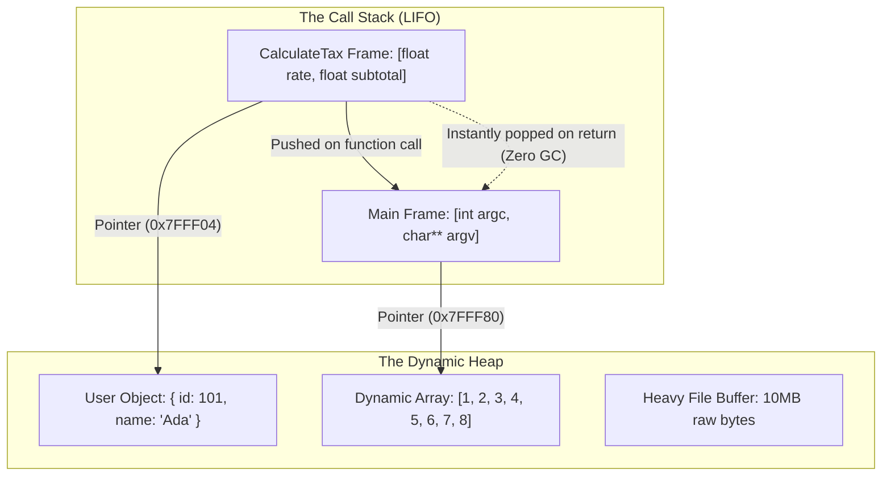
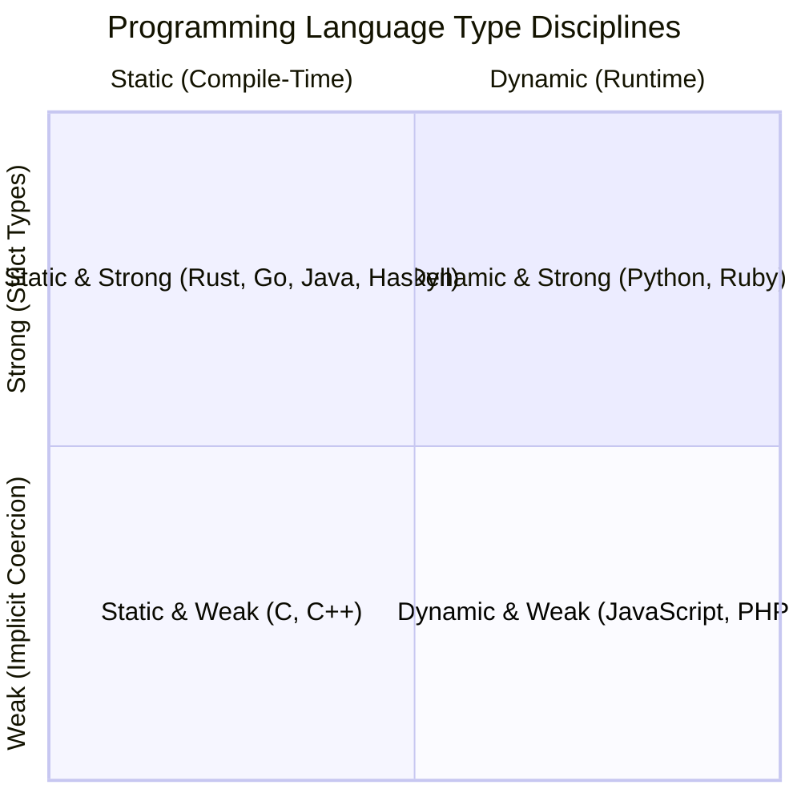
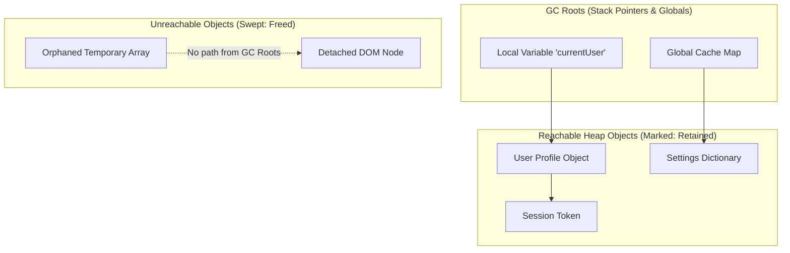

<Concepts items={["symbol binding", "stack vs heap memory", "static vs dynamic typing", "pointers & dereferencing", "garbage collection (mark & sweep)"]} />

<LessonIntro>

To system RAM, memory is merely an undifferentiated, continuous landscape of billions of numbered byte cells (`0x00000000` to `0xFFFFFFFF`). Hardware has no concept of a variable named `user_id`, a floating-point `price`, or an array of items.

A **Variable** is an abstraction that attaches a human-readable identifier to a specific memory location. In source code, it acts like a persistent container. Under the hood, the compiler or runtime maintains an internal **Symbol Table** mapping that friendly name to physical bytes in memory. How that memory is allocated, typed, and subsequently reclaimed dictates the stability, speed, and security of every program in existence.

</LessonIntro>

## Why this matters

Memory bugs are the leading cause of production downtime and cybersecurity vulnerabilities:

* **Security Exploits:** Over $70\%$ of all critical Common Vulnerabilities and Exposures (CVEs) across Microsoft Windows and Google Chrome originate from memory mismanagement (buffer overflows, dangling pointers, and use-after-free bugs).
* **Cloud Crashes:** Memory leaks in microservices gradually consume RAM until the container runtime or OS kernel forcefully executes an out-of-memory (OOM) kill (`SIGKILL` 137).
* **Latency Spikes:** Unchecked object allocations trigger massive Garbage Collection (GC) pauses that freeze real-time trading systems and multi-player gaming servers.

---

## 01 — Memory Topology: The Stack vs The Heap

When an operating system launches a process, it allocates a virtual address space split into distinct functional regions:

```
+-------------------------------------------------------+ High Memory (0xFFFFFFFF)
|  The Call Stack (Grows Downward ↓)                    |
|  - Fast, fixed-size function frames & local variables |
+-------------------------------------------------------+
|  ↓ Free Space ↓                                       |
|                                                       |
|  ↑ Free Space ↑                                       |
+-------------------------------------------------------+
|  The Heap (Grows Upward ↑)                            |
|  - Dynamic, variable-size objects with open lifetimes |
+-------------------------------------------------------+
|  BSS & Data Segment (Global & static variables)       |
+-------------------------------------------------------+
|  Text Segment (Compiled machine code instructions)    |
+-------------------------------------------------------+ Low Memory (0x00000000)
```



### The Call Stack (Fast & Predictable)

The **Stack** operates on a strict Last-In, First-Out (LIFO) basis:
* Every time a function is called, the CPU pushes a new **Stack Frame** storing the return address, parameter values, and fixed-size local primitives (e.g., `int`, `bool`, `float`).
* Moving the stack pointer takes a single CPU instruction (e.g., `sub rsp, 32`).
* When the function finishes, the frame is instantly popped off. There is zero fragmentation and zero garbage collection overhead.
* **Limitation:** Size is strictly constrained (typically $1\text{--}8\text{ MB}$). Exceeding this via infinite recursion causes a **Stack Overflow**.

### The Heap (Flexible & Dynamic)

The **Heap** is a vast, unorganized pool of memory designed for objects whose size is unpredictable at compile time (like an uploaded image or an array of dynamic database rows) or that must outlive the function that created them:
* Runtimes allocate heap memory using dynamic allocators (`malloc()` in C, `new` in C++/Java, object literals in JS).
* Allocating heap memory requires searching free-lists, acquiring thread locks, and handling memory fragmentation, making it significantly slower than stack allocation.

---

## 02 — Typing Disciplines: The Two-Dimensional Matrix

Programming language type systems are frequently categorized inaccurately. Type checking actually lives along two completely orthogonal axes:



### 1. Static vs Dynamic Typing (WHEN are types checked?)

* **Statically Typed (C, Rust, Go, Java, TypeScript):** Types are bound to variable names and verified before runtime. The compiler catches mismatched operations (like adding a boolean to a string) at compile time. Memory layout is optimized and unboxed.
* **Dynamically Typed (Python, JavaScript, Ruby):** Types belong to *values in memory*, not the variable labels. Variables are polymorphic references pointing to "boxed" heap structures holding type metadata tags. Type mismatches only explode when executed at runtime.

### 2. Strong vs Weak Typing (HOW STRICT are conversions?)

* **Strongly Typed (Python, Rust, Go):** The language refuses implicit type coercions. In Python, evaluating `"5" + 2` raises a fatal `TypeError`.
* **Weakly Typed (JavaScript, C):** The language silently coerces types behind your back. In JavaScript, evaluating `"5" + 2` evaluates to the string `"52"`, while `"5" - 2` evaluates to the number `3`.

---

## 03 — Pointers, References & The Perils of Manual Memory

A **Pointer** is a variable whose stored value is the memory address of another variable:

```c
int x = 42;          // x stores the integer value 42 at address 0x7FFEE4
int *p = &x;         // p is a pointer storing the address 0x7FFEE4
*p = 100;            // Dereferencing p modifies the value at 0x7FFEE4 to 100
```

```
Variable 'p' (Pointer)           Variable 'x' (Integer)
+-----------------------+        +-----------------------+
| Value: 0x7FFEE4       | -----> | Value: 100            |
| Address: 0x7FFEE0     |        | Address: 0x7FFEE4     |
+-----------------------+        +-----------------------+
```

### Classic Manual Memory Disasters (C / C++)

In languages requiring manual allocation (`malloc`) and deallocation (`free`), small developer oversights cause fatal bugs:

1. **Dangling Pointer & Use-After-Free:** Freeing memory block `B`, but continuing to access it through pointer `p`. If another thread reuses that memory address, attacker-controlled data can hijack the CPU execution pointer.
2. **Buffer Overflow:** Writing 12 bytes into an array allocated for only 8 bytes. The extra 4 bytes overwrite adjacent stack frames, altering function return addresses (the primary vector for remote code execution exploits).
3. **Memory Leak:** Allocating heap memory in a recurring loop but forgetting to call `free()`. The process slowly consumes gigabytes of RAM until the system becomes unresponsive.

---

## 04 — Automatic Memory Management: Garbage Collection

Modern high-level languages eliminate manual `free()` calls by delegating memory management to an automated **Garbage Collector (GC)**.

### Approach 1: Reference Counting (Swift, Python, Objective-C)

Every object in memory maintains an internal counter tracking how many references point to it:
* Increment counter when a new reference binds; decrement when a reference goes out of scope.
* When the counter hits `0`, the object is immediately destroyed.

> [!CAUTION] The Circular Reference Flaw
> If Object A points to Object B, and Object B points back to Object A (`A.next = B; B.prev = A`), their reference counts will never drop to zero even after all stack references disconnect. In pure reference-counting systems, circular references leak permanently unless broken manually or swept by a backup cycle detector.

### Approach 2: Tracing Garbage Collection (Java, Go, V8 JavaScript)

Instead of counting references, modern production runtimes use **Mark-and-Sweep** tracing:



1. **Pause / Safepoint:** The runtime halts or tracks application execution threads.
2. **Mark Phase:** The GC starts at **GC Roots** (active local variables on the call stack, global variables, CPU registers) and traverses pointers like a graph. Every visited object is marked as alive.
3. **Sweep Phase:** The GC walks the entire heap. Any memory block lacking a live mark is reclaimed and returned to the allocator free-list.
4. **Compact Phase:** Live objects are slid together into contiguous memory to eliminate fragmentation.

---

## 05 — Production Code Comparison: Values vs References

Understanding whether variables copy values or share references prevents subtle mutation bugs:

```python
# 1. Primitives pass by value-binding
x = 10
y = x
y += 5
print(x)  # 10 (x is untouched)

# 2. Objects pass by shared reference
list_a = [1, 2, 3]
list_b = list_a          # Both names point to the EXACT same heap address!
list_b.append(99)
print(list_a)            # [1, 2, 3, 99] (list_a mutated unexpectedly!)

# 3. Defensive copying breaks the link
list_c = list_a.copy()   # Allocates a new independent heap array
list_c.append(500)
print(list_a)            # [1, 2, 3, 99] (list_a remains safe)
```

---

## Summary Checklist: Variables & Memory Mental Model

1. **Variables are symbolic aliases:** They bind human identifiers in a symbol table to numeric RAM memory addresses (`0x7FFEE4`).
2. **The Stack is fast and deterministic:** It handles fixed-size function frames and primitives in strict LIFO order with zero runtime garbage collection.
3. **The Heap is dynamic and flexible:** It stores dynamic-sized objects with open lifetimes, but requires allocation search costs and garbage collection.
4. **Typing is two-dimensional:** Static vs Dynamic defines *when* types are checked (compile vs runtime); Strong vs Weak defines *how strictly* type coercion is enforced.
5. **Garbage collection traces reachability:** Mark-and-Sweep collectors periodically traverse pointers from active GC roots, reclaiming memory for any unreachable island of objects.
