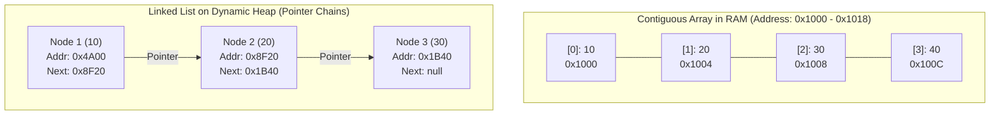
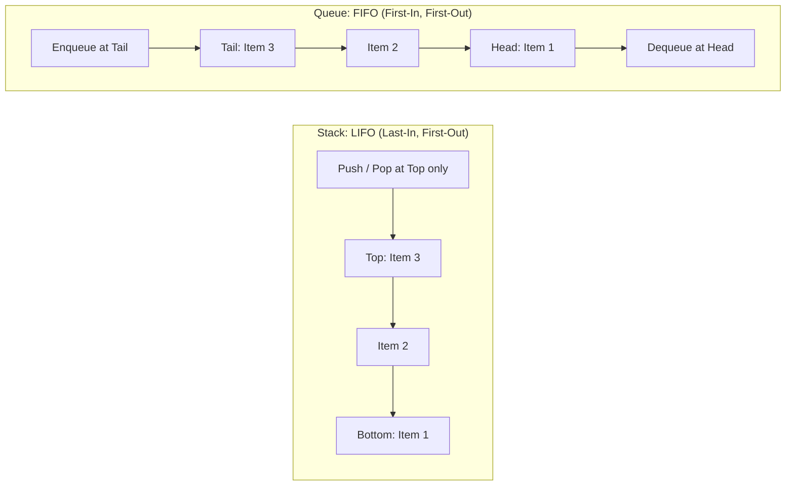
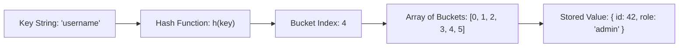
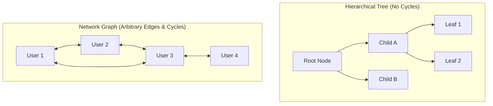

<Concepts items={["contiguous vs node-based", "arrays & linked lists", "stacks (LIFO) & queues (FIFO)", "hash tables & collision resolution", "trees (hierarchies) & graphs (networks)"]} />

<LessonIntro>

A **Data Structure** is a specialized format for organizing, storing, and accessing data in computer memory. In software engineering, choosing the right data structure is one of the most leveraged architectural decisions you can make.

The difference between a service that responds in 2 milliseconds and one that locks up for 20 minutes on a million records rarely comes down to CPU clock speeds or compiler flags — it comes down to choosing between an $O(n)$ linear array scan and an $O(1)$ constant-time hash map lookup. There is no single "best" data structure: each represents a mathematically calculated trade-off between read speed, insertion cost, and physical memory footprint.

</LessonIntro>

## Why this matters

In production systems, algorithms operate on data structures:
* **Databases:** Relational database indexes (PostgreSQL, MySQL) are organized as **B-Trees**, reducing disk reads from millions to three hops.
* **Network Routers:** Subnet routing tables use **Trie trees** for longest-prefix match lookups.
* **Message Brokers:** Distributed streaming platforms like Apache Kafka and RabbitMQ rely on persistent **FIFO Queues** to buffer asynchronous workloads.
* **Cache Layers:** Redis key-value storage relies on high-speed **Hash Tables** and **Skip Lists**.

---

## 01 — Linear Memory: Contiguous Arrays vs Linked Lists

The most fundamental architectural decision in data layout is whether items live **contiguously** side-by-side or **scattered** across the heap connected by pointers:

### Contiguous Arrays: The Speed of Offset Math

An array reserves a single uninterrupted block of physical memory:
* **Instant Direct Indexing ($O(1)$):** Locating element $i$ requires zero searching. The CPU calculates the physical memory address in a single clock cycle using arithmetic:

$$\text{Address}(i) = \text{Base Address} + (i \times \text{Size of Element})$$

* **CPU Cache Locality:** Because array cells sit side-by-side, the CPU pre-fetches adjacent elements into ultra-fast L1/L2 caches before they are even requested (spatial locality).
* **Downside:** Inserting or deleting an element at index 0 requires an expensive $O(n)$ operation to shift every subsequent element one slot to the right.

### Linked Lists: Dynamic Pointers

A linked list splits data into independent heap objects called **Nodes**, each storing the data value alongside a memory pointer to the next node:
* **Cheap Insertion/Deletion ($O(1)$):** Prepending a node at the head requires simply pointing the new node to the current head. Zero element shifting occurs.
* **Sequential Access Penalty ($O(n)$):** To read the 500th element, the CPU must traverse 499 pointer links sequentially. Random access is impossible.
* **Cache Hostility:** Nodes are scattered across the heap, causing continuous CPU cache misses.

---

## 02 — Constrained Access Patterns: Stacks & Queues

By deliberately constraining where data can enter and exit a linear structure, computer scientists created two indispensable operational primitives:

### The Stack (LIFO: Last-In, First-Out)

* **Operations:** `push(x)` adds to the top; `pop()` removes from the top ($O(1)$).
* **Everyday Applications:** 
  * The CPU **Call Stack** (managing function returns and local variable scopes).
  * The Browser **History Stack** (tracking URL navigation for "Back" and "Forward").
  * Syntax validation (matching opening and closing brackets `{ [ ( ) ] }` in compiler parsers).

### The Queue (FIFO: First-In, First-Out)

* **Operations:** `enqueue(x)` adds to the tail; `dequeue()` removes from the head ($O(1)$).
* **Everyday Applications:**
  * Operating System process scheduling queues.
  * Node.js **Event Loop Task Queues** (managing asynchronous I/O callbacks).
  * Print spoolers and distributed job processing pipelines (Celery, BullMQ).

---

## 03 — Constant-Time Lookups: Hash Tables & Sets

A **Hash Table** (known as a Dictionary in Python, Object/Map in JavaScript, or HashMap in Java) delivers near-instantaneous $O(1)$ key-value retrieval regardless of whether the collection stores 10 items or 10 million:

### The Hash Function & Index Mapping

1. **Deterministic Hashing:** The key string is passed through a mathematical hashing function (e.g., MurmurHash, SipHash) that produces a uniform 64-bit integer.
2. **Modulo Arithmetic:** The hash integer is mapped to a valid array slot index:
$$\text{Bucket Index} = \text{Hash}(\text{Key}) \pmod{\text{Total Array Capacity}}$$

### Handling Hash Collisions

Because the universe of possible string keys is infinite while array capacity is finite, two different keys will eventually hash to the same bucket index (the Pigeonhole Principle):

* **Separate Chaining:** Each bucket stores a linked list or small binary tree. Colliding items are simply chained together at that index.
* **Open Addressing (Linear Probing):** If bucket 4 is occupied, the algorithm checks bucket 5, then bucket 6, until an empty slot is found.

> [!NOTE] What is a Set?
> A **Set** is simply a Hash Table where each entry stores only the key, with no associated value. It provides instantaneous $O(1)$ duplicate checking and membership tests (`item in set`).

---

## 04 — Non-Linear Data: Trees & Graphs

When relationships are hierarchical or form complex interconnected networks, linear sequences are insufficient.

### Trees: Hierarchies Without Loops

A **Tree** begins at a single **Root** node and branches downward into child nodes without any circular loops:
* **Binary Search Tree (BST):** Every node has at most two children. The left subtree contains only smaller values; the right subtree contains only larger values. Searching an evenly balanced BST cuts the problem in half at every step ($O(\log n)$).
* **The Document Object Model (DOM):** Web browsers represent HTML pages as a hierarchical tree of nodes (`<html>` $\rightarrow$ `<body>` $\rightarrow$ `
`).

### Graphs: Arbitrary Networks

A **Graph** consists of **Vertices (Nodes)** connected by **Edges**:
* **Directed vs Undirected:** Twitter follow relationships are directed (A follows B, but B might not follow A); Facebook friendships are undirected (two-way).
* **Weighted Graphs:** Edges carry numerical values, such as road distances in Google Maps or packet latencies between internet routers.

---

## 05 — The Master Data Structures Complexity Matrix

| Data Structure | Access by Index | Search by Value | Insertion (Head/Tail) | Deletion | Primary Real-World Use Case |
| :--- | :---: | :---: | :---: | :---: | :--- |
| **Array** | $O(1)$ | $O(n)$ | $O(n)$ / $O(1)^*$ | $O(n)$ | Linear scan, indexed lookups, cache efficiency |
| **Linked List** | $O(n)$ | $O(n)$ | $O(1)$ | $O(1)$ | Fast pre-pending, building blocks for queues |
| **Stack** | $O(n)$ | $O(n)$ | $O(1)$ | $O(1)$ | Undo operations, call stacks, syntax parsers |
| **Queue** | $O(n)$ | $O(n)$ | $O(1)$ | $O(1)$ | Task buffering, asynchronous message streams |
| **Hash Table** | N/A | $O(1)$ avg | $O(1)$ avg | $O(1)$ avg | Instant key-value caching, symbol tables |
| **Binary Search Tree**| $O(\log n)$ | $O(\log n)$ | $O(\log n)$ | $O(\log n)$ | Sorted collections, range queries, DB indexing |

$^*$*Amortized constant time when appending to dynamic arrays.*

---

## Summary Checklist: Data Structures Mental Model

1. **Arrays excel at indexed reads:** Contiguous RAM placement gives $O(1)$ direct offset access and maximum CPU cache locality.
2. **Linked lists excel at insertions:** Node pointer chaining provides $O(1)$ inserts at the head without memory shifting, but suffers $O(n)$ lookup penalties.
3. **Stacks enforce LIFO; Queues enforce FIFO:** Stacks power execution call stacks and undo buffers; queues regulate asynchronous task pipelines.
4. **Hash maps trade memory for $O(1)$ speed:** Mathematical hash functions map keys to array bucket indices, resolving collisions via chaining or probing.
5. **Trees and graphs model complex relationships:** Trees power hierarchical filesystems and database search indexes; graphs model arbitrary social networks, road maps, and routing topologies.
