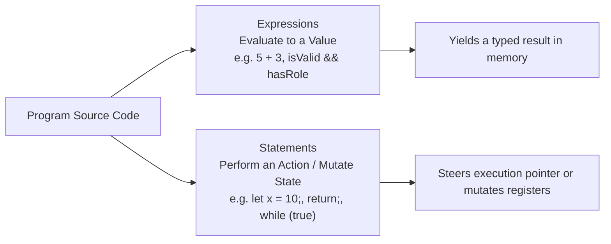
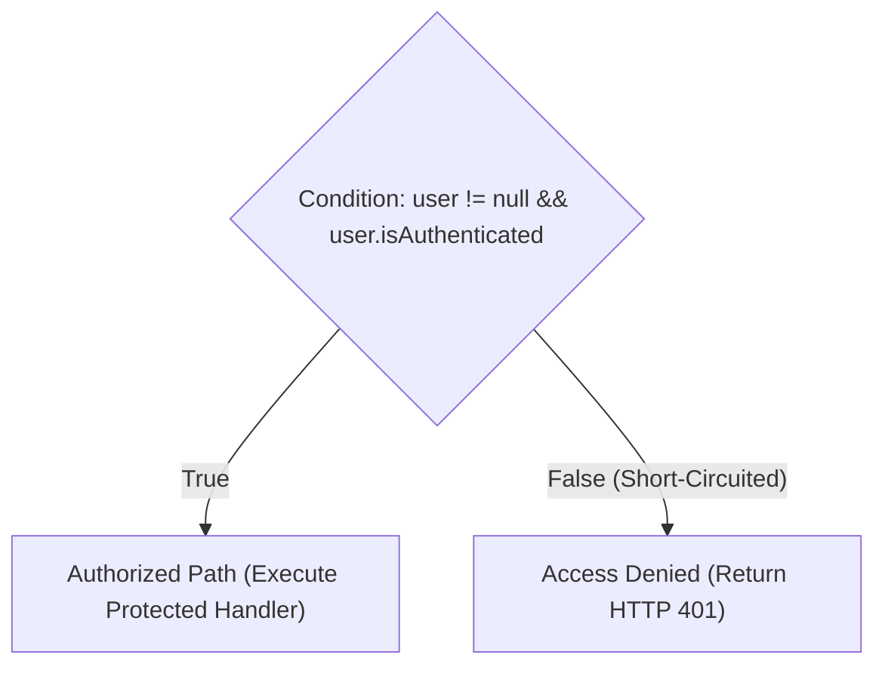
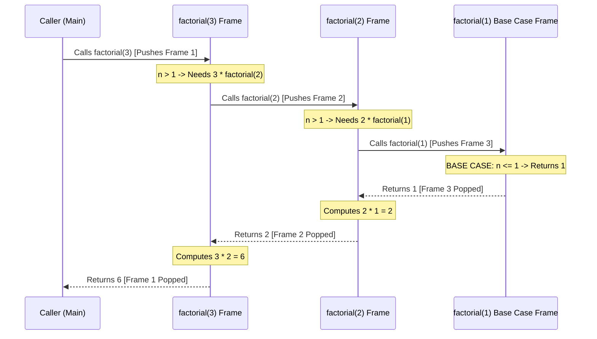
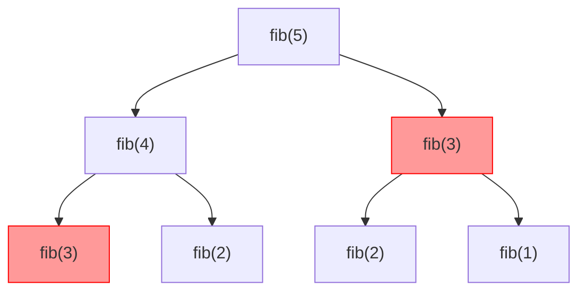

<Concepts items={["pure functions & side effects", "short-circuit boolean logic", "iteration vs recursion", "call stack frames & base cases", "tail-call optimization & memoization"]} />

<LessonIntro>

An **Algorithm** is not an impenetrable mathematical enigma — it is simply a unambiguous, finite sequence of computational steps designed to solve a specific problem. Every function you have ever written is an algorithm.

What separates an amateur algorithm from production engineering is not whether it works on a sample input of five items, but how predictably its **Control Flow** scales when handed five million inputs. Control flow provides the nervous system of software: directing execution through boolean branches, repeating workloads across collection iterators, and recursively dividing complex problems into atomic sub-tasks.

</LessonIntro>

## Why this matters

Subtle mistakes in control flow generate some of the most dangerous and elusive production bugs:
* **Production Deadlocks:** A missing base case in a recursive parser instantly triggers a `StackOverflowError`, killing the active process thread.
* **CPU Starvation:** An off-by-one boundary error in a `while` loop spins the CPU at $100\%$ indefinitely, starving adjacent container workloads.
* **Catastrophic Exponential Blowups:** Naive recursive calculations (like un-memoized tree walks) turn millisecond API responses into calculations that would outlive the heat death of the universe.

---

## 01 — Anatomies of Execution: Expressions, Statements & Functions

At the syntactic level, programming languages divide code into two distinct categories:



### The Function Abstraction

A **Function** packages a sequence of statements and expressions into a callable, named routine:
* **Pure Functions:** Given the identical input parameters, a pure function always returns the exact same output without observing or mutating outside state (no console logs, no database queries, no global variable mutations). Pure functions are trivially unit-tested, thread-safe, and cacheable.
* **Impure Functions:** Mutate external state, read files, or query network sockets. They introduce side effects and require careful error handling.

---

## 02 — Conditional Branching & CPU Branch Prediction

Software makes decisions by testing relational comparisons (`==`, `!=`, `<`, `>`), which evaluate to binary **booleans** (`true` or `false`).



### Short-Circuit Evaluation

Modern runtimes evaluate compound boolean expressions from left to right using **short-circuit logic**:

* **Logical AND (`A && B`):** If `A` evaluates to `false`, the runtime immediately halts and returns `false`. `B` is **never executed**.
* **Logical OR (`A || B`):** If `A` evaluates to `true`, the runtime immediately halts and returns `true`. `B` is **never executed**.

> [!TIP] Defensive Null Guards
> In dynamically typed or reference-based languages, short-circuiting is the standard idiom for preventing null dereference crashes:
> ```javascript
> // If user is null, user.profile is NEVER accessed, preventing a TypeError crash:
> if (user && user.profile && user.profile.email) {
>     sendNotification(user.profile.email);
> }
> ```

### Hardware Reality: CPU Branch Predictors

At the silicon level, conditional jumps (`if/else`) threaten to stall the CPU's instruction pipeline. To keep executing instructions without waiting for memory lookups, modern CPUs employ an onboard **Branch Predictor**:
* The CPU guesses which path the `if` statement will take based on historical branch statistics and speculatively executes upcoming instructions.
* If the guess was correct, execution proceeds at full speed.
* If the guess was wrong, the CPU suffers a **Branch Misprediction Penalty**: it must flush its entire pipeline ($15\text{--}20\text{ clock cycles}$) and restart along the correct path.

---

## 03 — Iteration: While Loops, For-Loops & Iterators

When a task requires repeating operations, languages provide two primary iterative structures:

| Loop Construct | Evaluation Timing | Best Used For | Risk Profile |
| :--- | :--- | :--- | :--- |
| **`while (condition)`** | Evaluated *before* every iteration | Repeating until an external state changes (e.g., reading stream bytes until EOF) | High risk of infinite loops if exit condition fails to mutate |
| **`for (item in iterable)`** | Bounded by collection size | Stepping sequentially across arrays, lists, maps, or string characters | Safe from infinite loops; risk of off-by-one errors |

```python
# The Iterator Protocol
numbers = [10, 20, 30]
iterator = iter(numbers)

print(next(iterator))  # 10
print(next(iterator))  # 20
print(next(iterator))  # 30
# next(iterator) -> Raises StopIteration (clean loop termination)
```

Behind every modern `for...in` or `for...of` loop is an **Iterator**: a stateful object maintaining an internal pointer cursor that yields values sequentially until exhausted.

---

## 04 — Recursion & The Call Stack: Divide and Conquer

**Recursion** is an algorithmic technique where a function solves a problem by breaking it down into smaller instances of itself until it reaches an atomic, non-recursive **Base Case**.

Every function call pushes a new stack frame onto the thread's call stack. The problem is solved as the call stack unwinds in LIFO order:



### The Two Non-Negotiable Rules of Recursion

1. **The Base Case:** Every recursive function must possess an explicit condition that returns a concrete value without making further recursive calls.
2. **Convergence:** Every recursive call must pass parameters that move strictly closer to the base case.

> [!CAUTION] The Stack Overflow Crash
> If a recursive function omits its base case or fails to converge, it invokes itself indefinitely:
> `def infinite(): return infinite()`
> In theory, this would run forever. In physical reality, thread stacks are constrained ($1\text{--}8\text{ MB}$). Within milliseconds, the stack pointer hits its boundary limit, and the operating system or runtime forcefully terminates the process with a fatal `StackOverflowError`.

---

## 05 — Production Case Study: Naive Recursion vs Dynamic Programming

Consider calculating the $n$-th Fibonacci number ($0, 1, 1, 2, 3, 5, 8, \dots$):

```
Naive Recursive Definition: fib(n) = fib(n - 1) + fib(n - 2)
```



Notice that `fib(3)` is computed independently twice, `fib(2)` three times, and `fib(1)` five times! This naive tree branches into an exponential computational nightmare:

$$\text{Time Complexity} = O(2^n)$$

To compute `fib(50)`, naive recursion requires over **$1{,}000{,}000{,}000{,}000{,}000$ operations** (taking days of CPU time).

### The Solution: Memoization (Caching Sub-Problems)

By storing previously computed results in a hash table (Memoization) or computing bottom-up iteratively, we eliminate redundant branches:

```python
# Optimal O(n) Dynamic Programming approach
def fib_memo(n, memo={}):
    if n in memo:
        return memo[n]
    if n <= 1:
        return n
    memo[n] = fib_memo(n - 1, memo) + fib_memo(n - 2, memo)
    return memo[n]

print(fib_memo(50))  # 12586269025 (Calculated in under 0.001 milliseconds!)
```

---

## Summary Checklist: Algorithms & Control Flow Mental Model

1. **Expressions calculate; statements act:** Expressions evaluate to typed values (`5 + 2`); statements manipulate state and control flow (`return`, `let`).
2. **Short-circuiting protects your code:** `&&` and `||` halt evaluation the instant the final boolean outcome is certain, guarding against null pointer exceptions.
3. **Branch prediction minimizes silicon stalls:** The CPU speculatively executes upcoming conditional blocks; mispredictions incur pipeline flush penalties.
4. **Recursion requires convergence:** Every recursive function must have an unyielding Base Case and move parameters closer to it, or face a fatal `StackOverflowError`.
5. **Redundant sub-problems demand caching:** Exponential recursive trees ($O(2^n)$) must be tamed into linear time ($O(n)$) using memoization or bottom-up iteration.
