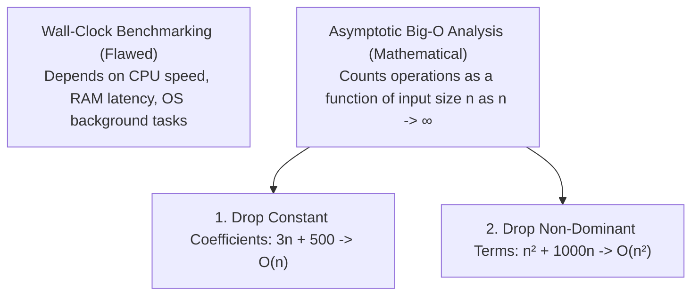
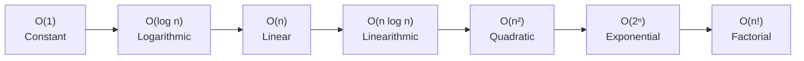
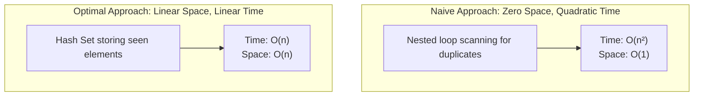

<Concepts items={["asymptotic complexity", "Big-O growth hierarchy", "time vs space trade-offs", "divide and conquer (binary search)", "dynamic programming & greedy heuristics"]} />

<LessonIntro>

Once code successfully compiles and passes tests on your laptop, the most critical engineering question arises: **will this algorithm survive production scale?**

Testing an algorithm on ten sample inputs in local development reveals almost nothing about its real-world viability. A function that completes in 1 millisecond on 50 records might require 30,000 years to execute when handed 500,000 records. **Big-O Notation** is the universal mathematical framework software engineers use to calculate the asymptotic scaling curve of code as input size approaches infinity, independent of CPU clock speeds, operating system schedulers, or programming language runtimes.

</LessonIntro>

## Why this matters

The difference between a service that gracefully scales and one that triggers catastrophic cascading outages in production is fundamentally algorithmic complexity:

* **Production Outages:** A developer introduces an innocent-looking nested loop (`list.contains()` inside a `for` loop). On staging with 100 records it passes instantly; on production with 200,000 users it stalls the event loop for 4 minutes, causing health-check timeouts and container crash-loops.
* **Database Collapse:** Omitting an index turns an $O(\log n)$ B-tree lookup into an $O(n)$ full table scan, locking database tables under peak traffic.
* **Cloud Infrastructure Bills:** An inefficient $O(n^2)$ pipeline requires scaling horizontally to 64 expensive AWS EC2 instances, whereas an $O(n \log n)$ refactor executes comfortably on a single container.

---

## 01 — Asymptotic Analysis: Why Raw Benchmarks Lie

Attempting to evaluate algorithms by benchmarking execution time with a stopwatch (or `console.time()`) is fundamentally flawed:

* If you benchmark on an M3 MacBook Pro vs an overloaded cloud virtual machine, the wall-clock milliseconds differ wildly.
* If the operating system pauses the process for a garbage collection sweep or hardware interrupt, timing is skewed.



### The Two Rules of Asymptotic Simplification

1. **Drop Constant Factors:** As $n$ approaches infinity, constant multipliers cease to dictate the trajectory. An algorithm taking $500n$ steps and one taking $2n$ steps are both categorized as **$O(n)$** (Linear).
2. **Drop Lower-Order Terms:** In the polynomial $n^2 + 500n + 10{,}000$, when $n = 1{,}000{,}000$, the $n^2$ term accounts for $1{,}000{,}000{,}000{,}000$ operations while $500n$ accounts for merely $0.05\%$ of the workload. We drop the lower terms and state the complexity is **$O(n^2)$**.

---

## 02 — The Big-O Hierarchy: From Instant to Impossible



### Comparing Operations Across Input Sizes ($n$)

| Big-O Class | Name | $n = 10$ | $n = 1{,}000$ | $n = 1{,}000{,}000$ | Real-World Example |
| :--- | :--- | :---: | :---: | :---: | :--- |
| **$O(1)$** | Constant | $1$ | $1$ | $1$ | Hash map lookup, array index read (`arr[0]`) |
| **$O(\log n)$** | Logarithmic | $\approx 3$ | $\approx 10$ | $\approx 20$ | Binary search in a sorted array |
| **$O(n)$** | Linear | $10$ | $1{,}000$ | $1{,}000{,}000$ | Single loop scanning an unsorted array |
| **$O(n \log n)$** | Linearithmic | $\approx 33$ | $\approx 10{,}000$ | $\approx 20{,}000{,}000$ | MergeSort, QuickSort, browser `Array.sort` |
| **$O(n^2)$** | Quadratic | $100$ | $1{,}000{,}000$ | $1{,}000{,}000{,}000{,}000$ | Nested loops, BubbleSort |
| **$O(2^n)$** | Exponential | $1{,}024$ | $> 10^{300}$ | *Heat death of Universe* | Naive recursive Fibonacci, subsets generation |
| **$O(n!)$** | Factorial | $3{,}628{,}800$ | *Unfathomable* | *Unfathomable* | Traveling Salesperson brute-force search |

> [!NOTE] The Power of Logarithmic Scaling
> In an $O(\log n)$ algorithm (like Binary Search or B-tree indexing), doubling the input size from $1\text{ million}$ to $2\text{ million}$ records adds **exactly one additional comparison** ($\log_2(2n) = \log_2(n) + 1$). Searching a billion items takes only $30$ hops!

---

## 03 — Time vs Space Complexity: The Core Trade-Off

Software engineering is fundamentally the art of trading physical RAM for computational speed (and vice-versa):



### Case Study: Finding Duplicates

```python
# Approach A: O(n²) Time, O(1) Space (Nested loops)
def has_duplicates_slow(items):
    for i in range(len(items)):
        for j in range(i + 1, len(items)):
            if items[i] == items[j]:
                return True
    return False

# Approach B: O(n) Time, O(n) Space (Trading RAM for speed)
def has_duplicates_fast(items):
    seen = set()
    for item in items:
        if item in seen:      # Hash set lookup is O(1)
            return True
        seen.add(item)
    return False
```

On an array of $100{,}000$ items:
* **Approach A** executes up to $5{,}000{,}000{,}000$ comparisons (taking $\approx 15\text{ seconds}$).
* **Approach B** executes $100{,}000$ operations and finishes in $\approx 8\text{ milliseconds}$, at the cost of allocating a few megabytes of auxiliary heap RAM.

---

## 04 — Algorithmic Paradigms: Divide & Conquer, Greedy & Dynamic Programming

### 1. Divide and Conquer

Breaks a problem into smaller independent sub-problems, solves them recursively, and merges the solutions:
* **Binary Search:** Compares the target against the middle element of a sorted array. If smaller, the entire right half is discarded. Discards $50\%$ of the search space on every iteration ($O(\log n)$).
* **MergeSort:** Recursively divides an array in half until single-element slices remain, then merges them in sorted order ($O(n \log n)$).

### 2. Greedy Heuristics

Makes the locally optimal choice at each step without ever reconsidering past decisions:
* **Dijkstra's Algorithm:** Finds the shortest path in a graph with non-negative edge weights by greedily visiting the closest unvisited vertex.
* **When Greedy Fails:** If an edge has a negative weight (e.g., a financial transaction rebate), greedy heuristics fail because a seemingly expensive hop might later reveal a massive shortcut. The slower Bellman-Ford algorithm ($O(V \cdot E)$) is required.

### 3. Dynamic Programming (DP) & Memoization

Solves complex problems by breaking them into overlapping sub-problems, solving each sub-problem once, and caching the answer:
* **Memoization (Top-Down):** Recursion with a cache table.
* **Tabulation (Bottom-Up):** Iteratively fills an array from base cases upward, avoiding call stack frame overhead entirely.

---

## 05 — Production Case Study: The Silent $O(n^2)$ Bottleneck

A common production anti-pattern involves disguising an $O(n)$ operation inside an existing loop:

```javascript
// A DANGEROUS HIDDEN O(n²) BUG IN PRODUCTION:
const userIds = getActiveUserIds(); // Array of 100,000 IDs
const bannedUsers = getBannedList(); // Array of 50,000 IDs

const allowed = userIds.filter(id => {
    // Array.prototype.includes() is an O(m) linear scan!
    // Nested inside .filter() (O(n)), total complexity is O(n * m) -> QUADRATIC!
    return !bannedUsers.includes(id);
});
```

### The $O(n)$ Fix

Convert the lookup array into a **Set** before running the filter loop:

```javascript
// OPTIMAL O(n) PRODUCTION FIX:
const userIds = getActiveUserIds();
const bannedSet = new Set(getBannedList()); // O(m) one-time initialization

const allowed = userIds.filter(id => {
    // Set.prototype.has() is an O(1) hash lookup!
    // Total complexity drops to O(n + m) -> LINEAR!
    return !bannedSet.has(id);
});
```

This four-character change transforms a 45-second blocking HTTP request into a 3-millisecond operation.

---

## Summary Checklist: Big-O Complexity Mental Model

1. **Big-O ignores constants to highlight the scaling curve:** $500n$ and $2n$ are both $O(n)$; we care about how execution scales as $n \to \infty$.
2. **Logarithmic algorithms ($O(\log n)$) cut work in half:** Searching 1 million items takes 20 hops; searching 1 billion items takes only 30 hops.
3. **Quadratic curves ($O(n^2)$) kill production services:** Beware of calling linear methods (`contains`, `indexOf`, `slice`) inside loops.
4. **Memory can be traded for computational speed:** Hash tables and memoization caches transform slow exponential or polynomial algorithms into linear time.
5. **Paradigms provide standard blueprints:** Use Divide & Conquer for sorted searches, Greedy algorithms for local pathing, and Dynamic Programming for overlapping subproblems.
