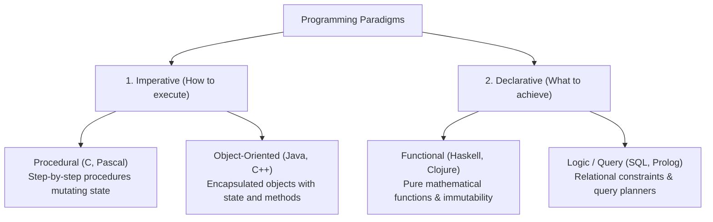
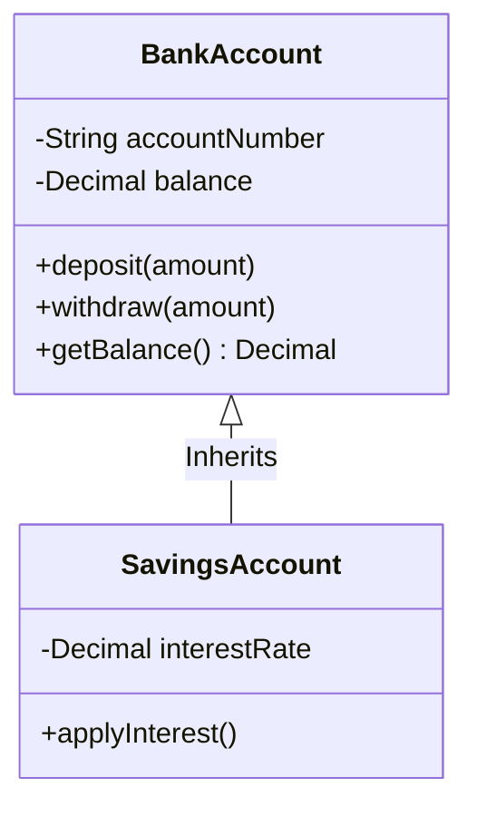
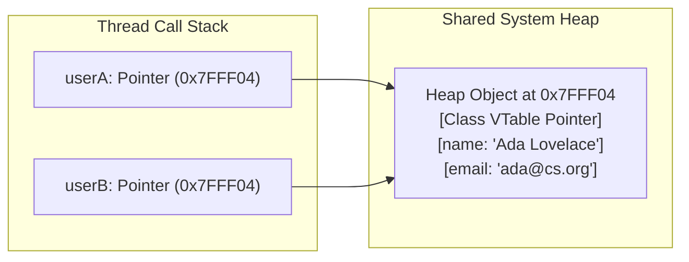
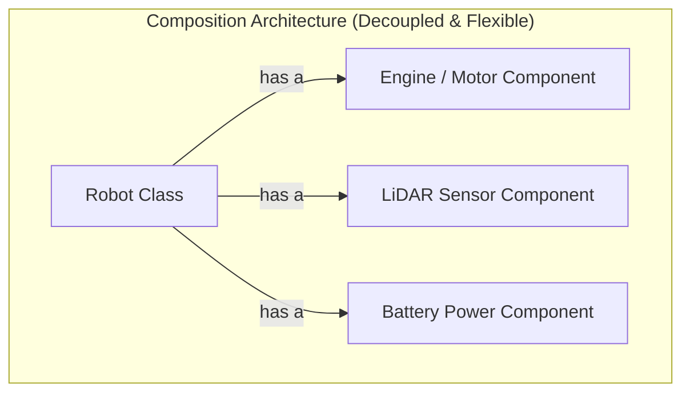

<Concepts items={["imperative vs declarative", "encapsulation & abstraction", "inheritance vs composition", "polymorphism & vtables", "pass-by-reference & heap objects"]} />

<LessonIntro>

There is always more than one way to instruct a computer to solve a problem. A **Programming Paradigm** is a philosophical framework and mental model for organizing code, managing state, and structuring computation.

At opposite ends of the spectrum sit **Imperative Programming** (which commands the CPU with explicit step-by-step state mutations: *how* to execute) and **Declarative Programming** (which specifies the desired end result: *what* to produce). Between them lies **Object-Oriented Programming (OOP)** — an architecture that groups related state data and behaviors into cohesive, self-protecting capsules called objects.

</LessonIntro>

## Why this matters

The paradigm you select dictates how a codebase evolves as team size grows from one developer to five hundred:

* **Maintainability:** Untamed global state in procedural scripts turns multi-developer codebases into a fragile house of cards where modifying one variable silently breaks an unrelated module.
* **Architecture Resilience:** Overusing rigid inheritance hierarchies creates the infamous "fragile base class" problem, whereas mastering **Composition over Inheritance** enables frictionless refactoring.
* **Bug Prevention:** In modern multi-threaded and distributed cloud systems, embracing declarative immutability eliminates an entire class of shared-memory race condition bugs.

---

## 01 — The Spectrum of Programming Paradigms



### Imperative vs Declarative in Practice

Consider filtering an array of numbers to retain only even values and doubling them:

```python
# Imperative Approach: Explicit loop counters, manual mutations, step-by-step HOW
numbers = [1, 2, 3, 4, 5, 6]
result = []
for n in numbers:
    if n % 2 == 0:
        result.append(n * 2)

# Declarative Approach: High-level intent, engine handles iteration WHAT
result = [n * 2 for n in numbers if n % 2 == 0]
```

In SQL, declarative programming reaches its purest form:
```sql
SELECT email FROM users WHERE active = true AND country = 'US';
```
You never specify whether the database engine should read sequentially, scan an index, or utilize parallel worker threads — the database query optimizer inspects table statistics and devises the optimal physical plan.

---

## 02 — The Four Pillars of Object-Oriented Programming (OOP)

OOP models business domains by grouping data attributes (**properties**) and operations (**methods**) into a unified construct called a **Class** (the blueprint), which is instantiated as concrete **Objects** in RAM.



### 1. Encapsulation (Information Hiding)

An object keeps its internal state fields private, exposing only validated public methods:
* **The Goal:** Protect internal invariants. If a `BankAccount` allowed external code to mutate `account.balance = -999999`, the business logic fails. Encapsulation forces callers through `account.withdraw(amount)`, which performs balance checks and audit logging before mutating private state.

### 2. Abstraction (Hiding Complexity)

Simplifies complex underlying mechanics behind clean interfaces:
* You press the brake pedal in a car without needing to understand master brake cylinders, hydraulic line pressure, or ABS pulsing algorithms. In software, an interface or abstract class provides the pedals while hiding the machinery.

### 3. Inheritance (Code Reuse)

A child subclass inherits fields and methods from a parent class, extending or overriding them:
* A `SavingsAccount` inherits `deposit()` and `withdraw()` from `BankAccount`, while introducing an `interestRate` property and overriding monthly fee calculations.

### 4. Polymorphism (Multiple Forms)

Enables different classes to be treated through a uniform interface while executing class-specific behavior:
* A graphics application holds a list of `Shape` objects. Calling `shape.draw()` on each item invokes the specialized draw method of `Circle`, `Square`, or `Polygon` via dynamic dispatch (Virtual Method Tables, or **vtables**).

---

## 03 — Memory Under the Hood: Heap Allocation & Pass-by-Reference

In object-oriented languages (Java, C#, Python, JavaScript), objects do not live on the CPU call stack — they are dynamically allocated on the **Heap**.



### The Pass-by-Reference Mutation Trap

When you assign an existing object to a new variable or pass it into a function, the language **passes the reference (memory address)**, not an independent copy:

```python
class Team:
    def __init__(self, name):
        self.members = []

# Instantiate object on the heap
team_alpha = Team("Alpha")

# Both variables point to the exact same heap memory address:
team_beta = team_alpha
team_beta.members.append("Alice")

# SURPRISE MUTATION:
print(team_alpha.members)  # ['Alice'] - team_alpha was mutated!
```

Because both variables alias the exact same heap memory address, modifying `team_beta` mutates `team_alpha`. In multi-threaded applications, uncontrolled shared mutable references cause severe data corruption.

---

## 04 — Modern Software Architecture: Composition over Inheritance

While classic OOP heavily promoted deep inheritance hierarchies, four decades of production experience revealed the **Fragile Base Class Problem**:

> [!CAUTION] The "Gorilla and the Banana" Dilemma (Joe Armstrong)
> *"The problem with object-oriented languages is they’ve got all this implicit environment that they carry around with them. You wanted a banana, but what you got was a gorilla holding the banana and the entire jungle."*

```
ANTI-PATTERN: Deep Fragile Inheritance Tree
LivingThing
  └── Animal
        └── Mammal
              └── Carnivore
                    └── Dog
                          └── GuideDog (Inherits 5 layers of fragile coupled state!)
```

### The Modern Standard: Composition over Inheritance

Instead of designing classes based on what they *are* (inheritance), design them based on what they *have* or *do* (**Composition**):



By injecting interchangeable component objects through constructors (Dependency Injection), you can swap a `GasEngine` for an `ElectricMotor` at runtime without rewriting or breaking class hierarchies.

---

## 05 — The Functional Paradigm: Pure Functions & Immutability

To eliminate the bugs inherent in shared mutable state, modern software engineering increasingly adopts functional programming principles:

| Core Concept | How It Works in Practice | Architectural Benefit |
| :--- | :--- | :--- |
| **Immutability** | Once created, data structures cannot be altered; changes return a new copy | Eliminates race conditions in multi-threaded systems |
| **Pure Functions** | Output depends exclusively on arguments; zero side effects | Trivially unit-tested and safely cached (memoization) |
| **First-Class Functions** | Functions can be passed as arguments, assigned to variables, and returned | Enables expressive data pipelines (`map`, `filter`, `reduce`) |

```javascript
// Declarative Functional Pipeline (Clean, Immutable, Thread-Safe)
const activeUserEmails = users
    .filter(user => user.isActive)
    .map(user => user.email.toLowerCase())
    .sort();
```

---

## Summary Checklist: Programming Paradigms Mental Model

1. **Paradigms represent distinct philosophies:** Imperative focuses on *how* to change state step-by-step; Declarative specifies *what* output is desired.
2. **Encapsulation enforces data integrity:** Private fields guarded by public methods ensure external callers cannot corrupt internal business rules.
3. **Objects reside on the heap:** Variables store memory references (pointers); assigning an object aliases the same underlying memory block.
4. **Prefer Composition over Inheritance:** Deep class trees become brittle; build flexible systems by assembling loosely coupled components.
5. **Functional principles eliminate state bugs:** Pure functions and immutable data structures prevent shared-memory concurrency collisions in distributed systems.
