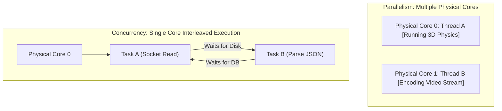
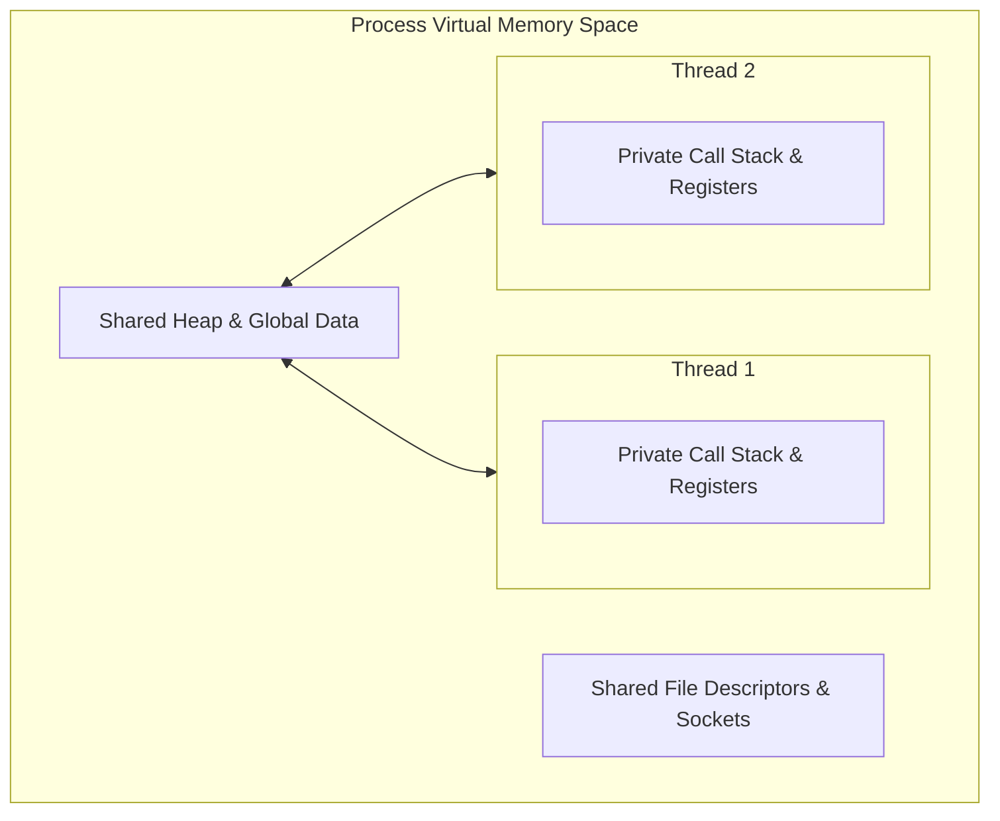
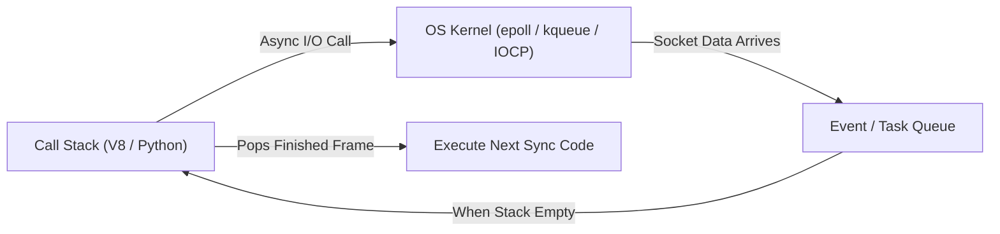
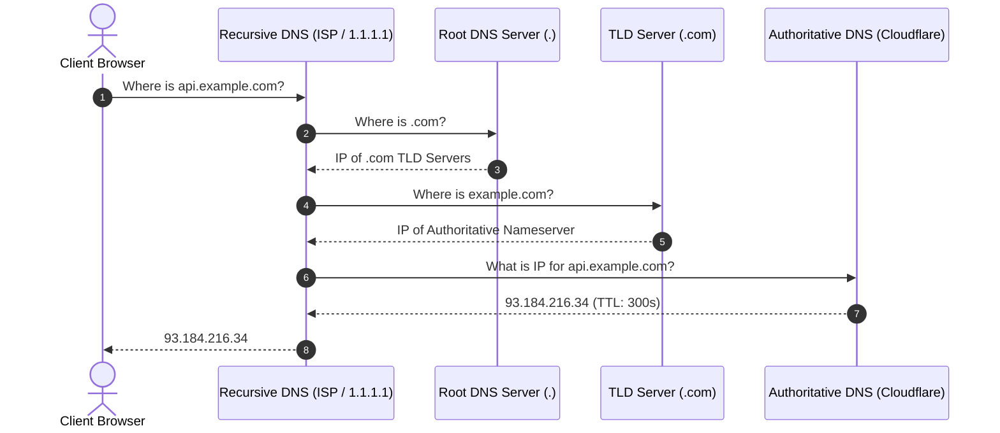
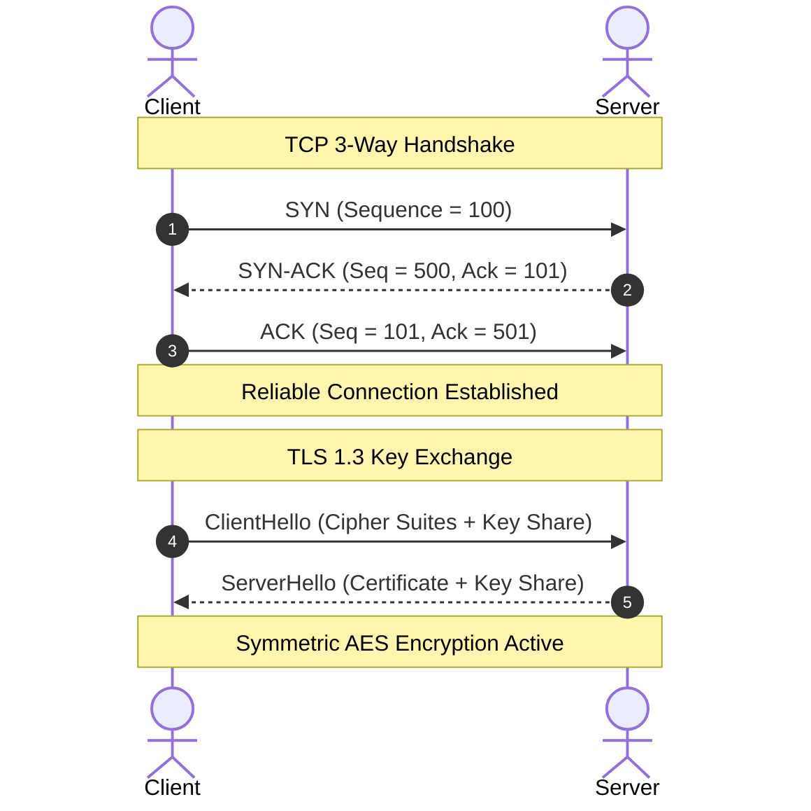
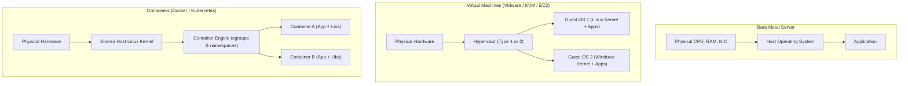
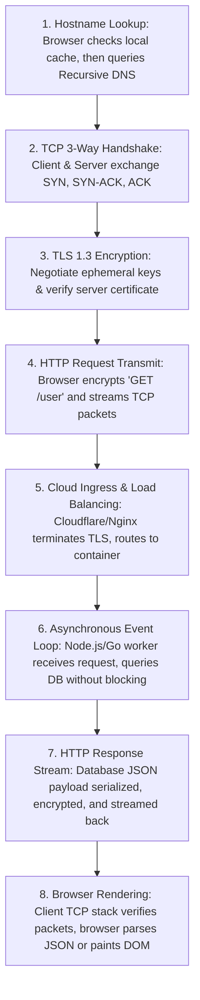

<Concepts items={[
  "threads & parallelism",
  "concurrency & event loops",
  "race conditions & mutexes",
  "IP & hierarchical DNS",
  "TCP 3-way handshake & UDP",
  "TLS encryption & HTTP/REST",
  "VMs vs containers"
]} />

<LessonIntro>

Go back to the CPU from Module 1 and look closely: modern computing does not happen on an isolated, single-core processor executing instructions one by one. A modern CPU splits physical silicon into multiple execution cores and **hardware threads** (hyper-threading), presenting dozens of logical processors to the operating system.

When software runs across multiple cores simultaneously, it achieves **true parallelism**. But when thousands of network connections hit a server concurrently, spawning dedicated hardware threads for each client exhausts physical memory and chokes the kernel with context switching. Scalable software balances hardware threads, asynchronous non-blocking **event loops**, mutual exclusion locks, and layered network protocols (IP, TCP, TLS, HTTP) to orchestrate data across distributed machines worldwide.

</LessonIntro>

## Why this matters

A shopper in Tokyo clicks **"Place Order"** on an e-commerce website. A cloud backend in Oregon must parse the HTTP payload, query an Amazon Aurora database in Virginia, charge a credit card via a Stripe payment gateway in California, and dispatch order confirmation emails—all while handling 40,000 other concurrent active checkout sessions on the same server cluster without crashing, dropping packets, or corrupting inventory quantities.

Without understanding concurrency, race conditions silently corrupt database records and financial balances. Without understanding the network stack, latency bottlenecks, packet drops, and connection renegotiation overhead cripple user experiences.

---

## 01 — Parallelism vs Concurrency: Physical Cores vs Event Loops

Engineers frequently conflate **parallelism** and **concurrency**, but they represent fundamentally distinct architectural concepts.

> "Concurrency is about **dealing** with lots of things at once. Parallelism is about **doing** lots of things at once."  
> — *Rob Pike (Co-designer of Go)*



### Hardware Cores & Hyper-Threading

- **Physical Core:** An independent silicon CPU block containing its own instruction fetcher, arithmetic logic units (ALUs), floating-point units (FPUs), and private L1/L2 caches.
- **Hardware Thread (Hyper-Threading / SMT):** A technique where a single physical core duplicates its architectural state registers (program counter, stack pointer, general-purpose registers) while sharing ALUs and execution pipelines. If Thread 0 stalls waiting for a cache miss from DRAM, the hardware instantly dispatches instructions from Thread 1 without an OS context switch.
- **Operating System View:** A processor with 8 physical cores supporting 2-way simultaneous multithreading (SMT) exposes **16 logical CPUs** to the kernel scheduler (`/proc/cpuinfo` or Task Manager).

### Comparison: Parallelism vs Concurrency

| Dimension | Parallelism | Concurrency |
| :--- | :--- | :--- |
| **Physical Requirement** | Requires $\ge 2$ physical/logical CPU cores | Can execute on a single core or across many |
| **Execution Reality** | Instructions execute at the exact identical nanosecond | Execution progress is interleaved over time slices or asynchronous events |
| **Primary Use Case** | Compute-heavy tasks: 3D rendering, machine learning training, cryptography, matrix algebra | I/O-heavy workloads: web servers, UI event listeners, socket streaming, database queries |
| **Bottleneck** | CPU clock speed, memory bandwidth, thermal throttling | I/O latency (disk, network sockets, database responses) |

---

## 02 — The Threading Model & Shared-Memory Pitfalls

An operating system **process** is an isolated execution container with its own private virtual memory space (Page Tables), environment variables, file descriptor table, and security permissions.

A **thread** is the smallest schedulable unit of execution inside a process. All threads created within the same process share that process's virtual memory address space:



Because threads share the same Heap and global memory, communication between threads is blisteringly fast—no inter-process copying required. However, shared mutable state introduces the most insidious bugs in computer science.

### Race Conditions: The `x++` Hazard

A programmer writes `counter++` in Python or C++, believing it is a single atomic action. At the CPU assembly level, `counter++` consists of three distinct machine instructions:

1. `MOV EAX, [counter]` — Read value from RAM into CPU register.
2. `ADD EAX, 1` — Increment register value inside ALU.
3. `MOV [counter], EAX` — Write updated register value back to RAM.

If two threads execute this simultaneously without synchronization, their operations interleave:

```
Thread 1: Reads counter (0)
Thread 2: Reads counter (0)
Thread 1: Increments register to 1
Thread 1: Writes 1 to counter
Thread 2: Increments register to 1
Thread 2: Writes 1 to counter (Overwrites Thread 1!)
```

Two increments occurred, but `counter` ends at `1` instead of `2`. In financial software, this bug results in double-spending or lost deposits.

### Synchronization Primitives

To safeguard critical sections of code from race conditions, systems use concurrency primitives:

- **Mutex (Mutual Exclusion Lock):** Only one thread can acquire the lock at any given time. If Thread B attempts to lock a mutex already held by Thread A, Thread B is suspended by the OS scheduler until Thread A releases it.
- **Atomic Operations (Compare-and-Swap / CAS):** Hardware-level instructions (e.g., `LOCK CMPXCHG` on x86) that perform read-modify-write as an indivisible atomic cycle directly in the CPU memory bus, avoiding expensive OS-level lock overhead.
- **Deadlock:** Occurs when two or more threads are permanently blocked, each holding a lock that the other needs to proceed:
  - Thread 1 locks Resource A, waits for Resource B.
  - Thread 2 locks Resource B, waits for Resource A.
  - Neither thread can ever advance.

```python
import threading

counter = 0
lock = threading.Lock()

def worker():
    global counter
    for _ in range(100_000):
        # Without lock, counter suffers severe race condition corruption
        with lock:
            counter += 1

threads = [threading.Thread(target=worker) for _ in range(4)]
for t in threads: t.start()
for t in threads: t.join()

print(f"Final safe counter: {counter}")  # Guaranteed 400,000
```

> [!CAUTION]
> Concurrency bugs are notoriously non-deterministic (**Heisenbugs**). A race condition may pass 10,000 automated unit tests on an engineer's machine and only manifest under heavy production load when high CPU context switching alters thread timing.

---

## 03 — The Event Loop & Asynchronous Non-Blocking I/O

Traditional server architectures (such as Apache HTTP Server in the early 2000s) allocated one dedicated OS thread per incoming network connection.

This works for 500 connections, but fails at 50,000 connections:
1. **Memory Overhead:** Each OS thread reserves 1MB to 8MB of stack memory. 50,000 threads consume 50GB to 400GB of RAM just for call stacks!
2. **Context Switching Cost:** The CPU kernel spends more cycles saving and restoring registers between 50,000 threads than doing actual application work.

Modern high-concurrency systems (Node.js, Nginx, Redis, Python FastAPI with `asyncio`, Go goroutines) use **asynchronous non-blocking I/O** driven by an **event loop**.



### How the Event Loop Works

1. **Call Stack:** The main JavaScript or Python thread executes instructions sequentially.
2. **Delegating to the Kernel:** When code requests a network socket read (`fetch()`) or database query, the runtime does **not** block the thread. Instead, it registers the file descriptor with the OS kernel's notification system (`epoll` on Linux, `kqueue` on macOS, `IOCP` on Windows) along with a callback function or Promise.
3. **Serving Other Traffic:** The main thread immediately continues executing subsequent code and handling other user clicks or requests.
4. **Completion:** When the network card finishes receiving the packet, the kernel notifies the runtime, which places the callback onto the **Task Queue**.
5. **Execution:** Once the Call Stack becomes empty, the Event Loop pulls the callback from the queue and executes it.

```javascript
// Non-blocking asynchronous execution
console.log("1. Starting database query");

fetch("https://api.example.com/data")
  .then((response) => response.json())
  .then((data) => console.log("3. Data received from network"));

console.log("2. Server continues handling other shoppers");

// Output order:
// 1. Starting database query
// 2. Server continues handling other shoppers
// 3. Data received from network
```

---

## 04 — The Network Stack: IP, DNS & The 3-Way TCP Handshake

To communicate across the globe, machines rely on the standardized **TCP/IP 5-Layer Stack**:

```
5. Application Layer  (HTTP, DNS, SSH, SMTP)
4. Transport Layer    (TCP, UDP)
3. Network Layer      (IP, ICMP, BGP Routing)
2. Data Link Layer    (Ethernet, Wi-Fi 802.11)
1. Physical Layer     (Fiber-optic photons, Copper voltage, Radio waves)
```

### 1. IP Addressing & DNS Resolution

Every device connected to the internet is identified by an **IP (Internet Protocol) address**:
- **IPv4:** 32-bit integer formatted in four decimal octets (e.g., `142.250.190.46`). Limited to $\approx 4.3 \times 10^9$ addresses, leading to global exhaustion.
- **IPv6:** 128-bit integer formatted in hexadecimal (e.g., `2607:f8b0:4005:808::200e`), providing $3.4 \times 10^{38}$ unique addresses.

Because humans cannot memorize 32-bit or 128-bit numbers, the **Domain Name System (DNS)** serves as the internet's decentralized phone book.



### 2. Transport Layer: TCP vs UDP

Once the client possesses the server's numeric IP address, it must transmit data packets across noisy, lossy physical networks.



#### Transmission Control Protocol (TCP)
- **Connection-Oriented:** Establishes a verified bi-directional session using the **3-Way Handshake** (`SYN` $\to$ `SYN-ACK` $\to$ `ACK`).
- **Guaranteed In-Order Delivery:** Breaks large application data streams into numbered segments. If packet 3 is dropped by a router, the receiver withholds packet 4 until packet 3 is retransmitted.
- **Congestion Control & Flow Control:** Dynamically throttles transmission rates if network routers experience packet loss (using algorithms like Reno or BBR).
- **Used for:** HTTP/1.1, HTTP/2, SSH, database connections, email (SMTP).

#### User Datagram Protocol (UDP)
- **Connectionless & Fire-and-Forget:** Sends individual datagrams without a handshake, without sequence numbers, and without retransmission.
- **Zero Overhead:** Negligible header size (8 bytes vs 20+ bytes for TCP) and zero latency wait time.
- **Used for:** Real-time multiplayer gaming, live video streaming (Zoom, WebRTC), DNS queries, HTTP/3 (QUIC).

---

## 05 — The Application Layer: HTTP, REST & Cloud Virtualization

### HTTP & REST APIs

Over secure, encrypted TLS/TCP streams, web browsers and mobile apps communicate using **HTTP (Hypertext Transfer Protocol)**.

```http
GET /api/v1/orders/7829 HTTP/1.1
Host: api.store.com
User-Agent: Mozilla/5.0
Authorization: Bearer eyJhbGciOi...
Accept: application/json
```

The server parses this request and returns a structured response:

```http
HTTP/1.1 200 OK
Content-Type: application/json; charset=utf-8
Content-Length: 142

{
  "orderId": 7829,
  "status": "shipped",
  "items": ["Mechanical Keyboard", "USB-C Hub"],
  "totalUSD": 189.50
}
```

#### HTTP Status Codes Every Engineer Must Know
- **`200 OK` / `201 Created`:** Request succeeded.
- **`301 Moved Permanently` / `304 Not Modified`:** Redirection / Browser cache hit.
- **`400 Bad Request`:** Client sent invalid or malformed data.
- **`401 Unauthorized` / `403 Forbidden`:** Missing authentication token / Insufficient permissions.
- **`404 Not Found`:** Requested resource does not exist.
- **`500 Internal Server Error`:** Unhandled exception or crash in server backend code.
- **`502 Bad Gateway` / `504 Gateway Timeout`:** Reverse proxy (e.g., Nginx) failed to reach the upstream application container.

### Cloud Virtualization: Bare Metal vs VMs vs Containers

Where do these server threads actually execute in modern cloud data centers (AWS, GCP, Azure)?



| Feature | Bare Metal | Virtual Machine (VM) | Container (Docker) |
| :--- | :--- | :--- | :--- |
| **Isolation Level** | Complete physical hardware isolation | Virtualized hardware via Hypervisor; isolated OS kernel | Process-level isolation via Linux cgroups and namespaces |
| **Startup Latency** | Minutes (physical boot) | 30 to 90 seconds (boots full guest OS kernel) | Milliseconds (spawns an isolated process on host kernel) |
| **Memory Overhead** | Zero virtualization tax | High ($\ge 512\text{ MB}$ to $2\text{ GB}$ per VM for guest OS) | Minimal (only the application process and shared libraries) |
| **Portability** | Bound to physical hardware architecture | High (portable `.ova` / `.vmdk` disk image) | Unmatched ("Build once, run anywhere" via container images) |

---

## Step-by-Step: End-to-End Lifecycle of a Web Request

When an engineer opens a laptop and visits `https://api.github.com/user`:



1. **DNS Resolution:** The browser queries DNS cache, then recursive resolvers, resolving `api.github.com` to `140.82.112.6`.
2. **TCP Connection:** The client operating system initiates a 3-way handshake (`SYN` $\to$ `SYN-ACK` $\to$ `ACK`) with the server's network interface on port 443.
3. **TLS Negotiation:** The client and server perform a cryptographic handshake, exchanging certificates and deriving symmetric AES encryption keys.
4. **HTTP Request:** The browser formats a plaintext HTTP `GET` request, encrypts it with the negotiated AES session key, and transmits it as TCP packet segments over Wi-Fi and fiber optics.
5. **Reverse Proxy & Routing:** An edge load balancer (e.g., Cloudflare or AWS ALB) decrypts the request and forwards it across private data center networks to a containerized backend service.
6. **Concurrent Processing:** The backend runtime's event loop catches the socket event, reads the HTTP headers, queries a Postgres database asynchronously, and handles other concurrent requests while waiting for disk I/O.
7. **Response Transmission:** Once the database returns records, the backend packages the payload into an HTTP `200 OK` response with `Content-Type: application/json` and flushes it back through the TCP socket.
8. **Client Assembly & Render:** The client's operating system receives the packets, reassembles them in sequence, decrypts the TLS stream, and hands the raw JSON to the calling application.

---

## Real-World Engineering Patterns

### The Café Analogy: Network & Concurrency in Daily Life

```
Client         --> The customer ordering at the counter
Server         --> The barista preparing drinks
HTTP Request   --> "One oat milk iced latte, please"
HTTP Response  --> Handing over the latte cup
HTTP Protocol  --> The spoken English language used to understand each other
TCP            --> The counter surface: items are verified before you step away
TLS / SSL      --> Whispering the order so nobody in line can spy or tamper
DNS            --> The sign outside the building mapping the name to a physical address
Event Loop     --> The barista starting the espresso grinder, then steaming milk
                   for another drink while the espresso pulls (non-blocking I/O!)
```

### Common Myth: "JavaScript is Single-Threaded, So It Cannot Handle Massive Traffic"

> [!NOTE]
> While user JavaScript code executes on a single main thread, the underlying runtime (Node.js/V8) leverages **libuv**, which maintains a multi-threaded C++ worker pool. Disk I/O, DNS lookups, and cryptographic computations run in parallel on background OS threads, while network sockets leverage asynchronous kernel event polling (`epoll`). A single Node.js process can easily sustain 50,000 idle or active WebSocket connections simultaneously.

---

## Primary Sources & Deep Dives

- [Computer Networking: A Top-Down Approach (Kurose & Ross)](https://www.pearson.com/en-us/subject-catalog/p/computer-networking-a-top-down-approach/P200000003330) — The definitive reference for application, transport, and network layer engineering.
- [RFC 9110: HTTP Semantics](https://www.rfc-editor.org/rfc/rfc9110.html) — Official Internet Engineering Task Force (IETF) specification for modern HTTP.
- [Node.js Event Loop Architecture Guide](https://nodejs.org/en/learn/asynchronous-work/event-loop-timers-and-nexttick) — Deep technical walkthrough of phases, timers, I/O polling, and microtask queues.

---

## Summary Checklist: Concurrency & Networks Mental Model

1. **Parallelism vs Concurrency:** Parallelism requires multiple hardware cores executing instructions at the exact same nanosecond; concurrency is structuring programs to handle multiple interleaved tasks over time.
2. **Shared Memory Demands Synchronization:** Threads within a process share the same heap memory. Any concurrent mutation of shared variables (`x++`) requires mutex locks or atomic operations to prevent race conditions.
3. **Event Loops Eliminate Thread Exhaustion:** Allocating one OS thread per connection caps concurrency at thread stack memory limits; asynchronous non-blocking event loops (`epoll`/`kqueue`) allow a single thread to handle tens of thousands of concurrent connections.
4. **TCP Guarantees Order; UDP Prioritizes Speed:** TCP uses a 3-way handshake (`SYN`, `SYN-ACK`, `ACK`), sequence numbers, and retransmissions for lossless streams; UDP drops guarantees to deliver minimal latency for video, gaming, and real-time streaming.
5. **Containers are Processes, Not Virtual Machines:** Virtual Machines emulate physical hardware and run independent guest OS kernels; Docker containers are isolated user-space processes sharing the host Linux kernel via cgroups and namespaces.
