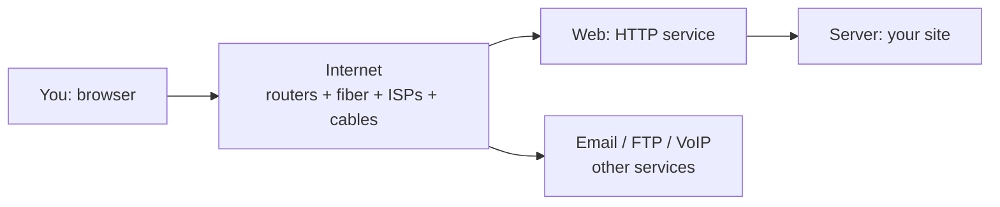
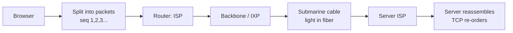
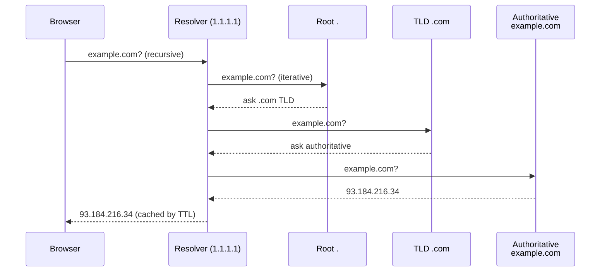
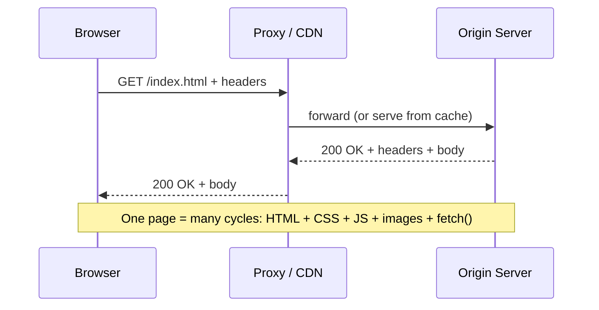
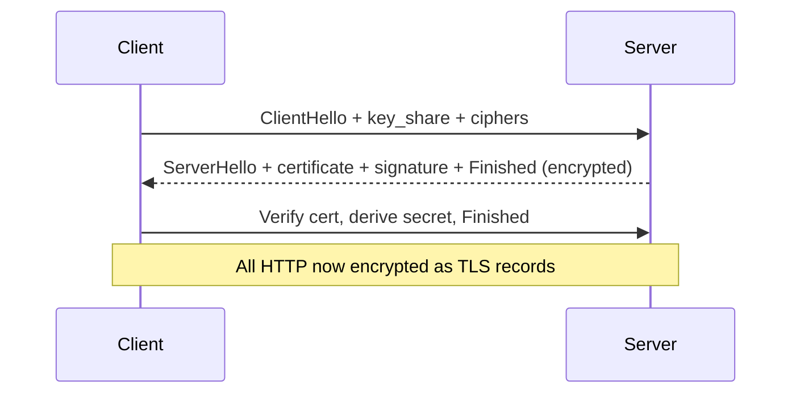
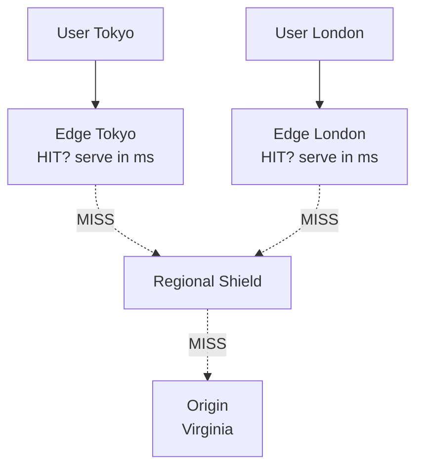
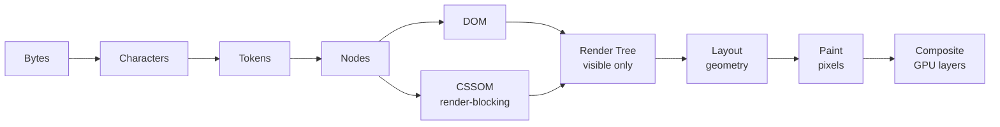
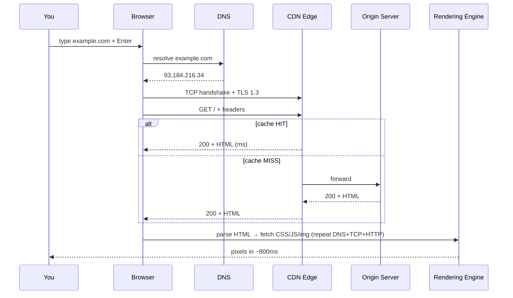

# How the Web Works

You just deployed your first site. It works on `localhost:3000`. You send the link to a friend in another city. She types it in, hits Enter — and 800 milliseconds later, your HTML, CSS, images, and JavaScript appear on her phone.

What just happened in those 800ms? This lesson traces that single keystroke across oceans, routers, encrypted tunnels, and a rendering engine.

**Protagonist:** you are a junior developer who can build a page but cannot yet explain how it reaches anyone.

**What you will be able to do at the end:** explain every step from URL to pixels, read a Network tab without guessing, and diagnose DNS, HTTP, TLS, and rendering failures.


## 01 — Nobody can find the server: Internet vs Web

Your naive attempt: you give your friend your computer's address and tell her to connect. It fails. She is on a different network, your laptop sleeps, your IP changes daily.

That is the first pain the Web solves: **how do billions of unreliable machines stay reachable?**

**Internet** is the infrastructure — billions of computers, phones, servers, fiber cables, routers that stay connected even if parts fail. Born as 1960s US Army research, public infrastructure in the 1980s.

**World Wide Web** is a *service* built on top of that infrastructure, using browsers + servers speaking HTTP/HTTPS. Other services ride the same Internet: email, FTP, VoIP.

> "The Internet is an infrastructure, whereas the Web is a service built on top of the infrastructure." — MDN



*Figure 1.1 — The Internet carries many services. The Web is one of them.*


*Figure 1.2 — Typical home network topology: cable or fiber modem bridging your local devices to the ISP and global Internet.*

**But here is the problem:** how does a message find one machine among billions without getting lost?

## 02 — Messages get lost: IP, packets, TCP

Naive attempt: send the whole page as one giant blob down a wire. One bit flips, one router congests — you re-send the entire 2MB page. Slow and fragile.

So the Internet does three things:

**1. IP addresses:** every device gets a logical address. IPv4 32-bit e.g. `93.184.216.34`. Exhausted, so IPv6 128-bit e.g. `2400:cb00:2048:1::c629:d7a2`. Hierarchical `netid + hostid` so routers can forward without knowing every device.

**2. Packets:** all data is split into small chunks. Each packet = `header (source/dest IP, seq no., protocol, port) + payload`. Lose one packet? Re-send one packet, not the whole file. Packets can take different paths and get re-ordered at the end.

**3. TCP/IP:** the rules of travel.

- **IP (Internet Protocol):** gets the packet to the *right computer* using the IP address. Best-effort, no guarantee.
- **TCP (Transmission Control Protocol):** gets the packet to the *right app* using the port (80 HTTP, 443 HTTPS). Reliable stream: sequence numbers, ACKs, retransmits, flow control.

Routers, ISPs, and backbone carry them: home → ISP via fiber/cell → ISP router reads dest IP → forwards hop-by-hop with BGP/OSPF → peering at IXPs or paid transit → possibly a submarine cable. ~99% of intercontinental traffic is submarine fiber, not satellite — 500+ systems, ~750k miles.



*Figure 2.1 — One page, many packets, many paths, one reassembly.*


*Figure 2.2 — Packet fragmentation: large payloads (like an image response) are split across multiple numbered envelopes.*


*Figure 2.3 — Mesh routing: packets traverse independent routers across networks before arriving at their final destination.*

Physical analogy: post office. IP is the street address on the envelope. Packets are tearing a book into numbered postcards. TCP is the friend who says "missing card #7, send again" before shelving the book in order.

**Breaking point:** IPs like `142.250.190.78` are unmemorable, and they change. No customer will type them.

## 03 — Humans cannot remember numbers: DNS

Naive attempt: a `hosts.txt` file everyone downloads with `name → IP`. Worked for 100 machines in 1982. Breaks at 300 million domains.

**DNS (Domain Name System)** is the distributed phonebook: `example.com` → IP. ~2 trillion lookups/day. Four server types per uncached lookup:

1. **Recursive Resolver** (your ISP, or 1.1.1.1 / 8.8.8.8): the librarian that hunts for you.
2. **Root `.` Nameserver** (13 logical roots): points to `.com`, `.org`, etc.
3. **TLD Nameserver** (`.com`): points to the domain's nameserver.
4. **Authoritative Nameserver:** final truth, returns A/AAAA record.

Caching at every level — browser → OS → resolver (TTL, typically 24-48h) — skips steps.



*Figure 3.1 — DNS lookup. Recursive to you, iterative between servers.*

Unintended consequence: now we know *where* the server is. But how do we *ask* for things in a language both sides understand?

## 04 — How do we ask for things: HTTP

**HTTP** is the application-layer, client-server, request/response protocol on top of TCP (or TLS for HTTPS, QUIC+UDP for HTTP/3). Human-readable, extensible via headers, **stateless** — the server remembers nothing between requests unless you add cookies/auth.

Request:

```http
GET /index.html HTTP/1.1
Host: example.com
Accept-Language: en
Cookie: session=abc123
```

Response:

```http
HTTP/1.1 200 OK
Content-Type: text/html
Content-Length: 29769
Set-Cookie: session=abc123; Secure; HttpOnly

<!doctype html>... body
```



*Figure 4.1 — HTTP request-response cycle.*

Key vocabulary:

- **Methods:** `GET` fetch (safe, cacheable), `HEAD` metadata only, `POST` create/submit (body, not idempotent), `PUT` replace full, `PATCH` partial, `DELETE` remove, `OPTIONS` CORS preflight, `CONNECT` tunnel.
- **Status codes:** `1xx` Info (100 Continue), `2xx` Success (200 OK, 201 Created), `3xx` Redirect (301 Moved Permanently, 304 Not Modified), `4xx` Client Error (401 Unauthorized, 403 Forbidden, 404 Not Found, 429 Too Many), `5xx` Server Error (500, 502 Bad Gateway, 503 Unavailable).
- **Headers:** `Host` (required, virtual hosts), `User-Agent`, `Accept/Content-Type`, `Cache-Control/ETag`, `Authorization: Bearer ...`, `Location` (redirects), `Cookie/Set-Cookie`.
- **Cookies — state over stateless HTTP:** server `Set-Cookie: sessionid=abc; Secure; HttpOnly; SameSite=Lax` → browser stores → auto-sends `Cookie: sessionid=abc`. That is logins, carts, prefs, tracking.

**Breaking point:** HTTP is postcards. Anyone on the path — coffee-shop Wi-Fi, ISP, compromised router — can read everything.

## 05 — Someone is listening: HTTPS and TLS

Naive attempt: encrypt with a password you both know. How do you share the password without someone intercepting it?

**HTTPS is not a separate protocol — it is HTTP inside a TLS tunnel** over TCP port 443. Provides confidentiality + integrity + authentication.

- **Certificates:** X.509 binds `domain + public key + issuer + validity` signed by a Certificate Authority. Chain: `leaf → intermediate → root CA` in your OS/browser. Browser verifies signatures + expiry + domain + revocation. Fail → big warning.
- **Two kinds of crypto:** asymmetric (RSA, ECDHE) — slow, only for handshake to authenticate + agree a secret. Symmetric (AES-GCM, ChaCha20) — fast, encrypts everything after. New random keys per session + ECDHE = forward secrecy.

TLS 1.3 (current, 1-RTT):



*Figure 5.1 — TLS 1.3 handshake. TLS 1.2 took 2-RTTs with RSA key exchange.*

After handshake, proxies cannot read unless they terminate TLS. SSL is the obsolete predecessor — "SSL certificate" now means TLS.

Physical analogy: you want to whisper in a crowded room. Asymmetric crypto is shouting a locked box only the server can open, with your secret code inside. Symmetric crypto is then whispering with that shared code.

**Breaking point:** encryption works, but the server is in Virginia and the user is in Tokyo. Physics says ~200ms round-trip. And a traffic spike melts your single server.

## 06 — The server is too far and too slow: servers, CDN, APIs

All web interaction is request-response, but *what* responds matters.

**Web server (Nginx, Apache, Caddy):** understands HTTP/URLs. Serves **static** content directly: HTML, CSS, JS, images. File exists → return, else 404 or forward.

**Application server (Node/Express, Django, Rails, Spring):** runs business logic to generate **dynamic** content. Connects to DB, auth, payments.

```
Browser -> Web Server [static? serve directly : forward] -> App -> Database query + Template -> HTML -> Browser
```

Production is a chain: `Reverse Proxy / Load Balancer → Web (static/cache) → App (dynamic) → DB`.

**Static vs dynamic:**

| Static | Dynamic |
| --- | --- |
| Prebuilt files, same for everyone | Built per-request via app + DB |
| Fast 2-3x, cheap (S3, Cloudflare Pages), secure | Personalized (feed, cart, search), needs caching |
| Blogs, docs, landing pages (Hugo, Astro) | Instagram, news homepage, e-commerce |

Modern hybrid: JAMstack / SSR / ISR — pre-render static, hydrate dynamic via API.

**CDN (Cloudflare, CloudFront, Fastly):** globally distributed edge PoPs that cache close to the user.



*Figure 6.1 — CDN tiered caching: edge → shield → origin. 95%+ offload.*

2026 model: Anycast + latency DNS steering + HTTP/3 QUIC with 0-RTT resume. Dynamic at edge via Workers/Lambda@Edge — personalize without origin round-trip.

**APIs / REST:** the contract for programs. REST = stateless, uniform URLs, cacheable, layered. `GET /users`, `POST /users`, `PUT /users/1`, `DELETE /users/1` + `Authorization: Bearer ...` → `200 + JSON`. Same API serves web, iOS, Android.

Evolution in one line: **1.0 (1990-2000) Read-only** static → **2.0 (2004-now) Read-Write** Ajax, social, centralized → **3.0 (emerging) Read-Write-Execute** decentralized, edge, AI. SPAs (React/Vue) ship one `index.html` + JS, then fetch only JSON.

**Breaking point:** the bytes arrived. How do they become pixels without jank?

## 07 — Bytes to pixels: how browsers render

A browser is not one thing: UI + networking + **rendering engine** (Blink, WebKit, Gecko) + **JS engine** (V8, SpiderMonkey, JavaScriptCore). Main thread is mostly single-threaded — parse HTML/CSS, run JS, layout, paint must finish in ~16.67ms/frame for 60fps or you get jank. Compositing runs on a separate GPU thread, which is why scrolling stays smooth.

Critical Rendering Path:



*Figure 7.1 — Critical Rendering Path. Change width → reflow all. Change transform → composite only.*

1. **HTML → DOM (incremental):** starts with first 14KB. Preload scanner pre-fetches `link/script/img` ahead. `<script>` without `async/defer` blocks parsing — use `defer` (ordered, after parse), `async` (asap).
2. **CSS → CSSOM (must be complete):** later rule can override earlier, so first paint blocks to avoid flash of unstyled content.
3. **JS:** `AST → bytecode → optimized machine code` + GC. Event loop; sync JS blocks main thread.
4. **Render Tree = DOM + CSSOM:** only visible nodes (`display:none` excluded).
5. **Layout/Reflow:** box model, flex/grid, text wrap. Most expensive O(n).
6. **Paint/Raster:** rects, text, shadows → GPU tiles. Expensive: `box-shadow, blur, border-radius`.
7. **Layerize + Composite:** own GPU texture if `transform, opacity, will-change, fixed`. Compositor combines at VSync.

Cost rule that drives all perf advice:

| Change | Pipeline | Cost |
| --- | --- | --- |
| `width, height, margin, top/left, font-size`, add/remove DOM | Style → Layout → Paint → Composite | Most expensive |
| `color, background, box-shadow, visibility` | Style → Paint → Composite | Medium |
| `transform, opacity` on promoted layer | Style → Composite | Cheapest |

> Animate `transform: translate/scale`, not `top/left/width`. Never read (`offsetHeight`) after write in a loop — batch reads, then writes, in `requestAnimationFrame`.

Frameworks do not bypass this — they minimize DOM work: Virtual DOM diff in memory → minimal `appendChild/setAttribute` → browser paints. SSR sends HTML for fast First Paint, then hydrates.

## 08 — Put it together: what happens when you type `https://example.com`



*Figure 8.1 — End-to-end journey. Every asset repeats DNS + connect + request.*

Step-by-step:

1. **Parse URL:** `https` = protocol, `example.com` = domain, `/` = path.
2. **DNS lookup (if not cached):** Browser → OS → Resolver → Root → `.com` → authoritative → IP.
3. **Connect:** TCP SYN/SYN-ACK/ACK to :443, then TLS negotiation.
4. **HTTP request:** `GET / HTTP/2` encapsulated in TCP → IP → Ethernet/WiFi to ISP.
5. **Routing:** hop-by-hop across ISP, backbone, possibly submarine cable.
6. **Server response:** edge HIT or origin/app+DB → `200 OK` + HTML in packets.
7. **Reassembly:** TCP re-orders, requests missing packets, hands stream to browser.
8. **Render:** DOM + CSSOM → Layout → Paint → Composite. Parse triggers new fetches for CSS, JS, images.

## 09 — Apply it: what to do next

### The checklist

- Open DevTools Network tab: find DNS time, TLS handshake, TTFB, content download for your site.
- Explain `example.com` resolution: recursive vs iterative, what TTL does.
- Classify a failure: `DNS NXDOMAIN` vs `TCP timeout` vs `404` vs `TLS cert error` vs `CORS blocked`.
- Set `Cache-Control`, `ETag`, `Strict-Transport-Security`, `Content-Security-Policy` on one route.
- Move one animation from `top/left` to `transform` and measure jank.
- Add `defer` to app JS, `preload` to LCP image, inline critical CSS.
- Decide static vs dynamic per page: pre-render shell, fetch dynamic via API at edge.

### Self-check

<details>
<summary>Internet vs Web — what's the difference?</summary>

Internet is the infrastructure (routers, fiber, IPs, TCP). Web is a service on top of it (browsers + servers speaking HTTP). Email and VoIP ride the same Internet but are not the Web.

</details>

<details>
<summary>Why split data into packets with TCP/IP?</summary>

Loss recovery is cheap (re-send one packet), paths can differ, networks load-balance. IP gets to the right computer, TCP gets to the right app reliably via seq numbers, ACKs, and retransmits.

</details>

<details>
<summary>What does DNS actually do, step by step?</summary>

Browser → Recursive Resolver → Root → TLD → Authoritative → IP, with caching at browser, OS, and resolver by TTL. Client asks recursively, servers answer iteratively with referrals.

</details>

<details>
<summary>What is inside an HTTP request and response?</summary>

Request: `method + path + version`, headers, blank line, optional body. Response: `version + status + reason`, headers, blank line, body. Stateless by default; cookies add sessions.

</details>

<details>
<summary>How does HTTPS prevent eavesdropping?</summary>

TLS handshake authenticates via CA certificates, negotiates a per-session symmetric key with asymmetric crypto (ECDHE), then encrypts all HTTP as TLS records. TLS 1.3 does this in 1-RTT.

</details>

<details>
<summary>When do you need a CDN?</summary>

When users are far (physics latency) or traffic spikes (origin overload). Edge PoPs cache static close to users, terminate TLS, filter DDoS. MISS goes edge → shield → origin. Dynamic personalization moves to edge Workers.

</details>

<details>
<summary>Why is `transform` cheaper than `width`?</summary>

`width` triggers Layout → Paint → Composite (reflow cascade). `transform/opacity` on a promoted layer skips main-thread layout/paint and composites on GPU only.

</details>

### Discussion prompts

1. Trace your own site: how many DNS lookups, TCP connections, and HTTP requests does one load make?
2. What breaks if DNS TTL is 5 seconds vs 48 hours? When would you want each?
3. Where should auth live — cookie vs `Authorization` header — for your app?
4. Which pages of your product could be static + edge-cached tomorrow?
5. What is your LCP element, and what blocks it in the Critical Rendering Path?

Sources: MDN How the web works, MDN How does the Internet work, Cloudflare Learning DNS / TLS handshake, web.dev Critical Rendering Path, Chromium RenderingNG, AWS Web vs App Server / REST.
