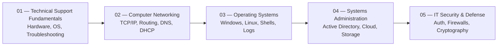
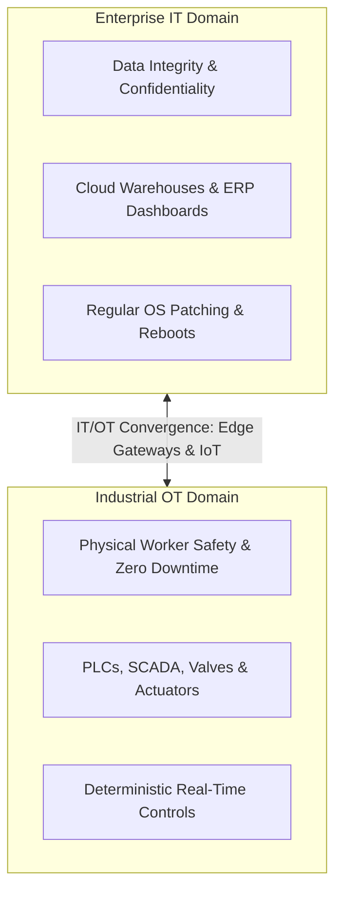
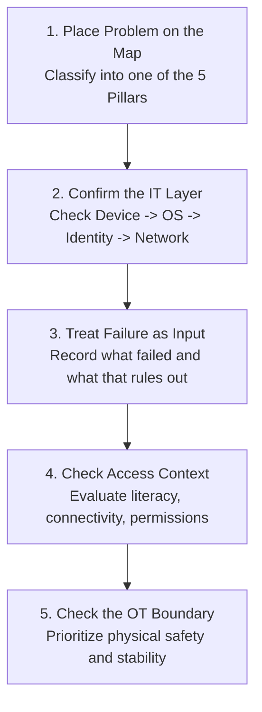

<Concepts items={["Information Technology", "IT support specialist", "failure as feedback", "digital divide", "Operational Technology", "IT/OT convergence", "process convergence", "data convergence", "physical convergence"]} />

<LessonIntro>

Every ticket you will ever touch as a support specialist starts with the same question: whose data is stuck, on which device, and what physical process is waiting on it. A nurse cannot open a patient chart, a cashier cannot take payment, a factory sensor stops reporting temperature. 

**Information Technology (IT)** is the discipline behind all three scenes — the computers, storage, networks, and processes used to create, process, store, secure, and exchange electronic data. This lesson maps that territory: the five pillars of the support profession, the day-to-day work of the specialist role, the access gap called the digital divide, and the convergence of office IT with industrial **Operational Technology (OT)**. If hardware is the machine itself, this lesson is the job description for the person who keeps it running.

</LessonIntro>

## Why this matters

In modern organizations, technology is not merely a utility like electricity or plumbing — it is the nervous system of the entire enterprise:

* **Business Continuity:** When a point-of-sale terminal freezes, customer queues stop moving; when an EHR (Electronic Health Record) workstation fails, clinical care halts. The IT support specialist is the first line of defense protecting operational uptime.
* **Cost of Misdiagnosis:** Swapping out a motherboad or re-imaging a machine when the true root cause was an expired Kerberos ticket or an incorrect DNS address wastes hundreds of dollars and hours of productive user time.
* **Stopping Ticket Ping-Pong:** Without a structured understanding of technical boundaries, tickets get tossed aimlessly between networking, systems administration, and application teams. A skilled specialist diagnoses cleanly on first contact.
* **Safety in Converged Environments:** As smart sensors and controllers blur the lines between corporate networks and manufacturing lines, poor security or misconfigured updates can disrupt physical machinery and compromise human safety.

---

## 01 — What is Information Technology? The Five Pillars

At its core, Information Technology is the engine that transforms raw electrical signals into reliable, accessible human knowledge.

<ConceptCard name="Information Technology (IT)" category="Definition">

**What it is.** The use of computers, storage, networking, physical devices, infrastructure, and processes to create, process, store, secure, and exchange all forms of electronic data.

**How it works.** Raw signals and records enter through devices and networks, get transformed by software into structured, accessible information, and are stored and moved under policies for availability and security. The same pipeline serves a pocket calculator, a hospital records system, an orbital satellite link, and a high-frequency trading desk — only the scale and the stakes change.

</ConceptCard>

### The Five Courses of IT Support

The foundational curriculum built by working Google IT professionals across operations engineering, site reliability engineering, systems administration, and security stacks into five core pillars. Holding this mental roadmap in your head helps you classify any incoming problem before you even open a terminal:

*Figure 1.1 — The five courses of the support program, in the order a ticket tends to escalate through them.*

### Neighboring Roles in the IT Ecosystem

As an IT support specialist, you do not operate in a vacuum. You sit at the operational hub connecting users to specialized engineering teams:

1. **Network Engineers:** Architect and maintain the switches, routers, firewalls, and subnets that enable global packet transport.
2. **Hardware Technicians:** Physically diagnose, solder, replace, and cable physical components across client laptops, desktops, and data center server racks.
3. **Helpdesk & Desktop Technicians:** Provide front-line user assistance, workstation software deployment, printer mapping, and client peripheral triage.
4. **Systems Administrators (SysAdmins):** Manage enterprise infrastructure, identity providers (Active Directory, Okta), domain policies, virtual machines, and cloud environments.

---

## 02 — The IT Support Specialist: Mindset & Day-to-Day Responsibilities

The IT Support Specialist is the primary anchor of daily technology operations.

<ConceptCard name="IT Support Specialist" category="Role">

**What it is.** The person accountable for keeping an organization's technological equipment running smoothly — managing, installing, maintaining, troubleshooting, and configuring office and computing equipment.

**How it works.** The work splits along two axes: in-person versus remote support, and small business versus global enterprise. A typical week mixes hardware setup and lifecycle management (workstations, docks, monitors, peripherals), operating system deployment and patching across Windows, macOS, ChromeOS, and Linux, identity and access management (accounts, multi-factor authentication, credential resets), and systematic issue diagnosis — isolating why a printer will not print, why a VPN will not connect, or why an application crashes.

</ConceptCard>

### The Core Responsibility Domains

A support specialist's work generally divides into four distinct functional quadrants:

| Responsibility Quadrant | Key Activities & Tools | Typical Support Goal |
| :--- | :--- | :--- |
| **Hardware Lifecycle** | Unboxing, inventory asset tagging, docking station testing, peripheral validation, RAM/SSD upgrades, hardware recycling. | Guarantee zero hardware-induced user downtime. |
| **OS Deployment & Patching** | Imaging with PXE/WDS, Microsoft Intune, Jamf Pro, Ansible, Windows Update for Business, Linux package updates. | Enforce security compliance and clean standard operating environments. |
| **Identity & Access Management (IAM)** | Active Directory, Entra ID, password resets, MFA token enrollment, role-based access control (RBAC), SSO onboarding. | Ensure least-privilege security while maintaining instant access. |
| **Systematic Issue Diagnosis** | Event Viewer, `dmesg`, syslog, Wireshark, remote assistance tools, hardware loopback testers. | Rapidly isolate root causes rather than applying temporary band-aids. |

### The "Failure as Feedback" Mindset

<ConceptCard name="Failure as Feedback" category="Mindset">

**What it is.** The working principle that a failed troubleshooting step is data, not defeat: you analyze what went wrong, document the finding, and use it to diagnose faster next time.

**How it works.** There is no routine day in IT because failure states keep evolving, so each breakage becomes an input to a personal and team knowledge base. The field rewards this temperament structurally — projected US job growth above 12% over the next decade means employers are buying adaptable problem-solvers, not people who memorized one fixed procedure.

</ConceptCard>

<AnalogyCard name="A Building Superintendent">

**The concept.** A support specialist keeps organizational technology running: installing, patching, provisioning access, and diagnosing faults across hardware, systems, and networks.

**The analogy.** A building superintendent does not design the skyscraper, but every tenant calls them first — a stuck door, a dead outlet, a flooded basement, a lost key. They triage, fix what they can, document what recurs, and call the electrician or the structural engineer when the fault is beyond their floor. Support work is tenancy for technology.

</AnalogyCard>

<LessonNote variant="myth" title="What people get wrong about support work">

**Myth:** "IT support is just resetting passwords and fixing printers."

**Truth:** Passwords and printers are the visible fraction. The role spans hardware lifecycle, OS deployment, identity management, systematic diagnosis, and increasingly the IT/OT boundary — and the differentiator is method (isolation, documentation, escalation judgment), not any single repair trick.

</LessonNote>

<LessonNote variant="why">

Every later lesson in this track — binary, encoding, gates, networking — is something you will explain to a confused user or apply to a broken device at 9 AM on a Monday. Knowing *why* the support role exists turns those topics from trivia into tools: you learn them because someone's workday depends on you applying them.

</LessonNote>

---

## 03 — The Digital Divide & Human-Centric Support

Technology exists to serve human beings, but access and knowledge are not distributed equally.

<ConceptCard name="Digital Divide" category="Access Gap">

**What it is.** The gap between individuals and communities who have access to modern information and communication technology (and the digital literacy to use it) and those who do not.

**How it works.** Regional infrastructure, household income, and educational funding decide who gets early computer literacy and reliable connectivity, which now gate employment, healthcare records, and education itself. Support specialists narrow the gap directly: deploying accessible community technology, giving patient support to first-time users, and mentoring future technicians.

</ConceptCard>

> [!TIP] The Empathy Rule in Support
> Over $50\%$ of support effectiveness is communication. When an end user says "the internet is broken," avoid condescension or technical jargon. Translate their emotional frustration into verifiable engineering observations: What application fails? Can the machine resolve DNS? Is the link-light illuminated?

---

## 04 — Operational Technology (OT) & IT/OT Convergence

In enterprise and industrial environments, traditional office IT intersects with physical machines.

<ConceptCard name="Operational Technology (OT)" category="Industrial Systems">

**What it is.** The hardware and software that monitors and controls physical industrial devices — SCADA systems, PLCs (Programmable Logic Controllers), sensors, valves, and robotic arms in factories, power plants, refineries, water utilities, and pharmaceutical labs.

**How it works.** Where IT optimizes for data integrity and throughput across offices, data centers, and clouds, OT optimizes for worker safety, uptime, and real-time physical control. A delayed packet in IT is an annoyance; a delayed command in OT can damage equipment or injure people, which is why the two domains were historically kept strictly separate.

</ConceptCard>

<ConceptCard name="IT/OT Convergence" category="Industry 4.0">

**What it is.** The merging of data-centric IT with machine-centric OT so factory telemetry flows into enterprise networks, dashboards, and machine learning models.

**How it works.** IoT sensors stream vibration and temperature data into IT systems that predict breakdowns before they happen; converged update pipelines push software to production lines; real-time logging satisfies environmental, medical, and safety compliance; automated controls tune power and materials against live grid conditions. The payoff is de-siloed teams, lower maintenance costs, faster time-to-market, audit visibility, and leaner resource use — at the price of exposing safety-critical equipment to network-borne risk, which is exactly why support teams now need to understand both sides.

</ConceptCard>

### IT vs OT Side-by-Side Comparison

| Dimension | Information Technology (IT) | Operational Technology (OT) |
| :--- | :--- | :--- |
| **Primary Focus** | Data-centric computing (data flow, storage, software, networking) | Machine-centric performance (monitoring, controlling physical industrial devices) |
| **Environments** | Offices, data centers, cloud infrastructure, enterprise endpoints | Factories, power plants, oil refineries, water utilities, pharmaceutical labs |
| **Key Equipment** | Servers, switches, routers, laptops, databases, SaaS applications | SCADA systems, PLCs (Programmable Logic Controllers), sensors, valves, robotic arms |
| **Primary Metric** | Data integrity, security (confidentiality/integrity), network throughput | Worker safety, system availability (uptime), real-time physical control |
| **Tolerance for Latency** | Seconds or minutes are acceptable for retries | Milliseconds or microseconds; deterministic latency required |

### The Three Dimensions of Convergence

Convergence itself has three synchronized dimensions:
1. **Process Convergence:** Aligns workflows, safety standards, and governance so maintenance schedules and incident response work in harmony across both departments.
2. **Data Convergence:** Builds unified network fabrics and APIs that ingest real-time OT sensor streams into IT warehouses and dashboards.
3. **Physical Convergence:** Retrofits legacy mechanical devices with microcontrollers, IP interfaces, edge computers, and smart sensors for bidirectional communication.

> [!WARNING] The Critical Balance
> Miss any one of the three dimensions and the other two stall: new sensors without shared processes produce data nobody trusts, and shared processes without network plumbing produce agreements nobody can execute.

---

## 05 — Triage in Action: Step-by-Step Breakdown & Real-World Scenarios

Every support specialist succeeds by adhering to a consistent, repeatable scientific method.

### The 5-Step Triage Workflow

1. **Place the problem on the map:** Decide which of the five pillars the ticket belongs to before troubleshooting.
2. **Confirm the IT layer:** Check device, operating system, identity, and network path in that order.
3. **Treat each failure as input:** Record what you tried, what changed, and what that rules out.
4. **Check the access context:** Ask whether connectivity or literacy — the digital divide — is part of the report.
5. **Check the OT boundary:** If the ticket touches sensors, controllers, or physical equipment, switch to safety-first handling and converge carefully.

### Real-World Production Scenarios

* **Obvious — Onboarding New Hires:** A new hire cannot log in on day one. You provision the OS profile, create the account, enroll multi-factor authentication, and verify the VPN. Four checklist items, one working workstation.
* **Counter-intuitive — Documenting Failed Fixes:** The most valuable act in a shift can be documenting a fix that failed. Writing down that a driver reinstall did *not* resolve the printer queue saves the next three specialists from repeating it, which compounds across a team faster than any single repair.
* **Edge case — The Flapping Sensor:** A vibration sensor on a packaging line streams into a cloud dashboard and starts flapping. The ticket looks like a network issue, but the root cause is a loose physical mount — an OT problem wearing an IT symptom. Restarting the network service changes nothing; tightening the mount fixes everything.

---

## Summary Checklist: IT Support Fundamentals Mental Model

1. **IT is data lifecycle management:** It encompasses the physical and logical processes to create, process, store, secure, and exchange all forms of electronic data.
2. **Support specialists are systems anchors:** The role balances hardware provisioning, OS deployment, identity management, and root-cause isolation.
3. **Failure is high-value telemetry:** A failed troubleshooting hypothesis eliminates variables; documenting negative results prevents team-wide duplicate labor.
4. **IT and OT optimize for different outcomes:** IT prioritizes data integrity and confidentiality; OT prioritizes deterministic physical control, uptime, and human safety.
5. **Convergence requires 3 aligned axes:** Process, data, and physical hardware must converge simultaneously to deliver actionable intelligence safely.

---

<QuickRecall title="Check yourself before moving on">

1. Recite the IT definition without looking: which five verbs does it use for what happens to electronic data?
2. Name the four day-to-day responsibility areas of a support specialist.
3. State the primary metric of IT versus the primary metric of OT, and why they conflict.
4. List the three types of IT/OT convergence and give one concrete example of each.

</QuickRecall>

This connects to the next lesson because the devices you will support did not arrive fully formed — understanding how computing evolved from beads and gears to smartphones explains why modern systems carry the quirks you will troubleshoot.
