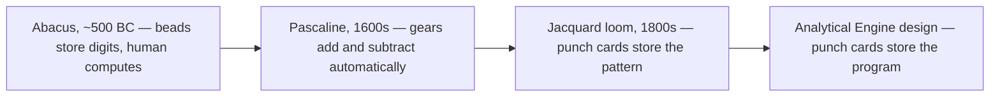
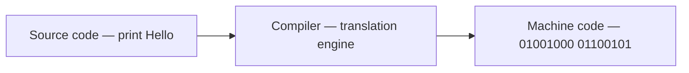

<Concepts items={["computer", "QWERTY layout", "abacus", "Pascaline", "punch cards", "Analytical Engine", "algorithm", "cryptography", "vacuum tubes", "ENIAC", "transistor", "compiler", "graphical user interface", "open source", "Linux"]} />

<LessonIntro>

A user calls about a frozen laptop, and underneath that complaint sits two thousand years of accumulated engineering. A **computer** is a device that stores and processes data by performing calculations — that definition has never changed, but the machinery underneath it has been reinvented half a dozen times. Beads on rods gave way to gears, gears to punched holes, holes to glowing vacuum tubes, tubes to microscopic transistors, and locked-down proprietary systems to open-source kernels running in every pocket. This lesson walks that chain link by link, because every era left residue in the machines you support: punch-card thinking in batch jobs, terminal thinking in command lines, and mainframe thinking in the cloud.

</LessonIntro>

Why should a support specialist care about history? Because legacy is a daily ticket category. You will meet keyboard layouts designed for mechanical typewriters, command-line tools inherited from 1970s Unix, and boot concepts that only make sense if you know what a vacuum tube cost to replace. History turns "arbitrary trivia" into "oh, that is why it works that way."

*Figure — ENIAC, one of the earliest general-purpose electronic computers. Image: Wikimedia Commons, public domain.*

## Concept Breakdown: What It Is and How It Works

<ConceptCard name="Computer" category="Definition">

**What it is.** A device that stores and processes data by performing calculations — from room-sized mainframes to laptops, car navigation units, and smartphones.

**How it works.** Data is held in some storage medium and transformed by rapid arithmetic and logic operations directed by stored instructions. The interface layered on top has its own history: the dominant keyboard layout worldwide remains **QWERTY**, named for the Q, W, E, R, T, Y keys across the top alpha row — a mechanical-typewriter inheritance no engineer would design today, but every support specialist must type on.

</ConceptCard>

<ConceptCard name="Abacus and Pascaline" category="Mechanical Era">

**What it is.** The earliest calculating devices: the abacus (around 500 BC), sliding beads on rods for arithmetic with large numbers, and Blaise Pascal's 17th-century mechanical calculator, the Pascaline, built from gears, wheels, and levers.

**How it works.** The abacus still required a human operator for every step — it stored state but did not compute. The Pascaline crossed that line: its gear trains automatically performed addition and subtraction, proving that a physical mechanism could calculate without human mental arithmetic.

</ConceptCard>

<ConceptCard name="Jacquard Loom and Punch Cards" category="Stored Program Ancestor">

**What it is.** Joseph Jacquard's 1800s textile loom, controlled by a sequence of stiff paper punch cards — the first widely deployed stored instruction set.

**How it works.** Each card carried a row of positions; where the card had a hole, the loom hooked thread through, and where it was solid, it did not. A deck of cards therefore encoded a complex fabric pattern as binary presence-or-absence decisions — hole equals 1, solid equals 0 — automating work that previously needed a skilled weaver's judgment at every row.

</ConceptCard>

*Figure 2.1 — The mechanical era: storage of state separates from execution of steps, then instructions themselves become storable.*

<ConceptCard name="Analytical Engine and Algorithm" category=" Programmable Design">

**What it is.** Charles Babbage's two gear-driven designs — the **Difference Engine**, built to compute and print error-free polynomial tables, and its successor the **Analytical Engine**, a general-purpose program-controlled machine with an arithmetic unit (the "Mill") and memory (the "Store") — plus Ada Lovelace's recognition of what it meant.

**How it works.** Inspired by Jacquard's cards, the Analytical Engine was designed to take its operations from punched instructions rather than fixed gearing. Mathematician **Ada Lovelace** saw past arithmetic: the engine could manipulate any symbols — music, text, graphics — and she wrote the first **algorithm** (a series of steps that solves a specific problem) intended for execution on it, making her the world's first computer programmer.

</ConceptCard>

<ConceptCard name="Cryptography and Turing" category="Wartime Computing">

**What it is.** **Cryptography** — the discipline of writing and solving secure codes, encrypting messages so unauthorized parties cannot read them — and Alan Turing's wartime application of computation to it.

**How it works.** World War II military communication needed calculation speeds no human team could sustain by hand. At Bletchley Park, Turing built on electromechanical methods to crack German **Enigma** ciphers with the Bombe machine, while his theoretical Turing Machine defined universal computation itself: the abstract model every later computer instantiates.

</ConceptCard>

<ConceptCard name="Vacuum Tubes and ENIAC" category="Electronic Generation">

**What it is.** The first electronic switching technology — **vacuum tubes** controlling voltage to switch signals — embodied at scale in the 1945 **ENIAC (Electronic Numerical Integrator and Computer)**: 17,000 tubes, 30 tons, 1,800 square feet.

**How it works.** Tubes switched far faster than relays, but they were bulky, power-hungry, and burned out constantly; through the 1950s, business data still lived on punch-card decks (drop one out of sequence and sorting was disastrous) and then on magnetized tape reels that sped ingestion. In 1947, engineers on the Harvard Mark II found an actual moth stuck in a relay — documented by Admiral Grace Hopper as the first literal computer "bug," a term support staff still use for every defect they log.

</ConceptCard>

<ConceptCard name="Transistor" category="Solid-State Revolution">

**What it is.** A compact solid-state semiconductor that performs the same electrical switching function as a vacuum tube at microscopic scale.

**How it works.** With no fragile glass envelope and no heater filament, transistors run cooler, fail less often, and shrink relentlessly — modern chips hold billions of them on a fingernail-sized die. Every price drop, every laptop that fits in a bag, every phone in a pocket traces back to this substitution.

</ConceptCard>

<ConceptCard name="Compiler" category="Software Revolution">

**What it is.** Software that translates human-readable programming language code into machine-executable binary (zeros and ones) — invented as the A-0 System by Admiral Grace Hopper.

**How it works.** Before compilers, engineers wrote raw binary or low-level assembly by hand. After Hopper, a developer could write `print("Hello")` and let the translation engine emit the corresponding bit patterns. That single indirection unlocked the entire software industry: humans think in intent, machines execute in bits, and the compiler stands between them.

</ConceptCard>

*Figure 2.2 — The compiler pipeline: human intent in, executable bits out.*

<ConceptCard name="Personal Computing and GUI" category="Democratization">

**What it is.** The shrink from room-sized machines to desks and pockets: the Xerox Alto (1973) with its **Graphical User Interface (GUI)** of windows, icons, folders, and mouse pointer; the Apple I (1976) from Steve Wozniak and Steve Jobs; the IBM PC with MS-DOS (1981); and Atari's coin-operated Pong (1972) putting electronic screens in public.

**How it works.** Microprocessors collapsed cost and size, GUIs collapsed the learning curve from memorized commands to pointing, and arcade games built mass familiarity with interactive screens. Enterprise standardization (IBM plus Microsoft's **MS-DOS, Microsoft Disk Operating System**) then made the PC a supportable fleet instead of a hobbyist toy — which is when IT support as a profession became necessary.

</ConceptCard>

<ConceptCard name="Unix, GNU, Linux, and Mobile" category="Open Systems">

**What it is.** The open collaboration lineage: Unix (Ken Thompson and Dennis Ritchie at Bell Labs), a powerful multitasking multi-user OS that was proprietary and expensive; Richard Stallman's 1983 GNU Project to build a free Unix-compatible system; Linus Torvalds's 1991 Linux kernel paired with GNU tools; and the PDA-to-smartphone arc that put that stack in pockets.

**How it works.** **Open source** means developers let others view, share, modify, and distribute the source code freely. That license choice compounded for decades: today Linux powers global cloud servers, supercomputers, network devices, and Android smartphones. The mobile branch runs through 1990s **PDAs (Personal Digital Assistants)** carrying calendars and email, which Nokia fused with cellular telephony in the late 1990s to launch the pocket smartphone revolution — the device your users now call about most.

</ConceptCard>

## Step-by-step breakdown

1. **Count by hand.** Abacus stores digits; the human does every operation.
2. **Mechanize arithmetic.** Pascaline gears add and subtract without mental effort.
3. **Store the instructions.** Jacquard cards encode patterns as holes; Babbage generalizes the idea to programs; Lovelace writes the first algorithm.
4. **Electrify switching.** Wartime cryptography demands machine speed; vacuum tubes and ENIAC deliver it, unreliably.
5. **Shrink the switch.** Transistors replace tubes; compilers replace hand-written binary.
6. **Democratize and open.** GUIs, PCs, and arcade games spread computers; Unix, GNU, and Linux open them; PDAs and phones pocket them.

## Examples

- **Obvious —** Punch-card deck order mattered because the deck *was* the program state; drop it and you scrambled memory. Modern batch queues and print spools inherit the same fragility — order is data.
- **Counter-intuitive —** The moth in the Harvard Mark II is the least interesting part of the bug story. The interesting part is that Hopper's team *logged* it, taped it into the notebook, and kept working — the support habit of documenting defects outlived the relay hardware by eighty years.
- **Edge case —** QWERTY survives on glass phone screens with no mechanical arms to jam — the problem it was designed to solve no longer exists, yet retraining billions of hands costs more than keeping it. Support specialists live inside many such frozen accidents, from drive letters to file extensions.

<AnalogyCard name="City Layers">

**The concept.** Each computing era — mechanical, punched, electronic, solid-state, personal, open — stacked on the previous one without fully replacing its assumptions.

**The analogy.** A modern city still follows street grids laid for horses, runs fiber through sewers dug for gaslight, and addresses buildings numbered for foot postmen. You navigate it fine without knowing any of that — until a street floods, and suddenly the 1850s drainage plan is your problem. Legacy computing knowledge works the same way.

</AnalogyCard>

<LessonNote variant="myth" title="What people get wrong about computing history">

**Myth:** "Old technology disappears when new technology arrives."

**Truth:** Old technology becomes infrastructure. Punch cards became batch processing, terminals became terminal emulators, mainframes became the cloud. As support you rarely meet history in a museum — you meet it inside the current ticket, wearing a modern skin.

</LessonNote>

<LessonNote variant="why">

Every strange default you will troubleshoot — QWERTY, drive letters, command-line flags, permission bits — is a fossil of one of these eras. Knowing the era turns "arbitrary nonsense to memorize" into "a decision that made sense once," which is far easier to remember under pressure.

</LessonNote>

<QuickRecall title="Check yourself before moving on">

1. What distinguishes the Pascaline from the abacus, in one sentence?
2. How did a Jacquard card encode a binary decision?
3. What are the two halves of Babbage's Analytical Engine, and what did Lovelace contribute?
4. Name the substitution the transistor made, and the substitution the compiler made.

</QuickRecall>

Computing history ends where the machine's inner language begins: beads and tubes are gone, but everything still runs on ones and zeros. The next lesson opens that language — bits, bytes, and the encodings that turn voltage into text and color.
