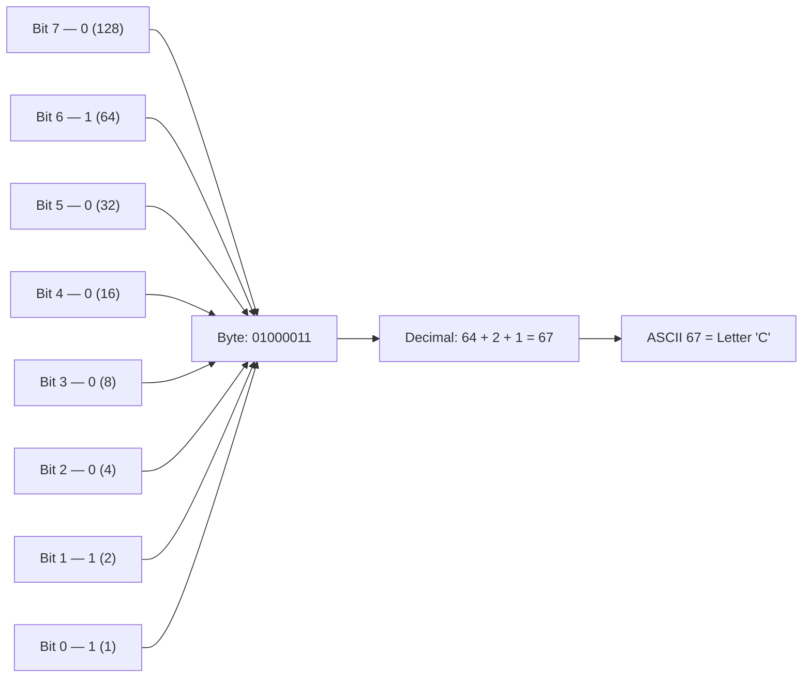
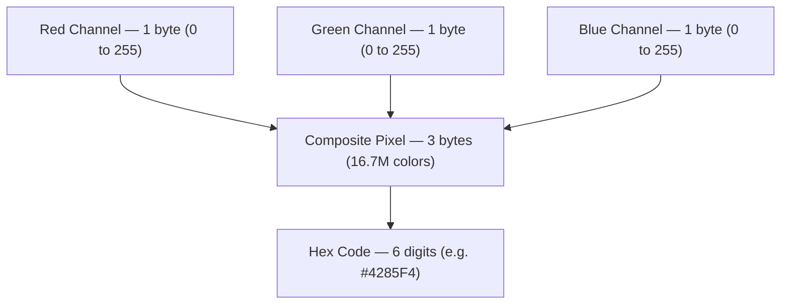
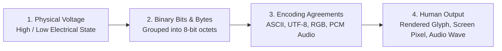

<Concepts items={["binary system", "bit", "byte", "voltage states", "character encoding", "ASCII", "Unicode", "UTF-8", "RGB model", "hex code"]} />

<LessonIntro>

A support ticket says "the file shows gibberish" or "the colors look wrong," and the cause sits one layer below the application: the machine only ever holds **voltage**, and everything else — letters, emoji, photographs — is an agreement about how to *interpret* that voltage. 

Computers operate on the **binary system**, the base-2 numeral system using only 0 and 1, because electronics most reliably holds two states: current present (1, high voltage, ON) or current absent (0, no voltage, OFF). Billions of such comparisons per second, grouped into bytes and decoded through agreed encodings, produce every document and display you support. This lesson builds that chain from wire to word to pixel.

</LessonIntro>

## Why this matters

For a support specialist or systems administrator, character and color encoding is never abstract theory — it is the root cause behind frequent, confusing helpdesk tickets:

* **Mojibake & Scrambled Text:** When an international customer submits an accented name like `Renée` and the database displays `Renée`, or an Excel spreadsheet renders foreign characters as diamond question marks (``), an encoding mismatch occurred between the sender and receiver.
* **Script Crashes on Non-ASCII:** Batch processing and automation scripts in Python or PowerShell that assume standard 7-bit ASCII will crash with unhandled decode exceptions when encountering curly quotes or smart punctuation copied from Word.
* **String Truncation & Buffer Overflows:** In legacy software that assumes 1 character = 1 byte, storing a multi-byte UTF-8 string (such as an emoji or CJK character) silently truncates the end of the text or corrupts database boundaries.
* **Display Triage:** Understanding the 24-bit RGB pipeline enables you to instantly diagnose whether a discolored laptop screen is caused by a failing subpixel array, a loose display cable, or a bad GPU driver.

---

## 01 — Physical Voltages Become Binary Bits & Bytes

Computers do not natively understand numbers, letters, or pixels. At the physical layer, computers understand only electrical voltage states.

<ConceptCard name="Binary System" category="Base-2 Language">

**What it is.** A base-2 numeral system that represents values and instructions using only two digits, 0 and 1, in contrast to human decimal (base-10) or alphabetical languages.

**How it works.** Each binary digit maps to one reliable physical state of a circuit — high voltage for 1, no voltage for 0. A computer computes by comparing billions of these ones and zeros per second; multi-bit patterns then stand for numbers, instructions, characters, and colors according to whichever encoding both writer and reader agreed to use.

</ConceptCard>

<ConceptCard name="Bit and Byte" category="Storage Units">

**What it is.** A **bit (binary digit)** is the smallest atomic unit of digital storage, holding exactly one binary state. A **byte** is a bundle of 8 bits and the standard unit that stores one text character.

**How it works.** Because each bit has 2 states, an 8-bit byte holds:

$$\text{Possible Values} = 2^8 = 256 \text{ distinct states } (0 \text{ to } 255)$$

The letter C, for example, lives in one byte as `01000011` (decimal 67): bits 6, 1, and 0 are ON and the rest are OFF.

</ConceptCard>

*Figure 3.1 — One byte holding 01000011: three ON bits select decimal 67, which ASCII renders as the letter C.*

---

## 02 — Character Encoding: From ASCII to Unicode & UTF-8

Software needs an explicit dictionary to convert arbitrary numeric byte values into human-readable characters.

<ConceptCard name="Character Encoding" category="Translation Agreement">

**What it is.** The system that assigns binary values to human-readable characters — letters, digits, punctuation, symbols — functioning like a shared dictionary between machine bits and readable text.

**How it works.** The writer converts each character to its agreed bit pattern; the reader converts the pattern back. If both ends use the same encoding, text survives the trip. If they disagree, the reader decodes valid bits under the wrong dictionary and the user sees unreadable streams of wrong characters — the classic encoding-mismatch ticket.

</ConceptCard>

<ConceptCard name="ASCII" category="Foundational Encoding">

**What it is.** **ASCII (American Standard Code for Information Interchange)**, the oldest foundational character encoding: 7 bits per character, 128 total values (0 to 127) out of a full byte's 256.

**How it works.** ASCII assigns the English uppercase and lowercase alphabets, digits 0–9, standard punctuation, and control characters (newline, tab) to fixed positions. The leading bit of the byte stays 0, which is why ASCII text is inherently English-only — the remaining values were simply never assigned.

</ConceptCard>

### Standard ASCII Mapping Sample

| Character | Decimal Value | 8-Bit Binary Representation | Hexadecimal |
| :--- | :--- | :--- | :--- |
| `A` (Uppercase A) | 65 | `01000001` | `0x41` |
| `B` (Uppercase B) | 66 | `01000010` | `0x42` |
| `a` (Lowercase a) | 97 | `01100001` | `0x61` |
| `0` (Digit zero) | 48 | `00110000` | `0x30` |
| `!` (Exclamation) | 33 | `00100001` | `0x21` |

> [!NOTE] The Case-Conversion Bit
> Look closely at uppercase `A` (65 / `01000001`) and lowercase `a` (97 / `01100001`). They differ by exactly 32 — which is precisely bit 5! Case conversion in ASCII is literally toggling that single wire, explaining why so many keyboard or parser bugs affect letter casing.

<ConceptCard name="Unicode and UTF-8" category="Global Encoding">

**What it is.** The **Unicode Standard**, a universal character set assigning unique code points to all human languages and symbols, and **UTF-8**, its dominant variable-length encoding using 1 to 4 bytes per character while staying backward-compatible with ASCII.

**How it works.** ASCII text is valid UTF-8 unchanged (one byte per character), so English never notices the upgrade. Characters beyond ASCII expand as needed: accented and Greek scripts take 2 bytes, Asian scripts 3 bytes, emoji 4 bytes. One encoding thereby covers over a million characters without breaking the billions of ASCII documents already stored.

</ConceptCard>

| Encoding Standard | Byte Width | Character Capacity | Practical Usage |
| :--- | :--- | :--- | :--- |
| **ASCII** | Fixed 1 byte (7 bits used) | 128 characters | Legacy serial consoles, early Unix configs. |
| **ISO-8859-1 (Latin-1)** | Fixed 1 byte (8 bits used) | 256 characters | Western European legacy web documents. |
| **UTF-8** | Variable: 1 to 4 bytes | 1,114,112 code points | The universal standard of the modern web and modern OSs. |
| **UTF-16** | Variable: 2 or 4 bytes | 1,114,112 code points | Windows internal APIs and Java/JavaScript runtimes. |

---

## 03 — The RGB Color Model & 24-Bit True Color

Just as numbers represent characters, sequences of numbers represent visual light on digital displays.

<ConceptCard name="RGB Color Model" category="24-Bit Color">

**What it is.** The **RGB (Red, Green, Blue)** additive color model: each pixel's color is mixed from varying intensities of red, green, and blue light, with 1 byte (8 bits, values 0–255) per channel in 24-bit True Color.

**How it works.** Three bytes per pixel give:

$$256 \times 256 \times 256 = 16{,}777{,}216 \text{ distinct colors}$$

Zero intensity on all three channels is black (lights off); maximum on all three is white; maximum on exactly two channels yields secondary colors — red plus green makes yellow, and so on. Each channel value is conventionally written as two hexadecimal digits, concatenated into a hex code.

</ConceptCard>

| Color Name | Red (0–255) | Green (0–255) | Blue (0–255) | Hexadecimal Code |
| :--- | :--- | :--- | :--- | :--- |
| **Pure Red** | 255 | 0 | 0 | `#FF0000` |
| **Pure Green** | 0 | 255 | 0 | `#00FF00` |
| **Pure Blue** | 0 | 0 | 255 | `#0000FF` |
| **Pure White** | 255 | 255 | 255 | `#FFFFFF` |
| **Pure Black (Off)** | 0 | 0 | 0 | `#000000` |
| **Yellow** | 255 | 255 | 0 | `#FFFF00` |

### Interactive 24-Bit Pixel Laboratory

Try adjusting the sliders below to see how three individual 8-bit channels blend directly into a 24-bit True Color pixel in real time:

<RgbMixer />

*Figure 3.2 — The 24-bit RGB pipeline: three one-byte intensities mix into one pixel, written as a six-digit hex code.*

---

## 04 — The Decoding Pipeline: From Voltage to Human Output

Every human-facing output follows an unbroken chain from hardware physics to semantic agreements:

*Figure 3.3 — The full decoding chain: physics at the bottom, agreements in the middle, human meaning at the top.*

### Step-by-Step Decoding Flow

1. **Hold a physical state:** A semiconductor circuit holds high voltage (1) or no voltage (0) — one bit.
2. **Bundle into bytes:** Eight bits form one byte: 256 possible values, enough for one standard Latin character.
3. **Agree on a dictionary:** Both endpoints agree to adopt ASCII for legacy text or UTF-8 for international text.
4. **Decode on arrival:** The receiving software looks up the bit pattern in its active encoding table. Mismatches yield unreadable symbols.
5. **Triple for color:** Three contiguous bytes per pixel — red, green, blue — mix 16.7 million distinct display colors.

---

## 05 — Real-World Support Scenarios & Practical Diagnostics

Understanding encodings lets you rapidly triage problems that leave inexperienced technicians baffled.

* **Obvious — Digit Characters vs Raw Numbers:** The digit character `'0'` is stored as decimal 48 (`00110000`), not as numeric zero. Text and arithmetic live in different encodings, which is why concatenating rather than adding two numbers (yielding `"5" + "5" = "55"`) is a classic data bug.
* **Counter-intuitive — Byte Count vs Character Count:** An emoji costs four bytes while the letter `A` costs one, yet both appear as "one character" to the end user. String length validation measured in bytes versus characters causes truncated names and database insertion errors.
* **Edge case — The Dead Blue Subpixel Channel:** Pure yellow (`#FFFF00`) contains zero blue. On a failing monitor with a dead blue subpixel channel, yellow renders perfectly while pure white (`#FFFFFF`) looks yellowish. This diagnostic rules out bad HDMI cables: if yellow is crisp but white is tinted, the physical blue display channel is dead.

<AnalogyCard name="A Shared Phrasebook">

**The concept.** Character encoding is a prior agreement mapping bit patterns to characters; both writer and reader must use the same edition.

**The analogy.** Two travelers share a phrasebook where entry 65 means "hello." If one of them swaps to a different publisher's phrasebook where 65 means "goodbye," every sentence arrives perfectly legible and perfectly wrong. Encoding bugs are phrasebook mismatches, not transmission damage.

</AnalogyCard>

<LessonNote variant="myth" title="What people get wrong about text">

**Myth:** "Text is just letters stored in the file."

**Truth:** Files store numbers; letters are what the agreed encoding *renders* those numbers as. The same byte `01000001` is the letter A in ASCII, part of a two-byte Greek character in UTF-8, and the number 65 to arithmetic. There is no text without an interpreter.

</LessonNote>

<LessonNote variant="why">

"Gibberish on screen" is one of the most common support tickets in multilingual organizations, and its fix is almost never reinstalling anything — it is identifying which encoding wrote the file and opening it with the same one. This lesson is that fix, prepaid.

</LessonNote>

---

## Summary Checklist: Computer Language & Encoding Mental Model

1. **Hardware is pure voltage:** Modern digital logic recognizes only high voltage (1) and low voltage (0); all meaning above this layer is human agreement.
2. **Bytes are 8-bit octets:** An 8-bit byte provides $2^8 = 256$ discrete numeric states ($0\text{ to }255$).
3. **ASCII is a 7-bit English standard:** It defines 128 characters; uppercase and lowercase differ by exactly 1 bit (bit 5).
4. **UTF-8 is variable and backward-compatible:** It maps over 1.1 million Unicode characters using 1 to 4 bytes while treating existing ASCII files as valid 1-byte UTF-8.
5. **24-bit True Color uses 3 bytes:** Each pixel allocates 1 byte for Red, 1 for Green, and 1 for Blue, producing 16,777,216 distinct color combinations.

---

<QuickRecall title="Check yourself before moving on">

1. Why do computers use base-2 rather than base-10?
2. How many values does one byte hold, and what is the exact arithmetic?
3. How does UTF-8 stay compatible with ASCII while covering emoji?
4. What RGB triplet and hex code produce pure white, and why?

</QuickRecall>

Bits and encodings explain what the machine *holds*. The next lesson explains what it *does* with those bits — the logic gates that turn voltage patterns into calculation.
