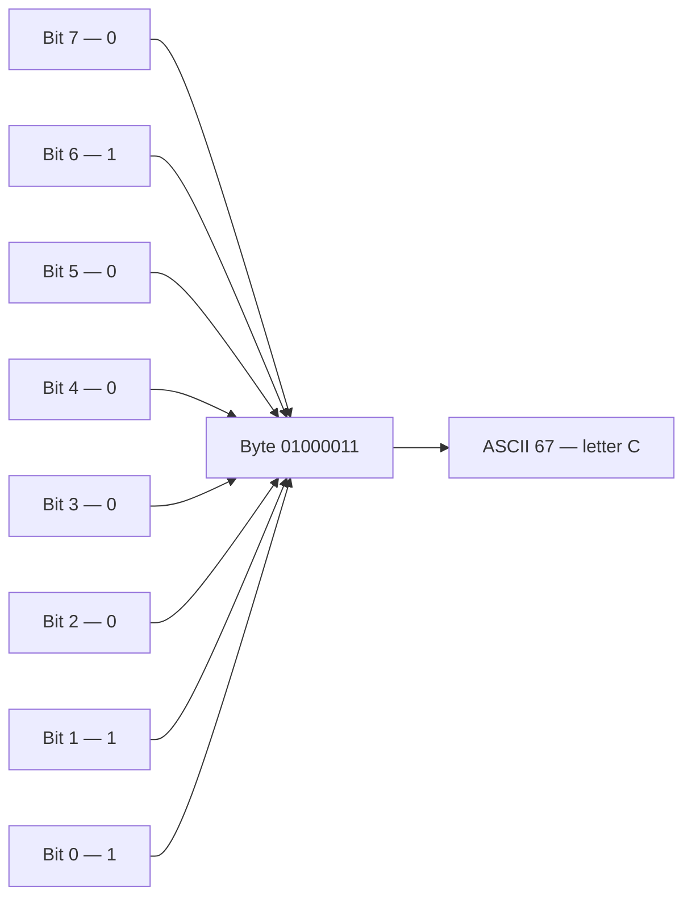
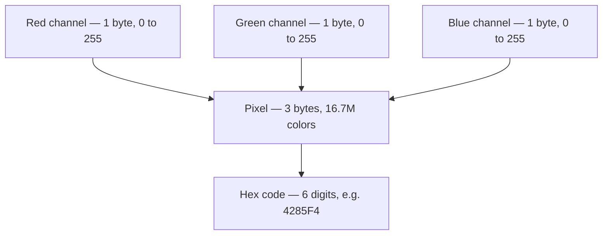
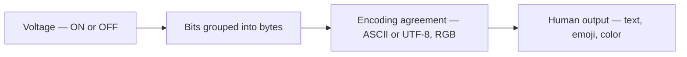

<Concepts items={["binary system", "bit", "byte", "voltage states", "character encoding", "ASCII", "Unicode", "UTF-8", "RGB model", "hex code"]} />

<LessonIntro>

A support ticket says "the file shows gibberish" or "the colors look wrong," and the cause sits one layer below the application: the machine only ever holds **voltage**, and everything else — letters, emoji, photographs — is an agreement about how to *interpret* that voltage. Computers operate on the **binary system**, the base-2 numeral system using only 0 and 1, because electronics most reliably holds two states: current present (1, high voltage, ON) or current absent (0, no voltage, OFF). Billions of such comparisons per second, grouped into bytes and decoded through agreed encodings, produce every document and display you support. This lesson builds that chain from wire to word to pixel.

</LessonIntro>

For a support specialist, encoding is not theory — it is the root cause behind mojibake text pasted from one system into another,CSV files that open with scrambled accents, and "why is this emoji a box on their machine" tickets. Learn the agreements and those tickets stop being mysterious.

## Concept Breakdown: What It Is and How It Works

<ConceptCard name="Binary System" category="Base-2 Language">

**What it is.** A base-2 numeral system that represents values and instructions using only two digits, 0 and 1, in contrast to human decimal (base-10) or alphabetical languages.

**How it works.** Each binary digit maps to one reliable physical state of a circuit — high voltage for 1, no voltage for 0. A computer computes by comparing billions of these ones and zeros per second; multi-bit patterns then stand for numbers, instructions, characters, and colors according to whichever encoding both writer and reader agreed to use.

</ConceptCard>

<ConceptCard name="Bit and Byte" category="Storage Units">

**What it is.** A **bit (binary digit)** is the smallest atomic unit of digital storage, holding exactly one binary state. A **byte** is a bundle of 8 bits and the standard unit that stores one text character.

**How it works.** Because each bit has 2 states, an 8-bit byte holds 2^8 = 2 × 2 × 2 × 2 × 2 × 2 × 2 × 2 = 256 possible unique values (0 to 255). The letter C, for example, lives in one byte as `01000011` (decimal 67): bits 6, 1, and 0 are ON and the rest are OFF.

</ConceptCard>

*Figure 3.1 — One byte holding 01000011: three ON bits select decimal 67, which ASCII renders as the letter C.*

<ConceptCard name="Character Encoding" category="Translation Agreement">

**What it is.** The system that assigns binary values to human-readable characters — letters, digits, punctuation, symbols — functioning like a shared dictionary between machine bits and readable text.

**How it works.** The writer converts each character to its agreed bit pattern; the reader converts the pattern back. If both ends use the same encoding, text survives the trip. If they disagree, the reader decodes valid bits under the wrong dictionary and the user sees unreadable streams of wrong characters — the classic encoding-mismatch ticket.

</ConceptCard>

<ConceptCard name="ASCII" category="Foundational Encoding">

**What it is.** **ASCII (American Standard Code for Information Interchange)**, the oldest foundational character encoding: 7 bits per character, 128 total values (0 to 127) out of a full byte's 256.

**How it works.** ASCII assigns the English uppercase and lowercase alphabets, digits 0–9, standard punctuation, and control characters (newline, tab) to fixed positions. The leading bit of the byte stays 0, which is why ASCII text is inherently English-only — the remaining values were simply never assigned.

</ConceptCard>

| Character | Decimal Value | 8-Bit Binary Representation |
| --- | --- | --- |
| `A` (Uppercase A) | 65 | `01000001` |
| `a` (Lowercase a) | 97 | `01100001` |
| `B` (Uppercase B) | 66 | `01000010` |
| `0` (Digit zero) | 48 | `00110000` |
| `!` (Exclamation) | 33 | `00100001` |

Note the structure hiding in the table: uppercase `A` (65) and lowercase `a` (97) differ by exactly 32 — a single bit (bit 5). Case conversion in ASCII is literally flipping one wire, which is why so many text bugs involve exactly that bit.

<ConceptCard name="Unicode and UTF-8" category="Global Encoding">

**What it is.** The **Unicode Standard**, a universal character set assigning unique code points to all human languages and symbols, and **UTF-8**, its dominant variable-length encoding using 1 to 4 bytes per character while staying backward-compatible with ASCII.

**How it works.** ASCII text is valid UTF-8 unchanged (one byte per character), so English never notices the upgrade. Characters beyond ASCII expand as needed: accented and Greek scripts take 2 bytes, Asian scripts 3 bytes, emoji 4 bytes. One encoding thereby covers over a million characters without breaking the billions of ASCII documents already stored.

</ConceptCard>

| Encoding Type | Byte Width | Supported Range | Examples |
| --- | --- | --- | --- |
| ASCII | Fixed 1 byte (7 bits used) | 128 characters | `A, b, 7, ?, !` |
| UTF-8 | Variable: 1 to 4 bytes | 1,114,112 characters | English (1 byte), Spanish/Greek (2 bytes), Asian scripts (3 bytes), Emojis (4 bytes) |

<ConceptCard name="RGB Color Model" category="24-Bit Color">

**What it is.** The **RGB (Red, Green, Blue)** additive color model: each pixel's color is mixed from varying intensities of red, green, and blue light, with 1 byte (8 bits, values 0–255) per channel in 24-bit True Color.

**How it works.** Three bytes per pixel give 256 × 256 × 256 = 16,777,216 distinct colors. Zero intensity on all three channels is black (lights off); maximum on all three is white; maximum on exactly two channels yields the secondary colors — red plus green makes yellow, and so on. Each channel value is conventionally written as two hexadecimal digits, concatenated into a hex code.

</ConceptCard>

| Color Name | Red Channel (0-255) | Green Channel (0-255) | Blue Channel (0-255) | Hex Code |
| --- | --- | --- | --- | --- |
| Pure Red | 255 | 0 | 0 | `#FF0000` |
| Pure Green | 0 | 255 | 0 | `#00FF00` |
| Pure Blue | 0 | 0 | 255 | `#0000FF` |
| Pure White | 255 | 255 | 255 | `#FFFFFF` |
| Pure Black (Lights Off) | 0 | 0 | 0 | `#000000` |
| Yellow | 255 | 255 | 0 | `#FFFF00` |

The interactive lab from the source lesson drives this home with a 24-bit pixel mixer: three sliders, one per 8-bit channel from 0 to 255, blend live into a preview swatch. Its default position — red 66, green 133, blue 244 — renders `rgb(66, 133, 244)`, hex `#4285F4`. Raising one slider toward 255 pushes the swatch toward that primary; dropping all three toward 0 darkens it toward black.

<RgbMixer />

*Figure 3.2 — The 24-bit RGB pipeline: three one-byte intensities mix into one pixel, written as a six-digit hex code.*

*Figure 3.3 — The full decoding chain: physics at the bottom, agreements in the middle, human meaning at the top.*

## Step-by-step breakdown

1. **Hold a state.** One circuit holds high voltage (1) or no voltage (0) — one bit.
2. **Bundle into bytes.** Eight bits form one byte: 256 values, enough for one ASCII character.
3. **Agree on a dictionary.** Both ends adopt ASCII for English or UTF-8 for global text.
4. **Decode on arrival.** Bit patterns map back to characters; mismatched dictionaries produce gibberish.
5. **Triple for color.** Three bytes per pixel — red, green, blue — mix 16.7 million display colors.

## Examples

- **Obvious —** The digit character `0` is stored as decimal 48 (`00110000`), not as numeric zero. Text and arithmetic live in different encodings, which is why adding two digit-characters without converting them first gives nonsense.
- **Counter-intuitive —** An emoji costs four bytes while the letter A costs one, yet both are "one character" to the user. String lengths measured in bytes versus measured in characters therefore disagree — the source of countless off-by-N text truncation bugs in tickets about cut-off names.
- **Edge case —** Pure yellow (`#FFFF00`) contains zero blue. On a failing display with a dead blue subpixel channel, yellow renders perfectly while white renders yellowish — a support-relevant diagnostic: if white looks yellow but yellow looks right, suspect the blue channel, not the cable.

<AnalogyCard name="A Shared Phrasebook">

**The concept.** Character encoding is a prior agreement mapping bit patterns to characters; both writer and reader must use the same edition.

**The analogy.** Two travelers share a phrasebook where entry 65 means "hello." If one of them swaps to a different publisher's phrasebook where 65 means "goodbye," every sentence arrives perfectly legible and perfectly wrong. Encoding bugs are phrasebook mismatches, not transmission damage.

</AnalogyCard>

<LessonNote variant="myth" title="What people get wrong about text">

**Myth:** "Text is just letters stored in the file."

**Truth:** Files store numbers; letters are what the agreed encoding *renders* those numbers as. The same byte `01000001` is the letter A in ASCII, part of a two-byte Greek character in UTF-8, and the number 65 to arithmetic. There is no text without an interpreter.

</LessonNote>

<LessonNote variant="why">

"Gibberish on screen" is one of the most common support tickets in multilingual organizations, and its fix is almost never reinstalling anything — it is identifying which encoding wrote the file and opening it with the same one. This lesson is that fix, prepaid.

</LessonNote>

<QuickRecall title="Check yourself before moving on">

1. Why do computers use base-2 rather than base-10?
2. How many values does one byte hold, and what is the exact arithmetic?
3. How does UTF-8 stay compatible with ASCII while covering emoji?
4. What RGB triplet and hex code produce pure white, and why?

</QuickRecall>

Bits and encodings explain what the machine *holds*. The next lesson explains what it *does* with those bits — the logic gates that turn voltage patterns into calculation.
