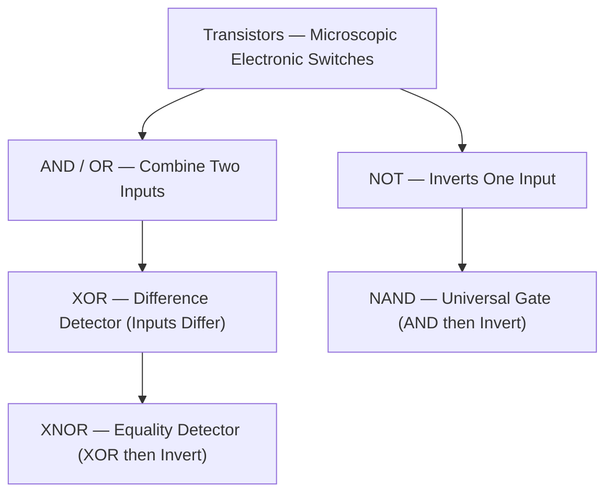
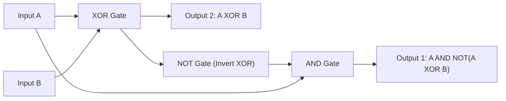
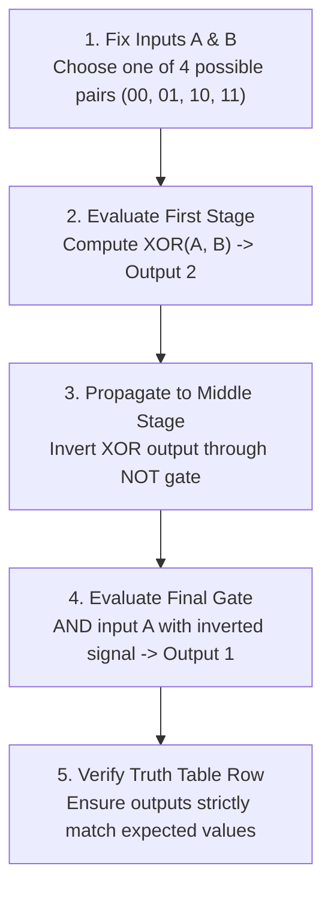

<Concepts items={["logic gates", "truth table", "NOT gate", "AND gate", "OR gate", "XOR gate", "NAND gate", "XNOR gate", "digital circuits", "signal propagation"]} />

<LessonIntro>

Every calculation a computer performs — every bit it adds, compares, or stores — bottoms out in tiny electronic components called **logic gates**: physical assemblies of transistors that implement exact rules mapping input voltages to an output voltage. 

The machine knows only ON (1, high voltage) and OFF (0, no voltage); a gate takes one or two such signals and decides, by its wiring alone, which signal to pass on. Six gate types cover the essential decisions, and everything above them — adders, memory, processors — is gates chained into **circuits**, the output of one feeding the input of the next. This lesson catalogs all six gates with their exact truth tables, then walks a three-gate circuit the way a signal actually travels through it.

</LessonIntro>

## Why this matters

While IT technicians rarely solder individual logic gates on a motherboard, the mental discipline of boolean logic governs modern systems engineering:

* **Triage as Boolean Evaluation:** Every support checklist is a boolean expression. A printer failure is evaluated as `(Power == 1) AND (NetworkLink == 1) AND (SpoolerService == 1) AND (PaperTray != Empty)`. If any term is 0, the output is 0.
* **Storage Architecture (NAND Flash):** Modern solid-state storage (NVMe and SATA SSDs) is physically fabricated from billions of floating-gate or charge-trap **NAND** cells. Understanding NAND gate physics explains write endurance, wear leveling, and why blocks must be erased before being rewritten.
* **Error Correction (ECC) & RAID Parity:** Memory buses and storage arrays (RAID 5 / RAID 6) use **XOR** gates to generate parity bits. When a single bit flips due to cosmic radiation or a drive fails in an array, XOR math mathematically reconstructs the lost byte on the fly.
* **Firewall & Security Rules:** Network security rules, IAM access policies, and conditional access policies evaluate boolean truth tables to grant or deny packet flow.

*Figure 4.1 — Discrete transistors. Every logic gate is transistor wiring that maps input voltages to an output voltage. Image: Wikimedia Commons (Honina / Wikimedia).*

---

## 01 — The Primitive Gates: NOT, AND, and OR

At the foundation of digital computation are three primitive operations: negation, conjunction, and disjunction.

<ConceptCard name="Logic Gates and Truth Tables" category="Foundation">

**What it is.** Physical electronic components built from transistors that produce an output voltage according to a fixed logical rule over one or more input voltages, fully described by a **truth table** mapping every possible input combination to its output.

**How it works.** Inputs arrive as binary signals (1 for ON/high voltage, 0 for OFF/no voltage). The gate's transistor wiring evaluates its rule instantaneously in hardware — no software runs, no decision is made; the physics *is* the logic. Two-input gates therefore always have exactly four truth-table rows (00, 01, 10, 11); one-input gates have two.

</ConceptCard>

### The NOT Gate (Inverter)

<ConceptCard name="NOT Gate (Inverter)" category="1 Input">

**What it is.** The simplest gate: one input, inverted to the opposite state at the output. Input 1 gives output 0; input 0 gives output 1.

**How it works.** A single switching stage flips the signal — schematically a triangle pointing at the output with a small inversion bubble. NOT is the building block of every negated gate (NAND, XNOR) and of any circuit branch that needs the complement of a signal.

</ConceptCard>

<svg viewBox="0 0 160 70" width="240" height="105" fill="none" role="img" aria-label="NOT gate schematic: input A enters a triangle, a small inversion bubble follows, output Q leaves">
<line x1="20" y1="35" x2="55" y2="35" stroke="#38bdf8" strokeWidth="2"/>
<text x="12" y="39" fill="#9ca3af" fontSize="12" fontFamily="'Fira Code', monospace">A</text>
<polygon points="55,15 55,55 95,35" fill="#1f2937" stroke="#f3f4f6" strokeWidth="2"/>
<circle cx="101" cy="35" r="5" fill="#111827" stroke="#f3f4f6" strokeWidth="2"/>
<line x1="107" y1="35" x2="140" y2="35" stroke="#38bdf8" strokeWidth="2"/>
<text x="145" y="39" fill="#9ca3af" fontSize="12" fontFamily="'Fira Code', monospace">Q</text>
</svg>

*Figure 4.2 — NOT gate schematic: input wire A feeds the triangle (inverter body), the small circle is the inversion bubble, output wire Q leaves to the right.*

| Input (A) | Output (Q) |
| :---: | :---: |
| 0 | 1 |
| 1 | 0 |

### The AND Gate

<ConceptCard name="AND Gate" category="2 Inputs">

**What it is.** A two-input gate that outputs 1 (ON) only when both inputs are 1; any 0 anywhere forces the output to 0.

**How it works.** Schematically a D-shaped body with two input wires on the flat side. Conceptually it is strict unanimity: A AND B must both hold. In support triage it models every "all of these must be true" checklist — power, cable, driver, service.

</ConceptCard>

<svg viewBox="0 0 160 70" width="240" height="105" fill="none" role="img" aria-label="AND gate schematic: inputs A and B enter a D-shaped body, output Q leaves">
<line x1="20" y1="23" x2="55" y2="23" stroke="#38bdf8" strokeWidth="2"/>
<line x1="20" y1="47" x2="55" y2="47" stroke="#38bdf8" strokeWidth="2"/>
<text x="10" y="27" fill="#9ca3af" fontSize="12" fontFamily="'Fira Code', monospace">A</text>
<text x="10" y="51" fill="#9ca3af" fontSize="12" fontFamily="'Fira Code', monospace">B</text>
<path d="M 55 15 L 75 15 C 95 15 105 25 105 35 C 105 45 95 55 75 55 L 55 55 Z" fill="#1f2937" stroke="#f3f4f6" strokeWidth="2"/>
<line x1="105" y1="35" x2="140" y2="35" stroke="#38bdf8" strokeWidth="2"/>
<text x="145" y="39" fill="#9ca3af" fontSize="12" fontFamily="'Fira Code', monospace">Q</text>
</svg>

*Figure 4.3 — AND gate schematic: two input wires A and B enter the flat side of the D-shaped body, output wire Q leaves the curved side.*

| A | B | Output (Q) |
| :---: | :---: | :---: |
| 0 | 0 | 0 |
| 0 | 1 | 0 |
| 1 | 0 | 0 |
| 1 | 1 | 1 |

### The OR Gate

<ConceptCard name="OR Gate" category="2 Inputs">

**What it is.** A two-input gate that outputs 0 (OFF) only when both inputs are 0; if at least one input is 1, the output is 1.

**How it works.** Schematically a curved shield (pointed body) with two inputs. It models leniency: any single qualifying condition suffices. "The user can authenticate by password OR by hardware key" is OR-logic — one path working is enough.

</ConceptCard>

<svg viewBox="0 0 160 70" width="240" height="105" fill="none" role="img" aria-label="OR gate schematic: inputs A and B enter a curved shield body, output Q leaves">
<line x1="20" y1="23" x2="60" y2="23" stroke="#38bdf8" strokeWidth="2"/>
<line x1="20" y1="47" x2="60" y2="47" stroke="#38bdf8" strokeWidth="2"/>
<text x="10" y="27" fill="#9ca3af" fontSize="12" fontFamily="'Fira Code', monospace">A</text>
<text x="10" y="51" fill="#9ca3af" fontSize="12" fontFamily="'Fira Code', monospace">B</text>
<path d="M 50 15 Q 68 35 50 55 Q 85 55 105 35 Q 85 15 50 15 Z" fill="#1f2937" stroke="#f3f4f6" strokeWidth="2"/>
<line x1="105" y1="35" x2="140" y2="35" stroke="#38bdf8" strokeWidth="2"/>
<text x="145" y="39" fill="#9ca3af" fontSize="12" fontFamily="'Fira Code', monospace">Q</text>
</svg>

*Figure 4.4 — OR gate schematic: two input wires A and B enter the curved shield (pointed body), output wire Q leaves the tip.*

| A | B | Output (Q) |
| :---: | :---: | :---: |
| 0 | 0 | 0 |
| 0 | 1 | 1 |
| 1 | 0 | 1 |
| 1 | 1 | 1 |

---

## 02 — Derived & Universal Gates: XOR, NAND, and XNOR

By combining inverters with AND/OR stages, engineers construct specialized difference detectors and universal building blocks.

*Figure 4.5 — The logic gate family hierarchy.*

### The XOR Gate (Exclusive OR)

<ConceptCard name="XOR Gate (Exclusive OR)" category="2 Inputs">

**What it is.** A two-input gate that outputs 1 when exactly one (but not both) of the inputs is 1; identical inputs (both 0 or both 1) give 0.

**How it works.** Schematically an OR shield with an extra curved input line. XOR is a difference detector — it answers "are these inputs *different*?" It is the core of binary addition (the sum bit of a half-adder is A XOR B) and of parity checks that detect transmission errors.

</ConceptCard>

<svg viewBox="0 0 160 70" width="240" height="105" fill="none" role="img" aria-label="XOR gate schematic: inputs A and B pass a double-curved input stage into a shield body, output Q leaves">
<line x1="20" y1="23" x2="52" y2="23" stroke="#38bdf8" strokeWidth="2"/>
<line x1="20" y1="47" x2="52" y2="47" stroke="#38bdf8" strokeWidth="2"/>
<text x="10" y="27" fill="#9ca3af" fontSize="12" fontFamily="'Fira Code', monospace">A</text>
<text x="10" y="51" fill="#9ca3af" fontSize="12" fontFamily="'Fira Code', monospace">B</text>
<path d="M 45 15 Q 63 35 45 55" stroke="#f3f4f6" strokeWidth="2" fill="none"/>
<path d="M 55 15 Q 73 35 55 55 Q 90 55 110 35 Q 90 15 55 15 Z" fill="#1f2937" stroke="#f3f4f6" strokeWidth="2"/>
<line x1="110" y1="35" x2="140" y2="35" stroke="#38bdf8" strokeWidth="2"/>
<text x="145" y="39" fill="#9ca3af" fontSize="12" fontFamily="'Fira Code', monospace">Q</text>
</svg>

*Figure 4.6 — XOR gate schematic: the extra curved input line marks it as exclusive-OR.*

| A | B | Output (Q) |
| :---: | :---: | :---: |
| 0 | 0 | 0 |
| 0 | 1 | 1 |
| 1 | 0 | 1 |
| 1 | 1 | 0 |

### The NAND Gate (Universal Gate)

<ConceptCard name="NAND Gate (Not-AND)" category="2 Inputs">

**What it is.** An AND gate followed by a NOT: it outputs 0 (OFF) only when both inputs are 1, and 1 in every other case.

**How it works.** Schematically a D-shaped AND body with an inversion bubble at the output. NAND is universal — any other gate, and therefore any circuit, can be built from NAND gates alone — which is why manufacturers optimize for it and why it appears constantly in hardware documentation you may read during escalation.

</ConceptCard>

<svg viewBox="0 0 160 70" width="240" height="105" fill="none" role="img" aria-label="NAND gate schematic: inputs A and B enter a D-shaped body with an inversion bubble, output Q leaves">
<line x1="20" y1="23" x2="55" y2="23" stroke="#38bdf8" strokeWidth="2"/>
<line x1="20" y1="47" x2="55" y2="47" stroke="#38bdf8" strokeWidth="2"/>
<text x="10" y="27" fill="#9ca3af" fontSize="12" fontFamily="'Fira Code', monospace">A</text>
<text x="10" y="51" fill="#9ca3af" fontSize="12" fontFamily="'Fira Code', monospace">B</text>
<path d="M 55 15 L 75 15 C 95 15 105 25 105 35 C 105 45 95 55 75 55 L 55 55 Z" fill="#1f2937" stroke="#f3f4f6" strokeWidth="2"/>
<circle cx="111" cy="35" r="5" fill="#111827" stroke="#f3f4f6" strokeWidth="2"/>
<line x1="117" y1="35" x2="140" y2="35" stroke="#38bdf8" strokeWidth="2"/>
<text x="145" y="39" fill="#9ca3af" fontSize="12" fontFamily="'Fira Code', monospace">Q</text>
</svg>

*Figure 4.7 — NAND gate schematic: D-shaped AND body with output inversion bubble.*

| A | B | Output (Q) |
| :---: | :---: | :---: |
| 0 | 0 | 1 |
| 0 | 1 | 1 |
| 1 | 0 | 1 |
| 1 | 1 | 0 |

### The XNOR Gate (Equality Detector)

<ConceptCard name="XNOR Gate (Not-XOR)" category="2 Inputs">

**What it is.** An XOR gate followed by a NOT: it outputs 1 (ON) only when both inputs are the same (both 0 or both 1), and 0 when they differ.

**How it works.** Schematically an XOR body with an inversion bubble at the output. XNOR is an equality detector — the complement of XOR's difference detection — and appears wherever hardware must test "do these two signals agree," from comparators to error-checking stages.

</ConceptCard>

<svg viewBox="0 0 160 70" width="240" height="105" fill="none" role="img" aria-label="XNOR gate schematic: inputs A and B pass a double-curved stage into a shield body with an inversion bubble, output Q leaves">
<line x1="20" y1="23" x2="48" y2="23" stroke="#38bdf8" strokeWidth="2"/>
<line x1="20" y1="47" x2="48" y2="47" stroke="#38bdf8" strokeWidth="2"/>
<text x="10" y="27" fill="#9ca3af" fontSize="12" fontFamily="'Fira Code', monospace">A</text>
<text x="10" y="51" fill="#9ca3af" fontSize="12" fontFamily="'Fira Code', monospace">B</text>
<path d="M 42 15 Q 60 35 42 55" stroke="#f3f4f6" strokeWidth="2" fill="none"/>
<path d="M 52 15 Q 70 35 52 55 Q 85 55 102 35 Q 85 15 52 15 Z" fill="#1f2937" stroke="#f3f4f6" strokeWidth="2"/>
<circle cx="108" cy="35" r="5" fill="#111827" stroke="#f3f4f6" strokeWidth="2"/>
<line x1="114" y1="35" x2="140" y2="35" stroke="#38bdf8" strokeWidth="2"/>
<text x="145" y="39" fill="#9ca3af" fontSize="12" fontFamily="'Fira Code', monospace">Q</text>
</svg>

*Figure 4.8 — XNOR gate schematic: XOR double-curve and shield body with inversion bubble.*

| A | B | Output (Q) |
| :---: | :---: | :---: |
| 0 | 0 | 1 |
| 0 | 1 | 0 |
| 1 | 0 | 0 |
| 1 | 1 | 1 |

---

## 03 — Combinational Digital Circuits: Signal Propagation

Real computer architectures chain millions of gates together so the output of one gate feeds the inputs of subsequent gates.

### Tracing a Three-Gate Circuit

Consider the three-gate combinational circuit below: inputs A and B enter an **XOR** gate; that result splits into a directly observable **Output 2** (`A XOR B`) and a branch into a **NOT** gate; the inverted signal then meets original input A at an **AND** gate whose result is **Output 1** (`A AND (NOT (A XOR B))`):

*Figure 4.9 — Signal propagation through the three-gate circuit: XOR splits to a visible output and an inverted branch that rejoins A at the AND gate.*

### Full Circuit Truth Table

| Input A | Input B | XOR Result (Output 2) | NOT(XOR) | AND Result (Output 1) |
| :---: | :---: | :---: | :---: | :---: |
| 0 | 0 | 0 | 1 | **0** (0 AND 1) |
| 0 | 1 | 1 | 0 | **0** (0 AND 0) |
| 1 | 0 | 1 | 0 | **0** (1 AND 0) |
| 1 | 1 | 0 | 1 | **1** (1 AND 1) |

> [!NOTE] Emergent Circuit Behavior
> Looking at the final column reveals what the entire circuit computes: **Output 1** is only `1` when both A and B are `1`. The three-gate assembly behaves as an AND detector synthesized from an XOR, NOT, and AND gate! Complex logic emerges strictly from basic gate composition.

### Interactive Circuit Simulator

Experiment with the interactive circuit simulator below by toggling switch inputs A and B to trace real-time signal propagation:

<CircuitSimulator />

---

## 04 — Circuit Analysis: Step-by-Step Propagation & Verification

When troubleshooting digital electronics or analyzing logic errors, follow this formal verification sequence:

*Figure 4.10 — The verification loop for combinational digital logic circuits.*

1. **Fix the inputs:** Choose one of the four pairs (00, 01, 10, 11) — a combinational circuit is always evaluated one row at a time.
2. **Evaluate the first gate:** Compute the XOR of A and B; record it as Output 2.
3. **Propagate forward:** Feed the XOR result into the NOT gate and invert it.
4. **Evaluate the final gate:** AND original input A with the inverted signal to calculate Output 1.
5. **Check the row:** Confirm the outputs match the truth table, then repeat for the next input pair.

---

## 05 — Triage Analogies & Real-World Support Scenarios

* **Obvious — AND Logic in Service Triage:** An AND gate accurately models print spooling: "The document prints only if the printer is powered ON AND the queue is unpaused." Any single failure condition breaks the chain — one `0` input forces the output to `0`.
* **Counter-intuitive — Why NAND Dominates Fabrication:** NAND outputs `1` for three out of four input rows, yet semiconductor manufacturers build almost all digital memory and logic from NAND. Because NAND is **functionally complete** (universal), any logic circuit can be created using only NAND gates, drastically simplifying silicon lithography.
* **Edge case — Self-Testing via XOR:** The XOR of any signal with itself is mathematically guaranteed to be `0` ($A \oplus A = 0$), and the XNOR of a signal with itself is always `1`. Built-in self-test (BIST) circuits in memory chips exploit this identity: feeding both gate inputs from one line guarantees a known constant, instantly exposing downstream defects if the output deviates.

<AnalogyCard name="Plumbing Valves">

**The concept.** Gates route and transform binary signals: NOT flips, AND requires all, OR accepts any, XOR detects difference, NAND and XNOR negate their partners.

**The analogy.** Picture water valves: NOT is a valve that closes when you push it open and opens when you release it. AND is two valves in series — water flows only if both are open. OR is two valves in parallel — either open lets water through. XOR is a changeover that flows only when exactly one side is open. Circuits are whole plumbing walls of such valves, and a truth table is the chart of every handle combination.

</AnalogyCard>

<LessonNote variant="myth" title="What people get wrong about gates">

**Myth:** "XOR means 'either one' — same as OR."

**Truth:** OR includes the both-1 row (output 1); XOR excludes it (output 0). That single differing row is the entire difference between "at least one" and "exactly one" — and it is the row that makes binary addition work. In support terms, it is the difference between "any admin approved" and "exactly one admin approved."

</LessonNote>

<LessonNote variant="why">

You will never solder a gate, but you will read "NAND flash," "parity error," and "checksum mismatch" in logs and vendor notes for the rest of your career. Those terms are gate-level concepts wearing product names — XOR detects the difference, XNOR confirms agreement, NAND stores the bit. This lesson is the decoder ring.

</LessonNote>

---

## Summary Checklist: Logic Gates & Circuits Mental Model

1. **Gates are physical voltage switches:** Built from transistors, logic gates evaluate boolean relationships instantaneously in hardware without software overhead.
2. **The three primitives form everything:** NOT inverts, AND requires total unanimity, and OR requires at least one active condition.
3. **XOR detects differences; XNOR detects equality:** XOR outputs `1` when inputs differ (crucial for adders and parity); XNOR outputs `1` when inputs match.
4. **NAND is universal:** Any digital circuit or processor can be constructed entirely using only NAND gates, making it the bedrock of SSD flash memory and chip design.
5. **Truth tables prove circuit behavior:** Complex composite circuits are systematically verified by tracing signals stage-by-stage across all input permutations.

---

<QuickRecall title="Check yourself before moving on">

1. Which two rows differ between the OR and XOR truth tables, and why does that matter?
2. Why is NAND called universal, and what does its output row pattern look like?
3. In the example circuit, why is Output 1 equal to 1 only when A and B are both 1?
4. You need "exactly one of two sensors tripped." Which gate, and what does the other gate (OR) get wrong?

</QuickRecall>

Gates explain how hardware *decides*. The next lesson turns to how it *counts* — positional binary arithmetic and the conversions between decimal and binary you will use in addressing, permissions, and sizing.
