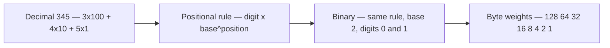
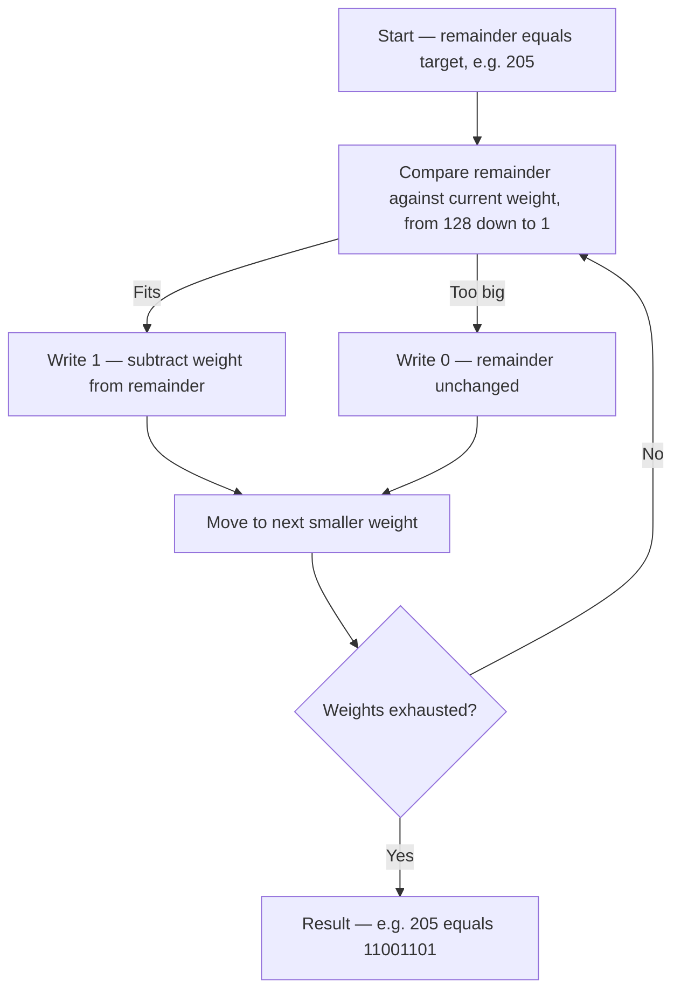

<Concepts items={["positional notation", "base-10", "base-2", "place values", "powers of two", "binary to decimal", "decimal to binary", "IPv4 addressing", "file permissions", "hexadecimal"]} />

<LessonIntro>

Humans count in tens because they have ten fingers; computers count in twos because a wire holds two states. Both systems run on the same idea — **positional notation**, where each digit's worth depends on its position — but fluency in base-2 is a working tool, not a party trick. Reading a subnet mask, decoding `chmod 755`, explaining why memory ships in powers of two, converting an address octet on a whiteboard during an outage: all of these are binary conversions performed under mild pressure. This lesson makes the two directions mechanical — binary to decimal by adding place values, decimal to binary by descending subtraction — then shows exactly where each surfaces in real support work.

</LessonIntro>

The bridge from the previous lesson is direct: gates decide on bits, and this lesson counts with them. A byte is eight gate-outputs wide, and its numeric value is what you compute here.

## Concept Breakdown: What It Is and How It Works

<ConceptCard name="Positional Notation (Base-10 vs Base-2)" category="Number Systems">

**What it is.** The principle that a digit's value equals the digit times the base raised to the position's power. Decimal (base-10) uses digits 0–9 with powers of 10; binary (base-2) uses digits 0–1 with powers of 2.

**How it works.** Decimal `345` means (3 × 10^2) + (4 × 10^1) + (5 × 10^0) = 300 + 40 + 5. Binary works identically with base 2: each position leftward doubles the weight (1, 2, 4, 8, …), and each position holds only 0 or 1. Same machinery, narrower digits.

</ConceptCard>

<ConceptCard name="The 8 Place Values of a Byte" category="Powers of Two">

**What it is.** The eight weights of a standard 1-byte value, from the Most Significant Bit (Bit 7) on the left to the Least Significant Bit (Bit 0) on the right.

**How it works.** Bit position *n* carries weight 2^n. Summing all eight ON bits gives the byte maximum: 128 + 64 + 32 + 16 + 8 + 4 + 2 + 1 = 255; all OFF gives 0 — hence exactly 256 states per byte.

</ConceptCard>

| Bit Position | Bit 7 (MSB) | Bit 6 | Bit 5 | Bit 4 | Bit 3 | Bit 2 | Bit 1 | Bit 0 (LSB) |
| --- | --- | --- | --- | --- | --- | --- | --- | --- |
| Power of 2 | 2^7 | 2^6 | 2^5 | 2^4 | 2^3 | 2^2 | 2^1 | 2^0 |
| Decimal Place Value | 128 | 64 | 32 | 16 | 8 | 4 | 2 | 1 |

*Figure 5.1 — One positional rule underlies both systems; only the base and the digit set change.*

<ConceptCard name="Binary to Decimal Conversion" category="Add the ON Weights">

**What it is.** The procedure for reading a binary string as a decimal number: add the place values wherever a 1 appears, ignore the 0 positions.

**How it works.** Align the bits over the weights 128–64–32–16–8–4–2–1 and sum the weights under the 1s. Two worked examples from the curriculum: `10011011` selects 128 + 16 + 8 + 2 + 1 = 155, and the common subnet octet `11000000` selects 128 + 64 = 192.

</ConceptCard>

| Binary | Weights ON | Calculation | Decimal |
| --- | --- | --- | --- |
| `10011011` | 128, 16, 8, 2, 1 | 128 + 0 + 0 + 16 + 8 + 0 + 2 + 1 | 155 |
| `11000000` | 128, 64 | 128 + 64 | 192 |

<ConceptCard name="Decimal to Binary Conversion" category="Descending Subtraction">

**What it is.** The standard algorithm for writing a decimal number in binary: walk the weights from 128 down to 1, placing a 1 and subtracting wherever the weight fits, else placing a 0.

**How it works.** Compare the remaining value against each weight in turn. If the remainder is greater than or equal to the weight, write 1 and subtract; otherwise write 0 and move on. The curriculum's worked conversion of decimal 205 proceeds: 205 − 128 = 77, 77 − 64 = 13, skip 32, skip 16, 13 − 8 = 5, 5 − 4 = 1, skip 2, 1 − 1 = 0 — yielding `11001101`.

</ConceptCard>

*Figure 5.2 — The descending-subtraction algorithm: fit-or-skip at each weight from 128 down to 1.*

The source lesson's interactive 8-bit switchboard — eight toggles, one per weight, with live binary, decimal, hexadecimal, and ASCII readouts — compresses here into the worked table it was designed to teach. Switching on 128, 32, 4, and 1 while leaving the rest off gives:

| Bit 7 (128) | Bit 6 (64) | Bit 5 (32) | Bit 4 (16) | Bit 3 (8) | Bit 2 (4) | Bit 1 (2) | Bit 0 (1) |
| --- | --- | --- | --- | --- | --- | --- | --- |
| 1 | 0 | 1 | 0 | 0 | 1 | 0 | 1 |

Binary `10100101` = 128 + 32 + 4 + 1 = 165 = `0xA5`, the ASCII symbol for an extended character. Flip every switch off and all four readouts collapse to `00000000`, 0, `0x00`, NUL; flip every switch on and they read `11111111`, 255, `0xFF`. The switchboard never does anything the two conversion procedures above cannot do on paper — it just does it instantly, which is why practicing on paper first matters.

Try the exact switchboard from the source lesson — live, right here:

<BinarySwitchboard />

<ConceptCard name="Binary in Real Support Work" category="Applied Conversions">

**What it is.** Three daily touchpoints where support specialists convert bases without necessarily noticing: IPv4 networking and subnetting, storage and memory sizing, and Unix file permissions.

**How it works.** Every IPv4 address (such as `192.168.1.1`) is four bytes (32 bits); subnet masks like `255.255.255.0` (`/24`) use bitwise AND to split network ID from host ID. Memory and storage scale in powers of two (256 MB, 512 MB, 1 GB, 2 GB, 4 GB, 8 GB, …) because each added address wire doubles capacity. Linux permissions map three bits to one octal digit — Read = 4 (`100`), Write = 2 (`010`), Execute = 1 (`001`) — so `chmod 755` grants the owner 7 (`111`, all rights) and everyone else 5 (`101`, read plus execute).

</ConceptCard>

## Step-by-step breakdown

1. **Memorize the eight weights.** 128, 64, 32, 16, 8, 4, 2, 1 — left to right, each half the previous.
2. **Binary to decimal: add the ON weights.** Align bits to weights; sum wherever the bit is 1.
3. **Decimal to binary: subtract descending.** From 128 down, write 1 and subtract where the weight fits, else 0.
4. **Cross-check both ways.** Convert your answer back; the round trip must land on the starting value.
5. **Recognize the landmarks.** 192 (`11000000`), 255 (`11111111`), 128 (`10000000`), and 7/5/4 in permissions should become sight-reads.

## Examples

- **Obvious —** `11000000` = 192 on sight (128 + 64): the first octet of countless home networks (`192.168.x.x`). Recognizing it instantly during an outage call saves a conversion under pressure.
- **Counter-intuitive —** Decimal 205 (`11001101`) *looks* nothing like its value — eight digits to write three. Binary length grows far faster than decimal intuition expects, which is why humans read `0xCD` or 205 instead, and why logs show hex where hardware thinks in bits.
- **Edge case —** `chmod 755` versus `chmod 777`: one digit apart, but the second grants write-plus-execute to the world (the `001` execute bit plus `010` write on every file). A single binary digit is the difference between a working web directory and a compromised one — count carefully.

<AnalogyCard name="An Odometer With Two Digits">

**The concept.** Positional binary counting: each column holds only 0 or 1, and overflowing a column carries into the next — 1, 10, 11, 100, 101 — exactly like decimal 9 rolling to 10.

**The analogy.** A car odometer with wheels numbered only 0–1 would read 0000, 0001, 0010, 0011, 0100 as it drives — alien to glance at, but the same carry rule as the decimal odometer beside it. Decimal and binary are two odometers with different wheel labels, not different mechanics.

</AnalogyCard>

<LessonNote variant="myth" title="What people get wrong about binary">

**Myth:** "Binary is advanced math you need a calculator for."

**Truth:** Byte-range conversion is addition and subtraction of eight memorized numbers. The skill is not computation — it is recognizing the eight weights cold and applying one of two short procedures. Ten minutes of drill beats any calculator, especially mid-incident.

</LessonNote>

<LessonNote variant="why">

Subnet masks, permission triples, memory sizes, and hex dumps are the four places support specialists meet binary weekly. Each one is this lesson wearing a uniform: masks are byte comparisons, permissions are 3-bit groups, memory is powers of two, hex is shorthand for nibbles. Learn the conversions once and all four become readable.

</LessonNote>

<QuickRecall title="Check yourself before moving on">

1. Write the eight byte weights from memory, with their powers of two.
2. Convert `10011011` to decimal without looking at the table — then verify you got 155.
3. Convert decimal 205 to binary by descending subtraction — then verify `11001101`.
4. Explain what `chmod 755` grants, bit by bit, and why 777 is dangerous.

</QuickRecall>

Counting closes the foundations track: you can now place a ticket on the support map, read the history inside a default, decode the text and pixels on screen, follow a signal through gates, and count in the machine's own base. Everything after this — networking, operating systems, infrastructure — spends the currency minted here.
