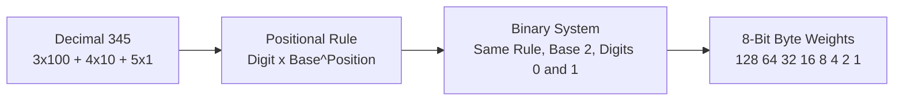
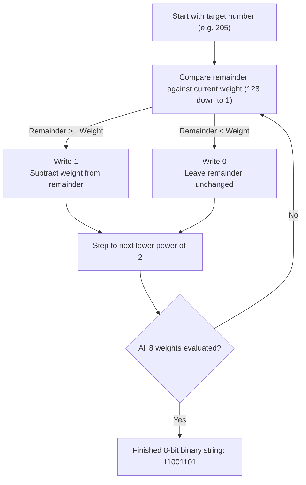
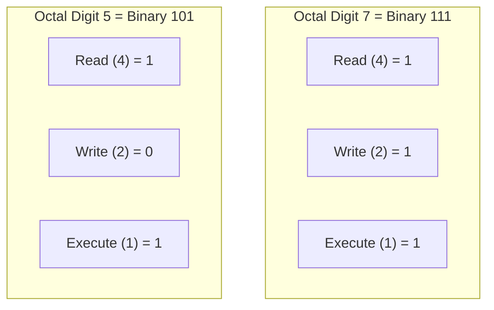

<Concepts items={["positional notation", "base-10", "base-2", "place values", "powers of two", "binary to decimal", "decimal to binary", "IPv4 addressing", "file permissions", "hexadecimal"]} />

<LessonIntro>

Humans count in tens because they have ten fingers; computers count in twos because a wire holds two states. Both systems run on the same idea — **positional notation**, where each digit's worth depends on its position — but fluency in base-2 is a working tool, not a party trick. 

Reading a subnet mask, decoding `chmod 755`, explaining why memory ships in powers of two, converting an address octet on a whiteboard during an outage: all of these are binary conversions performed under mild pressure. This lesson makes the two directions mechanical — binary to decimal by adding place values, decimal to binary by descending subtraction — then shows exactly where each surfaces in real support work.

</LessonIntro>

## Why this matters

In IT support and infrastructure engineering, binary conversion is not an academic exercise — it is a daily troubleshooting reflex:

* **IPv4 Subnetting & CIDR Masks:** When a host cannot reach the default gateway, understanding that subnet mask `255.255.255.0` (`/24`) is twenty-four contiguous `1`s lets you calculate network IDs and host ranges instantly.
* **Linux Permissions (`chmod`):** Security permissions like `chmod 755` or `chmod 644` are octal representations of 3-bit binary flags: Read ($4 = 100_2$), Write ($2 = 010_2$), and Execute ($1 = 001_2$). Miscalculating one bit can turn a secure corporate directory into a world-writable vulnerability.
* **RAM & Storage Capacities:** Memory modules ship strictly in powers of two ($4\text{ GB}, 8\text{ GB}, 16\text{ GB}, 32\text{ GB}, 64\text{ GB}$) because each physical address line added to the CPU memory bus doubles addressable space.
* **Hex Crash Dumps:** Blue Screen of Death (BSOD) stop codes like `0x0000007E` and kernel panic stack traces are hexadecimal representations of raw binary registers.

---

## 01 — Positional Notation: Base-10 vs Base-2

Every number system we use relies on the same mathematical structure: positional notation, where a digit's contribution is scaled by its column weight.

<ConceptCard name="Positional Notation (Base-10 vs Base-2)" category="Number Systems">

**What it is.** The principle that a digit's value equals the digit times the base raised to the position's power. Decimal (base-10) uses digits 0–9 with powers of 10; binary (base-2) uses digits 0–1 with powers of 2.

**How it works.** Decimal `345` means $(3 \times 10^2) + (4 \times 10^1) + (5 \times 10^0) = 300 + 40 + 5$. Binary works identically with base 2: each position leftward doubles the weight ($1, 2, 4, 8, \dots$), and each position holds only 0 or 1. Same machinery, narrower digits.

</ConceptCard>

<ConceptCard name="The 8 Place Values of a Byte" category="Powers of Two">

**What it is.** The eight weights of a standard 1-byte value, from the Most Significant Bit (Bit 7) on the left to the Least Significant Bit (Bit 0) on the right.

**How it works.** Bit position $n$ carries weight $2^n$. Summing all eight ON bits gives the byte maximum: $128 + 64 + 32 + 16 + 8 + 4 + 2 + 1 = 255$; all OFF gives 0 — hence exactly 256 states per byte.

</ConceptCard>

### The 8 Place Values of a Byte

| Bit Position | Bit 7 (MSB) | Bit 6 | Bit 5 | Bit 4 | Bit 3 | Bit 2 | Bit 1 | Bit 0 (LSB) |
| :--- | :---: | :---: | :---: | :---: | :---: | :---: | :---: | :---: |
| **Power of 2** | $2^7$ | $2^6$ | $2^5$ | $2^4$ | $2^3$ | $2^2$ | $2^1$ | $2^0$ |
| **Decimal Place Value** | **128** | **64** | **32** | **16** | **8** | **4** | **2** | **1** |

*Figure 5.1 — One positional rule underlies both decimal and binary; only the base and symbol set change.*

---

## 02 — Binary to Decimal: Summing the Active Weights

Converting a binary string to its decimal equivalent is as simple as adding the weights where a `1` bit appears.

<ConceptCard name="Binary to Decimal Conversion" category="Add the ON Weights">

**What it is.** The procedure for reading a binary string as a decimal number: add the place values wherever a 1 appears, ignore the 0 positions.

**How it works.** Align the bits over the weights 128–64–32–16–8–4–2–1 and sum the weights under the 1s. Two worked examples from the curriculum: `10011011` selects $128 + 16 + 8 + 2 + 1 = 155$, and the common subnet octet `11000000` selects $128 + 64 = 192$.

</ConceptCard>

| Binary Byte | Active Weights ($1$s) | Full Arithmetic Sum | Decimal Result |
| :--- | :--- | :--- | :--- |
| `10011011` | $128, 16, 8, 2, 1$ | $128 + 0 + 0 + 16 + 8 + 0 + 2 + 1$ | **155** |
| `11000000` | $128, 64$ | $128 + 64 + 0 + 0 + 0 + 0 + 0 + 0$ | **192** |
| `11111111` | All 8 weights | $128 + 64 + 32 + 16 + 8 + 4 + 2 + 1$ | **255** |
| `11110000` | $128, 64, 32, 16$ | $128 + 64 + 32 + 16$ | **240** |

> [!TIP] Subnet Sight-Reads
> In network engineering, you will see the same leading binary octets repeatedly. Memorize these on sight:
> * `10000000` = **128** (`/25`)
> * `11000000` = **192** (`/26`)
> * `11100000` = **224** (`/27`)
> * `11110000` = **240** (`/28`)
> * `11111000` = **248** (`/29`)
> * `11111100` = **252** (`/30`)

---

## 03 — Decimal to Binary: Descending Subtraction Algorithm

To convert any decimal number ($0\text{ to }255$) into binary, test it against the weights from 128 down to 1.

<ConceptCard name="Decimal to Binary Conversion" category="Descending Subtraction">

**What it is.** The standard algorithm for writing a decimal number in binary: walk the weights from 128 down to 1, placing a 1 and subtracting wherever the weight fits, else placing a 0.

**How it works.** Compare the remaining value against each weight in turn. If the remainder is greater than or equal to the weight, write 1 and subtract; otherwise write 0 and move on. The curriculum's worked conversion of decimal 205 proceeds: 
$$205 - 128 = 77 \implies \text{bit } 1$$
$$77 - 64 = 13 \implies \text{bit } 1$$
$$13 < 32 \implies \text{bit } 0, \quad 13 < 16 \implies \text{bit } 0$$
$$13 - 8 = 5 \implies \text{bit } 1$$
$$5 - 4 = 1 \implies \text{bit } 1$$
$$1 < 2 \implies \text{bit } 0$$
$$1 - 1 = 0 \implies \text{bit } 1$$
Yielding binary: `11001101`.

</ConceptCard>

*Figure 5.2 — The descending-subtraction algorithm: fit-or-skip at each weight from 128 down to 1.*

---

## 04 — The Interactive 8-Bit Switchboard Lab

Toggling electrical switches on an 8-bit bus demonstrates how bits combine into decimal, hexadecimal, and ASCII text:

| Bit 7 (128) | Bit 6 (64) | Bit 5 (32) | Bit 4 (16) | Bit 3 (8) | Bit 2 (4) | Bit 1 (2) | Bit 0 (1) |
| :---: | :---: | :---: | :---: | :---: | :---: | :---: | :---: |
| **1** | **0** | **1** | **0** | **0** | **1** | **0** | **1** |

$$\text{Binary: } 10100101_2 = 128 + 32 + 4 + 1 = \mathbf{165} \quad (\text{Hex: } \mathbf{0xA5})$$

Try toggling the live switches below to observe real-time conversions across binary, decimal, hex, and ASCII representations:

<BinarySwitchboard />

---

## 05 — Binary in Daily IT Support Operations

Base-2 numerical systems appear in three core areas of enterprise systems administration:

<ConceptCard name="Binary in Real Support Work" category="Applied Conversions">

**What it is.** Three daily touchpoints where support specialists convert bases without necessarily noticing: IPv4 networking and subnetting, storage and memory sizing, and Unix file permissions.

**How it works.** Every IPv4 address (such as `192.168.1.1`) is four bytes (32 bits); subnet masks like `255.255.255.0` (`/24`) use bitwise AND to split network ID from host ID. Memory and storage scale in powers of two (256 MB, 512 MB, 1 GB, 2 GB, 4 GB, 8 GB, …) because each added address wire doubles capacity. Linux permissions map three bits to one octal digit — Read = 4 (`100`), Write = 2 (`010`), Execute = 1 (`001`) — so `chmod 755` grants the owner 7 (`111`, all rights) and everyone else 5 (`101`, read plus execute).

</ConceptCard>

### Linux File Permissions Decoded

Every file in Linux has three permission sets (Owner, Group, Others), each represented by 3 bits:

* `chmod 755`: Owner has `7` (`rwx` = $4+2+1$), Group has `5` (`r-x` = $4+0+1$), Others have `5` (`r-x` = $4+0+1$).
* `chmod 644`: Owner has `6` (`rw-` = $4+2+0$), Group has `4` (`r--` = $4+0+0$), Others have `4` (`r--` = $4+0+0$).
* `chmod 777`: Everyone has `7` (`rwx`). **Never use this in production** as it permits any user or process to overwrite or execute arbitrary files.

---

## 06 — Real-World Scenarios & Troubleshooting Intuition

* **Obvious — Instant Subnet Identification:** Seeing `11000000` translates immediately to `192` ($128 + 64$): the initial octet of most private LANs (`192.168.1.0/24`). Recognizing this immediately saves time during on-call network outages.
* **Counter-intuitive — Why We Use Hexadecimal:** Decimal 205 is written as eight binary bits: `11001101`. Because binary is too long for humans to read, engineers group bits into 4-bit nibbles: `1100` ($12 = \text{C}$) and `1101` ($13 = \text{D}$). Thus, `11001101` becomes **`0xCD`**. Hexadecimal is simply ergonomic binary shorthand.
* **Edge case — Permission Creep (`755` vs `777`):** A junior technician struggling with a web server permission error runs `chmod -R 777 /var/www`. While it solves the 403 Forbidden error immediately, it grants write and execute rights to the world, allowing any compromised web process to upload and execute malicious rootkits.

<AnalogyCard name="An Odometer With Two Digits">

**The concept.** Positional binary counting: each column holds only 0 or 1, and overflowing a column carries into the next — 1, 10, 11, 100, 101 — exactly like decimal 9 rolling to 10.

**The analogy.** A car odometer with wheels numbered only 0–1 would read 0000, 0001, 0010, 0011, 0100 as it drives — alien to glance at, but the same carry rule as the decimal odometer beside it. Decimal and binary are two odometers with different wheel labels, not different mechanics.

</AnalogyCard>

<LessonNote variant="myth" title="What people get wrong about binary">

**Myth:** "Binary is advanced math you need a calculator for."

**Truth:** Byte-range conversion is addition and subtraction of eight memorized numbers. The skill is not computation — it is recognizing the eight weights cold and applying one of two short procedures. Ten minutes of drill beats any calculator, especially mid-incident.

</LessonNote>

<LessonNote variant="why">

Subnet masks, permission triples, memory sizes, and hex dumps are the four places support specialists meet binary weekly. Each one is this lesson wearing a uniform: masks are byte comparisons, permissions are 3-bit groups, memory is powers of two, hex is shorthand for nibbles. Learn the conversions once and all four become readable.

</LessonNote>

---

## Summary Checklist: Binary Counting & Conversion Mental Model

1. **Positional notation is universal:** A digit's true value is its face symbol multiplied by the base raised to the column's power ($d \times b^p$).
2. **The 8 byte weights are fixed:** Memorize $128, 64, 32, 16, 8, 4, 2, 1$ from left to right; each power of two doubles moving leftward.
3. **Binary to decimal sums active weights:** Add the weights where `1` appears; ignore positions where `0` appears.
4. **Decimal to binary uses descending subtraction:** Test remainder against weights from 128 down to 1; if it fits, write `1` and subtract.
5. **Applied binary governs IT systems:** IPv4 addresses (32 bits), CIDR prefixes, Linux permissions (`chmod 755`), and memory bus widths all directly apply 8-bit arithmetic.

---

<QuickRecall title="Check yourself before moving on">

1. Write the eight byte weights from memory, with their powers of two.
2. Convert `10011011` to decimal without looking at the table — then verify you got 155.
3. Convert decimal 205 to binary by descending subtraction — then verify `11001101`.
4. Explain what `chmod 755` grants, bit by bit, and why 777 is dangerous.

</QuickRecall>

Counting closes the foundations track: you can now place a ticket on the support map, read the history inside a default, decode the text and pixels on screen, follow a signal through gates, and count in the machine's own base. Everything after this — networking, operating systems, infrastructure — spends the currency minted here.
