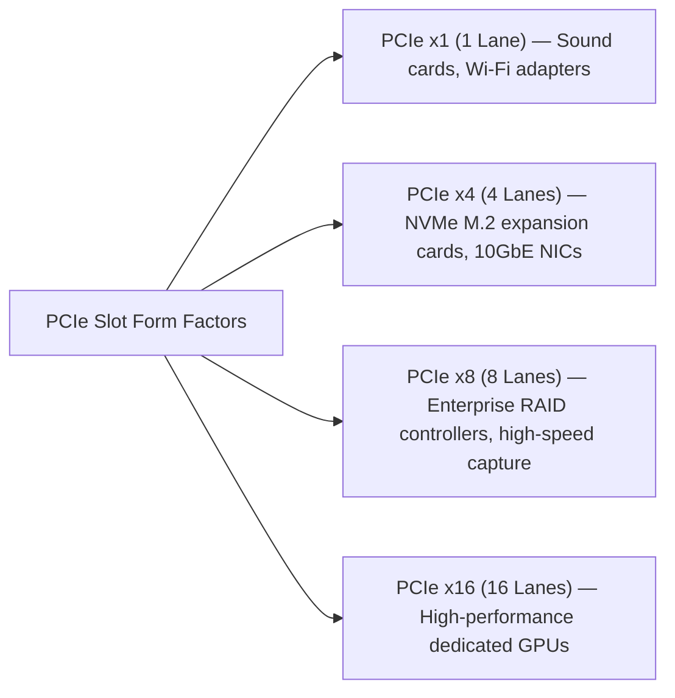
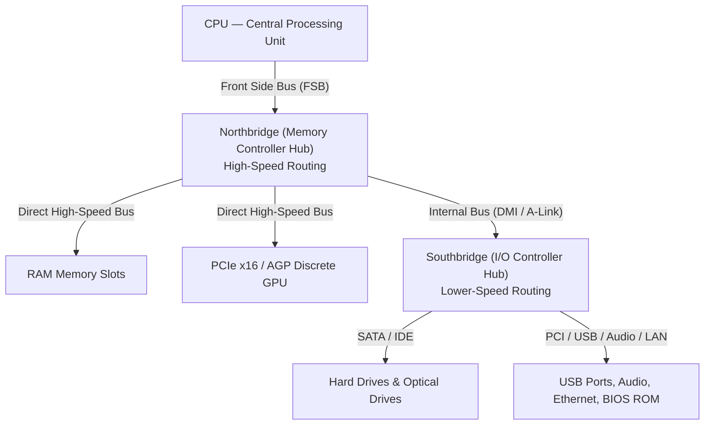
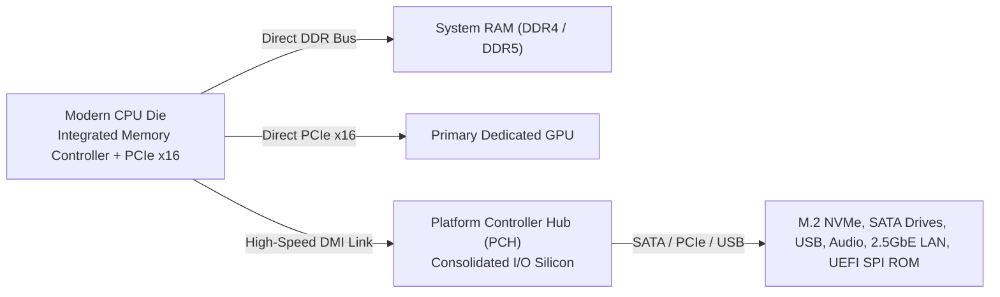
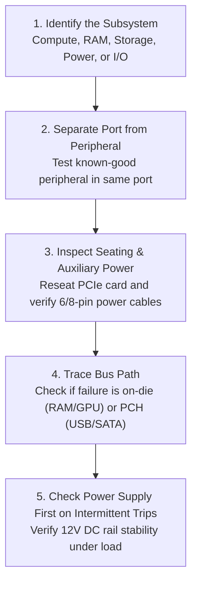

<Concepts items={["hardware", "CPU", "RAM", "secondary storage", "PSU", "motherboard", "port", "peripheral", "expansion slot", "PCIe", "chipset", "Northbridge", "Southbridge", "PCH"]} />

<LessonIntro>

A support ticket says a workstation will not boot after a RAM upgrade, and another says a newly installed graphics card is not detected. Both tickets point to the same place: the physical layout inside the chassis and the buses that tie it together. 

This lesson maps that layout — the five core internal components, the difference between a port and a peripheral, how expansion cards add function, and how the chipset routes every conversation between CPU, memory, and I/O.

</LessonIntro>

## Why this matters

Opening a computer case without understanding motherboard architecture turns troubleshooting into dangerous guesswork:

* **POST Failures & Beep Codes:** When a newly assembled workstation powers on, spins fans, and emits a repetitive beep sequence with no display output, you must instantly know which subsystem failed power-on self-test (CPU socket pin contact, RAM channel pairing, or missing 8-pin EPS 12V CPU power).
* **PCIe Lane Starvation:** Installing a second high-speed NVMe add-in card or a capture card into a secondary slot can silently downgrade a primary GPU from $\times 16$ to $\times 8$ lanes due to shared CPU/PCH lane topologies.
* **Isolating Port vs Peripheral:** Swapping out an expensive enterprise conference webcam when the root cause was a degraded USB 3.0 port trace on the front I/O header wastes time and budget.
* **Thermal Throttling & Power Spikes:** Failing to recognize that a CPU cooler is a structural subsystem rather than an optional cosmetic accessory leads to shutdown loops and silicon degradation.

*Figure 6.1 — ATX motherboard with CPU and cooler fitted. The board is the backbone routing power and high-speed data buses. Image: Wikimedia Commons, public domain (Leon Brooks).*

---

## 01 — The Five Core Internal Components

A computer is constructed from physical electronic and electromechanical components collectively called **hardware**. Inside the desktop chassis or laptop enclosure, five primary subsystems perform all computation, storage, and communication:

<ConceptCard name="Central Processing Unit (CPU)" category="Hardware Core">

**What it is.** The processor that performs mathematical calculation, instruction decoding, and data processing. It sits in a motherboard socket beneath a heat sink and fan.

**How it works.** It fetches instructions from RAM over high-speed buses, executes them internally, and returns results to memory or I/O. Because it dissipates substantial heat, the heat sink and fan are functionally part of the CPU assembly — a missing or failed cooler is a boot or stability fault, not an accessory problem.

</ConceptCard>

<ConceptCard name="Random Access Memory (RAM)" category="Hardware Memory">

**What it is.** Fast, short-term volatile working memory that stores active programs, open tabs, and data the CPU is currently processing.

**How it works.** The CPU reads and writes RAM cells by address over the memory bus. Contents are lost when power is removed, which is why unsaved work disappears on a power cut while files on disk survive.

</ConceptCard>

<ConceptCard name="Secondary Storage" category="Hardware Storage">

**What it is.** Long-term persistent memory — hard drives and SSDs — that holds operating system files, applications, music, photos, and documents even when the system is shut down.

**How it works.** Storage sits behind a storage controller rather than on the CPU memory bus, so access is slower than RAM but non-volatile. The OS loads programs from here into RAM for execution.

</ConceptCard>

<ConceptCard name="Power Supply Unit (PSU)" category="Hardware Power">

**What it is.** The unit that converts high-voltage Alternating Current (AC) from the wall outlet into clean, regulated low-voltage Direct Current (DC) for silicon components.

**How it works.** It provides separate DC rails for different loads and includes protection circuits. An underrated or failing PSU produces reboots under load, not just a dead machine.

</ConceptCard>

<ConceptCard name="Motherboard (System Board)" category="Hardware Backbone">

**What it is.** The physical backbone and circulatory system of the computer. It mechanically holds components, supplies power rails, and routes high-speed data buses.

**How it works.** Copper traces, slots, sockets, and the chipset connect CPU, RAM, storage, and expansion cards so each can signal the others at the correct speed and voltage.

</ConceptCard>

### Subsystem Roles & Triage Quick Reference

| Subsystem | Volatility | Typical Latency | Primary Diagnostic Signal |
| :--- | :--- | :--- | :--- |
| **CPU** | Volatile registers | $< 1\text{ ns}$ | Thermal shutdown, high fan RPM, POST failure. |
| **RAM** | Volatile | $\approx 60\text{--}90\text{ ns}$ | BSOD memory management errors, continuous beep codes. |
| **Secondary Storage** | Non-volatile | $50\ \mu\text{s} \text{ (NVMe)} \dots 10\text{ ms} \text{ (HDD)}$ | SMART alerts, missing boot device, read/write I/O hangs. |
| **PSU** | N/A | Instant delivery | Random reboots under 3D/CPU loads, burning smell, tripping breaker. |
| **Motherboard** | N/A | Bus clock | No power LED, dead USB controllers, bent socket pins. |

---

## 02 — Ports, Peripherals & PCIe Expansion Architecture

Modern computers interface with the outside world through external ports and internal expansion buses.

<ConceptCard name="Port" category="Interface">

**What it is.** The physical interface or connection point on a case or motherboard that allows communication and data transfer with external devices, such as USB, HDMI, Ethernet, or DisplayPort.

**How it works.** A port exposes a standard electrical and protocol interface. Peripherals plug into ports; no chassis disassembly or motherboard installation is required.

</ConceptCard>

<ConceptCard name="Peripheral" category="I/O Device">

**What it is.** Any external hardware device connected via a port to extend functionality or provide Input/Output, such as keyboards, mice, monitors, printers, or external drives.

**How it works.** Peripherals convert between the physical world and digital bytes and rely on the port plus OS drivers. If a peripheral fails, check the port, the cable, and the driver before opening the case.

</ConceptCard>

<ConceptCard name="Expansion Slot and Expansion Card" category="Expandability">

**What it is.** Expansion slots are internal connectors on the motherboard that seat expansion cards — printed circuit boards that add features not built into the board by default.

**How it works.** Common cards include dedicated GPUs for 3D rendering and multi-monitor output, Network Interface Cards (NICs) for 10GbE fiber or Wi-Fi, sound and audio capture cards for multi-channel processing, and RAID controller cards for multi-disk redundant arrays in servers. The modern standard bus is **PCI Express (PCIe)** with $\times 1, \times 4, \times 8,$ and $\times 16$ lane configurations; lane count determines bandwidth.

</ConceptCard>

*Figure 6.2 — PCIe lane allocations and standard card assignments.*

---

## 03 — The Chipset Evolution: From Northbridge/Southbridge to Modern PCH

The **Chipset** directs data traffic across the entire motherboard, but its physical architecture has undergone a radical transformation over the past two decades.

<ConceptCard name="Chipset, Northbridge, Southbridge, and PCH" category="Architecture">

**What it is.** The chipset manages and routes communication between CPU, memory, graphics, and peripheral interfaces. Older boards split this into two chips; modern boards consolidate it.

**How it works.** The **Northbridge (Host Bridge)** connected the CPU directly to RAM and high-speed graphics (PCIe x16 / AGP) and determined maximum memory capacity and speeds. The **Southbridge (I/O Controller Hub)** handled lower-speed I/O: SATA / IDE storage, USB, onboard audio, legacy PCI slots, and BIOS ROM, linked to the Northbridge over an internal bus (DMI). In modern Intel and AMD designs the Northbridge functions — memory controller and PCIe controller — moved directly onto the CPU die, and the remaining I/O was consolidated into a single **Platform Controller Hub (PCH)**.

</ConceptCard>

### Legacy Architecture: Northbridge and Southbridge

*Figure 6.3 — Traditional two-chip architecture: CPU connects over the Front Side Bus to the Northbridge, which delegates slow I/O to the Southbridge.*

### Modern Architecture: On-Die Memory Controller & The PCH

*Figure 6.4 — Modern unified architecture: Northbridge functionality resides directly on the CPU die; all general I/O routes through the PCH.*

| Architecture Component | Connected Devices & Role | Speed Profile |
| :--- | :--- | :--- |
| **Northbridge (Legacy)** | Directly bridged CPU to RAM and primary graphics (PCIe x16). Controlled memory bandwidth and speeds. | High Speed |
| **Southbridge (Legacy)** | Controlled lower-speed I/O: SATA, IDE, USB, Ethernet, onboard audio, legacy PCI, and BIOS chip. | Lower Speed |
| **Platform Controller Hub (PCH)** | **Modern architecture:** Intel & AMD integrated memory and PCIe x16 controllers directly onto the CPU die. Secondary I/O consolidated into the single PCH. | Unified High-Efficiency |

---

## 04 — Hardware Triage: Step-by-Step Isolation Workflow

When diagnosing an internal hardware failure, always work from the outside inward:

*Figure 6.5 — Step-by-step hardware triage sequence.*

1. **Identify the subsystem:** Is the symptom compute, working memory, persistence, power, interconnect, or external I/O?
2. **Separate port from peripheral:** If an external device fails, test a known-good peripheral in the same port, then the same peripheral in a different port, before suspecting drivers or the motherboard.
3. **Check expansion seating and lanes:** A card not detected usually means incorrect slot, incomplete seating, missing auxiliary power, or a lane configuration issue — not a dead card.
4. **Trace the chipset path:** RAM and GPU faults point toward the high-speed path (formerly Northbridge, now on-die); SATA, USB, audio, and legacy PCI faults point toward the slow I/O path (formerly Southbridge, now PCH).
5. **Confirm power first on intermittent faults:** Random reboots under load implicate the PSU and its DC rails before any other component.

---

## 05 — Real-World Helpdesk Tickets & Diagnostic Scenarios

### Common Ticket Matrix

| Ticket Description | Most Probable Root Cause | Resolution Action |
| :--- | :--- | :--- |
| **Workstation beeps with black screen after RAM upgrade.** | RAM stick not fully latched, seated in mismatched channel, or incompatible speed. | Reseat firmly until both clips click. Install sticks in recommended paired channels (A2/B2). |
| **New discrete GPU not visible in Device Manager.** | Card inserted in low-lane slot, not fully seated, or auxiliary 8-pin PCIe power missing. | Move to top primary $\times 16$ slot, seat firmly, and connect auxiliary PCIe power cables from PSU. |
| **External USB drive works on laptop but fails on desktop front port.** | Loose front-panel USB header cable or insufficient power from front chassis port. | Plug drive directly into rear motherboard I/O ports connected directly to the PCH. |

### Diagnostic Scenarios

* **Obvious — Disturbed Cable Connections:** A keyboard ceases functioning after a desk is moved. The peripheral is intact; the physical USB connection was mechanically loosened. Reseating the cable restores functionality instantly without requiring internal repairs.
* **Counter-intuitive — PCIe Lane Splitting:** Installing a second high-end GPU or high-speed add-in card can cause the primary GPU's benchmark score to drop. Motherboard lane switches often automatically bifurcate a 16-lane CPU connection into two 8-lane connections ($\times 8 / \times 8$).
* **Edge case — Single-Stick vs Dual-Stick Boot:** A computer boots cleanly with one stick of RAM, but fails to POST with two identical sticks. This frequently indicates bent pins inside the CPU LGA socket that sever the second memory channel's address bus lines.

<AnalogyCard name="A City Transit System">

**The concept.** CPU, RAM, storage, and I/O exchange data over buses managed by the chipset; expansion slots add new stations to the network.

**The analogy.** The motherboard is the city grid, the chipset is the transit authority routing express trains (memory and graphics) separately from local buses (USB, SATA, audio), and an expansion card is a new district connected by building a station on the existing line.

</AnalogyCard>

<LessonNote variant="myth" title="What people get wrong about motherboards and chipsets">

**Myth:** "The Northbridge and Southbridge are still two separate chips on every new board."

**Truth:** On modern Intel and AMD platforms the Northbridge is gone as a separate chip. Its memory and PCIe control moved onto the CPU die itself, and the leftover I/O lives in one PCH. Troubleshooting guides that tell you to find the Northbridge chip on a new board are describing a two-chip era that no longer applies.

</LessonNote>

<LessonNote variant="why">

Every later lesson — CPU buses, RAM generations, SATA versus NVMe, BIOS versus UEFI — is a detail of one path drawn here. If you can trace a byte from CPU through chipset to RAM, GPU, or disk, every hardware ticket becomes a routing question rather than a guessing game.

</LessonNote>

---

## Summary Checklist: Hardware Architecture Mental Model

1. **Five core parts build the PC:** The CPU computes, RAM provides volatile working space, secondary storage persists data, the PSU supplies DC voltage, and the motherboard interconnects them.
2. **Ports are physical interfaces; peripherals are devices:** Always isolate the external device, cable, and port before disassembling the chassis.
3. **PCIe bandwidth scales by lane count:** Slots range from $\times 1$ to $\times 16$; ensure bandwidth-hungry expansion cards (GPUs, RAID) occupy appropriate high-lane slots.
4. **The Northbridge migrated onto the CPU die:** High-speed memory and graphics controllers live directly inside modern CPUs; the PCH manages lower-speed peripheral I/O.
5. **Power stability underpins hardware health:** Intermittent crashes and spontaneous reboots under load frequently stem from fluctuating voltage rails in aging or under-rated PSUs.

---

<QuickRecall title="Quick Recall — Hardware Architecture">

Try from memory before moving on:

1. What distinguishes a port from a peripheral?
2. Which devices sat on the Northbridge versus the Southbridge?
3. What changed when designs moved to a PCH?

Reveal answers

1. A port is the physical interface on the machine; a peripheral is the external device that plugs into it.
2. Northbridge: RAM and high-speed graphics (PCIe x16 / AGP). Southbridge: SATA / IDE, USB, audio, legacy PCI, BIOS ROM.
3. Northbridge functions moved directly onto the CPU die, and remaining I/O was consolidated into a single PCH chip.

</QuickRecall>

This connects to CPU architecture because the processor at the top of this diagram has its own internal structure — control, arithmetic, and registers — and its own rules for reaching memory.
