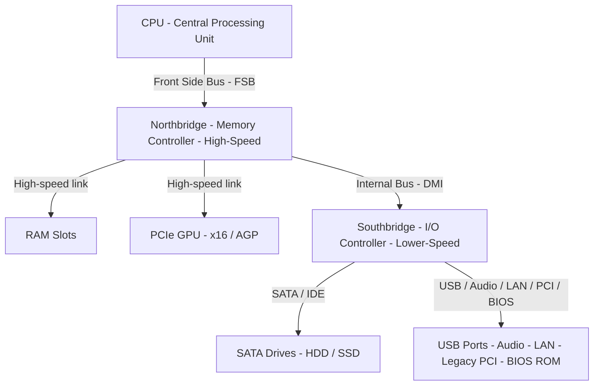
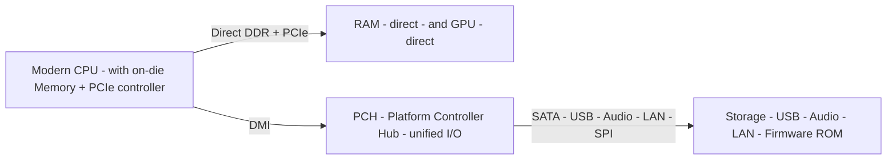

<Concepts items={["hardware", "CPU", "RAM", "secondary storage", "PSU", "motherboard", "port", "peripheral", "expansion slot", "PCIe", "chipset", "Northbridge", "Southbridge", "PCH"]} />

<LessonIntro>

A support ticket says a workstation will not boot after a RAM upgrade, and another says a newly installed graphics card is not detected. Both tickets point to the same place: the physical layout inside the chassis and the buses that tie it together. This lesson maps that layout — the five core internal components, the difference between a port and a peripheral, how expansion cards add function, and how the chipset routes every conversation between CPU, memory, and I/O.

</LessonIntro>

A desktop computer is built from physical electronic and electromechanical parts collectively called **hardware**. Externally you see monitors, keyboards, mice, webcams, speakers, and printers. Inside the chassis, five core components do the work: the CPU computes, RAM holds the active working set, secondary storage persists files, the PSU delivers clean power, and the motherboard holds everything in place and routes power and data between parts.

*Figure — ATX motherboard with CPU and fan fitted. The board is the backbone that routes power and data between CPU, RAM, storage, and expansion cards. Image: Wikimedia Commons, public domain (Leon Brooks).*

## Concept Breakdown: What It Is & How It Works

<ConceptCard name="Central Processing Unit (CPU)" category="Hardware Core">

**What it is.** The processor that performs mathematical calculation, instruction decoding, and data processing. It sits in a motherboard socket beneath a heat sink and fan.

**How it works.** It fetches instructions from RAM over high-speed buses, executes them internally, and returns results to memory or I/O. Because it dissipates substantial heat, the heat sink and fan are functionally part of the CPU assembly — a missing or failed cooler is a boot or stability fault, not an accessory problem.

</ConceptCard>

<ConceptCard name="Random Access Memory (RAM)" category="Hardware Memory">

**What it is.** Fast, short-term volatile working memory that stores active programs, open tabs, and data the CPU is currently processing.

**How it works.** The CPU reads and writes RAM cells by address over the memory bus. Contents are lost when power is removed, which is why unsaved work disappears on a power cut while files on disk survive.

</ConceptCard>

<ConceptCard name="Secondary Storage" category="Hardware Storage">

**What it is.** Long-term persistent memory — hard drives and SSDs — that holds operating system files, applications, music, photos, and documents even when the system is shut down.

**How it works.** Storage sits behind a storage controller rather than on the CPU memory bus, so access is slower than RAM but non-volatile. The OS loads programs from here into RAM for execution.

</ConceptCard>

<ConceptCard name="Power Supply Unit (PSU)" category="Hardware Power">

**What it is.** The unit that converts high-voltage Alternating Current (AC) from the wall outlet into clean, regulated low-voltage Direct Current (DC) for silicon components.

**How it works.** It provides separate DC rails for different loads and includes protection circuits. An underrated or failing PSU produces reboots under load, not just a dead machine.

</ConceptCard>

<ConceptCard name="Motherboard (System Board)" category="Hardware Backbone">

**What it is.** The physical backbone and circulatory system of the computer. It mechanically holds components, supplies power rails, and routes high-speed data buses.

**How it works.** Copper traces, slots, sockets, and the chipset connect CPU, RAM, storage, and expansion cards so each can signal the others at the correct speed and voltage.

</ConceptCard>

<ConceptCard name="Port" category="Interface">

**What it is.** The physical interface or connection point on a case or motherboard that allows communication and data transfer with external devices, such as USB, HDMI, Ethernet, or DisplayPort.

**How it works.** A port exposes a standard electrical and protocol interface. Peripherals plug into ports; no chassis disassembly or motherboard installation is required.

</ConceptCard>

<ConceptCard name="Peripheral" category="I/O Device">

**What it is.** Any external hardware device connected via a port to extend functionality or provide Input/Output, such as keyboards, mice, monitors, printers, or external drives.

**How it works.** Peripherals convert between the physical world and digital bytes and rely on the port plus OS drivers. If a peripheral fails, check the port, the cable, and the driver before opening the case.

</ConceptCard>

<ConceptCard name="Expansion Slot and Expansion Card" category="Expandability">

**What it is.** Expansion slots are internal connectors on the motherboard that seat expansion cards — printed circuit boards that add features not built into the board by default.

**How it works.** Common cards include dedicated GPUs for 3D rendering and multi-monitor output, Network Interface Cards (NICs) for 10GbE fiber or Wi-Fi, sound and audio capture cards for multi-channel processing, and RAID controller cards for multi-disk redundant arrays in servers. The modern standard bus is **PCI Express (PCIe)** with x1, x4, x8, and x16 lane configurations; lane count determines bandwidth.

</ConceptCard>

<ConceptCard name="Chipset, Northbridge, Southbridge, and PCH" category="Architecture">

**What it is.** The chipset manages and routes communication between CPU, memory, graphics, and peripheral interfaces. Older boards split this into two chips; modern boards consolidate it.

**How it works.** The **Northbridge (Host Bridge)** connected the CPU directly to RAM and high-speed graphics (PCIe x16 / AGP) and determined maximum memory capacity and speeds. The **Southbridge (I/O Controller Hub)** handled lower-speed I/O: SATA / IDE storage, USB, onboard audio, legacy PCI slots, and BIOS ROM, linked to the Northbridge over an internal bus (DMI). In modern Intel and AMD designs the Northbridge functions — memory controller and PCIe controller — moved directly onto the CPU die, and the remaining I/O was consolidated into a single **Platform Controller Hub (PCH)**.

</ConceptCard>

## Chipset routing in one view

*Figure 1 — Traditional two-chip routing. CPU to Northbridge over FSB, Northbridge to RAM and GPU at high speed, Northbridge to Southbridge over DMI, Southbridge to storage and slow I/O.*

| Architecture Component | Connected Peripherals & Role | Speed Category |
|---|---|---|
| **Northbridge (Host Bridge)** | Directly connects the CPU to **RAM** and high-speed **Graphics (PCIe x16 / AGP)**. Determines maximum memory capacity and memory speeds. | High Speed |
| **Southbridge (I/O Controller Hub)** | Connects to lower-speed peripherals: **SATA / IDE storage**, **USB ports**, onboard audio, legacy PCI slots, and BIOS ROM. | Lower Speed |
| **Platform Controller Hub (PCH)** | **Modern architecture:** Intel and AMD integrated the Northbridge functions directly onto the CPU die (on-die Memory Controller & PCIe controller). The remaining I/O functions were consolidated into a single chip called the **PCH**. | Unified Modern Architecture |

*Figure 2 — Modern PCH architecture. Memory and graphics move onto the CPU die; one PCH handles remaining I/O.*

## Step-by-step breakdown

1. **Identify the subsystem.** Is the symptom compute, working memory, persistence, power, interconnect, or external I/O.
2. **Separate port from peripheral.** If an external device fails, test a known-good peripheral in the same port, then the same peripheral in a different port, before suspecting drivers or the motherboard.
3. **Check expansion seating and lanes.** A card not detected usually means incorrect slot, incomplete seating, missing auxiliary power, or a lane configuration issue — not a dead card.
4. **Trace the chipset path.** RAM and GPU faults point toward the high-speed path (formerly Northbridge, now on-die); SATA, USB, audio, and legacy PCI faults point toward the slow I/O path (formerly Southbridge, now PCH).
5. **Confirm power first on intermittent faults.** Random reboots under load implicate the PSU and its DC rails before any other component.

## Ticket symptoms to likely cause

- **Ticket: PC beeps and shows nothing after RAM was touched.** Likely cause: module incompletely seated or incompatible with the memory controller path. Reseat, test one stick, verify supported capacity and speed.
- **Ticket: New dedicated GPU not listed in Device Manager.** Likely cause: card in a low-lane PCIe slot, not fully seated, or auxiliary PCIe power unplugged. Move to x16, reseat, connect power.
- **Ticket: USB drive works on one machine but not this port.** Likely cause: port failure, driver, or PCH-attached hub issue rather than the drive. Isolate port versus peripheral as above.

## Examples

- **Obvious —** A keyboard stops working after a cable tug. The peripheral is fine; the USB port connection was disturbed. Replugging into the same or another port restores it with no internal work.
- **Counter-intuitive —** Adding a second high-end GPU can make the first one slower. Both cards may share PCIe lanes, so each drops from x16 to x8. Total throughput rises for parallel work but single-card bandwidth falls — lane topology, not card quality.
- **Edge case —** A machine boots with one RAM stick but not two identical sticks. The memory controller limit, a bent socket pin, or a board that requires specific paired slots can reject a configuration whose parts are individually good.

<AnalogyCard name="A City Transit System">

**The concept.** CPU, RAM, storage, and I/O exchange data over buses managed by the chipset; expansion slots add new stations to the network.

**The analogy.** The motherboard is the city grid, the chipset is the transit authority routing express trains (memory and graphics) separately from local buses (USB, SATA, audio), and an expansion card is a new district connected by building a station on the existing line.

</AnalogyCard>

<LessonNote variant="myth" title="What people get wrong about motherboards and chipsets">

**Myth:** "The Northbridge and Southbridge are still two separate chips on every new board."

**Truth:** On modern Intel and AMD platforms the Northbridge is gone as a separate chip. Its memory and PCIe control moved onto the CPU die itself, and the leftover I/O lives in one PCH. Troubleshooting guides that tell you to find the Northbridge chip on a new board are describing a two-chip era that no longer applies.

</LessonNote>

<LessonNote variant="why">

Every later lesson — CPU buses, RAM generations, SATA versus NVMe, BIOS versus UEFI — is a detail of one path drawn here. If you can trace a byte from CPU through chipset to RAM, GPU, or disk, every hardware ticket becomes a routing question rather than a guessing game.

</LessonNote>

This connects to CPU architecture because the processor at the top of this diagram has its own internal structure — control, arithmetic, and registers — and its own rules for reaching memory.

<QuickRecall title="Quick Recall — Hardware Architecture">

Try from memory before moving on:

1. What distinguishes a port from a peripheral?
2. Which devices sat on the Northbridge versus the Southbridge?
3. What changed when designs moved to a PCH?

Reveal answers

1) A port is the physical interface on the machine; a peripheral is the external device that plugs into it. 2) Northbridge: RAM and high-speed graphics (PCIe x16 / AGP). Southbridge: SATA / IDE, USB, audio, legacy PCI, BIOS ROM. 3) Northbridge functions moved onto the CPU die and remaining I/O consolidated into one PCH.

</QuickRecall>

