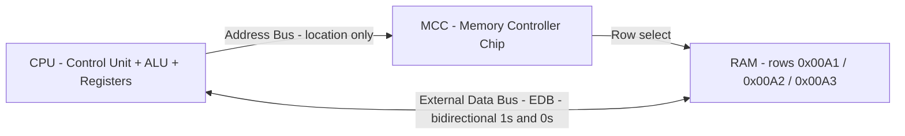
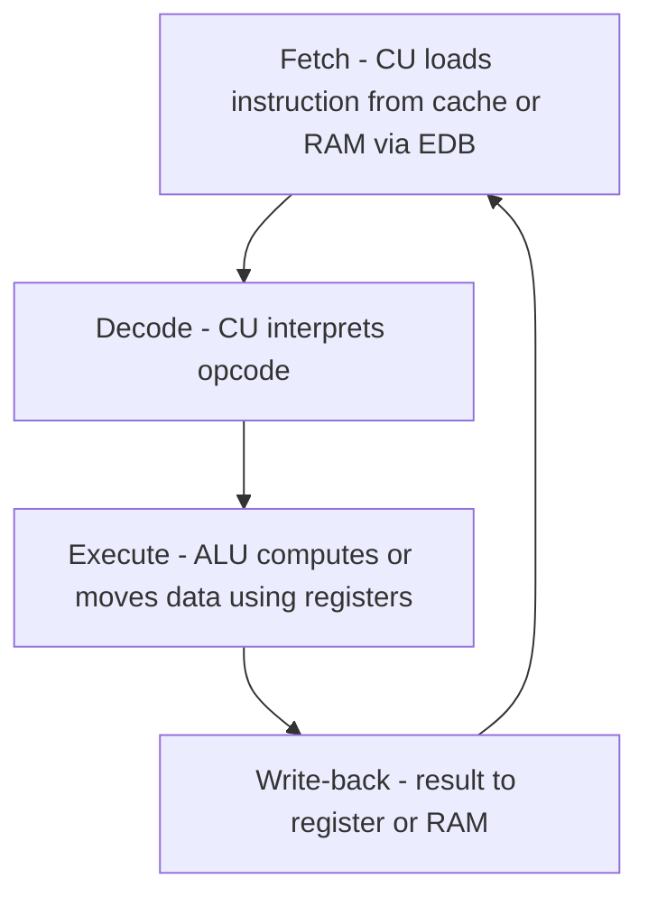

<Concepts items={["CPU", "Control Unit", "ALU", "registers", "External Data Bus", "address bus", "MCC", "L1 cache", "L2 cache", "L3 cache", "clock cycle", "GHz", "32-bit", "64-bit", "LGA", "PGA", "overclocking"]} />

<LessonIntro>

A ticket reports random freezes after a user raised clock speeds to get faster renders, and another reports a machine that caps memory at 4 GB despite having 16 GB installed. Both are CPU architecture questions. This lesson opens the processor package — the three logical units, the buses that carry data and addresses with the memory controller, the cache tiers that keep a gigahertz core fed, socket and cooling mechanics, and the disciplined procedure for overclocking without destroying hardware.

</LessonIntro>

Think of the CPU as a master chef working from recipes (programs) stored in a cookbook (storage drive). The recipes are fetched into the kitchen (RAM and cache), decoded into steps, executed with arithmetic, and the results are plated back to memory. Three functional units inside the package perform every operation.

*Figure — Intel CPU package, top view with heat-spreader. It sits in the motherboard socket under a heat sink and fan. Image: Wikimedia Commons, public domain.*

## Concept Breakdown: What It Is & How It Works

<ConceptCard name="Control Unit (CU)" category="CPU Core">

**What it is.** The director of operations. It fetches instructions from memory, decodes them, and directs the ALU, registers, and I/O devices.

**How it works.** On each clock pulse it moves an instruction into internal registers, interprets the opcode, and issues control signals that route data between ALU, registers, buses, and I/O. It computes nothing itself; it choreographs everything else.

</ConceptCard>

<ConceptCard name="Arithmetic Logic Unit (ALU)" category="CPU Core">

**What it is.** The mathematical engine that performs arithmetic (addition, subtraction, multiplication) and logical comparisons (AND, OR, NOT, XOR).

**How it works.** Operands arrive from registers, the ALU executes the operation selected by the control unit in combinational logic, and the result returns to a register or to memory over the bus.

</ConceptCard>

<ConceptCard name="Registers (Memory Unit)" category="CPU Core">

**What it is.** The smallest, fastest data-holding locations built directly into the processor die, holding active operands, intermediate results, and memory addresses.

**How it works.** They are read and written within a single cycle with no bus traversal. Capacity is a few bytes per register (32-bit to 64-bit widths); everything larger must live in cache or RAM.

</ConceptCard>

<ConceptCard name="External Data Bus (EDB)" category="Bus">

**What it is.** A physical highway of parallel wires connecting the CPU to memory components, transporting raw binary data in 8-bit, 16-bit, 32-bit, or 64-bit widths.

**How it works.** It is bidirectional: data flows from RAM to CPU on reads and CPU to RAM on writes. Wider buses move more bits per transfer, which is why bus width is a first-order performance limit alongside clock speed.

</ConceptCard>

<ConceptCard name="Address Bus and Memory Controller Chip (MCC)" category="Bus">

**What it is.** A dedicated bus from CPU to memory controller that carries the location of requested data, plus the controller chip that bridges CPU to RAM rows.

**How it works.** The CPU asserts a row and address on the address bus — location, not content. The MCC receives it, retrieves the corresponding byte from RAM, and places that byte onto the EDB for the CPU to consume. Address-bus width caps how much memory can be named, which is exactly the 32-bit versus 64-bit limit below.

</ConceptCard>

<ConceptCard name="CPU Cache (L1, L2, L3)" category="Memory">

**What it is.** Ultra-fast Static RAM (SRAM) located directly on the processor die that shields the core from slower RAM.

**How it works.** L1 is fastest and smallest, integrated into each core for instructions and data in immediate execution (typically 32KB–128KB per core). L2 is intermediate, slightly larger and slower, holding recently accessed and prefetched data (typically 512KB–2MB per core). L3 is largest and shared across all cores, slower than L1/L2 but far faster than system RAM (typically 8MB–64MB+). The core checks L1, then L2, then L3, then RAM — each miss costs more cycles.

</ConceptCard>

<ConceptCard name="Clock, Clock Cycle, and Clock Speed" category="Timing">

**What it is.** The quartz clock generator that synchronizes the CPU, where one clock cycle is one pulse of work and clock speed is cycles per second in Gigahertz (GHz).

**How it works.** A clock wire sends voltage pulses telling the CPU when to begin each step. A 3.8 GHz processor performs 3.8 billion cycles per second. Higher GHz means more steps per second, but stalls on cache misses and memory waits still waste cycles — GHz without cache and bus bandwidth is misleading.

</ConceptCard>

<ConceptCard name="32-bit vs 64-bit Architecture" category="Architecture">

**What it is.** The chunk size in which a CPU processes data and addresses.

**How it works.** A 32-bit CPU addresses 2^32 bytes, limiting physical RAM to 4 GB. A 64-bit CPU addresses 2^64 bytes — over 16 Exabytes — allowing modern operating systems to run massive applications and heavy multitasking. A 64-bit OS with 16 GB installed but a 32-bit process or boot path can still present the classic 4 GB cap.

</ConceptCard>

<ConceptCard name="Sockets: LGA vs PGA, and Cooling" category="Packaging">

**What it is.** The mechanical and electrical form factor joining CPU to motherboard, plus the thermal path that keeps it alive.

**How it works.** In Land Grid Array (LGA) the delicate pins sit in the motherboard socket and the CPU underside has flat gold lands — predominantly Intel. In Pin Grid Array (PGA) the pins are on the CPU itself and the socket has matching holes — AMD legacy platforms. Microscopic surface imperfections trap air, a poor conductor, so thermal paste fills the voids between heat spreader and heat sink to conduct heat into the sink and fan. Missing, dried, or excessive paste is a thermal fault.

</ConceptCard>

## How data reaches the core

*Figure 1 — Memory communication flow. The address bus carries the requested location to the MCC; the MCC fetches the row from RAM and returns the byte over the EDB.*

## The execution loop the buses serve

*Figure 2 — Fetch-decode-execute loop. Every clock-driven iteration moves an instruction through fetch, decode, execute, and write-back.*

## Step-by-step breakdown

1. **Locate the data.** The address bus sends the row address to the MCC; the MCC selects the RAM row.
2. **Move the data.** The byte travels over the EDB into registers or cache.
3. **Decode the instruction.** The control unit interprets what operation is required.
4. **Execute.** The ALU computes on register operands.
5. **Write back and repeat.** Results return to a register or RAM on the next cycles, paced by the clock.

## Safe overclocking protocol

Overclocking raises clock rate above factory specification to boost calculation speed. It increases power draw, generates extreme heat, risks degradation, and may void warranties. Follow this five-step procedure only when authorized.

1. **Verify hardware compatibility.** Confirm an unlocked CPU (Intel K series or AMD Black Edition / X series) and a chipset that supports multiplier and voltage adjustment. Laptops and OEM proprietary machines generally do not support overclocking.
2. **Clean chassis and wear anti-static protection.** Power off and unplug, wear an ESD wrist strap, and clear dust from intakes, exhausts, and heatsink fins with compressed air.
3. **Upgrade cooling.** Stock coolers are insufficient for overclocked loads. Install high-performance air cooling or closed-loop liquid (AIO) before changing any clock.
4. **Establish baseline benchmarks.** Log stock temperatures, frequencies, and benchmark scores under stress test so regressions are measurable.
5. **Tune stepwise.** Increment the core multiplier by 1 in BIOS/UEFI or vendor utility, stress test for stability and temperature, and only if unstable increase core voltage (Vcore) in minimal 0.01V to 0.05V steps. Do not exceed 1.4V without specialized extreme cooling. On any freeze or thermal breach, roll back to the last stable frequency.

<LessonNote variant="myth" title="Overclocking safety — read before changing clocks">

**Myth:** "If it boots at the new speed, the overclock is safe."

**Truth:** Booting proves nothing about stability under sustained load. An untested overclock can corrupt files, crash under render or compile load, and thermally degrade silicon over weeks. Every multiplier step requires a stress test, temperature log, and a known-good rollback point — and voltage must never jump blindly past 1.4V on conventional cooling.

</LessonNote>

## Examples

- **Obvious —** A render workstation crashes only under sustained load after a multiplier bump. The overclock passed idle but fails stress testing — roll back one step and retest.
- **Counter-intuitive —** A faster clock can make a machine slower. Thermal throttling from inadequate cooling forces the CPU to drop below stock speed under load, so the overclocked machine benchmarks worse than factory settings.
- **Edge case —** A board accepts a multiplier change but ignores voltage changes. Chipset locks, OEM firmware, or a non-unlocked SKU silently discard the setting — the displayed value and the applied value differ.

<AnalogyCard name="A Kitchen Line">

**The concept.** CU fetches and directs, ALU cooks, registers hold ingredients in hand, buses run dishes between pantry (RAM) and line, cache is the mise en place within reach.

**The analogy.** The control unit is the head chef calling tickets, the ALU is the cook at the burner, registers are the chef's hands holding exactly what is being worked, the EDB is the pass carrying plates, and overclocking is telling the line to work faster without adding ventilation — output rises until heat shuts the kitchen down.

</AnalogyCard>

<LessonNote variant="myth" title="What people get wrong about GHz and bits">

**Myth:** "A higher GHz number always means a faster computer, and 64-bit just means faster math."

**Truth:** GHz counts steps per second, not useful work per step — cache misses, bus width, and throttling dominate. And 64-bit is primarily about addressability: 32-bit caps RAM at 4 GB (2^32 bytes) while 64-bit reaches past 16 Exabytes (2^64 bytes). A 3.8 GHz chip starved by cache misses loses to a slower chip that stays fed.

</LessonNote>

<LessonNote variant="why">

Support tickets about freezes, memory caps, and heat almost always reduce to these three questions: can the core get data fast enough, can it name enough memory, and can heat leave fast enough. Answer those and the ticket is half solved.

</LessonNote>

This connects to memory hierarchy because cache and RAM are the two stages that decide whether the core waits or works.

<QuickRecall title="Quick Recall — CPU and Buses">

1. Which unit fetches and directs versus which unit computes?
2. What travels on the address bus versus the EDB, and what does the MCC do?
3. What are the L1, L2, and L3 size ranges and sharing rules?

Reveal answers

1) Control Unit fetches, decodes, and directs; ALU performs arithmetic and logic. 2) Address bus carries location; EDB carries data bits; MCC bridges CPU to RAM rows. 3) L1 32KB–128KB per core fastest; L2 512KB–2MB per core intermediate; L3 8MB–64MB+ shared across cores.

</QuickRecall>

