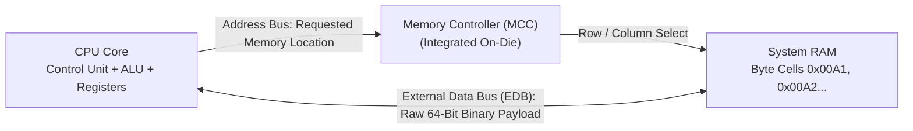
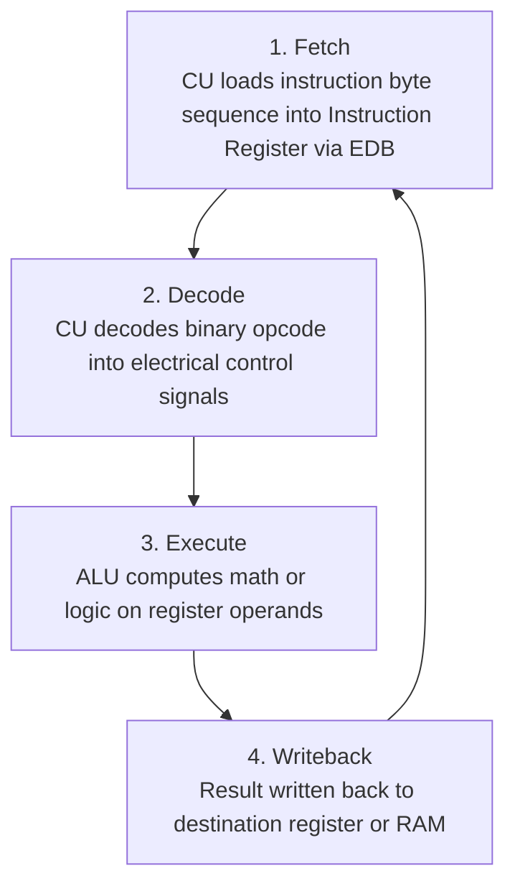
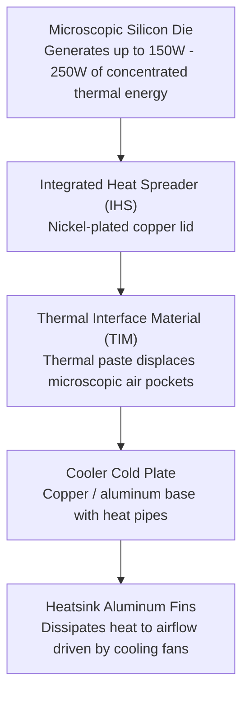

<Concepts items={["CPU", "GPU", "Control Unit", "ALU", "registers", "External Data Bus", "address bus", "MCC", "L1 cache", "L2 cache", "L3 cache", "clock cycle", "GHz", "32-bit", "64-bit", "LGA", "PGA", "overclocking"]} />

<LessonIntro>

A ticket reports random freezes after a user raised clock speeds to get faster renders, and another reports a machine that caps memory at 4 GB despite having 16 GB installed. Both are processor architecture questions. 

This lesson opens the processor package — starting with what a CPU is and how it fundamentally contrasts with a GPU, the three logical subunits inside a core, the physical buses that transport data and addresses with the memory controller, the on-die cache tiers that keep gigahertz cores fed, socket and thermal mechanics, and the disciplined procedure for overclocking without destroying hardware.

</LessonIntro>

## Why this matters

Understanding CPU and GPU architecture allows an IT technician to distinguish between bad operating system software, faulty RAM, and silicon-level thermal or computational bottlenecks:

* **Workload Sizing (CPU vs GPU):** Knowing which processor handles which task prevents costly hardware misconfigurations. Putting a heavy 3D rendering or AI inference task on a high-end CPU will choke the system, while general-purpose OS logic cannot run on a GPU.
* **Thermal Throttling vs Hardware Hangs:** When a user complains that a workstation "crawls to a halt" after 30 minutes of video export or compiling, modern CPUs don't crash — they drop their internal clock multiplier from $4.8\text{ GHz}$ down to $800\text{ MHz}$ to prevent silicon meltdown. Diagnosing this requires checking CPU core temperatures rather than reinstalling software.
* **The 4 GB Memory Ceiling:** Installing a 32-bit operating system or running 32-bit application binaries physically limits addressable memory to $2^{32}\text{ bytes} = 4\text{ GB}$, rendering additional installed RAM invisible to the software.
* **Corrupted Files from Unstable Overclocks:** Aggressive voltage or multiplier tuning without stress testing creates silent mathematical calculation errors in the ALU, which write corrupted bits to storage drives and destroy database tables over time.
* **Socket Pin Damage:** Knowing whether a motherboard uses LGA or PGA dictates how you handle socket replacements, bent pins, and CPU upgrades without breaking fragile contacts.

*Figure 7.1 — Intel CPU package, top view with integrated heat spreader (IHS). It sits in the motherboard socket under a heatsink and fan. Image: Wikimedia Commons, public domain.*

---

## 01 — Processing Architectures: What is a CPU vs. a GPU?

Every modern computer relies on two fundamentally different types of silicon processors to compute workloads: the **Central Processing Unit (CPU)** and the **Graphics Processing Unit (GPU)**.

<ConceptCard name="Central Processing Unit (CPU)" category="General-Purpose Compute">

**What it is.** CPU stands for Central Processing Unit. It is the main processor and "brain" of the computer, designed to handle sequential, general-purpose computation.

**How it works.** A CPU has a few powerful cores — usually 2 to 24 in most laptops and desktops, and sometimes more in enterprise servers. Each core can handle complex instructions, deep branches, and unpredictable tasks with ultra-low latency.

</ConceptCard>

### What the CPU Handles
* **Running the operating system** (Windows, macOS, Linux)
* **Opening and running apps** (browsers, productivity tools, enterprise suites)
* **Browsing the web** and executing script engines
* **Doing general logic and calculations**
* **Managing memory, storage, and input/output (I/O)**
* **Coordinating with and dispatching work to the GPU**

### Key Features of a CPU
* **High clock speed:** Often $3\text{ to }5\text{ GHz}$ for rapid sequential instruction throughput.
* **Large cache:** Multi-megabyte ultra-fast SRAM (L1, L2, L3) built directly into the chip die.
* **Out-of-order execution:** It can reorder instructions dynamically to keep execution units busy.
* **Branch prediction:** It uses predictive heuristics to guess which way an `if/else` branch will go before evaluation to avoid pipeline stalls.
* **Optimized for latency:** Engineered to finish a single complex task as quickly as humanly possible.

> **Mental Model:** Think of a CPU as a **project manager leading a small team of highly skilled engineers**. It can handle many completely different, complicated kinds of work, but it cannot do thousands of independent tasks at the exact same millisecond.

---

<ConceptCard name="Graphics Processing Unit (GPU)" category="Massive Parallel Compute">

**What it is.** GPU stands for Graphics Processing Unit. It is a specialized processor originally designed for rendering images and video frames, but now widely used for massively parallel compute workloads.

**How it works.** A GPU features hundreds or thousands of smaller, simpler cores — often called shader cores, stream processors, or CUDA cores. These cores are designed to execute the exact same operation simultaneously across massive streams of data (SIMD/SIMT).

</ConceptCard>

### What the GPU Handles
* **Gaming graphics** (rasterization, ray tracing, shading)
* **3D rendering** and modeling viewport acceleration
* **Video editing and hardware encoding/decoding** (NVENC, QuickSync)
* **AI and machine learning** (neural network training and tensor inference)
* **Scientific simulations** and fluid dynamics
* **Cryptocurrency mining** (in proof-of-work algorithms)

### Key Features of a GPU
* **Many cores:** Hundreds to tens of thousands of lightweight execution units.
* **Lower clock speed:** Often $1\text{ to }2.5\text{ GHz}$ per core.
* **High memory bandwidth:** Connected to ultra-wide GDDR6 or High Bandwidth Memory (HBM) video RAM (VRAM).
* **Optimized for throughput:** Engineered to maximize the total volume of work processed per second rather than the latency of a single thread.
* **SIMD / SIMT:** Single Instruction, Multiple Data / Single Instruction, Multiple Threads architecture.

> **Mental Model:** Think of a GPU as a **massive team of hundreds or thousands of factory assembly workers**. Each worker is not as flexible or smart as an individual CPU core, but together they can process enormous volumes of repetitive data in parallel at breathtaking speed.

### CPU vs. GPU Architectural Comparison

| Dimension | Central Processing Unit (CPU) | Graphics Processing Unit (GPU) |
| :--- | :--- | :--- |
| **Primary Strength** | Serial execution, low latency, complex logic | Massively parallel execution, high throughput |
| **Typical Core Count** | 2 to 24 cores (up to 64–128 in enterprise servers) | Thousands of cores (e.g. 5,000–16,000+ CUDA cores) |
| **Clock Frequencies** | High ($3.0\text{--}5.5\text{ GHz}$) | Moderate ($1.0\text{--}2.8\text{ GHz}$) |
| **Instruction Style** | Complex Instruction Set (CISC / RISC with out-of-order) | SIMD / SIMT (Single Instruction, Multiple Data) |
| **Memory Architecture** | System DDR4/DDR5 RAM (Low latency, medium bandwidth) | Dedicated VRAM GDDR6/HBM (High latency, massive bandwidth) |
| **Optimal Tasks** | Compiling code, running OS kernels, databases, logic branching | Matrix math, image rasterization, video encoding, AI tensors |

---

## 02 — Internal Processing Subunits: CU, ALU & Registers

Inside each individual CPU core, three primary functional subunits execute instructions:

<ConceptCard name="Control Unit (CU)" category="CPU Core">

**What it is.** The director of operations. It fetches instructions from memory, decodes them, and directs the ALU, registers, and I/O devices.

**How it works.** On each clock pulse it moves an instruction into internal registers, interprets the opcode, and issues control signals that route data between ALU, registers, buses, and I/O. It computes nothing itself; it choreographs everything else.

</ConceptCard>

<ConceptCard name="Arithmetic Logic Unit (ALU)" category="CPU Core">

**What it is.** The mathematical engine that performs arithmetic (addition, subtraction, multiplication) and logical comparisons (AND, OR, NOT, XOR).

**How it works.** Operands arrive from registers, the ALU executes the operation selected by the control unit in combinational logic, and the result returns to a register or to memory over the bus.

</ConceptCard>

<ConceptCard name="Registers (Memory Unit)" category="CPU Core">

**What it is.** The smallest, fastest data-holding locations built directly into the processor die, holding active operands, intermediate results, and memory addresses.

**How it works.** They are read and written within a single cycle with no bus traversal. Capacity is a few bytes per register (32-bit to 64-bit widths); everything larger must live in cache or RAM.

</ConceptCard>

### Functional Roles Comparison

| CPU Subunit | Primary Duty | Access Speed | Typical Data Stored |
| :--- | :--- | :--- | :--- |
| **Control Unit (CU)** | Instruction fetching, opcode decoding, pipeline scheduling. | Zero bus latency | Program Counter (PC), Instruction Register (IR). |
| **ALU** | Mathematical arithmetic and boolean logic comparisons. | Combinational speed | Accumulator results, status flags (Zero, Carry). |
| **Registers** | Immediate working memory on the execution pipeline. | $< 1\text{ ns}$ ($1\text{ cycle}$) | Active operands, pointer memory addresses. |

---

## 03 — Data Pathways & The Fetch-Decode-Execute Cycle

To execute code, the CPU exchanges data across two distinct bus systems synchronized by a memory controller.

<ConceptCard name="External Data Bus (EDB)" category="Bus">

**What it is.** A physical highway of parallel wires connecting the CPU to memory components, transporting raw binary data in 8-bit, 16-bit, 32-bit, or 64-bit widths.

**How it works.** It is bidirectional: data flows from RAM to CPU on reads and CPU to RAM on writes. Wider buses move more bits per transfer, which is why bus width is a first-order performance limit alongside clock speed.

</ConceptCard>

<ConceptCard name="Address Bus and Memory Controller Chip (MCC)" category="Bus">

**What it is.** A dedicated bus from CPU to memory controller that carries the location of requested data, plus the controller chip that bridges CPU to RAM rows.

**How it works.** The CPU asserts a row and address on the address bus — location, not content. The MCC receives it, retrieves the corresponding byte from RAM, and places that byte onto the EDB for the CPU to consume. Address-bus width caps how much memory can be named, which is exactly the 32-bit versus 64-bit limit below.

</ConceptCard>

*Figure 7.2 — Memory bus communication: address bus selects the location, MCC bridges the RAM row, and EDB carries the payload.*

### The Instruction Cycle Loop

Every program instruction runs through this rhythmic hardware loop:

*Figure 7.3 — The Fetch-Decode-Execute loop.*

1. **Locate the data:** The address bus sends the requested memory address to the MCC; the MCC selects the physical RAM row.
2. **Move the data:** The raw bytes travel across the EDB into CPU registers or high-speed cache.
3. **Decode the opcode:** The Control Unit translates the binary opcode into internal control signals.
4. **Execute:** The ALU computes operations on register operands.
5. **Write back and repeat:** Results return to destination registers or system RAM on subsequent clock cycles.

---

## 04 — Cache Hierarchy, Clocking & Architecture Widths

The greatest bottleneck in CPU design is **memory latency**: system DRAM takes $\approx 60\text{--}90\text{ ns}$ to respond, during which a $4\text{ GHz}$ core would sit idle for hundreds of clock cycles. On-die caches solve this dilemma.

<ConceptCard name="CPU Cache (L1, L2, L3)" category="Memory">

**What it is.** Ultra-fast Static RAM (SRAM) located directly on the processor die that shields the core from slower RAM.

**How it works.** L1 is fastest and smallest, integrated into each core for instructions and data in immediate execution (typically 32KB–128KB per core). L2 is intermediate, slightly larger and slower, holding recently accessed and prefetched data (typically 512KB–2MB per core). L3 is largest and shared across all cores, slower than L1/L2 but far faster than system RAM (typically 8MB–64MB+). The core checks L1, then L2, then L3, then RAM — each miss costs more cycles.

</ConceptCard>

<ConceptCard name="Clock, Clock Cycle, and Clock Speed" category="Timing">

**What it is.** The quartz clock generator that synchronizes the CPU, where one clock cycle is one pulse of work and clock speed is cycles per second in Gigahertz (GHz).

**How it works.** A clock wire sends voltage pulses telling the CPU when to begin each step. A 3.8 GHz processor performs 3.8 billion cycles per second. Higher GHz means more steps per second, but stalls on cache misses and memory waits still waste cycles — GHz without cache and bus bandwidth is misleading.

</ConceptCard>

<ConceptCard name="32-bit vs 64-bit Architecture" category="Architecture">

**What it is.** The chunk size in which a CPU processes data and addresses.

**How it works.** A 32-bit CPU addresses $2^{32}\text{ bytes}$, limiting physical RAM to 4 GB. A 64-bit CPU addresses $2^{64}\text{ bytes}$ — over 16 Exabytes — allowing modern operating systems to run massive applications and heavy multitasking. A 64-bit OS with 16 GB installed but a 32-bit process or boot path can still present the classic 4 GB cap.

</ConceptCard>

### Cache Tier Hierarchy

| Cache Level | Capacity Range | Access Latency | Location & Scope |
| :--- | :--- | :--- | :--- |
| **L1 Cache** | $32\text{--}128\text{ KB}$ per core | $\approx 1\text{ ns}$ ($4\text{ cycles}$) | Dedicated per core; split into L1 Instruction and L1 Data. |
| **L2 Cache** | $512\text{ KB -- }2\text{ MB}$ per core | $\approx 3\text{--}5\text{ ns}$ ($12\text{ cycles}$) | Dedicated per core; holds prefetched data. |
| **L3 Cache** | $16\text{--}96\text{ MB}$ pool | $\approx 10\text{--}20\text{ ns}$ ($40\text{ cycles}$) | Shared pool across all execution cores on the die. |
| **Main RAM** | $8\text{--}128\text{ GB}$ | $\approx 60\text{--}90\text{ ns}$ ($200\text{ cycles}$) | External DRAM sticks connected over memory channels. |

---

## 05 — Sockets, Thermal Dissipation & Coolers

Physical packaging dictates how the CPU mounts to the system board and transfers heat away from delicate silicon.

<ConceptCard name="Sockets: LGA vs PGA, and Cooling" category="Packaging">

**What it is.** The mechanical and electrical form factor joining CPU to motherboard, plus the thermal path that keeps it alive.

**How it works.** In Land Grid Array (LGA) the delicate pins sit in the motherboard socket and the CPU underside has flat gold lands — predominantly Intel and modern AMD AM5. In Pin Grid Array (PGA) the pins are on the CPU itself and the socket has matching holes — AMD legacy platforms (AM4). Microscopic surface imperfections trap air, a poor conductor, so thermal paste fills the voids between heat spreader and heat sink to conduct heat into the sink and fan. Missing, dried, or excessive paste is a thermal fault.

</ConceptCard>

*Figure 7.4 — Thermal dissipation conduction path from silicon die to ambient room air.*

---

## 06 — The Safe Overclocking Protocol & Stability Verification

Overclocking raises clock multipliers and core voltages above factory ratings to increase calculation throughput. It increases power draw, accelerates electromigration, generates extreme heat, and risks data corruption if executed improperly.

### The 5-Step Safe Overclocking Procedure

1. **Verify hardware compatibility:** Confirm an unlocked CPU (Intel K-series, AMD X-series/unlocked) and an enthusiast chipset supporting voltage adjustments (e.g., Intel Z-series, AMD X/B-series). Laptops and corporate OEM desktops lock these features in firmware.
2. **Clean chassis and implement ESD precautions:** Power down, disconnect AC power, ground yourself with an ESD wrist strap, and blow accumulated dust out of heatsink fins and chassis filters.
3. **Upgrade cooling infrastructure:** Stock coolers cannot manage overclocked thermal loads. Install a dual-tower air cooler or a $280\text{mm}/360\text{mm}$ All-In-One (AIO) liquid cooler before altering clocks.
4. **Establish baseline stress benchmarks:** Run standard workloads (Cinebench, Prime95, AIDA64) at stock settings. Record idle and peak load temperatures, clock frequencies, and power draw.
5. **Tune stepwise with incremental verification:**
   - Increase the CPU core multiplier by 1 step ($+100\text{ MHz}$) in UEFI.
   - Boot into the OS and run a 15-minute stress test while monitoring temperatures.
   - If unstable or experiencing BSODs, increase core voltage ($V_{\text{core}}$) in tiny $+0.01\text{V}$ to $+0.02\text{V}$ increments.
   - **Never exceed $1.4\text{V } V_{\text{core}}$** on standard consumer cooling solutions.
   - If thermal throttling exceeds $95^\circ\text{C}$ or freezing occurs, roll back to the previous stable multiplier.

<LessonNote variant="myth" title="Overclocking safety — read before changing clocks">

**Myth:** "If it boots at the new speed, the overclock is safe."

**Truth:** Booting proves nothing about stability under sustained load. An untested overclock can corrupt files, crash under render or compile load, and thermally degrade silicon over weeks. Every multiplier step requires a stress test, temperature log, and a known-good rollback point — and voltage must never jump blindly past 1.4V on conventional cooling.

</LessonNote>

---

## 07 — Troubleshooting Freezes & Real-World Support Scenarios

* **Obvious — Thermal Throttling in High-Performance Workstations:** A rendering machine freezes after 20 minutes of 3D modeling. Checking hardware sensors reveals the CPU core temperature hit $100^\circ\text{C}$, causing the clock speed to collapse to $800\text{ MHz}$. Inspection reveals dried-out thermal paste or a dead AIO liquid cooler pump.
* **Counter-intuitive — When Higher Clock Speeds Reduce Performance:** A user overclocks their CPU from $3.6\text{ GHz}$ to $5.0\text{ GHz}$ without upgrading cooling. Under load, the CPU reaches thermal cutoff almost immediately and throttles violently, resulting in benchmark scores lower than stock factory configuration.
* **Edge case — The Phantom 4 GB RAM Limit:** A user installs 32 GB of DDR4 RAM, but Windows reports only "3.2 GB Usable." The issue is not bad RAM; the user installed a 32-bit version of Windows, whose 32-bit address bus can only index $2^{32}\text{ bytes}$ ($4\text{ GB}$ total address space, shared with PCIe device mapping). Reinstalling a 64-bit OS unlocks all 32 GB immediately.

<AnalogyCard name="A Kitchen Line">

**The concept.** CU fetches and directs, ALU cooks, registers hold ingredients in hand, buses run dishes between pantry (RAM) and line, cache is the mise en place within reach.

**The analogy.** The control unit is the head chef calling tickets, the ALU is the cook at the burner, registers are the chef's hands holding exactly what is being worked, the EDB is the pass carrying plates, and overclocking is telling the line to work faster without adding ventilation — output rises until heat shuts the kitchen down.

</AnalogyCard>

<LessonNote variant="myth" title="What people get wrong about GHz and bits">

**Myth:** "A higher GHz number always means a faster computer, and 64-bit just means faster math."

**Truth:** GHz counts steps per second, not useful work per step — cache misses, bus width, and throttling dominate. And 64-bit is primarily about addressability: 32-bit caps RAM at 4 GB (2^32 bytes) while 64-bit reaches past 16 Exabytes (2^64 bytes). A 3.8 GHz chip starved by cache misses loses to a slower chip that stays fed.

</LessonNote>

<LessonNote variant="why">

Support tickets about freezes, memory caps, and heat almost always reduce to these three questions: can the core get data fast enough, can it name enough memory, and can heat leave fast enough. Answer those and the ticket is half solved.

</LessonNote>

---

## Summary Checklist: CPU Architecture & Overclocking Mental Model

1. **CPUs prioritize latency; GPUs prioritize throughput:** CPUs feature a few powerful cores ($3\text{--}5\text{ GHz}$) designed for sequential branching, OS kernels, and apps; GPUs feature thousands of simpler cores ($1\text{--}2.5\text{ GHz}$) designed for massive SIMD parallel tasks (graphics, video, AI).
2. **The three CPU core units divide execution labor:** The Control Unit fetches and decodes instructions; the ALU executes arithmetic and logic; Registers hold active operands at single-cycle speed.
3. **Buses split location and payload:** The Address Bus specifies the numeric RAM address to the Memory Controller; the External Data Bus (EDB) carries raw bytes back and forth.
4. **Cache hides DRAM latency:** On-die SRAM caches (L1, L2, L3) store frequently used data and instructions close to the execution pipeline to prevent core starvation.
5. **64-bit breaks memory boundaries:** 32-bit architectures are physically limited to 4 GB address space ($2^{32}$); 64-bit systems support up to 16 Exabytes ($2^{64}$).
6. **Overclocking requires strict thermal discipline:** Never increase multipliers without stress testing; maintain voltages below $1.4\text{V}$; verify cooling capacity before modifying clock settings.

---

<QuickRecall title="Quick Recall — CPU and Buses">

1. What fundamentally differentiates the architectural design and core structure of a CPU versus a GPU?
2. Which internal CPU subunit fetches and directs instructions versus which subunit computes them?
3. What travels on the address bus versus the EDB, and what does the MCC do?
4. What are the L1, L2, and L3 cache size ranges and core-sharing rules?

Reveal answers

1. A CPU has a few very powerful cores (2 to 24+) optimized for low latency, complex sequential branching, and general-purpose OS tasks. A GPU has hundreds or thousands of simpler cores optimized for high throughput and massively parallel calculations (SIMD/SIMT) like graphics and AI.
2. The Control Unit (CU) fetches, decodes, and directs; the Arithmetic Logic Unit (ALU) performs arithmetic and boolean logic.
3. The address bus carries memory locations (where to look); the EDB carries raw data bytes (the payload); the Memory Controller Chip (MCC) translates addresses and retrieves the row from physical RAM.
4. L1 ($32\text{--}128\text{ KB}$ per core) is fastest and private; L2 ($512\text{ KB -- }2\text{ MB}$ per core) is intermediate and private; L3 ($16\text{--}96\text{ MB}+$) is large and shared across all cores on the die.

</QuickRecall>

This connects to memory hierarchy because cache and RAM are the two stages that decide whether the core waits or works.
