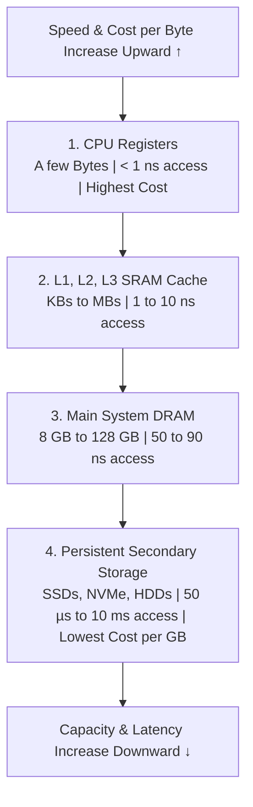
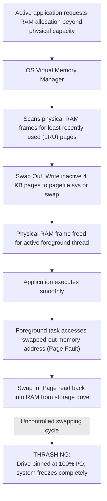
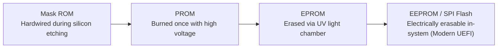

<Concepts items={["memory hierarchy", "registers", "cache", "RAM", "DRAM", "SRAM", "SDRAM", "DDR", "DIMM", "virtual memory", "paging", "thrashing", "ROM", "PROM", "EPROM", "EEPROM"]} />

<LessonIntro>

A user with 16 GB of RAM insists the machine needs more because twenty browser tabs feel slow, while another machine with failing RAM throws random blue screens. Both tickets require the same mental model: a pyramid of memories trading speed against capacity, two transistor technologies behind RAM, generation-locked DIMM sticks, an OS escape hatch called paging, and a separate non-volatile family that holds firmware. 

This lesson builds that model from the top register down to ROM.

</LessonIntro>

## Why this matters

Memory issues generate some of the most elusive and disruptive tickets in IT support:

* **Distinguishing Healthy RAM from Exhaustion:** An end user panics seeing Windows Task Manager report "90% Memory Used." Modern operating systems intentionally use idle RAM for file caching and prefetching. The true indicator of starvation is not RAM percentage, but **hard page faults** and disk **thrashing**.
* **Memory Management BSODs:** Memory stop codes such as `PAGE_FAULT_IN_NONPAGED_AREA` or `MEMORY_MANAGEMENT` indicate bad solder contacts, damaged capacitor cells, or incompatible memory timings across dual-channel DIMMs.
* **Physical Motherboard Damage:** Forcing an incompatible DDR4 stick into a DDR3 or DDR5 slot damages both the motherboard trace connectors and the memory module. The physical notch is an intentional mechanical lock.
* **Firmware Recovery:** Understanding EEPROM flash memory explains how BIOS/UEFI updates are flashed, why pulling power during a firmware write bricks the board, and how modern USB BIOS Flashback buttons recover dead boards.

*Figure 8.1 — Different RAM generations. Each DDR generation changes notch position, operating voltage, and pinout to prevent physical mismatch. Image: Wikimedia Commons.*

---

## 01 — The Storage Pyramid: Latency vs Capacity Trade-offs

Computer architecture resolves the fundamental engineering conflict between speed, cost, and physical space by stacking memory into a multi-tiered hierarchy:

<ConceptCard name="Memory Hierarchy" category="Architecture">

**What it is.** The tiered pyramid from CPU registers through cache, main RAM, and secondary storage.

**How it works.** The CPU checks the smallest fastest tier first and falls through to slower larger tiers on each miss. Higher tiers trade capacity for speed and cost; lower tiers trade speed for capacity and cheap persistence.

</ConceptCard>

<ConceptCard name="RAM vs CPU Registers" category="Memory">

**What it is.** Two volatile working memories at opposite ends of the speed-capacity trade.

**How it works.** Registers live inside the CPU die, hold a few bytes per register, and respond in under one cycle for immediate arithmetic and decoding. RAM lives on separate DIMM modules in motherboard slots, holds gigabytes of running programs and OS services, and costs multiple cycles plus bus and MCC routing per access. Both are volatile — registers clear on cycle or power loss, RAM clears on shutdown or reboot.

</ConceptCard>

*Figure 8.2 — The storage hierarchy pyramid: speed and cost scale upward; capacity scales downward.*

### Registers vs System RAM Comparison

| Architectural Feature | CPU Registers | Random Access Memory (RAM) |
| :--- | :--- | :--- |
| **Physical Location** | Directly on the CPU silicon die execution pipeline. | Separate DIMM modules slotted into motherboard memory channels. |
| **Typical Capacity** | $1\text{--}2\text{ KB}$ total ($64\text{ bits}$ per general register). | $8\text{ GB to }128\text{ GB}+$. |
| **Access Latency** | $< 1\text{ CPU clock cycle}$ ($< 0.5\text{ ns}$). | $60\text{--}90\text{ ns}$ ($\approx 200\text{ clock cycles}$). |
| **Functional Role** | Immediate operands, accumulator values, jump pointers. | Active application working sets, OS kernel, process heap/stack. |
| **Volatility** | Volatile (flushed on instruction retire or power loss). | Volatile (contents drain instantly on power down or reboot). |

---

## 02 — Silicon Technologies: DRAM vs SRAM

At the transistor level, the two primary forms of random access memory employ fundamentally different electronic circuitry:

<ConceptCard name="DRAM (Dynamic RAM)" category="Memory Technology">

**What it is.** Main system memory built from one transistor and one tiny capacitor per bit.

**How it works.** Capacitors leak charge, so DRAM must be refreshed continuously thousands of times per second or data fades. The reward is high density and low cost, which is why laptops, desktops, and phones use DRAM for gigabytes of main memory.

</ConceptCard>

<ConceptCard name="SRAM (Static RAM)" category="Memory Technology">

**What it is.** Cache memory built from flip-flop circuits using four to six transistors per bit.

**How it works.** It holds data steadily as long as power is present with no refresh cycles, at higher speed, reliability, cost, and physical size per bit. That is why it is reserved for CPU L1, L2, and L3 cache rather than main memory.

</ConceptCard>

| Metric / Parameter | DRAM (Dynamic RAM) | SRAM (Static RAM) |
| :--- | :--- | :--- |
| **Circuit Component** | 1 Transistor + 1 Capacitor (1T1C) | 4 to 6 Transistors (Bistable Flip-Flop) |
| **Refresh Required?** | **Yes** (thousands of refresh cycles per second) | **No** (holds state steadily while powered) |
| **Packaging Density** | Very high (billions of cells per small chip) | Low (requires significantly larger die area per bit) |
| **Manufacturing Cost** | Low cost per gigabyte | Extremely expensive per megabyte |
| **Typical Deployment** | Desktop DIMMs, Laptop SO-DIMMs, Phone LPDDR | CPU L1/L2/L3 on-die cache memory |

---

## 03 — DDR SDRAM Generations & DIMM Physical Form Factors

Modern system memory operates as **Synchronous DRAM (SDRAM)** synchronized with the motherboard clock. The industry standard is **DDR (Double Data Rate)**, transferring data on both the rising and falling edges of each clock pulse.

<ConceptCard name="DDR SDRAM and DIMMs" category="Memory Standard">

**What it is.** Modern RAM is Synchronous DRAM clocked with the system, in Double Data Rate variants that transfer on both rising and falling clock edges to double throughput. Desktop modules ship as Dual Inline Memory Modules (DIMMs).

**How it works.** Each DDR generation raises frequency and density while lowering voltage, and each uses a differently positioned alignment notch so an incompatible generation cannot physically seat. Board and stick generations must match; the notch enforces it mechanically.

</ConceptCard>

### Generational Specifications & Notch Positions

| Memory Standard | Bandwidth / Transfer Rate | Operating Voltage | Pin Count | Key Physical Distinction |
| :--- | :--- | :--- | :--- | :--- |
| **DDR1** | $200\text{--}400\text{ MT/s}$ | $2.5\text{ V}$ | 184-pin | Offset alignment notch for legacy boards. |
| **DDR2** | $400\text{--}800\text{ MT/s}$ | $1.8\text{ V}$ | 240-pin | Offset notch closer to module center. |
| **DDR3** | $800\text{--}2133\text{ MT/s}$ | $1.5\text{ V}$ | 240-pin | Distinct asymmetrical notch; incompatible with DDR2. |
| **DDR4** | $2133\text{--}3200\text{ MT/s}$ | $1.2\text{ V}$ | 288-pin | Curved connector edge to reduce insertion force. |
| **DDR5** | $4800\text{--}8400+\text{ MT/s}$ | $1.1\text{ V}$ | 288-pin | Near-center notch, on-die ECC, dual 32-bit subchannels. |

> [!WARNING] The Alignment Notch Rule
> Never force a RAM module into a motherboard DIMM slot. If the module does not seat smoothly with moderate thumb pressure until the side latches snap shut, check the alignment notch. The stick is either oriented backwards or belongs to a different DDR generation.

---

## 04 — Virtual Memory, Paging & Thrashing Dynamics

When running applications require more memory than physically installed in the DIMM slots, the operating system kernel activates its virtual memory subsystem:

<ConceptCard name="Virtual Memory (Paging)" category="OS Memory">

**What it is.** The operating system's overflow mechanism when committed memory exceeds physical RAM — for example, demanding 18 GB on a 16 GB machine.

**How it works.** The OS reserves a paging file (pagefile.sys on Windows, swap partition on Linux) on secondary storage and swaps inactive pages of RAM to disk to free physical frames for the foreground task. Because disk is far slower than RAM, heavy swapping causes thrashing — the machine spends more time paging than executing.

</ConceptCard>

*Figure 8.3 — Virtual memory paging lifecycle and the thrashing failure mode.*

---

## 05 — Non-Volatile Firmware Memory: ROM, PROM, EPROM & EEPROM

Unlike RAM, which loses state on shutdown, firmware memory must retain initialization instructions indefinitely without battery power:

<ConceptCard name="ROM: PROM, EPROM, EEPROM" category="Firmware Memory">

**What it is.** Non-volatile Read-Only Memory that retains startup code such as the bootstrap loader without power.

**How it works.** PROM ships blank and is written once with a high-voltage programmer, then permanent. EPROM can be erased by removing the chip and exposing its quartz window to ultraviolet light for 20–30 minutes, then reprogrammed. EEPROM (Flash ROM) erases and rewrites electrically in circuit with no removal, which is what makes modern BIOS/UEFI firmware updates possible.

</ConceptCard>

### The Evolution of Non-Volatile Firmware

*Figure 8.4 — Evolutionary timeline of firmware ROM technologies.*

* **Mask ROM:** Hardwired in the factory. Cannot be modified or updated under any circumstances.
* **PROM (Programmable ROM):** Blank chips programmed once by blowing microscopic internal fuses. Irreversible once written.
* **EPROM (Erasable PROM):** Features a clear quartz window on top of the ceramic chip package. Exposing the window to high-intensity ultraviolet (UV) light for 20 minutes discharges floating gates, allowing reprogramming.
* **EEPROM / SPI Flash ROM (Electrically Erasable PROM):** Uses pulsed electrical voltages to erase and rewrite blocks in-place without removing the chip. Modern motherboards use 16 MB–32 MB SPI Flash EEPROMs to store UEFI firmware.

---

## 06 — Diagnostic Workflows & Real-World Support Scenarios

### Troubleshooting Symptoms & Root Causes

| Symptom / Error Message | Root Cause Subsystem | Remediation Protocol |
| :--- | :--- | :--- |
| **Solid disk activity LED, system crawls, mouse stutters.** | **Thrashing:** System memory is exhausted; kernel is continuously swapping pages to slow disk. | Check Task Manager committed memory. Close background processes or upgrade physical RAM. |
| **Intermittent BSODs with varying stop codes (`0x0000001A`).** | Failing DRAM capacitor cell, mismatched timings, or dirty gold slot contacts. | Run Windows Memory Diagnostic or MemTest86. Test DIMMs individually in known-good slots. |
| **New replacement RAM module will not snap into motherboard slot.** | Wrong DDR generation or reversed module orientation. | Compare key notch location with existing module. Verify DDR generation matches motherboard specs. |

### Practical Support Scenarios

* **Obvious — Volatility Demonstration:** Pulling the power cord on a running desktop clears RAM completely. Unsaved Word documents or code edits vanish instantly, while files committed to disk and UEFI settings in EEPROM persist without damage.
* **Counter-intuitive — When Adding RAM Does Not Improve Speed:** A user complains their single-threaded accounting script is slow and requests 32 GB of RAM. Adding RAM changes nothing because the script's dataset was already small enough to fit inside L3 cache. The bottleneck is single-core CPU frequency, not memory capacity.
* **Edge case — Dual-Channel Memory Slot Inversion:** A user buys two identical 8 GB sticks of DDR4 for a four-slot motherboard and inserts them into slots 1 and 2 (Channel A). The machine boots in **Single-Channel mode** at half theoretical memory bandwidth. Relocating the sticks to slots 2 and 4 (A2 and B2) enables **Dual-Channel mode**, doubling memory throughput for integrated GPUs and multitasking.

<AnalogyCard name="A Chef's Workstations">

**The concept.** Registers, cache, RAM, disk, and ROM form tiers of increasing capacity and latency; DRAM needs constant refresh while SRAM and ROM hold steady.

**The analogy.** Registers are ingredients in the chef's hands, cache is the cutting board within reach, RAM is the nearby refrigerator, secondary storage is the warehouse across town, and ROM is the laminated recipe card bolted to the wall — while DRAM is ice that must be refrozen constantly or it melts away.

</AnalogyCard>

<LessonNote variant="myth" title="What people get wrong about memory">

**Myth:** "Free RAM is wasted RAM, so a machine using all its RAM always needs more."

**Truth:** Modern operating systems deliberately fill RAM with caches and buffers. High utilization alone is healthy. The signal for shortage is paging and thrashing — constant swap activity with degraded responsiveness — not the utilization percentage itself.

</LessonNote>

<LessonNote variant="why">

Every slow-machine ticket asks one pyramid question: where does the working set actually live right now. If it lives in cache and registers, the CPU flies; if it spills to disk through paging, no CPU upgrade will save it.

</LessonNote>

---

## Summary Checklist: Memory Hierarchy Mental Model

1. **The memory pyramid trades speed for scale:** Moving from CPU registers down to secondary storage increases capacity by orders of magnitude while multiplying access latency by thousands.
2. **DRAM requires active electrical refresh:** Built from 1 transistor and 1 capacitor, DRAM is cheap and dense, but must be refreshed thousands of times per second.
3. **SRAM powers CPU caches:** Using 4 to 6 transistors per cell, SRAM requires no refresh, provides single-digit nanosecond latencies, and is deployed as on-die L1/L2/L3 cache.
4. **DIMM notches are mechanical safety keys:** Each DDR generation (DDR1 through DDR5) enforces unique notch positions and operating voltages to prevent board damage.
5. **Thrashing is the failure mode of virtual memory:** When memory commits exceed physical RAM, excessive disk swapping causes storage queues to spike to 100%, locking the user interface.

---

<QuickRecall title="Quick Recall — Memory Hierarchy">

1. What are the four pyramid tiers with their technologies and latencies?
2. How does DRAM differ from SRAM, and where is each used?
3. What is paging, and what is thrashing?

Reveal answers

1. Registers (bytes, under 1 ns), SRAM cache KB–MB at 1–10 ns, DRAM RAM in GBs at 50–100 ns, secondary SSD/NVMe/HDD in TBs at microseconds to ms.
2. DRAM uses 1T1C with constant refresh for dense cheap main memory; SRAM uses 4–6T flip-flops with no refresh for fast expensive cache.
3. Paging swaps inactive RAM pages to pagefile.sys or swap partition; thrashing is the collapse when swapping dominates execution.

</QuickRecall>

This connects to persistent storage because paging already showed that disk speed matters — and disk technologies differ by orders of magnitude.
