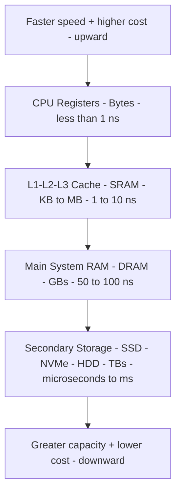
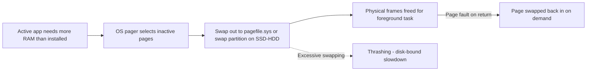

<Concepts items={["memory hierarchy", "registers", "cache", "RAM", "DRAM", "SRAM", "SDRAM", "DDR", "DIMM", "virtual memory", "paging", "thrashing", "ROM", "PROM", "EPROM", "EEPROM"]} />

<LessonIntro>

A user with 16 GB of RAM insists the machine needs more because twenty browser tabs feel slow, while another machine with failing RAM throws random blue screens. Both tickets require the same mental model: a pyramid of memories trading speed against capacity, two transistor technologies behind RAM, generation-locked DIMM sticks, an OS escape hatch called paging, and a separate non-volatile family that holds firmware. This lesson builds that model from the top register down to ROM.

</LessonIntro>

Computers balance speed, cost, and capacity with tiered storage. The fastest tiers are tiny and expensive; the largest tiers are slow and cheap. Every memory access walks down this pyramid until it finds the data, so placement determines performance.

*Figure — Different RAM generations. Each DDR generation changes notch position, voltage, and speed, so board and stick generations must match. Image: Wikimedia Commons.*

## Concept Breakdown: What It Is & How It Works

<ConceptCard name="Memory Hierarchy" category="Architecture">

**What it is.** The tiered pyramid from CPU registers through cache, main RAM, and secondary storage.

**How it works.** The CPU checks the smallest fastest tier first and falls through to slower larger tiers on each miss. Higher tiers trade capacity for speed and cost; lower tiers trade speed for capacity and cheap persistence.

</ConceptCard>

<ConceptCard name="RAM vs CPU Registers" category="Memory">

**What it is.** Two volatile working memories at opposite ends of the speed-capacity trade.

**How it works.** Registers live inside the CPU die, hold a few bytes per register, and respond in under one cycle for immediate arithmetic and decoding. RAM lives on separate DIMM modules in motherboard slots, holds gigabytes of running programs and OS services, and costs multiple cycles plus bus and MCC routing per access. Both are volatile — registers clear on cycle or power loss, RAM clears on shutdown or reboot.

</ConceptCard>

<ConceptCard name="DRAM (Dynamic RAM)" category="Memory Technology">

**What it is.** Main system memory built from one transistor and one tiny capacitor per bit.

**How it works.** Capacitors leak charge, so DRAM must be refreshed continuously thousands of times per second or data fades. The reward is high density and low cost, which is why laptops, desktops, and phones use DRAM for gigabytes of main memory.

</ConceptCard>

<ConceptCard name="SRAM (Static RAM)" category="Memory Technology">

**What it is.** Cache memory built from flip-flop circuits using four to six transistors per bit.

**How it works.** It holds data steadily as long as power is present with no refresh cycles, at higher speed, reliability, cost, and physical size per bit. That is why it is reserved for CPU L1, L2, and L3 cache rather than main memory.

</ConceptCard>

<ConceptCard name="DDR SDRAM and DIMMs" category="Memory Standard">

**What it is.** Modern RAM is Synchronous DRAM clocked with the system, in Double Data Rate variants that transfer on both rising and falling clock edges to double throughput. Desktop modules ship as Dual Inline Memory Modules (DIMMs).

**How it works.** Each DDR generation raises frequency and density while lowering voltage, and each uses a differently positioned alignment notch so an incompatible generation cannot physically seat. Board and stick generations must match; the notch enforces it mechanically.

</ConceptCard>

<ConceptCard name="Virtual Memory (Paging)" category="OS Memory">

**What it is.** The operating system's overflow mechanism when committed memory exceeds physical RAM — for example, demanding 18 GB on a 16 GB machine.

**How it works.** The OS reserves a paging file (pagefile.sys on Windows, swap partition on Linux) on secondary storage and swaps inactive pages of RAM to disk to free physical frames for the foreground task. Because disk is far slower than RAM, heavy swapping causes thrashing — the machine spends more time paging than executing.

</ConceptCard>

<ConceptCard name="ROM: PROM, EPROM, EEPROM" category="Firmware Memory">

**What it is.** Non-volatile Read-Only Memory that retains startup code such as the bootstrap loader without power.

**How it works.** PROM ships blank and is written once with a high-voltage programmer, then permanent. EPROM can be erased by removing the chip and exposing its quartz window to ultraviolet light for 20–30 minutes, then reprogrammed. EEPROM (Flash ROM) erases and rewrites electrically in circuit with no removal, which is what makes modern BIOS/UEFI firmware updates possible.

</ConceptCard>

## The pyramid

*Figure 1 — The storage hierarchy. Speed and cost rise toward registers; capacity rises and cost per byte falls toward secondary storage.*

| Feature | CPU Registers | Random Access Memory (RAM) |
|---|---|---|
| **Location** | Inside the CPU die itself. | Separate DIMM modules slotted into the motherboard. |
| **Capacity** | A few bytes (32-bit to 64-bit per register). | Gigabytes (8 GB, 16 GB, 32 GB, 64 GB+). |
| **Access Latency** | Instantaneous (< 1 CPU clock cycle). | Multiple clock cycles (requires bus traversal & MCC routing). |
| **Primary Purpose** | Immediate arithmetic calculations, instruction decoding, temporary operands. | Holding currently running programs, active OS services, and application data. |
| **Persistence** | Volatile (lost immediately on CPU cycle or power loss). | Volatile (lost when system powers down or reboots). |

*Figure 2 — Virtual-memory paging. Inactive pages spill to disk to protect the foreground task; overuse causes thrashing.*

| Generation | Key Enhancements | Operating Voltage | Physical Form Factor |
|---|---|---|---|
| **DDR1** | First double data rate standard (200-400 MT/s). | 2.5 V | 184-pin DIMM |
| **DDR2** | Improved bus speeds and lower power consumption. | 1.8 V | 240-pin DIMM |
| **DDR3** | Doubled prefetch buffer, higher clock speeds. | 1.5 V | 240-pin DIMM (different notch) |
| **DDR4** | Higher density, improved error detection, high bandwidth. | 1.2 V | 288-pin DIMM |
| **DDR5** | Dual-channel per DIMM, on-die ECC, extreme frequencies (4800+ MT/s). | 1.1 V | 288-pin DIMM (centered notch) |

DIMM sticks enforce compatibility physically: each generation places its alignment notch differently so a DDR4 stick cannot seat in a DDR3 or DDR5 slot. When a ticket says RAM does not fit, that notch is usually the answer, not force.

## Step-by-step breakdown

1. **Check the fastest tier first.** A hot loop that fits in cache runs at nanosecond latency; the same loop spilling to RAM pays 50–100 ns per miss.
2. **Match the technology to the tier.** SRAM for cache where speed matters, DRAM for main memory where density matters.
3. **Match the generation to the board.** Confirm DDR generation, voltage, pin count, and notch before seating a DIMM.
4. **Watch for paging.** If RAM is full and disk activity is constant with slow response, suspect thrashing rather than a dead stick — close working sets or add RAM.
5. **Separate firmware from working memory.** Boot and firmware faults implicate non-volatile ROM/Flash; lost work on power loss implicates volatile RAM and registers.

## Ticket symptoms to likely cause

- **Ticket: Machine slows to a crawl with many tabs, disk light solid.** Likely cause: paging and thrashing, not CPU failure. Check committed versus physical memory and the pagefile/swap device.
- **Ticket: Random crashes with different stop codes.** Likely cause: failing DRAM cell or mismatched DIMM generations and timings. Test sticks individually and verify board support.
- **Ticket: Replacement RAM will not seat.** Likely cause: wrong DDR generation — the notch position is telling you the board expects a different pinout.

## Examples

- **Obvious —** Pulling power clears RAM. Unsaved documents vanish while files on disk and firmware settings persist — volatility versus non-volatility in one demonstration.
- **Counter-intuitive —** More RAM can make a slow machine slower to diagnose. If the bottleneck was thrashing, adding RAM helps; if it was a single-threaded CPU loop resident in cache, extra DRAM changes nothing because the working set never left the upper tiers.
- **Edge case —** A DDR3 and DDR4 stick with the same capacity and similar labels are not interchangeable despite both being 240+ pin DIMMs in spirit. DDR3 is 240-pin at 1.5V and DDR4 is 288-pin at 1.2V with a different notch — the board accepts exactly one.

<AnalogyCard name="A Chef's Workstations">

**The concept.** Registers, cache, RAM, disk, and ROM form tiers of increasing capacity and latency; DRAM needs constant refresh while SRAM and ROM hold steady.

**The analogy.** Registers are ingredients in the chef's hands, cache is the cutting board within reach, RAM is the nearby refrigerator, secondary storage is the warehouse across town, and ROM is the laminated recipe card bolted to the wall — while DRAM is ice that must be refrozen constantly or it melts away.

</AnalogyCard>

<LessonNote variant="myth" title="What people get wrong about memory">

**Myth:** "Free RAM is wasted RAM, so a machine using all its RAM always needs more."

**Truth:** Modern operating systems deliberately fill RAM with caches and buffers. High utilization alone is healthy. The signal for shortage is paging and thrashing — constant swap activity with degraded responsiveness — not the utilization percentage itself.

</LessonNote>

<LessonNote variant="why">

Every slow-machine ticket asks one pyramid question: where does the working set actually live right now. If it lives in cache and registers, the CPU flies; if it spills to disk through paging, no CPU upgrade will save it.

</LessonNote>

This connects to persistent storage because paging already showed that disk speed matters — and disk technologies differ by orders of magnitude.

<QuickRecall title="Quick Recall — Memory Hierarchy">

1. What are the four pyramid tiers with their technologies and latencies?
2. How does DRAM differ from SRAM, and where is each used?
3. What is paging, and what is thrashing?

Reveal answers

1) Registers (bytes, under 1 ns), SRAM cache KB–MB at 1–10 ns, DRAM RAM in GBs at 50–100 ns, secondary SSD/NVMe/HDD in TBs at microseconds to ms. 2) DRAM uses 1T1C with constant refresh for dense cheap main memory; SRAM uses 4–6T flip-flops with no refresh for fast expensive cache. 3) Paging swaps inactive RAM pages to pagefile.sys or swap partition; thrashing is the collapse when swapping dominates execution.

</QuickRecall>

