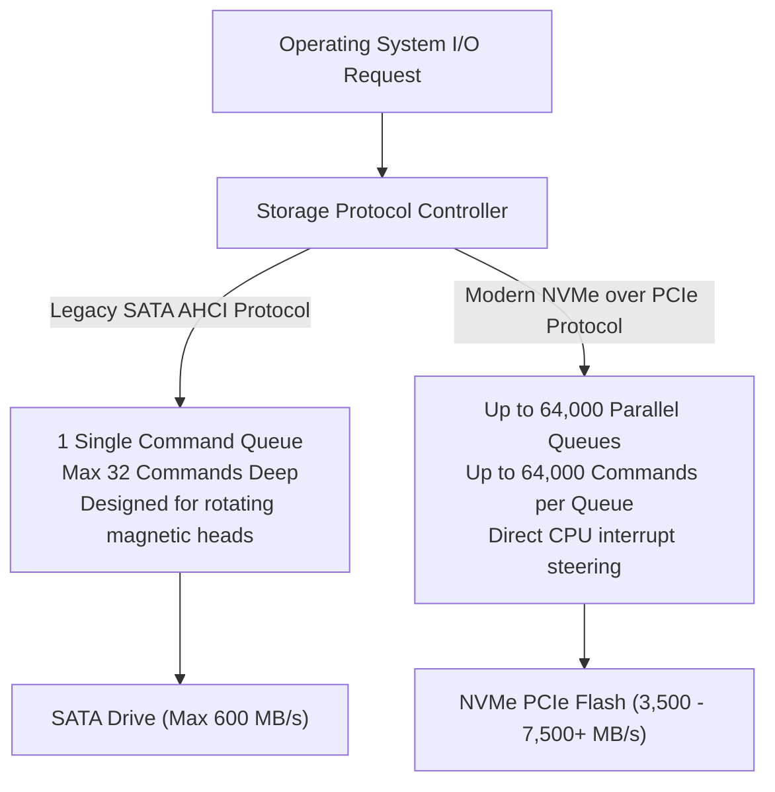

<Concepts items={["primary storage", "secondary storage", "HDD", "SSD", "NAND flash", "SATA", "NVMe", "PCIe", "SAS", "IDE", "M.2", "decimal prefix", "binary prefix", "KB vs KiB"]} />

<LessonIntro>

A user complains that boot takes minutes while a colleague's identical OS boots in seconds, and another asks why a new 1 TB drive shows as 931 GB in Windows. 

The first ticket is a device-technology question — spinning platters versus flash — plus the bus interface behind it. The second is a units question — decimal versus binary prefix calculations. This lesson covers both: HDD and SSD internals, SATA, NVMe, SAS, and legacy IDE, then the full KB through YB versus KiB through YiB table and the mathematical 931 GiB calculation every technician must be able to reproduce.

</LessonIntro>

## Why this matters

Storage drives are the most frequently upgraded and diagnosed components across corporate IT fleets:

* **The 100% Disk Utilization Hang:** When a Windows 10/11 laptop with an older mechanical HDD becomes completely unresponsive on boot, the drive is pinned at 100% active time simply servicing random background telemetry and antivirus scans. Swapping the mechanical HDD for a solid-state drive is the highest-ROI upgrade in desktop support.
* **The "Missing Space" Ticket:** Users frequently submit tickets claiming a newly purchased 1 TB or 2 TB external drive is "defective" or "missing 70 GB of factory storage." Understanding SI decimal marketing vs IEC binary OS measurement resolves the ticket instantly without RMA returns.
* **M.2 Slot Confusion:** Physical M.2 connectors can carry either legacy SATA III signals (capped at $600\text{ MB/s}$) or high-speed PCIe lanes (reaching $7{,}000+\text{ MB/s}$). Installing an NVMe drive into a SATA-only M.2 slot results in either failure to detect or severely throttled bandwidth.
* **Data Recovery vs Catastrophic Loss:** Mechanical drives show early warning signs of failure through audible clicking, motor hum, and SMART reallocated sector counts. SSDs fail silently at the flash controller level without warning, making automated 3-2-1 backup strategies mandatory.

---

## 01 — Mechanical Hard Disk Drives (HDD) vs Solid-State Drives (SSD)

Primary storage (RAM and CPU registers) is fast but volatile. Secondary storage holds operating system images, applications, databases, and user files permanently.

<ConceptCard name="Hard Disk Drive (HDD)" category="Storage Device">

**What it is.** A mechanical drive using magnetic platters spinning at 5400 or 7200 RPM with a moving actuator arm and read/write heads.

**How it works.** The head seeks physically to the track and waits for the sector to rotate underneath, so latency is measured in milliseconds. Drops or vibration can cause head crashes and mechanical failure. Strength: cheap mass cold storage, video archives, and bulk backups.

</ConceptCard>

*Figure 9.1 — Inside a mechanical hard drive: spinning magnetic platters and actuator arm with read/write heads. Image: Wikimedia Commons.*

<ConceptCard name="Solid State Drive (SSD)" category="Storage Device">

**What it is.** A solid-state drive using non-volatile NAND flash microchips with zero moving parts plus a flash controller.

**How it works.** Cells are addressed electronically with microsecond latency and no seek penalty, silent, cooler, shock-resistant, and energy-efficient — extending laptop battery life. Strength: operating systems, applications, gaming, and databases where latency dominates.

</ConceptCard>

*Figure 9.2 — 2.5-inch SATA SSD with zero moving parts. Image: Wikimedia Commons (Intel Free Press, CC BY 2.0).*

### HDD vs SSD Technical Comparison

| Feature / Metric | Hard Disk Drive (HDD) | Solid-State Drive (SSD) |
| :--- | :--- | :--- |
| **Internal Mechanism** | Spinning magnetic platters & mechanical actuator arm | Non-volatile NAND flash microchips & controller |
| **Random Access Latency** | $\approx 5\text{--}15\text{ ms}$ (seek time + rotational delay) | $\approx 20\text{--}100\ \mu\text{s}$ (direct electronic address) |
| **Sequential Read/Write** | $100\text{--}250\text{ MB/s}$ | $550\text{ MB/s (SATA)} \dots 7{,}500+\text{ MB/s (NVMe)}$ |
| **Physical Shock Tolerance** | Fragile; physical drops during operation cause head crashes | High durability; withstands drops, shocks, and vibrations |
| **Acoustic Noise** | Audible spinning hum, seeking clicks, and head sweeps | $100\%$ completely silent |
| **Common Form Factors** | $3.5\text{''}$ (desktop/servers), $2.5\text{''}$ (older laptops) | $2.5\text{''}$ SATA, M.2 (2280), U.2, E1.S (enterprise) |
| **Optimal IT Use Case** | Cold mass storage, video surveillance archives, bulk backups | Operating system boot drives, active applications, databases |

---

## 02 — Storage Bus Interfaces: SATA, NVMe, SAS & Legacy IDE

How a drive communicates with the CPU and memory is dictated by its underlying bus architecture and protocol:

<ConceptCard name="SATA, NVMe, SAS, and IDE" category="Interface">

**What it is.** The hardware interface plus software protocol connecting a drive to the motherboard.

**How it works.** SATA III runs over an AHCI controller at 600 MB/s (6 Gbps) with hot-swappable cables for standard SSDs and HDDs. NVMe runs directly over the PCIe bus to the CPU at 3,500–7,500+ MB/s across Gen3/Gen4/Gen5 for high-performance OS, gaming, and enterprise AI and databases with deep parallel queues. SAS serves enterprise arrays at 1,200 MB/s (12 Gbps) with dual-port redundancy. IDE/PATA over parallel ribbon cable at 133 MB/s is obsolete, retained only for legacy HDDs and CD-ROM drives.

</ConceptCard>

*Figure 9.3 — M.2 2280 NVMe SSD. It communicates directly over PCIe lanes to bypass legacy SATA bottlenecks. Image: Wikimedia Commons (CC0).*

### Storage Interface Protocols Matrix

| Interface Standard | Underlying Physical Bus | Maximum Throughput | Typical Deployment Environment |
| :--- | :--- | :--- | :--- |
| **NVMe (NVM Express)** | **PCIe Bus** ($\times 4$ lanes direct to CPU) | **$3{,}500\text{--}7{,}500+\text{ MB/s}$** | Modern OS boot drives, workstations, gaming, enterprise AI workloads. |
| **SATA III (Serial ATA)** | SATA Controller / AHCI Bus | **$600\text{ MB/s}$** ($6\text{ Gbps}$) | Standard consumer SATA SSDs, $3.5\text{''}$ desktop HDDs, optical drives. |
| **SAS (Serial Attached SCSI)** | Enterprise SAS Controller | **$1{,}200\text{ MB/s}$** ($12\text{ Gbps}$) | High-density data center server arrays; supports dual-port failover. |
| **IDE / PATA (Legacy)** | 40/80-conductor parallel ribbon cable | $133\text{ MB/s}$ | Obsolete legacy standard found on 1990s/early 2000s computers. |

---

## 03 — Queue Depth & Protocol Architecture: AHCI vs NVMe

The performance difference between modern NVMe storage and SATA SSDs is not merely the copper traces — it is the queue protocol.

<ConceptCard name="NVMe Queue Advantage" category="Protocol">

**What it is.** The reason NVMe is more than a faster cable: it was designed for flash parallelism.

**How it works.** SATA-era AHCI handles one queue with 32 commands — a legacy of spinning disks. NVMe supports up to 64,000 queues with 64,000 commands per queue, slashing CPU overhead and latency under concurrent load. A SATA SSD and an NVMe SSD with similar flash differ dramatically under queue depth for exactly this reason.

</ConceptCard>

*Figure 9.4 — AHCI vs NVMe queue depth comparison.*

---

## 04 — Data Capacity Standards: Decimal SI (GB) vs Binary IEC (GiB)

One of the most persistent complaints received by IT helpdesks is that formatted storage drives appear smaller than the packaging advertises.

<ConceptCard name="Decimal vs Binary Prefixes" category="Units">

**What it is.** Two standards for kilo through yotta: SI decimal powers of 10 versus IEC binary powers of 2.

**How it works.** Manufacturers market in decimal ($1\text{ TB} = 10^{12}\text{ bytes}$). Operating systems measure in binary ($1\text{ TiB} = 2^{40}\text{ bytes}$). The gap compounds at each prefix, which is why the same drive reports a smaller number in the OS than on the box.

</ConceptCard>

### The Complete Capacity Units Table

| Decimal Prefix (SI Base-10) | Exact SI Bytes | Binary Prefix (IEC Base-2) | Exact Binary Bytes | Percentage Difference |
| :--- | :--- | :--- | :--- | :--- |
| **Kilobyte (KB)** | $10^3 = 1{,}000$ | **Kibibyte (KiB)** | $2^{10} = 1{,}024$ | $+2.4\%$ |
| **Megabyte (MB)** | $10^6 = 1{,}000{,}000$ | **Mebibyte (MiB)** | $2^{20} = 1{,}048{,}576$ | $+4.8\%$ |
| **Gigabyte (GB)** | $10^9 = 1{,}000{,}000{,}000$ | **Gibibyte (GiB)** | $2^{30} = 1{,}073{,}741{,}824$ | $+7.4\%$ |
| **Terabyte (TB)** | $10^{12} = 1{,}000{,}000{,}000{,}000$ | **Tebibyte (TiB)** | $2^{40} = 1{,}099{,}511{,}627{,}776$ | **$+9.9\%$** |
| **Petabyte (PB)** | $10^{15}$ | **Pebibyte (PiB)** | $2^{50}$ | $+12.6\%$ |
| **Exabyte (EB)** | $10^{18}$ | **Exbibyte (EiB)** | $2^{60}$ | $+15.3\%$ |
| **Zettabyte (ZB)** | $10^{21}$ | **Zebibyte (ZiB)** | $2^{70}$ | $+18.0\%$ |
| **Yottabyte (YB)** | $10^{24}$ | **Yobibyte (YiB)** | $2^{80}$ | $+20.9\%$ |

### The "Missing 69 GB" Calculation

When a storage drive manufacturer sells a "1 TB" drive, they deliver exactly one trillion bytes:

$$\text{Manufacturer Capacity} = 1{,}000{,}000{,}000{,}000 \text{ bytes}$$

However, Microsoft Windows measures storage using binary **Gibibytes (GiB)**, where $1\text{ GiB} = 2^{30} = 1{,}073{,}741{,}824\text{ bytes}$, yet incorrectly labels them as "GB":

$$\text{Reported in Windows} = \frac{1{,}000{,}000{,}000{,}000}{1{,}073{,}741{,}824} \approx \mathbf{931.32 \text{ GiB}}$$

No physical storage was lost to formatting defects; the discrepancy is entirely a difference in mathematical measurement standards.

---

## 05 — Triage Workflows & Common Helpdesk Tickets

### Storage Triage Matrix

| User Ticket Symptom | Root Cause Subsystem | Support Resolution Action |
| :--- | :--- | :--- |
| **System boot takes 4 minutes; Task Manager shows Disk at 100%.** | Aging mechanical HDD suffering from high random seek latency under Windows OS load. | Clone the disk to a 2.5-inch SATA or M.2 NVMe SSD using imaging tools. |
| **New external USB-C NVMe drive benchmarks at only 40 MB/s.** | Cable plugged into a legacy USB 2.0 port or user using a charge-only cable. | Move cable to a USB 3.2 Gen 2 ($10\text{ Gbps}$) port and verify USB 3.0+ cable rated for data. |
| **New 1 TB internal SSD reports only 931 GB in Disk Management.** | Normal mathematical divergence between SI decimal packaging and IEC binary OS reporting. | Explain the binary conversion formula to user. Confirm drive health using SMART utilities. |

### Practical Support Scenarios

* **Obvious — Physical Shock Vulnerability:** Dropping a powered laptop with a running 7200 RPM mechanical HDD frequently causes the read/write heads to crash into the magnetic platters, permanently destroying data sectors. Dropping a laptop with an SSD causes zero platter damage because flash silicon contains no moving parts.
* **Counter-intuitive — Why Full SSDs Slow Down:** When an SSD is filled to greater than $90\%$ capacity, write performance can drop below mechanical drive speeds. Because NAND flash cannot overwrite existing data without first erasing entire $2\text{--}8\text{ MB}$ blocks (the **Write Amplification** effect), a full SSD must perform slow read-modify-erase-write cycles for every new file. Maintaining at least $15\text{--}20\%$ free space preserves peak throughput.
* **Edge case — The M.2 Keying Trap:** An M.2 SSD form factor uses different mechanical notches ("keys"): B-key, M-key, or B+M key. Installing a B-key SATA SSD into an M-key NVMe-only slot will either physically not fit or fail to initialize in UEFI. Always check the motherboard manual for supported keying and protocol (SATA vs PCIe).

<AnalogyCard name="A Vinyl Collection versus a Jukebox of Photographs">

**The concept.** HDDs seek mechanically through one shallow queue; SSDs address electronically; NVMe parallelizes deeply over PCIe.

**The analogy.** An HDD is a record library where one clerk fetches one sleeve at a time and walks it to the turntable. A SATA SSD is a wall of photographs handed over instantly but still through one window. NVMe is sixty-four thousand windows each serving sixty-four thousand requests at once — the wall did not get faster, the line disappeared.

</AnalogyCard>

<LessonNote variant="myth" title="What people get wrong about storage">

**Myth:** "A 1 TB drive that shows 931 GB has lost 69 GB to formatting or a defect."

**Truth:** The bytes are all present. The vendor labels in powers of 10 while the OS measures in powers of 2, and the gap widens with size. Formatting metadata costs megabytes, not tens of gigabytes — the 931 figure is arithmetic, not damage.

</LessonNote>

<LessonNote variant="why">

Storage tickets split cleanly once you separate mechanism from interface from units. Mechanism decides latency and durability, interface decides ceiling throughput and queue depth, and units decide whether the capacity number should worry anyone at all.

</LessonNote>

---

## Summary Checklist: Storage Devices & Data Sizes Mental Model

1. **HDDs seek mechanically; SSDs address electronically:** HDDs suffer millisecond rotational latencies and shock fragility; SSDs deliver microsecond access with zero moving parts.
2. **NVMe bypasses legacy AHCI bottlenecks:** Running directly across PCIe lanes with up to 64,000 deep parallel queues, NVMe delivers up to $7{,}500+\text{ MB/s}$ throughput.
3. **M.2 is a form factor, not a protocol:** An M.2 card can run either slow SATA III protocols ($600\text{ MB/s}$) or high-speed PCIe NVMe; verify slot routing in motherboard specifications.
4. **Vendors count in decimal; operating systems count in binary:** A 1 TB drive ($10^{12}\text{ bytes}$) equals $\approx 931.32\text{ GiB}$ ($2^{40}\text{ bytes}$ basis) in Windows.
5. **SSDs require over-provisioning headroom:** Keeping SSDs below $85\%$ capacity prevents extreme write amplification and preserves TRIM garbage-collection performance.

---

<QuickRecall title="Quick Recall — Storage and Sizes">

1. What are the latency, durability, and best-use differences between HDD and SSD?
2. How do SATA, NVMe, SAS, and IDE differ in bus and throughput?
3. Why does 1 TB equal about 931 GiB in the OS?

Reveal answers

1. HDD milliseconds with fragile mechanics for bulk archives; SSD microseconds silent and shock-resistant for OS and apps.
2. SATA 600 MB/s AHCI, NVMe 3,500–7,500+ MB/s over PCIe with deep queues, SAS 1,200 MB/s enterprise redundant, IDE 133 MB/s obsolete.
3. 1,000,000,000,000 divided by 1,073,741,824 ≈ 931.32 GiB — decimal label versus binary measurement.

</QuickRecall>

This connects to motherboards and firmware because the interface choice — SATA versus NVMe, MBR versus GPT — determines what the board and its boot code must support.
