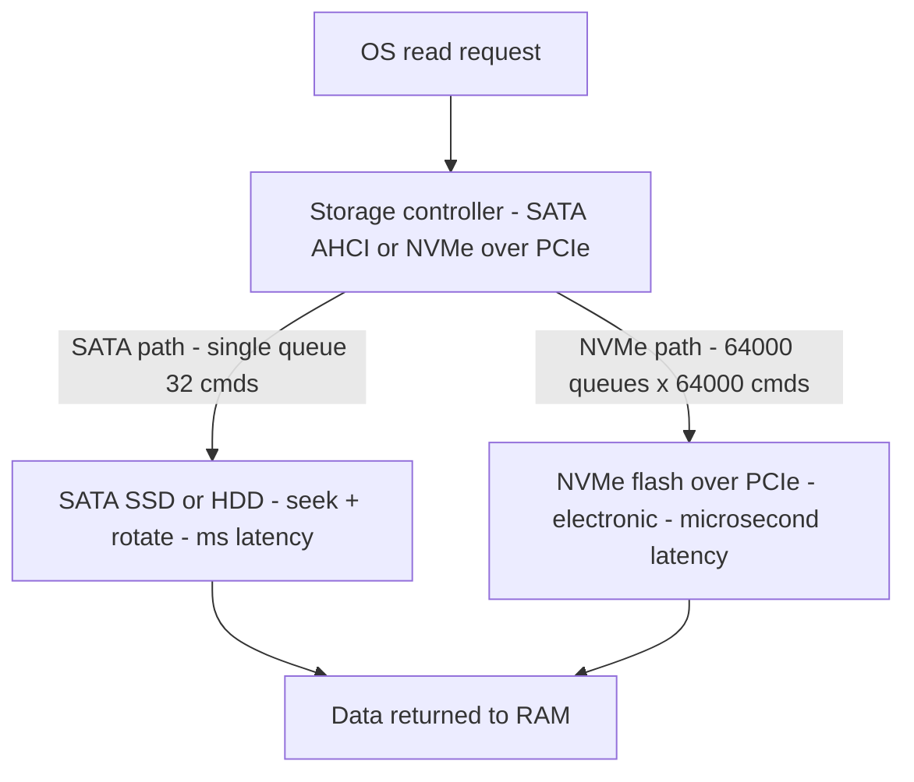

<Concepts items={["primary storage", "secondary storage", "HDD", "SSD", "NAND flash", "SATA", "NVMe", "PCIe", "SAS", "IDE", "M.2", "decimal prefix", "binary prefix", "KB vs KiB"]} />

<LessonIntro>

A user complains that boot takes minutes while a colleague's identical OS boots in seconds, and another asks why a new 1 TB drive shows as 931 GB. The first ticket is a device-technology question — spinning platters versus flash — plus the interface behind it. The second is a units question —Decimal versus Binary prefixes. This lesson covers both: HDD and SSD internals, SATA, NVMe, SAS, and legacy IDE, then the full KB through YB versus KiB through YiB table and the 931 GiB calculation every technician should be able to reproduce.

</LessonIntro>

Primary storage (RAM and CPU registers) is directly accessed by the CPU over memory buses — ultra-fast but volatile. Secondary storage (HDD, SSD, NVMe) is accessed indirectly through storage controllers over SATA or PCIe — slower than RAM but non-volatile, holding the OS, applications, and user data permanently. Secondary technologies span internal HDDs and SSDs, optical media (CD, DVD, Blu-ray), magnetic tape arrays for archival, Network-Attached Storage (NAS), Storage Area Networks (SANs), and cloud storage.

## Concept Breakdown: What It Is & How It Works

<ConceptCard name="Hard Disk Drive (HDD)" category="Storage Device">

**What it is.** A mechanical drive using magnetic platters spinning at 5400 or 7200 RPM with a moving actuator arm and read/write heads.

**How it works.** The head seeks physically to the track and waits for the sector to rotate underneath, so latency is measured in milliseconds. Drops or vibration can cause head crashes and mechanical failure. Strength: cheap mass cold storage, video archives, and bulk backups.

</ConceptCard>

*Figure — Inside a hard drive: magnetic platters with the read/write heads on the actuator arm. Image: Wikimedia Commons.*

<ConceptCard name="Solid State Drive (SSD)" category="Storage Device">

**What it is.** A solid-state drive using non-volatile NAND flash microchips with zero moving parts plus a flash controller.

**How it works.** Cells are addressed electronically with microsecond latency and no seek penalty, silent, cooler, shock-resistant, and energy-efficient — extending laptop battery life. Strength: operating systems, applications, gaming, and databases where latency dominates.

</ConceptCard>

*Figure — SATA SSD with no moving parts. Image: Wikimedia Commons (Intel Free Press, CC BY 2.0).*

<ConceptCard name="SATA, NVMe, SAS, and IDE" category="Interface">

**What it is.** The hardware interface plus software protocol connecting a drive to the motherboard.

**How it works.** SATA III runs over an AHCI controller at 600 MB/s (6 Gbps) with hot-swappable cables for standard SSDs and HDDs. NVMe runs directly over the PCIe bus to the CPU at 3,500–7,500+ MB/s across Gen3/Gen4/Gen5 for high-performance OS, gaming, and enterprise AI and databases with deep parallel queues. SAS serves enterprise arrays at 1,200 MB/s (12 Gbps) with dual-port redundancy. IDE/PATA over parallel ribbon cable at 133 MB/s is obsolete, retained only for legacy HDDs and CD-ROM drives.

</ConceptCard>

<ConceptCard name="NVMe Queue Advantage" category="Protocol">

**What it is.** The reason NVMe is more than a faster cable: it was designed for flash parallelism.

**How it works.** SATA-era AHCI handles one queue with 32 commands — a legacy of spinning disks. NVMe supports up to 64,000 queues with 64,000 commands per queue, slashing CPU overhead and latency under concurrent load. A SATA SSD and an NVMe SSD with similar flash differ dramatically under queue depth for exactly this reason.

</ConceptCard>

*Figure — M.2 2280 NVMe SSD. NVMe runs directly over PCIe for deep parallel queues. Image: Wikimedia Commons (CC0).*

<ConceptCard name="Decimal vs Binary Prefixes" category="Units">

**What it is.** Two standards for kilo through yotta: SI decimal powers of 10 versus IEC binary powers of 2.

**How it works.** Manufacturers market in decimal (1 TB = 10^12 bytes). Operating systems measure in binary (1 TiB = 2^40 bytes). The gap compounds at each prefix, which is why the same drive reports a smaller number in the OS than on the box.

</ConceptCard>

| Feature | HDD (Hard Disk Drive) | SSD (Solid State Drive) |
|---|---|---|
| **Internal Technology** | Spinning magnetic disks & mechanical actuator arm. | NAND flash memory chips & flash controller. |
| **Access Speed & Latency** | Slower (~100-200 MB/s, latency in milliseconds). | Fast (~550 MB/s to 7,000+ MB/s, latency in microseconds). |
| **Physical Durability** | Fragile; drops can damage heads/platters. | High durability; withstands shocks and vibrations. |
| **Acoustic Noise** | Produces audible clicking and spinning hum. | 100% Silent (no moving parts). |
| **Energy Consumption** | Higher power draw (motor spinning platters). | Very low power consumption; extends battery life. |
| **Common Form Factors** | 3.5-inch (desktop/server), 2.5-inch (laptop). | 2.5-inch SATA, M.2 (2280), U.2. |
| **Best Use Case** | Mass cold storage, video archives, bulk backups. | Operating systems, applications, gaming, databases. |

*Figure 1 — HDD versus SSD read path. SATA serializes through one shallow queue plus mechanical seek; NVMe parallelizes across deep queues with no moving parts.*

| Interface / Protocol | Underlying Bus | Max Throughput | Typical Application |
|---|---|---|---|
| **NVMe (NVM Express)** | **PCIe Bus** (Direct to CPU) | **3,500 – 7,500+ MB/s** (PCIe Gen3/4/5) | Modern high-performance OS drives, gaming, enterprise AI/databases. Ultra-low latency and deep parallel queues. |
| **SATA III (Serial ATA)** | SATA Controller (AHCI) | **600 MB/s** (6 Gbps) | Standard consumer SSDs and desktop/laptop HDDs. Hot-swappable cable connections. |
| **SAS (Serial Attached SCSI)** | Enterprise SAS Controller | **1,200 MB/s** (12 Gbps) | Enterprise server storage arrays; higher reliability and dual-port redundancy. |
| **IDE / PATA (Legacy)** | Parallel ATA Ribbon Cable | 133 MB/s | Obsolete legacy standard for older HDDs and CD-ROM drives. |

| Decimal Prefix (SI Base-10) | Approximate Bytes | Binary Prefix (IEC Base-2 ISQ) | Exact Binary Bytes |
|---|---|---|---|
| **Kilobyte (KB)** | 10^3 = 1,000 Bytes | **Kibibyte (KiB)** | 2^10 = 1,024 Bytes |
| **Megabyte (MB)** | 10^6 = 1,000,000 Bytes | **Mebibyte (MiB)** | 2^20 = 1,048,576 Bytes |
| **Gigabyte (GB)** | 10^9 = 1,000,000,000 Bytes | **Gibibyte (GiB)** | 2^30 = 1,073,741,824 Bytes |
| **Terabyte (TB)** | 10^12 = 1 Trillion Bytes | **Tebibyte (TiB)** | 2^40 = 1,099,511,627,776 Bytes |
| **Petabyte (PB)** | 10^15 Bytes | **Pebibyte (PiB)** | 2^50 Bytes |
| **Exabyte (EB)** | 10^18 Bytes | **Exbibyte (EiB)** | 2^60 Bytes |
| **Zettabyte (ZB)** | 10^21 Bytes | **Zebibyte (ZiB)** | 2^70 Bytes |
| **Yottabyte (YB)** | 10^24 Bytes | **Yobibyte (YiB)** | 2^80 Bytes |

Why a 1 TB drive shows as about 931 GB in Windows: the manufacturer counts 1 TB as 1,000,000,000,000 bytes, while the OS divides by binary gibibytes (1,073,741,824 bytes each). So 1,000,000,000,000 / 1,073,741,824 ≈ 931.32 GiB. No space is missing; the ruler changed.

## Step-by-step breakdown

1. **Classify the need.** Latency-sensitive OS, apps, and databases belong on SSD/NVMe; bulk archives belong on HDD.
2. **Match interface to workload.** Single-queue SATA suffices for bulk and budget SSDs; concurrent, queue-deep workloads need NVMe over PCIe; enterprise arrays needing redundancy need SAS.
3. **Check form factor and slot.** Confirm 3.5-inch versus 2.5-inch bays, or 2.5-inch SATA versus M.2 (2280) versus U.2, before ordering.
4. **Translate the capacity label.** Convert the decimal box figure to binary OS units before telling a user space is missing.
5. **Listen and feel.** Clicking plus vibration points to HDD mechanics; silence with microsecond response points to flash.

## Ticket symptoms to likely cause

- **Ticket: Boot takes minutes, disk at 100 percent on a spinning drive.** Likely cause: HDD seek latency under random I/O. Cloning the OS to an SSD typically resolves it without any other change.
- **Ticket: External SSD fast on one machine, capped at about 550 MB/s on another.** Likely cause: SATA interface or enclosure bottleneck rather than the flash — the NVMe drive is behind a SATA-class path.
- **Ticket: New 1 TB drive reports 931 GB — is it defective.** Likely cause: decimal versus binary accounting. Show the division above; do not RMA a healthy drive.

## Examples

- **Obvious —** Dropping a running HDD kills it while dropping an SSD does not. Moving heads and spinning platters tolerate no shock; NAND cells do.
- **Counter-intuitive —** A nearly full SSD can be slower than a half-empty HDD for sustained writes. Without free blocks and over-provisioning headroom, the flash controller must erase before writing, stalling throughput — fullness, not mechanics, becomes the bottleneck.
- **Edge case —** An M.2 slot does not guarantee NVMe speed. Some M.2 slots expose only a SATA path, so an NVMe stick installed there negotiates down to SATA-class throughput despite the modern connector.

<AnalogyCard name="A Vinyl Collection versus a Jukebox of Photographs">

**The concept.** HDDs seek mechanically through one shallow queue; SSDs address electronically; NVMe parallelizes deeply over PCIe.

**The analogy.** An HDD is a record library where one clerk fetches one sleeve at a time and walks it to the turntable. A SATA SSD is a wall of photographs handed over instantly but still through one window. NVMe is sixty-four thousand windows each serving sixty-four thousand requests at once — the wall did not get faster, the line disappeared.

</AnalogyCard>

<LessonNote variant="myth" title="What people get wrong about storage">

**Myth:** "A 1 TB drive that shows 931 GB has lost 69 GB to formatting or a defect."

**Truth:** The bytes are all present. The vendor labels in powers of 10 while the OS measures in powers of 2, and the gap widens with size. Formatting metadata costs megabytes, not tens of gigabytes — the 931 figure is arithmetic, not damage.

</LessonNote>

<LessonNote variant="why">

Storage tickets split cleanly once you separate mechanism from interface from units. Mechanism decides latency and durability, interface decides ceiling throughput and queue depth, and units decide whether the capacity number should worry anyone at all.

</LessonNote>

This connects to motherboards and firmware because the interface choice — SATA versus NVMe, MBR versus GPT — determines what the board and its boot code must support.

<QuickRecall title="Quick Recall — Storage and Sizes">

1. What are the latency, durability, and best-use differences between HDD and SSD?
2. How do SATA, NVMe, SAS, and IDE differ in bus and throughput?
3. Why does 1 TB equal about 931 GiB in the OS?

Reveal answers

1) HDD milliseconds with fragile mechanics for bulk archives; SSD microseconds silent and shock-resistant for OS and apps. 2) SATA 600 MB/s AHCI, NVMe 3,500–7,500+ MB/s over PCIe with deep queues, SAS 1,200 MB/s enterprise redundant, IDE 133 MB/s obsolete. 3) 1,000,000,000,000 divided by 1,073,741,824 ≈ 931.32 GiB — decimal label versus binary measurement.

</QuickRecall>

