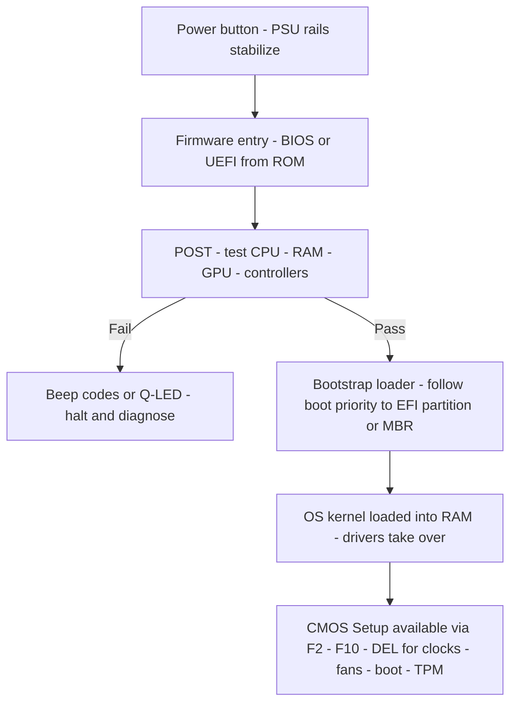
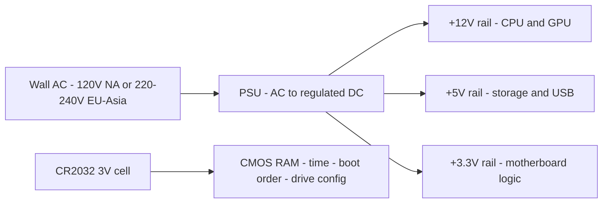

<Concepts items={["form factor", "ATX", "Micro-ATX", "Mini-ITX", "standoffs", "jumper", "DIP switch", "BIOS", "UEFI", "POST", "bootstrap loader", "CMOS", "CR2032", "PSU", "volts", "amps", "watts", "AC", "DC"]} />

<LessonIntro>

A machine shows a CMOS checksum error and forgets the time on every cold boot, another refuses to boot from a 4 TB drive, and a third smells of burnt plastic after an international move. Three tickets, three layers of the same board: firmware settings and their battery, firmware generation and its partition limit, and mains power versus the DC rails silicon expects. This lesson walks the motherboard from mounting holes to boot handoff to power conversion.

</LessonIntro>

A motherboard's form factor fixes its dimensions, mounting holes, and expansion capacity. Firmware on its ROM chip initializes hardware and hands control to the OS. A coin-cell battery preserves firmware settings when the wall power is gone. And the power supply converts wall AC into regulated DC rails. Each layer fails in a characteristic way.

*Figure — Desktop motherboard showing the socket, slots, and rear I/O cluster. Image: Wikimedia Commons (CC BY-SA 4.0).*

## Concept Breakdown: What It Is & How It Works

<ConceptCard name="Form Factors and Standoffs" category="Motherboard">

**What it is.** The size standard governing board dimensions, hole placement, and slot count — plus the brass spacers that mount the board safely.

**How it works.** ATX suits full towers and workstations with the most slots and RAM channels; Micro-ATX trades slots for compact office builds; Mini-ITX and smaller trade almost everything for cubes, home-theater PCs, and IoT appliances. Standoffs screw into the chassis first and lift the PCB off bare metal — without them, solder joints short against the steel frame on first power-on.

</ConceptCard>

<ConceptCard name="Jumpers and DIP Switches" category="Motherboard">

**What it is.** Legacy hardware configuration: jumper pins with conductive caps that short a pair to change a setting, and banks of tiny Dual In-line Package slide switches flipped with a pen or tweezers.

**How it works.** A jumper cap completing the clear-CMOS pair resets BIOS settings and passwords to defaults; DIP banks once set bus speeds and voltages. Both are obsolete for routine configuration on modern automated boards but remain the recovery path when firmware is unreachably misconfigured.

</ConceptCard>

<ConceptCard name="BIOS and UEFI Firmware" category="Firmware">

**What it is.** Low-level firmware on a non-volatile ROM chip that initializes hardware and hands control to the operating system — Legacy BIOS in 16-bit mode, modern UEFI in 32-bit or 64-bit native mode.

**How it works.** Firmware runs before any OS driver exists, configures controllers, then loads the OS kernel from the boot device. UEFI adds a graphical mouse-driven interface, GPT support for drives far beyond BIOS limits, and Secure Boot, which cryptographically verifies OS loaders against rootkits. BIOS manages only basic password protection and MBR booting.

</ConceptCard>

<ConceptCard name="Firmware Startup Functions" category="Boot">

**What it is.** The four jobs firmware performs on every boot: POST, bootstrap loading, pre-OS hardware services, and the setup utility.

**How it works.** Power-On Self-Test checks CPU, RAM, GPU, and controllers and reports failures through beep codes or diagnostic Q-LEDs. The bootstrap loader follows boot priority to the EFI partition or Master Boot Record and loads the kernel into RAM. Built-in services let the CPU use keyboard, display, and storage before OS drivers load. The CMOS Setup Utility (F2, F10, or DEL) exposes clocks, fan curves, boot order, and TPM settings.

</ConceptCard>

<ConceptCard name="CMOS RAM and Battery" category="Firmware Memory">

**What it is.** A low-power volatile chip holding BIOS/UEFI settings — time, boot order, drive configuration — kept alive by a 3V CR2032 lithium coin cell.

**How it works.** The battery powers CMOS RAM while the machine is unplugged. A dying cell loses settings on every cold boot: the clock falls back to a default such as Jan 1, 1970 with CMOS Checksum Error warnings. Replacing the coin cell, not reinstalling the OS, is the fix.

</ConceptCard>

<ConceptCard name="PSU: Volts, Amps, and Watts" category="Power">

**What it is.** The Power Supply Unit converting wall Alternating Current into regulated Direct Current rails — +12V for CPU and GPU, +5V for storage and USB, +3.3V for motherboard logic.

**How it works.** Voltage is electrical pressure (120V in North America, 220–240V in Europe and Asia). Current in amperes is the volume of charge flow. Power in watts is the rate of energy use: Watts = Volts × Amps. An undersized PSU sags under GPU and CPU load even when idle voltages look correct.

</ConceptCard>

*Figure — ATX power supply unit. It converts wall AC into regulated +12V, +5V, and +3.3V DC rails. Image: Wikimedia Commons.*

| Form Factor | Typical Dimensions | Expansion Capability | Target System |
|---|---|---|---|
| **ATX (Advanced Technology Extended)** | 12 × 9.6 inches (305 × 244 mm) | Up to 7 PCIe expansion slots, 4-8 RAM slots | Full-sized desktop towers, high-end workstations, gaming PCs. |
| **Micro-ATX (mATX)** | 9.6 × 9.6 inches (244 × 244 mm) | Up to 4 PCIe expansion slots, 2-4 RAM slots | Compact office desktops and budget tower builds. |
| **ITX (Mini-ITX / Nano / Pico)** | 6.7 × 6.7 inches (170 × 170 mm) | 1 PCIe slot, 2 RAM slots | Small Form Factor (SFF) cubes, home theater PCs (HTPC), IoT appliances. |

| Feature | Legacy BIOS | Modern UEFI |
|---|---|---|
| **Architecture** | 16-bit processor mode | 32-bit or 64-bit native mode |
| **Interface** | Text-only, keyboard-only blue screen | Graphical User Interface (GUI) with mouse support |
| **Boot Drive Capacity** | Max 2.2 TB (MBR partition scheme) | Up to 9.4 ZB (GPT partition scheme) |
| **Security** | Basic password protection | **Secure Boot** (cryptographically verifies OS loaders against rootkits) |

## Boot and power flows

*Figure 1 — BIOS versus UEFI boot flow. Power stabilizes, firmware self-tests, failures surface as beeps or Q-LEDs, then the bootstrap loader hands the kernel control.*

*Figure 2 — Motherboard power flow. The PSU converts mains AC to three DC rails while the coin cell independently retains firmware settings.*

## Step-by-step breakdown

1. **Mount safely.** Install standoffs in the chassis before the board; verify every mounting hole is supported and no extra standoff shorts the PCB underside.
2. **Recover with jumpers when locked out.** If firmware settings or passwords block boot, use the clear-CMOS jumper to restore defaults rather than replacing the board.
3. **Identify the firmware generation.** On boot-capacity or Secure Boot tickets, confirm BIOS with MBR (2.2 TB ceiling) versus UEFI with GPT (up to 9.4 ZB).
4. **Read POST before reinstalling.** Beeps and Q-LEDs name the failing stage — CPU, RAM, GPU, or controller — and precede any OS troubleshooting.
5. **Size and verify power.** Confirm PSU wattage (Volts × Amps) against CPU plus GPU load and confirm the mains voltage selector or auto-ranging before blaming components for load-dependent reboots.

<LessonNote variant="myth" title="PSU and voltage safety — read before plugging in">

**Myth:** "A plug adapter makes any PC safe on any country's mains."

**Truth:** Adapters change shape, not voltage. A 120V-only device forced onto 220V takes double pressure, draws excessive current, and can fry capacitors with smoke and fire risk. A 220V device on 120V merely runs underpowered or fails to start — no less a fault, but a different one. Confirm the PSU's input rating and range switch before first power-on after any international move, and never bypass that check with a passive adapter.

</LessonNote>

## Voltage mismatch outcomes

- **120V appliance in a 220V outlet — catastrophic burnout.** Double pressure forces excessive current through underrated circuits: overheating, fried capacitors, smoke, and fire hazard.
- **220V appliance in a 120V outlet — underpowered operation.** Inadequate current means the device fails to start or runs at reduced power without immediate physical destruction.

## Ticket symptoms to likely cause

- **Ticket: Clock resets to 1970 plus checksum error every cold boot.** Likely cause: dead CR2032 with volatile CMOS RAM losing settings. Replace the coin cell and reconfigure boot order.
- **Ticket: 4 TB drive visible in UEFI but unbootable under legacy settings.** Likely cause: BIOS with MBR capped at 2.2 TB. Switch to UEFI with GPT and reinstall the loader accordingly.
- **Ticket: Reboots only in games after a GPU upgrade.** Likely cause: PSU +12V rail undersized for combined CPU and GPU draw. Recalculate Watts = Volts × Amps for the new load.

## Examples

- **Obvious —** Forgetting standoffs produces shorts on first boot. The board worked on the bench and fails in the case — the chassis, not the silicon, is the new variable.
- **Counter-intuitive —** A machine that keeps time while plugged in but forgets it unplugged has a healthy OS and a dead battery. Mains power masks the CR2032 failure until the cord is pulled.
- **Edge case —** Secure Boot blocks a legitimate rescue USB. The firmware is correctly rejecting an unsigned loader — security working as designed looks identical to a broken boot device until the signature is checked.

<AnalogyCard name="A Building Manager's Office">

**The concept.** Form factor sets floor space, firmware is the opening checklist and key handoff, CMOS is the sticky-note settings wall, and the PSU is the building transformer.

**The analogy.** Standoffs are the insulation pads keeping wiring off bare concrete, POST is the morning walk-through that flags a burst pipe before tenants arrive, CMOS notes survive the night only if the backup battery holds, and plugging a 120V appliance into 220V is opening a high-pressure main into pipes rated for half the load.

</AnalogyCard>

<LessonNote variant="myth" title="What people get wrong about BIOS and CMOS">

**Myth:** "BIOS settings are stored in the same flash as the firmware, so a dead battery only affects the clock."

**Truth:** Firmware code lives in non-volatile ROM/Flash, but its settings live in volatile CMOS RAM. A dead CR2032 loses boot order, drive modes, fan curves, and TPM state alongside the time — which is why a battery fault can change which drive boots.

</LessonNote>

<LessonNote variant="why">

Board, firmware, and power form the triangle every hardware ticket stands inside. If POST passes, the loader finds the kernel, settings persist unplugged, and rails hold under load, the fault almost certainly lies above this layer.

</LessonNote>

This connects to peripherals and displays because once the board boots and power holds, the next faults appear at the ports — USB, video, network — and in mobile power systems.

<QuickRecall title="Quick Recall — Boards, Firmware, Power">

1. How do ATX, Micro-ATX, and ITX differ, and what do standoffs prevent?
2. How do BIOS and UEFI differ across architecture, interface, capacity, and security?
3. What are the four firmware functions, and what does a dead CMOS battery cause?

Reveal answers

1) ATX 12×9.6 in with up to 7 PCIe and 4–8 RAM slots for towers; mATX 9.6×9.6 with up to 4 PCIe and 2–4 RAM for compact desktops; ITX 6.7×6.7 with 1 PCIe and 2 RAM for SFF and HTPC. Standoffs prevent shorts to the chassis. 2) 16-bit text MBR 2.2 TB with passwords versus 32/64-bit GUI GPT 9.4 ZB with Secure Boot. 3) POST, bootstrap loader, hardware services, CMOS setup; dead CR2032 resets clock to 1970 with checksum errors and lost boot settings.

</QuickRecall>

