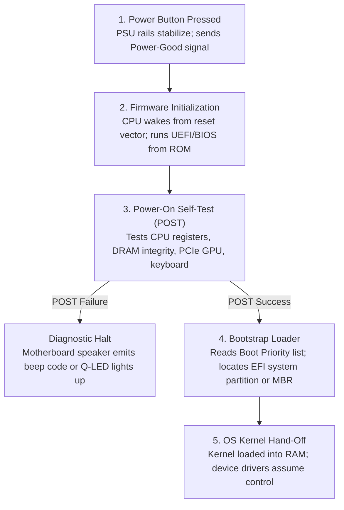
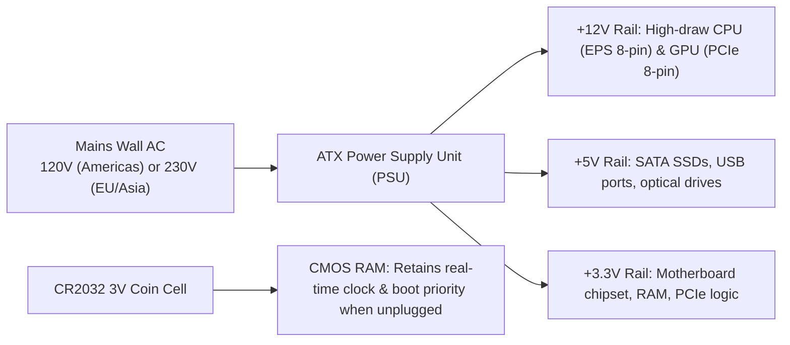

<Concepts items={["form factor", "ATX", "Micro-ATX", "Mini-ITX", "standoffs", "jumper", "DIP switch", "BIOS", "UEFI", "POST", "bootstrap loader", "CMOS", "CR2032", "PSU", "volts", "amps", "watts", "AC", "DC"]} />

<LessonIntro>

A machine shows a CMOS checksum error and forgets the time on every cold boot, another refuses to boot from a 4 TB drive, and a third smells of burnt plastic after an international corporate relocation. 

Three tickets, three layers of the same board: firmware settings and their battery, firmware generation and its disk partition limit, and mains wall power versus the regulated DC rails silicon components expect. This lesson walks the motherboard from physical standoff mounting to boot handoff to power conversion.

</LessonIntro>

## Why this matters

The motherboard, firmware, and power supply constitute the physical foundation that hosts all operating systems and software:

* **Standoff Short-Circuits:** Installing a motherboard directly against a metal case chassis without brass standoffs shorts solder joints on first power-on, instantly destroying the board and triggering PSU over-current protection.
* **The CMOS Battery Failure Pattern:** When a cold-booted desktop loses its system clock, reverts to Jan 1, 1970, and prompts with `CMOS Checksum Bad`, replacing a \$2 CR2032 coin-cell battery solves the ticket in 60 seconds without operating system reinstalls.
* **The 2.2 TB Boot Barrier:** Legacy BIOS using Master Boot Record (MBR) partition tables cannot boot from storage drives larger than $2.2\text{ TB}$. Modern drives require UEFI paired with GUID Partition Tables (GPT) to access capacities up to $9.4\text{ ZB}$.
* **Catastrophic Voltage Inversion:** Connecting a 120V North American workstation to a 230V European outlet without verifying an auto-ranging or switched PSU explodes filtering capacitors, creating fire hazards and destroying the computer.

*Figure 10.1 — Desktop motherboard showing socket, memory channels, PCIe slots, and rear I/O cluster. Image: Wikimedia Commons (CC BY-SA 4.0).*

---

## 01 — Motherboard Form Factors & Physical Mounting

Motherboard form factors establish the physical dimensions, mounting hole patterns, and expansion capacities of computer enclosures:

<ConceptCard name="Form Factors and Standoffs" category="Motherboard">

**What it is.** The size standard governing board dimensions, hole placement, and slot count — plus the brass spacers that mount the board safely.

**How it works.** ATX suits full towers and workstations with the most slots and RAM channels; Micro-ATX trades slots for compact office builds; Mini-ITX and smaller trade almost everything for cubes, home-theater PCs, and IoT appliances. Standoffs screw into the chassis first and lift the PCB off bare metal — without them, solder joints short against the steel frame on first power-on.

</ConceptCard>

<ConceptCard name="Jumpers and DIP Switches" category="Motherboard">

**What it is.** Legacy hardware configuration: jumper pins with conductive caps that short a pair to change a setting, and banks of tiny Dual In-line Package slide switches flipped with a pen or tweezers.

**How it works.** A jumper cap completing the clear-CMOS pair resets BIOS settings and passwords to defaults; DIP banks once set bus speeds and voltages. Both are obsolete for routine configuration on modern automated boards but remain the recovery path when firmware is unreachably misconfigured.

</ConceptCard>

### Form Factor Comparison Table

| Form Factor | Physical Dimensions | Expansion Slots | RAM Slots | Primary System Target |
| :--- | :--- | :--- | :--- | :--- |
| **ATX (Full-Size)** | $12 \times 9.6\text{ in}$ ($305 \times 244\text{ mm}$) | Up to 7 PCIe slots | 4 to 8 DIMMs | High-end workstations, enterprise towers, servers. |
| **Micro-ATX (mATX)** | $9.6 \times 9.6\text{ in}$ ($244 \times 244\text{ mm}$) | Up to 4 PCIe slots | 2 to 4 DIMMs | Mainstream corporate office desktops, compact towers. |
| **Mini-ITX (SFF)** | $6.7 \times 6.7\text{ in}$ ($170 \times 170\text{ mm}$) | Exactly 1 PCIe slot | 2 SO-DIMM / DIMMs | Small Form Factor cubes, thin clients, POS kiosks, IoT. |

> [!CAUTION] Never Forget Motherboard Standoffs
> Always verify that brass standoffs match the motherboard's mounting holes exactly. An extra standoff left installed beneath a motherboard where no screw hole exists will press directly against PCB traces and create an instant short-circuit.

---

## 02 — Firmware Evolution: Legacy BIOS vs Modern UEFI

Before the operating system kernel can execute a single instruction, motherboard firmware must initialize hardware components.

<ConceptCard name="BIOS and UEFI Firmware" category="Firmware">

**What it is.** Low-level firmware on a non-volatile ROM chip that initializes hardware and hands control to the operating system — Legacy BIOS in 16-bit mode, modern UEFI in 32-bit or 64-bit native mode.

**How it works.** Firmware runs before any OS driver exists, configures controllers, then loads the OS kernel from the boot device. UEFI adds a graphical mouse-driven interface, GPT support for drives far beyond BIOS limits, and Secure Boot, which cryptographically verifies OS loaders against rootkits. BIOS manages only basic password protection and MBR booting.

</ConceptCard>

### BIOS vs UEFI Specification Comparison

| Architectural Feature | Legacy BIOS | Modern UEFI (Unified Extensible Firmware Interface) |
| :--- | :--- | :--- |
| **Processor Execution Mode** | 16-bit Real Mode ($1\text{ MB}$ address limit) | 32-bit or 64-bit Native Protected Mode |
| **User Interface** | Text-only, keyboard-only blue terminal screens | High-resolution Graphical UI (GUI) with full mouse support |
| **Boot Drive Partition Scheme** | Master Boot Record (MBR) | GUID Partition Table (GPT) |
| **Maximum Boot Drive Capacity** | Capped at **$2.2\text{ TB}$** | Supports up to **$9.4\text{ ZB}$** ($9.4\text{ billion TB}$) |
| **Cryptographic Protection** | Simple BIOS supervisor password | **Secure Boot** (validates digital certificates of OS bootloaders) |

---

## 03 — The Boot Sequence: POST, Bootstrap Loader & CMOS RAM

Every time a computer boots, the firmware executes an automated hardware verification routine:

<ConceptCard name="Firmware Startup Functions" category="Boot">

**What it is.** The four jobs firmware performs on every boot: POST, bootstrap loading, pre-OS hardware services, and the setup utility.

**How it works.** Power-On Self-Test checks CPU, RAM, GPU, and controllers and reports failures through beep codes or diagnostic Q-LEDs. The bootstrap loader follows boot priority to the EFI partition or Master Boot Record and loads the kernel into RAM. Built-in services let the CPU use keyboard, display, and storage before OS drivers load. The CMOS Setup Utility (F2, F10, or DEL) exposes clocks, fan curves, boot order, and TPM settings.

</ConceptCard>

<ConceptCard name="CMOS RAM and Battery" category="Firmware Memory">

**What it is.** A low-power volatile chip holding BIOS/UEFI settings — time, boot order, drive configuration — kept alive by a 3V CR2032 lithium coin cell.

**How it works.** The battery powers CMOS RAM while the machine is unplugged. A dying cell loses settings on every cold boot: the clock falls back to a default such as Jan 1, 1970 with CMOS Checksum Error warnings. Replacing the coin cell, not reinstalling the OS, is the fix.

</ConceptCard>

*Figure 10.2 — The complete hardware boot execution flow from power button to OS kernel.*

---

## 04 — Power Supply Units (PSU): Voltage Rails & Electrical Safety

The Power Supply Unit converts dangerous high-voltage Alternating Current (AC) from the electrical grid into precise, ripple-free Direct Current (DC) rails:

<ConceptCard name="PSU: Volts, Amps, and Watts" category="Power">

**What it is.** The Power Supply Unit converting wall Alternating Current into regulated Direct Current rails — +12V for CPU and GPU, +5V for storage and USB, +3.3V for motherboard logic.

**How it works.** Voltage is electrical pressure (120V in North America, 220–240V in Europe and Asia). Current in amperes is the volume of charge flow. Power in watts is the rate of energy use: Watts = Volts × Amps. An undersized PSU sags under GPU and CPU load even when idle voltages look correct.

</ConceptCard>

*Figure 10.3 — ATX power supply unit. It converts high-voltage AC into regulated +12V, +5V, and +3.3V DC rails. Image: Wikimedia Commons.*

*Figure 10.4 — Voltage rails and power distribution across motherboard subsystems.*

<LessonNote variant="myth" title="PSU and voltage safety — read before plugging in">

**Myth:** "A plug adapter makes any PC safe on any country's mains."

**Truth:** Adapters change shape, not voltage. A 120V-only device forced onto 220V takes double pressure, draws excessive current, and can fry capacitors with smoke and fire risk. A 220V device on 120V merely runs underpowered or fails to start — no less a fault, but a different one. Confirm the PSU's input rating and range switch before first power-on after any international move, and never bypass that check with a passive adapter.

</LessonNote>

### Voltage Mismatch Failure Modes

* **120V Appliance into a 230V Outlet (Catastrophic Burnout):** Double electrical pressure forces massive over-current through input rectifiers and capacitors, blowing fuses, melting transformer coils, and creating an immediate fire hazard.
* **230V Appliance into a 120V Outlet (Underpowered Brownout):** Insufficient electrical pressure prevents switching transformers from stabilizing voltage rails. The machine fails to turn on or experiences continuous restart loops without explosive physical damage.

---

## 05 — Triage Workflows & Common Motherboard Tickets

### Motherboard & Power Triage Matrix

| Ticket Symptom | Root Cause Subsystem | Support Resolution Action |
| :--- | :--- | :--- |
| **Machine loses system date/time and boot priority on every cold boot.** | Dying CR2032 3V lithium coin-cell battery. | Replace CR2032 battery; enter UEFI Setup to configure clock and boot priority. |
| **New 4 TB secondary drive is only recognized up to 2.2 TB.** | Drive partitioned using legacy MBR table under Legacy BIOS. | Convert drive partition scheme to GPT using Windows `mbr2gpt` or Disk Management. |
| **Workstation abruptly shuts down during 3D rendering or gaming.** | Undersized PSU or sagging $+12\text{V}$ rail under combined CPU + GPU load. | Calculate total component TDP. Replace PSU with a higher-wattage unit rated $80\text{ Plus Gold}$. |

### Practical Diagnostic Scenarios

* **Obvious — The Missing Standoff Ground Short:** A newly built PC powers on for half a second, fans twitch, and it shuts off instantly. The technician forgot to install brass standoffs, causing the solder pins on the rear of the motherboard to short directly against the metal case plate. Removing the board and inserting standoffs restores operation.
* **Counter-intuitive — Masked Battery Failures:** A desktop keeps accurate time and boot configuration for six months in the office. The moment it is unplugged and moved to another desk, it reverts to 1970. The continuous wall power was keeping CMOS RAM alive, masking the completely dead CR2032 battery until the power cable was disconnected.
* **Edge case — Secure Boot Blocking Enterprise Rescue USBs:** A technician boots an emergency Linux diagnostics USB flash drive, but the motherboard reports `Secure Boot Violation: Invalid Signature Detected`. The rescue utility is completely healthy, but unsigned by Microsoft's CA. Disabling Secure Boot temporarily in UEFI Setup permits booting into the recovery environment.

<AnalogyCard name="A Building Manager's Office">

**The concept.** Form factor sets floor space, firmware is the opening checklist and key handoff, CMOS is the sticky-note settings wall, and the PSU is the building transformer.

**The analogy.** Standoffs are the insulation pads keeping wiring off bare concrete, POST is the morning walk-through that flags a burst pipe before tenants arrive, CMOS notes survive the night only if the backup battery holds, and plugging a 120V appliance into 220V is opening a high-pressure main into pipes rated for half the load.

</AnalogyCard>

<LessonNote variant="myth" title="What people get wrong about BIOS and CMOS">

**Myth:** "BIOS settings are stored in the same flash as the firmware, so a dead battery only affects the clock."

**Truth:** Firmware code lives in non-volatile ROM/Flash, but its settings live in volatile CMOS RAM. A dead CR2032 loses boot order, drive modes, fan curves, and TPM state alongside the time — which is why a battery fault can change which drive boots.

</LessonNote>

<LessonNote variant="why">

Board, firmware, and power form the triangle every hardware ticket stands inside. If POST passes, the loader finds the kernel, settings persist unplugged, and rails hold under load, the fault almost certainly lies above this layer.

</LessonNote>

---

## Summary Checklist: Motherboards, Firmware & Power Mental Model

1. **Form factors dictate mechanical layout:** ATX provides maximum expansion; Micro-ATX is compact; Mini-ITX targets Small Form Factor builds. Always use brass standoffs.
2. **UEFI replaces 16-bit BIOS:** UEFI supports mouse GUIs, drives larger than 2.2 TB via GPT, and cryptographically verified Secure Boot.
3. **POST validates hardware before software loads:** Hardware failures during Power-On Self-Test halt boot and broadcast beep codes or Q-LED indicators.
4. **CMOS RAM requires battery power:** A CR2032 3V coin cell keeps volatile clock and boot configuration alive when wall AC power is disconnected.
5. **PSUs convert AC to three regulated DC rails:** $+12\text{V}$ powers CPUs and GPUs; $+5\text{V}$ powers storage and USB; $+3.3\text{V}$ powers motherboard logic. Never use passive plug adapters across differing mains voltages.

---

<QuickRecall title="Quick Recall — Boards, Firmware, Power">

1. How do ATX, Micro-ATX, and ITX differ, and what do standoffs prevent?
2. How do BIOS and UEFI differ across architecture, interface, capacity, and security?
3. What are the four firmware functions, and what does a dead CMOS battery cause?

Reveal answers

1. ATX 12×9.6 in with up to 7 PCIe and 4–8 RAM slots for towers; mATX 9.6×9.6 with up to 4 PCIe and 2–4 RAM for compact desktops; ITX 6.7×6.7 with 1 PCIe and 2 RAM for SFF and HTPC. Standoffs prevent shorts to the chassis.
2. 16-bit text MBR 2.2 TB with passwords versus 32/64-bit GUI GPT 9.4 ZB with Secure Boot.
3. POST, bootstrap loader, hardware services, CMOS setup; dead CR2032 resets clock to 1970 with checksum errors and lost boot settings.

</QuickRecall>

This connects to peripherals and displays because once the board boots and power holds, the next faults appear at the ports — USB, video, network — and in mobile power systems.
