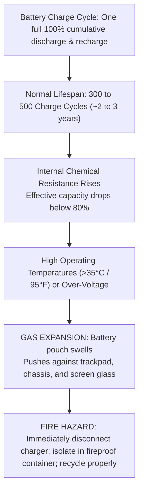

<Concepts items={["USB", "USB-C", "Thunderbolt", "RJ-45", "RJ-11", "HDMI", "DisplayPort", "DVI", "VGA", "projector", "SoC", "battery cycle", "IPS", "TN", "VA", "OLED", "Micro-LED", "refresh rate", "BYOD", "RMA"]} />

<LessonIntro>

A conference-room projector shows a cropped blurry image five minutes before an executive meeting, a user's external SSD crawls on a new laptop, and a smartphone with a swollen back cover sits on the IT support desk. 

Each ticket is a different edge of the same physical boundary: the cables and ports outside the case, the display technology behind the glass, and the power and integration constraints inside mobile devices. This lesson maps USB through Thunderbolt, network and legacy cabling, display interfaces and panel physics, System on a Chip (SoC) design, battery health cycles, and the BYOD and RMA procedures that govern enterprise hardware lifecycles.

</LessonIntro>

## Why this matters

The physical peripherals, display monitors, and mobile endpoints are the tangible surface where end users interact with enterprise technology:

* **Meeting Room Outages:** High-stakes conference room failures almost always stem from resolution mismatches between laptop graphics cards and projector scalers, or uncorrected keystone distortion.
* **The USB-C Protocol Mirage:** USB-C specifies only the physical shape of the connector. Plugs that look identical can support anything from slow USB 2.0 ($480\text{ Mbps}$) with 5W charging to dual-display 40 Gbps Thunderbolt 4 with 100W Power Delivery. Swapping the wrong cable throttles external NVMe drives and video docks.
* **Swollen Battery Safety Hazards:** When a laptop trackpad becomes difficult to click or a smartphone screen separates from its aluminum frame, the lithium-ion battery has suffered gas expansion from thermal degradation. Handling it requires immediate decommissioning and hazardous waste isolation.
* **Data Leakage during RMA Returns:** Returning a defective laptop or drive to an OEM vendor for warranty replacement without a certified cryptographic wipe violates GDPR and HIPAA compliance, exposing corporate credentials and confidential records.

*Figure 11.1 — USB Type-C adapter. One reversible physical port carries USB data, video output, and Power Delivery. Image: Wikimedia Commons (CC0).*

---

## 01 — Peripheral Bus Standards: From USB 2.0 to Thunderbolt 4

The Universal Serial Bus (USB) ecosystem connects peripherals through standardized physical ports with continually increasing bandwidth and power capabilities:

<ConceptCard name="USB Standards and Connectors" category="Peripheral Bus">

**What it is.** The Universal Serial Bus family connecting keyboards, drives, cameras, and chargers through shared port shapes with rising bandwidth and power delivery.

**How it works.** Each generation raises the ceiling while keeping lower devices working: higher signaling rates, better encoding, and — in USB-C, USB4, and Thunderbolt — a reversible port carrying data, display streams, and up to 100W–240W of USB Power Delivery over one cable. Thunderbolt 3 and 4 reuse the USB-C port to tunnel PCIe plus dual 4K/8K video at 40 Gbps.

</ConceptCard>

### USB & High-Speed Peripheral Matrix

| Standard / Connector | Maximum Bandwidth | Physical Port Cues | Primary Enterprise Use Cases |
| :--- | :--- | :--- | :--- |
| **USB 2.0 (High-Speed)** | $480\text{ Mbps}$ | Black or white Type-A plastic insert | Keyboards, mice, barcode scanners, basic receipt printers. |
| **USB 3.0 / 3.1 Gen 1 (SuperSpeed)** | $5\text{ Gbps}$ | **Blue plastic insert** in Type-A port | External hard drives, HD webcams, flash thumb drives. |
| **USB 3.1 Gen 2 (SuperSpeed+)** | $10\text{ Gbps}$ | Red or teal plastic insert | High-speed external SATA/NVMe SSD enclosures, 4K webcams. |
| **USB-C (USB 3.2 Gen 2x2)** | Up to $20\text{ Gbps}$ | Symmetrical, reversible oval connector | High-speed mobile devices, up to 100W–240W Power Delivery (USB-PD). |
| **USB4 / Thunderbolt 3 & 4** | **$40\text{ Gbps}$** | USB-C port marked with lightning bolt | Tunnels PCIe lanes, dual 4K / 8K monitors, enterprise docking stations. |
| **Micro-USB / Lightning** | $480\text{ Mbps}$ | Micro-B trapezoid / Apple 8-pin | Legacy smartphones, older wireless accessories. |

*Figure 11.2 — Peripheral connection link negotiation path.*

---

## 02 — Cabling Standards: Network, Audio, Video & Telecom

Technicians must identify copper, optical, and legacy serial connectors deployed in server rooms and user desks:

<ConceptCard name="Network, Power, and Legacy Connectors" category="Cabling">

**What it is.** The remaining copper, coaxial, optical, and board-level connectors a technician still meets: twisted-pair Ethernet and telephone, legacy drive power and serial, broadband coax and fiber, and telecom termination blocks.

**How it works.** RJ-45 (8-pin) terminates Cat5e/Cat6 for LAN and DSL modems; RJ-11 (4/6-pin) terminates telephone for POTS and dial-up. Molex 4-pin delivers +12V and +5V to legacy IDE drives and optical bays; DB89/serial D-sub served early mice, joysticks, and consoles. F-Type coax screws onto cable modems and TV plant; fiber LC/SC/ST carries light over glass for long high-bandwidth runs. 110/66 punch-down blocks terminate copper pairs in closets onto organized patch panels.

</ConceptCard>

* **RJ-45 (8P8C):** 8-conductor twisted-pair Ethernet connector terminating Cat5e ($1\text{ Gbps}$), Cat6 ($1\text{--}10\text{ Gbps}$), and Cat6a ($10\text{ Gbps}$) infrastructure cables.
* **RJ-11 (6P2C/6P4C):** 4- to 6-conductor telephone modular connector used for legacy Plain Old Telephone Service (POTS) and DSL modem uplinks.
* **F-Type Coaxial:** Threaded connector terminating RG-6 coaxial cables for cable modems, DOCSIS uplinks, and digital video distribution.
* **Optical Fiber Connectors (LC, SC, ST):** Carries pulses of laser or LED light over silica glass cores for long-distance, high-bandwidth campus backbones and SAN links.
* **110 & 66 Punch-Down Blocks:** IDC (Insulation Displacement Connector) blocks in wiring closets used to terminate horizontal twisted-pair cables into enterprise patch panels.
* **Molex 4-Pin:** Classic white nylon power connector supplying $+12\text{V}$ and $+5\text{V}$ DC power to older IDE drives, fans, and optical drives.

---

## 03 — Display Interfaces & Meeting-Room Projector Triage

Video links connect graphics cards to desktop monitors, digital displays, and meeting room projection systems:

<ConceptCard name="Display Interfaces and Projectors" category="Display I/O">

**What it is.** The video links from PC to panel or projector — HDMI, DisplayPort, DVI, and VGA — plus the three projector faults that dominate meeting-room tickets.

**How it works.** HDMI carries digital video with multi-channel audio in Standard, Mini, and Micro forms as the consumer default. DisplayPort carries digital video with high-definition audio and daisy-chains monitors on business and GPU outputs. DVI carries video only (DVI-D digital, DVI-A analog) and needs a separate 3.5mm path for sound. VGA carries analog video over a 15-pin D-sub, degrading into noise and ghosting on long runs. Projector faults repeat: native-resolution mismatch blurs or crops until the OS matches the projector (for example 1920×1080), projection angle trapezoids the image until keystone correction compensates, and clogged filters overheat halogen lamps into thermal shutdown — where cool LED and laser engines run more tolerantly.

</ConceptCard>

### Display Interface Comparison

| Interface Port | Signal Encoding | Audio Support | Maximum Capabilities |
| :--- | :--- | :--- | :--- |
| **HDMI (High-Definition Multimedia Interface)** | Digital | **Yes** (Multi-channel uncompressed) | Consumer standard (Standard, Mini, Micro). HDMI 2.1 supports $4\text{K}@120\text{Hz}$ and $8\text{K}@60\text{Hz}$. |
| **DisplayPort (DP)** | Digital (Packetized) | **Yes** (High-definition) | Enterprise PC standard. Supports **Multi-Stream Transport (MST)** for daisy-chaining multiple monitors. |
| **DVI (Digital Visual Interface)** | Digital (DVI-D) / Analog (DVI-I) | **No** (Video only; needs separate 3.5mm cable) | Dual-link supports $2560 \times 1600$; common on older office LCD monitors. |
| **VGA (Video Graphics Array)** | Analog (15-pin D-Sub) | **No** (Video only) | Legacy standard. Highly susceptible to electromagnetic interference, ghosting, and line noise. |

### The Three Conference Room Projector Fixes

When called to an emergency meeting room projector ticket, follow this exact sequence:

1. **Resolution Mismatch (Blurry / Fuzzy Display):** If the projector uses a native $1920 \times 1080$ DLP grid but the user's laptop outputs $2560 \times 1600$, the internal projector scaler interpolates pixels, blurring small spreadsheet text. Force the OS display settings to match the projector's native resolution.
2. **Keystone Distortion (Trapezoidal Image):** When the projector is angled upward or downward relative to the projection screen, the image appears wider at the top or bottom. Adjust the physical projector tilt and apply digital **keystone correction** in the projector on-screen menu.
3. **Thermal Filter Shutdown (Sudden Lamp Power-Off):** Traditional halogen lamp projectors run extremely hot ($200\text{--}300^\circ\text{C}$). If internal intake dust filters are clogged, thermal sensors trigger an emergency shutdown to prevent lamp explosions. Clean or replace dust filters and allow the cooldown fan cycle to complete.

---

## 04 — Display Panel Technologies & Refresh Rates

Modern flat panels differ fundamentally based on whether pixels generate their own illumination or filter an external backlight:

<ConceptCard name="Display Panel Technologies" category="Display Physics">

**What it is.** Six panel families split by whether pixels generate their own light (emissive) or modulate a backlight (passive).

**How it works.** Passive IPS, TN, and VA LCDs filter LED backlights with different liquid-crystal alignments for color, speed, or contrast. Emissive OLED/AMOLED pixels emit their own light for true 0-nit blacks and foldable thinness at the cost of burn-in and blue aging. Mini-LED stays passive but densifies the backlight into thousands of zones for extreme brightness without burn-in. Micro-LED goes emissive with inorganic diodes for blacks plus brightness and lifespan at extreme manufacturing cost.

</ConceptCard>

### Panel Technology Matrix

| Technology | Light Emission | Key Strengths | Known Limitations | Target IT Use Case |
| :--- | :--- | :--- | :--- | :--- |
| **IPS LCD (In-Plane Switching)** | Passive (LED Backlight) | Accurate color reproduction, wide $178^\circ$ viewing angles. | Slower response times than TN; mild "IPS glow" at angles. | Graphic design, photo/video editing, medical imaging. |
| **TN LCD (Twisted Nematic)** | Passive (LED Backlight) | Ultra-fast response times ($1\text{ ms}$), low cost, high refresh. | Poor contrast, narrow viewing angles, color shifts. | Fast-paced esports gaming, budget high-refresh stations. |
| **VA LCD (Vertical Alignment)** | Passive (LED Backlight) | High native contrast ($3000:1+$), deep dark tones. | Ghosting in fast motion; narrower viewing angles than IPS. | General office work, media consumption, data dashboards. |
| **OLED / AMOLED** | **Active / Emissive** (Organic) | Individual self-lit pixels, **pure 0-nit blacks**, ultra-thin. | Risk of static **burn-in**, organic degradation, higher cost. | High-end laptops, smartphones, HDR mastering. |
| **Mini-LED (mLED)** | Passive (Thousands of LEDs) | Extreme peak brightness ($>1600\text{ nits}$), granular local dimming. | Thicker than OLED; higher cost than standard LCDs. | Premium mobile workstations, outdoor displays. |
| **Micro-LED ($\mu$LED)** | **Active / Emissive** (Inorganic) | Self-lit inorganic pixels, true blacks, high brightness, no burn-in. | Extremely complex to fabricate; currently enterprise-only cost. | Next-generation video walls and futuristic flagships. |

> [!NOTE] Refresh Rate vs Response Time
> **Refresh rate (Hz)** indicates how many times per second the display draws a new frame ($60\text{ Hz}, 120\text{ Hz}, 144\text{ Hz}$). **Response time (ms)** measures how quickly an individual pixel can transition from grey-to-grey. A high refresh rate reduces visual eye strain and creates fluid mouse cursor motion.

---

## 05 — Mobile Architecture & Battery Lifecycle Management

Smartphones, tablets, and ultrabooks integrate computing hardware into tightly coupled, low-power thermal packages:

<ConceptCard name="System on a Chip (SoC)" category="Mobile Architecture">

**What it is.** The mobile integration strategy replacing separate motherboard, discrete graphics, and DIMM slots with one silicon die.

**How it works.** CPU, GPU, RAM, storage controller, 5G/Wi-Fi/Bluetooth modem, and Neural Processing Unit share one die, cutting power, bus latency, and footprint to fit thermal, volume, and battery budgets in phones, tablets, and watches. The trade is repairability: nothing upgrades independently.

</ConceptCard>

<ConceptCard name="Rechargeable Batteries and Charge Cycles" category="Mobile Power">

**What it is.** Lithium-Ion and Lithium-Polymer cells whose lifespan is counted in full 100-percent cycles under temperature limits.

**How it works.** One cycle is one full discharge plus recharge in any split — 100-to-50 Monday plus recharge plus 50-points Tuesday equals one cycle. Past roughly 300–500 cycles internal resistance rises, shortening runtime and peak charge rate. Heat above about 35°C (95°F) accelerates aging and can swell cells with gas; swollen batteries risk fire and rupture and must be isolated and recycled immediately, never punctured or charged.

</ConceptCard>

*Figure 11.3 — Lithium-ion battery lifecycle, chemical degradation, and emergency swelling hazard.*

---

## 06 — IT Support Policies: BYOD, RMA & Device Sanitization

Managing thousands of distributed mobile and desktop assets requires strict adherence to corporate security and logistics protocols:

<ConceptCard name="IT Policies: BYOD, RMA, and Sanitization" category="Support Process">

**What it is.** The three procedures governing personal devices and defective hardware: Bring Your Own Device, Return Merchandise Authorization, and pre-repair data wiping.

**How it works.** BYOD lets staff use personal phones and laptops under Mobile Device Management with sandboxed corporate data and privacy partitions. RMA is the vendor's tracked warranty path for returning defective units for certified repair or replacement. Before any device ships, the technician performs a full factory reset wiping credentials, mail, and user data — a missed wipe is a breach, not just an oversight.

</ConceptCard>

### Support Diagnostics & Ticket Resolution

| Helpdesk Ticket Symptom | Root Cause Subsystem | Support Resolution Action |
| :--- | :--- | :--- |
| **External SSD runs at only 40 MB/s when plugged into front port.** | Device plugged into black USB 2.0 port ($480\text{ Mbps}$) or using a charge-only cable. | Relocate cable to blue USB 3.0+ port ($5\text{ Gbps}$) and verify SuperSpeed cable rating. |
| **Conference room projector image is blurry and text is unreadable.** | Laptop resolution does not match projector native $1920 \times 1080$ display mode. | Adjust OS display output to native resolution; adjust projector digital keystone. |
| **Laptop trackpad will not click down; bottom casing is bulging.** | **Swollen Lithium-Ion battery:** Gas expansion has deformed the pouch beneath the trackpad. | **Immediate hazard:** Power down, unplug, isolate in fireproof container, and order warranty battery replacement. |

### Practical Support Scenarios

* **Obvious — Bandwidth Headroom is Invisible on Slow Devices:** Plugging a standard USB keyboard into a $40\text{ Gbps}$ Thunderbolt 4 port provides zero speed advantage over an old USB 2.0 port. Low-speed peripherals never saturate basic buses.
* **Counter-intuitive — USB-C Cable Mismatches:** A high-end \$40 USB-C charging cable shipped with a MacBook can bottleneck an external SSD to USB 2.0 ($480\text{ Mbps}$) speeds. USB-C defines the plug geometry, but charging cables often lack high-speed data transmission lanes to maximize copper thickness for power.
* **Edge case — OLED Dashboard Image Retention:** An enterprise operations center installs vibrant OLED monitors to display 24/7 server health dashboards. Within six months, static table headers burn permanently into the subpixels. OLED panels must be avoided for static monitoring dashboards in favor of IPS LCD or Mini-LED displays.

<AnalogyCard name="Roads, Billboards, and a Sealed Engine">

**The concept.** Cables set speed limits, displays render through different light physics, and SoC plus battery seal the mobile computer into one thermal budget.

**The analogy.** USB generations are road classes from lane to highway to express tunnel, display panels are billboards lit from behind versus tiles that glow themselves, and a phone SoC is a sealed race engine where fuel (battery cycles), cooling, and every subsystem share one compartment — fast, compact, and unserviceable part by part.

</AnalogyCard>

<LessonNote variant="myth" title="What people get wrong about cables and displays">

**Myth:** "Any USB-C cable supports full speed and charging, and a higher refresh rate always means a better picture."

**Truth:** USB-C names the plug, not the wire — speed and wattage depend on the cable's rated generation. And refresh rate counts redraws per second, not color accuracy or contrast: a 144Hz TN panel moves fluidly while an IPS or OLED at lower rates reproduces color and blacks more faithfully. Match the spec to the need, not the bigger number.

</LessonNote>

<LessonNote variant="why">

Meeting rooms, desks, and pockets fail at their boundaries — the connector, the native resolution, the cycle count, the wipe before repair. Knowing which boundary each symptom belongs to turns a scattered peripheral backlog into a short checklist.

</LessonNote>

---

## Summary Checklist: Peripherals, Displays & Mobile Mental Model

1. **USB-C is a connector form factor, not a protocol:** Cables and ports range from $480\text{ Mbps}$ USB 2.0 charging leads up to $40\text{ Gbps}$ Thunderbolt 4 cables supporting dual 4K video.
2. **DisplayPort and HDMI carry digital audio; VGA is analog:** DisplayPort supports Multi-Stream Transport (MST) daisy-chaining; VGA suffers analog signal degradation over distance.
3. **Projector triage requires resolution and keystone alignment:** Match the OS output to the projector's native resolution, correct keystone geometry, and maintain clean thermal filters.
4. **IPS delivers color accuracy; OLED delivers true blacks:** Choose IPS for enterprise graphics, TN for response speeds, VA for contrast, and OLED for true blacks (avoiding static burn-in).
5. **SoCs trade repairability for efficiency:** Mobile devices integrate CPU, GPU, RAM, and modems into one die; battery swelling from heat or cycle exhaustion represents a physical safety hazard.

---

<QuickRecall title="Quick Recall — Peripherals, Displays, Mobile">

1. How do USB 2.0 through USB4/Thunderbolt differ in bandwidth and connector cues?
2. Which display interfaces carry audio, and what are the three projector fixes?
3. What is a charge cycle, and what must happen before an RMA shipment?

Reveal answers

1. 480 Mbps Type-A, 5 Gbps blue insert, 10 Gbps red/teal, USB-C to 20 Gbps reversible with 100W–240W PD, USB4/Thunderbolt 40 Gbps over USB-C with PCIe and dual 4K/8K.
2. HDMI and DisplayPort carry audio; DVI needs separate audio and VGA is analog video only. Fixes: match native resolution, keystone geometry, clean filters and thermals.
3. One full 100-percent discharge plus recharge in any split; lifespan about 300–500 cycles. Factory-reset and wipe before any RMA.

</QuickRecall>

This closes the hardware arc: from chassis and chipset through CPU, memory, storage, boards, and power to the ports, panels, and phones users actually touch. The next step is procedure — glossary, handling, and safe repair flow.
