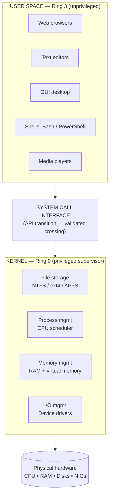

<Concepts items={["operating system","kernel","user space","system calls","Ring 0","Ring 3","process management","memory management","file systems","device drivers","Windows","macOS","Linux","ChromeOS","Android"]} />

<LessonIntro>

Ticket #2417: "My laptop froze when I opened three apps at once." Nothing in that sentence names the kernel, yet the kernel is the reason the machine survived it. An **operating system (OS)** is the master intermediary between you, your applications, and the silicon underneath — scheduling the CPU, guarding memory, organising storage, and talking to hardware through drivers, all in milliseconds. This lesson opens up that intermediary: what the OS is, why it splits itself into a privileged kernel and an unprivileged user space, the four functions the kernel performs, and which OS ecosystems you will meet on real support desks.

</LessonIntro>

An OS is far more than the desktop picture on the monitor. It is an integrated suite of scheduling engines, memory managers, security arbiters, and device drivers working synchronously. Users never touch the privileged core directly. Every request — opening a file, printing a page, loading a web tab — crosses a guarded boundary called the system call interface, where the kernel vets the request before touching hardware.

## Concept Breakdown: What It Is & How It Works

<ConceptCard name="Operating System (OS)" category="System Software">

**What it is.** System software that manages computer hardware, allocates software resources, and provides common services for computer programs.

**How it works.** It sits between applications and physical hardware as a permanent intermediary: applications ask the OS for things (CPU time, memory, disk writes, screen output) instead of driving registers and buses themselves, and the OS grants, schedules, and isolates those requests.

</ConceptCard>

<ConceptCard name="The Kernel" category="Privileged Core">

**What it is.** The core supervisor program of the operating system that holds total, direct control over all hardware resources and loads first during boot.

**How it works.** It runs in privileged CPU Ring 0 (kernel or supervisor mode), where it may execute any instruction — talking directly to CPU registers, memory controllers, and device buses. Users never interact with it directly; all requests arrive through system calls.

</ConceptCard>

<ConceptCard name="User Space" category="Unprivileged Environment">

**What it is.** The outer environment where users and applications operate: the graphical desktop, shells, system utilities, web browsers, media players, and productivity software.

**How it works.** Code here runs in unprivileged Ring 3. It cannot modify physical hardware registers or another program's memory directly. When it needs hardware — disk, network, screen — it must ask the kernel through a system call and wait for the answer.

</ConceptCard>

<ConceptCard name="System Call Interface" category="Privilege Boundary">

**What it is.** The guarded API transition between user space (Ring 3) and kernel space (Ring 0).

**How it works.** An application traps into the kernel with a numbered request such as "open this file" or "send these bytes." The kernel validates permissions, performs the privileged hardware operation, and returns the result. A crash in user space kills one app; a bug in a system call path can take down the machine, which is why the boundary exists.

</ConceptCard>

<ConceptCard name="File Storage and Management" category="Kernel Function 1">

**What it is.** The kernel subsystem that structures, writes, and organises data blocks on physical drives.

**How it works.** It implements file systems (NTFS, ext4, APFS), maintains file metadata such as ownership, permissions, and timestamps, and maps human-readable paths to physical sectors so applications can say "save report.docx" without knowing which disk blocks are free.

</ConceptCard>

<ConceptCard name="Process Management" category="Kernel Function 2">

**What it is.** The kernel subsystem that schedules CPU execution time across competing programs.

**How it works.** It allocates resources to each running process, switches execution contexts in rapid time slices so dozens of programs appear to run at once, and terminates finished tasks and reclaims their resources.

</ConceptCard>

<ConceptCard name="Memory Management" category="Kernel Function 3">

**What it is.** The kernel subsystem that dynamically allocates physical RAM to running applications.

**How it works.** It hands each process its own isolated virtual address space, maps those virtual pages onto physical RAM, enforces isolation so one process cannot read another's memory, and pages idle data out to swap when RAM fills.

</ConceptCard>

<ConceptCard name="I/O Management" category="Kernel Function 4">

**What it is.** The kernel subsystem that mediates communication between software and hardware devices.

**How it works.** It loads device drivers — translator modules for keyboards, monitors, network cards, and disks — and routes every read and write through them so transfers stay fast, ordered, and error-checked without applications speaking raw bus protocols.

</ConceptCard>

<ConceptCard name="Microsoft Windows" category="OS Ecosystem">

**What it is.** The dominant enterprise desktop and consumer OS, current mainstream releases Windows 10 and 11.

**How it works.** Known for extensive backward hardware compatibility, broad commercial software and gaming support, and domain management through Active Directory and Group Policy — which is why most corporate support tickets involve it.

</ConceptCard>

<ConceptCard name="Apple macOS and iOS" category="OS Ecosystem">

**What it is.** Apple's desktop (macOS) and mobile (iOS) operating systems, built on a Unix foundation called Darwin.

**How it works.** Shipped exclusively on Apple hardware with tight ecosystem integration and hardware acceleration for creative workflows, plus sandboxed security that limits what any single app can touch.

</ConceptCard>

<ConceptCard name="Linux (Ubuntu, Debian, Red Hat)" category="OS Ecosystem">

**What it is.** A family of free, open-source operating systems built on the Linux kernel.

**How it works.** Highly customisable and scriptable, it dominates enterprise cloud servers, supercomputers, network routers, and developer workstations — the machines you will most often reach over SSH rather than in person.

</ConceptCard>

<ConceptCard name="ChromeOS and Android" category="OS Ecosystem">

**What it is.** Google's two Linux-kernel operating systems: ChromeOS for Chromebooks and Android for phones and tablets.

**How it works.** ChromeOS is a lightweight, cloud-first OS where the browser is the desktop; Android is the most widely deployed mobile OS in the world. Both inherit Linux process and memory management underneath a very different user space.

</ConceptCard>

## Step-by-step breakdown

1. **User acts in user space.** Clicking Save in a text editor runs unprivileged Ring 3 code — the editor cannot touch the disk itself.
2. **Request crosses the boundary.** The editor issues a system call such as "write these bytes to this file."
3. **Kernel validates.** In Ring 0, the kernel checks permissions, finds free blocks via the file system, and orders the write through the storage driver.
4. **Kernel juggles everything else.** Meanwhile the scheduler keeps your other apps' time slices flowing and the memory manager keeps each app isolated, so one Save cannot corrupt another program.
5. **Result returns.** The kernel hands success or an error code back across the boundary, and the editor shows "Saved."

## Kernel vs. user space at a glance

The architecture diagram from the source lesson reduces to two boxes and one guarded line: applications live above, the kernel lives below, and nothing crosses without a system call.

*Figure 12.1 — Operating system architecture. User-space programs can only reach hardware by crossing the system call interface into the kernel's four subsystems.*

## Examples

- **Obvious —** Double-clicking a photo opens it in a viewer. The viewer (user space) system-calls the file system (kernel) to read blocks off the SSD through the storage driver, then system-calls the display driver to paint pixels. You saw one click; the kernel did four jobs.
- **Counter-intuitive —** A frozen app usually means user space failed, not the kernel. That is why you can kill one hung program in Task Manager while music keeps playing — the scheduler simply stops giving the offender time slices and reclaims its memory.
- **Edge case —** A buggy third-party device driver runs inside the kernel with full privileges. One bad driver can Blue-Screen an otherwise healthy machine even though no application did anything wrong — privilege cuts both ways.

## Support-desk triage: "which layer is broken?"

1. **One app misbehaves, rest of system fine** — suspect user space (app bug, corrupt profile). Reinstall, update, or test under a fresh user account.
2. **Whole system slow or unstable** — suspect kernel resources (CPU saturation, RAM exhaustion, disk errors). Check Task Manager / Activity Monitor / `top`, then storage health.
3. **A device vanished (printer, Wi-Fi, USB disk)** — suspect I/O management (driver). Reinstall or roll back the driver before replacing hardware.
4. **Permission denied on a file you should own** — suspect file-system ACLs, covered in the next lesson. Verify ownership and permissions before assuming corruption.

<AnalogyCard name="An Airport">

**The concept.** Applications cannot walk onto the runway (hardware); every request passes through security (system calls) into the control tower (kernel), which schedules takeoffs (processes), assigns gates (memory), files flight plans (file system), and talks to ground crews (drivers).

**The analogy.** Passengers (apps) stay in the terminal (user space). The tower (kernel) owns the runways. Security (system call interface) is the only way through — slow when crowded, but the reason planes do not collide.

</AnalogyCard>

<LessonNote variant="myth" title="What people get wrong about the OS">

**Myth:** "The operating system is the desktop wallpaper, windows, and Start menu."

**Truth:** That visible shell is a thin user-space program. The actual OS — scheduling, memory isolation, file systems, drivers — runs invisibly in the kernel. You can replace the entire desktop (as Linux users do routinely) without changing operating systems.

</LessonNote>

<LessonNote variant="why">

Every ticket you will ever work — slow PC, missing file, dead printer, crashed app — is a question about which kernel function or which side of the privilege boundary failed. Learn this split now and every later lesson has somewhere to hang.

</LessonNote>

This connects to the next lesson because the kernel's file-storage function hides an entire database — file data, metadata, and block maps — that decides whether a user's document opens, vanishes, or denies access.

<QuickRecall title="Quick Recall — OS Components and Kernel">

Before moving on, try to answer these from memory:

1. Why can one frozen app be killed while the rest of the system keeps running?
2. Name the four core kernel functions.
3. What must a text editor cross to save a file to disk, and why?

Reveal answers

1) The frozen app is an isolated user-space process; the kernel scheduler simply stops giving it CPU time and reclaims its memory without affecting other processes. 2) File storage and management, process management, memory management, I/O management. 3) The system call interface — user-space code in Ring 3 cannot touch hardware registers directly, so the kernel must validate and perform the write.

</QuickRecall>
