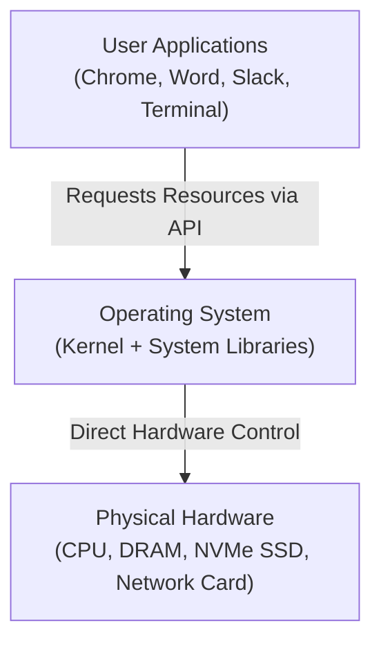
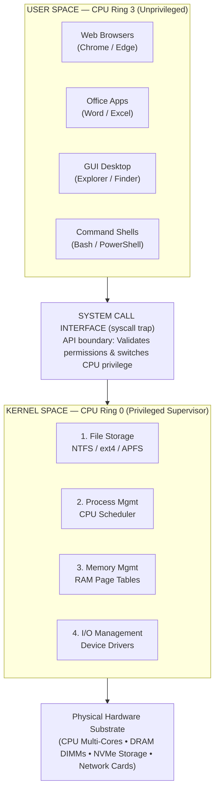
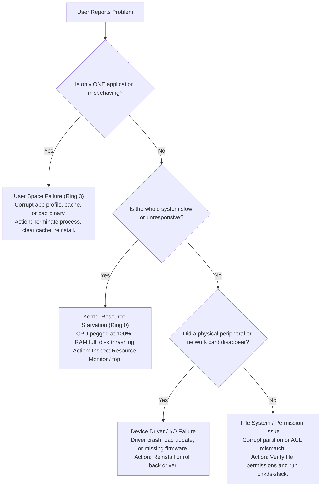

<Concepts items={["operating system", "kernel", "user space", "system calls", "Ring 0", "Ring 3", "process management", "memory management", "file systems", "device drivers", "Windows", "macOS", "Linux", "ChromeOS", "Android"]} />

<LessonIntro>

Ticket #2417: "My laptop froze when I opened three apps at once." Nothing in that sentence names the kernel, yet the kernel is the reason the machine survived it. 

An **Operating System (OS)** is the master intermediary between human users, active software applications, and physical silicon underneath — scheduling the CPU, guarding memory pages, organizing file storage, and mediating hardware through device drivers, all within microseconds. This lesson opens up that intermediary: what the OS is, why it splits itself into a privileged kernel and an unprivileged user space, the four functions the kernel performs, and the operating system ecosystems you will support on enterprise desks.

</LessonIntro>

## Why this matters

Every support ticket — from an unresponsive browser tab to a corporate fleet deployment failure — maps directly to an operating system layer:

* **Isolating User-Space Hangs from Kernel Crashes:** When an application freezes, an IT specialist does not reboot the computer. Because the application runs in isolated user space (Ring 3), terminating the process via Task Manager or `kill -9` cleanly reclaims its memory without destabilizing the operating system kernel.
* **Diagnosing Blue Screens (BSODs) and Kernel Panics:** When an entire operating system crashes with a stop code, the failure almost never originates from user-space software. Over $80\%$ of kernel crashes trace back to third-party **Device Drivers** executing with full hardware privileges inside Ring 0.
* **Understanding System Call Latency:** When an application experiences severe lag while reading thousands of small files, the bottleneck is often the overhead of context-switching across the user-space/kernel-space boundary thousands of times per second.
* **Managing Cross-Platform Fleets:** Modern organizations manage heterogeneous device fleets spanning Windows, macOS, Linux, ChromeOS, and mobile devices. Understanding the common architectural kernel foundations allows you to troubleshoot any OS using the same mental models.

---

## 01 — What is an Operating System? Core Architecture

An operating system is far more than the graphical desktop wallpaper visible on the monitor:

<ConceptCard name="Operating System (OS)" category="System Software">

**What it is.** System software that manages computer hardware, allocates software resources, and provides common services for computer programs.

**How it works.** It sits between applications and physical hardware as a permanent intermediary: applications ask the OS for things (CPU time, memory, disk writes, screen output) instead of driving registers and buses themselves, and the OS grants, schedules, and isolates those requests.

</ConceptCard>

### The Master Intermediary

Without an operating system, every individual application would need to contain its own device drivers for thousands of printers, display adapters, and storage controllers. More dangerously, applications would overwrite each other's memory in RAM without any supervisor to referee access. The OS acts as the permanent coordinator:

*Figure 12.1 — The operating system mediates between user applications and bare silicon.*

---

## 02 — The Architectural Split: Kernel Space vs User Space

Modern microprocessors enforce hardware-level security separation through **CPU Protection Rings**:

<ConceptCard name="The Kernel" category="Privileged Core">

**What it is.** The core supervisor program of the operating system that holds total, direct control over all hardware resources and loads first during boot.

**How it works.** It runs in privileged CPU Ring 0 (kernel or supervisor mode), where it may execute any instruction — talking directly to CPU registers, memory controllers, and device buses. Users never interact with it directly; all requests arrive through system calls.

</ConceptCard>

<ConceptCard name="User Space" category="Unprivileged Environment">

**What it is.** The outer environment where users and applications operate: the graphical desktop, shells, system utilities, web browsers, media players, and productivity software.

**How it works.** Code here runs in unprivileged Ring 3. It cannot modify physical hardware registers or another program's memory directly. When it needs hardware — disk, network, screen — it must ask the kernel through a system call and wait for the answer.

</ConceptCard>

<ConceptCard name="System Call Interface" category="Privilege Boundary">

**What it is.** The guarded API transition between user space (Ring 3) and kernel space (Ring 0).

**How it works.** An application traps into the kernel with a numbered request such as "open this file" or "send these bytes." The kernel validates permissions, performs the privileged hardware operation, and returns the result. A crash in user space kills one app; a bug in a system call path can take down the machine, which is why the boundary exists.

</ConceptCard>

*Figure 12.2 — Operating system architecture: user-space programs can only access hardware by crossing the system call interface into the kernel.*

---

## 03 — The Four Core Kernel Responsibilities

The operating system kernel runs continuously in the background, executing four core supervisory duties:

<ConceptCard name="Process Management" category="Kernel Function 1">

**What it is.** The kernel subsystem that schedules CPU execution time across competing programs.

**How it works.** It allocates resources to each running process, switches execution contexts in rapid time slices so dozens of programs appear to run at once, and terminates finished tasks and reclaims their resources.

</ConceptCard>

<ConceptCard name="Memory Management" category="Kernel Function 2">

**What it is.** The kernel subsystem that dynamically allocates physical RAM to running applications.

**How it works.** It hands each process its own isolated virtual address space, maps those virtual pages onto physical RAM, enforces isolation so one process cannot read another's memory, and pages idle data out to swap when RAM fills.

</ConceptCard>

<ConceptCard name="File Storage and Management" category="Kernel Function 3">

**What it is.** The kernel subsystem that structures, writes, and organises data blocks on physical drives.

**How it works.** It implements file systems (NTFS, ext4, APFS), maintains file metadata such as ownership, permissions, and timestamps, and maps human-readable paths to physical sectors so applications can say "save report.docx" without knowing which disk blocks are free.

</ConceptCard>

<ConceptCard name="I/O Management" category="Kernel Function 4">

**What it is.** The kernel subsystem that mediates communication between software and hardware devices.

**How it works.** It loads device drivers — translator modules for keyboards, monitors, network cards, and disks — and routes every read and write through them so transfers stay fast, ordered, and error-checked without applications speaking raw bus protocols.

</ConceptCard>

### Kernel Subsystems Quick Reference

| Kernel Subsystem | Core Duty | Failure Symptom When Starved | Key Diagnostic Tool |
| :--- | :--- | :--- | :--- |
| **Process Scheduler** | Allocates CPU time slices across active threads. | High CPU usage, unresponsiveness, freezing UI. | Task Manager / `top` / `htop` |
| **Memory Manager** | Maps virtual pages to physical DRAM and manages paging. | Out of Memory (OOM) errors, severe disk thrashing. | Resource Monitor / `free -m` |
| **File System Driver** | Translates paths to disk sectors; manages ACLs. | Read-only file systems, corrupted files, `Access Denied`. | `chkdsk` / `fsck` / Event Viewer |
| **I/O & Device Drivers** | Interfaces with peripheral chips and storage buses. | Kernel BSOD (`IRQL_NOT_LESS_OR_EQUAL`), missing devices. | Device Manager / `dmesg` / `lsusb` |

---

## 04 — Major Enterprise OS Ecosystems

Support technicians manage devices spanning five major operating system families:

<ConceptCard name="Microsoft Windows" category="OS Ecosystem">

**What it is.** The dominant enterprise desktop and consumer OS, current mainstream releases Windows 10 and 11.

**How it works.** Known for extensive backward hardware compatibility, broad commercial software and gaming support, and domain management through Active Directory and Group Policy — which is why most corporate support tickets involve it.

</ConceptCard>

<ConceptCard name="Apple macOS and iOS" category="OS Ecosystem">

**What it is.** Apple's desktop (macOS) and mobile (iOS) operating systems, built on a Unix foundation called Darwin.

**How it works.** Shipped exclusively on Apple hardware with tight ecosystem integration and hardware acceleration for creative workflows, plus sandboxed security that limits what any single app can touch.

</ConceptCard>

<ConceptCard name="Linux (Ubuntu, Debian, Red Hat)" category="OS Ecosystem">

**What it is.** A family of free, open-source operating systems built on the Linux kernel.

**How it works.** Highly customisable and scriptable, it dominates enterprise cloud servers, supercomputers, network routers, and developer workstations — the machines you will most often reach over SSH rather than in person.

</ConceptCard>

<ConceptCard name="ChromeOS and Android" category="OS Ecosystem">

**What it is.** Google's two Linux-kernel operating systems: ChromeOS for Chromebooks and Android for phones and tablets.

**How it works.** ChromeOS is a lightweight, cloud-first OS where the browser is the desktop; Android is the most widely deployed mobile OS in the world. Both inherit Linux process and memory management underneath a very different user space.

</ConceptCard>

### Enterprise OS Comparison

| Operating System | Underlying Kernel Architecture | Primary Enterprise Deployment | Centralized Management Platform |
| :--- | :--- | :--- | :--- |
| **Microsoft Windows** | Hybrid Windows NT Kernel | Corporate desktop workstations, enterprise laptops. | Microsoft Intune, Active Directory, GPO. |
| **Apple macOS** | XNU (Darwin / BSD Unix) | Executive laptops, design and software engineering teams. | Jamf Pro, Apple Business Manager. |
| **Linux (RHEL / Ubuntu)** | Monolithic Linux Kernel | Cloud servers, web backends, CI/CD pipelines, Docker. | Ansible, Puppet, SSH, Landscape. |
| **Google ChromeOS** | Linux Kernel (Gentoo-based) | K-12 education, call centers, front-line retail kiosks. | Google Workspace Admin Console. |
| **Google Android** | Linux Kernel with ART Runtime | Corporate smartphones, handheld warehouse scanners. | Android Enterprise MDM / Knox. |

---

## 05 — Support-Desk Triage: "Which Layer is Broken?"

When troubleshooting an operating system issue, systematically isolate which architectural layer has failed:

### The 4-Step Layer Isolation Flowchart

*Figure 12.3 — Structured OS troubleshooting workflow.*

### Practical Support Scenarios

* **Obvious — Safe Process Termination:** When a spreadsheet hangs while calculating millions of cells, the rest of the desktop continues running smoothly. Opening Task Manager and clicking "End Task" sends a `SIGTERM` / `TerminateProcess` signal to the user-space process. The kernel immediately reclaims all allocated memory pages without requiring a system reboot.
* **Counter-intuitive — User Space vs Kernel Space Blame:** When users experience application crashes, they often complain that "Windows crashed." In reality, the kernel remained completely healthy and functioned as designed by containing the faulty application and preventing it from damaging other processes.
* **Edge case — The Ring 0 Driver Crash (Blue Screen of Death):** A technician updates a graphics card driver or an antivirus endpoint agent. Minutes later, the system experiences a Blue Screen of Death (`PAGE_FAULT_IN_NONPAGED_AREA`). Because device drivers execute inside Ring 0 alongside the kernel, an unhandled memory exception in driver code crashes the entire operating system to protect file-system integrity.

<AnalogyCard name="An Airport">

**The concept.** Applications cannot walk onto the runway (hardware); every request passes through security (system calls) into the control tower (kernel), which schedules takeoffs (processes), assigns gates (memory), files flight plans (file system), and talks to ground crews (drivers).

**The analogy.** Passengers (apps) stay in the terminal (user space). The tower (kernel) owns the runways. Security (system call interface) is the only way through — slow when crowded, but the reason planes do not collide.

</AnalogyCard>

<LessonNote variant="myth" title="What people get wrong about the OS">

**Myth:** "The operating system is the desktop wallpaper, windows, and Start menu."

**Truth:** That visible shell is a thin user-space program. The actual OS — scheduling, memory isolation, file systems, drivers — runs invisibly in the kernel. You can replace the entire desktop (as Linux users do routinely) without changing operating systems.

</LessonNote>

<LessonNote variant="why">

Every ticket you will ever work — slow PC, missing file, dead printer, crashed app — is a question about which kernel function or which side of the privilege boundary failed. Learn this split now and every later lesson has somewhere to hang.

</LessonNote>

---

## Summary Checklist: OS Components & Kernel Mental Model

1. **The OS is the resource coordinator:** It isolates applications from raw silicon, translating high-level software requests into hardware bus operations.
2. **CPU Protection Rings enforce security boundaries:** User applications run in restricted Ring 3; the kernel supervisor executes with full bare-metal privileges in Ring 0.
3. **The System Call Interface guards the gate:** Applications must issue a system call to read files, transmit network packets, or allocate memory.
4. **The kernel executes four perpetual jobs:** Process scheduling (CPU), memory management (RAM/paging), file system structuring (storage), and I/O routing (drivers).
5. **Driver crashes take down the entire system:** Because third-party device drivers execute inside Ring 0, driver bugs cause BSODs and kernel panics.

---

<QuickRecall title="Quick Recall — OS Components and Kernel">

Before moving on, try to answer these from memory:

1. Why can one frozen app be killed while the rest of the system keeps running?
2. Name the four core kernel functions.
3. What must a text editor cross to save a file to disk, and why?

Reveal answers

1. The frozen app is an isolated user-space process; the kernel scheduler simply stops giving it CPU time and reclaims its memory without affecting other processes.
2. File storage and management, process management, memory management, I/O management.
3. The system call interface — user-space code in Ring 3 cannot touch hardware registers directly, so the kernel must validate permissions and execute the privileged write.

</QuickRecall>

This connects to the next lesson because the kernel's file-storage function hides an entire database — file data, metadata, and block maps — that decides whether a user's document opens, vanishes, or denies access.
