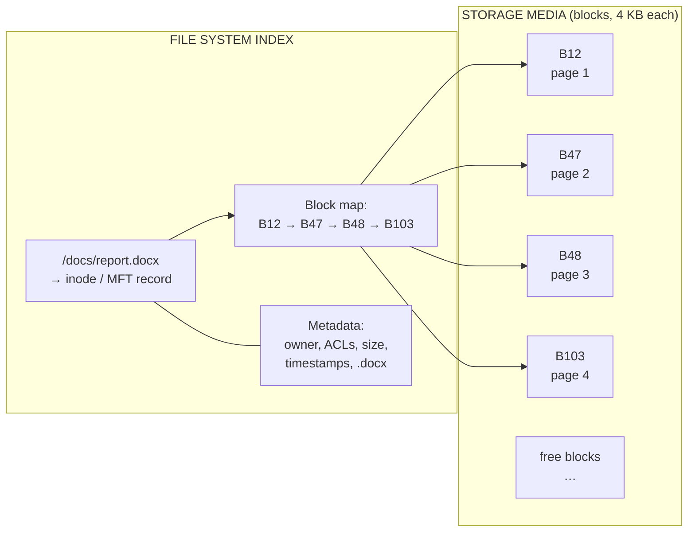

<Concepts items={["file data","file metadata","file system","data blocks","clusters","file extensions","NTFS","ext4","APFS","FAT32","exFAT","journaling","ACLs"]} />

<LessonIntro>

Ticket #3102: "I saved the report, but Word says the file is corrupted — and my USB stick refuses a 5 GB video." Two symptoms, one lesson. The bytes you typed (**file data**), the timestamps and permissions attached to them (**file metadata**), and the on-disk database mapping names to sectors (**file system**) are three separate layers, and each fails differently. This lesson separates them, shows how block allocation works, and maps which file system you will meet on Windows, Linux, Mac, and removable media.

</LessonIntro>

When the kernel manages files, it coordinates three layers at once. Confusing them is the most common beginner mistake in storage troubleshooting: the content can be fine while the metadata or the index is broken, and each case demands a different fix.

## Concept Breakdown: What It Is & How It Works

<ConceptCard name="File Data" category="Content Layer">

**What it is.** The raw binary content of the file — text characters, image pixels, video frames, machine-code bytes — written physically across storage media.

**How it works.** Data is split into fixed-size chunks and scattered across available sectors rather than laid down in one unbroken strip, so the kernel must consult an index to reassemble the file on every read.

</ConceptCard>

<ConceptCard name="File Metadata" category="Descriptor Layer">

**What it is.** The structural descriptor that profiles a file without parsing its contents: creation and modification timestamps, owner ID, security permissions, size, and extension.

**How it works.** Stored alongside the index, metadata answers every question the OS asks before opening a file — "who may read this?", "how big is it?", "which program opens it?", "has it changed since the last backup?" — and backup, forensic, and security tools read metadata first.

</ConceptCard>

<ConceptCard name="File System" category="Index Layer">

**What it is.** The database and data structure — directory hierarchy, index table, journaling engine — that maps human-readable paths to physical storage sectors.

**How it works.** When an app asks for `/photos/trip.jpg`, the file system looks up the path in its index, collects the list of data blocks belonging to that file, and orders the driver to read exactly those sectors.

</ConceptCard>

<ConceptCard name="Data Blocks (Clusters)" category="Allocation Unit">

**What it is.** Uniform chunks (commonly 4 KB) into which every file is partitioned for storage.

**How it works.** Spreading a file across blocks gives two wins: the file system can read blocks in parallel through multiple I/O channels for speed, and a growing file simply claims new free blocks anywhere on disk instead of forcing every neighbouring file to move.

</ConceptCard>

<ConceptCard name="NTFS" category="Windows File System">

**What it is.** New Technology File System, the default file system on Windows.

**How it works.** Journals every change before committing it (so a power cut mid-write replays or rolls back instead of corrupting), enforces granular NTFS ACL permissions, and supports BitLocker encryption and volume shadow copies.

</ConceptCard>

<ConceptCard name="ext4" category="Linux File System">

**What it is.** Fourth Extended Filesystem, the default on most Linux distributions.

**How it works.** A journaled, rock-solid design supporting volumes up to 1 exabyte, backward compatible with ext2/ext3, and tuned for the server workloads where Linux dominates.

</ConceptCard>

<ConceptCard name="APFS" category="Apple File System">

**What it is.** Apple File System, the modern 64-bit default on macOS and iOS, replacing legacy HFS+.

**How it works.** Built for flash storage with native strong encryption, space sharing between volumes, and instantaneous file cloning — duplicating a file's index entry instead of copying all its bytes.

</ConceptCard>

<ConceptCard name="FAT32 and exFAT" category="Universal File Systems">

**What it is.** Cross-platform file systems readable by Windows, Mac, and Linux, standard on removable media.

**How it works.** FAT32 trades features for universal compatibility but caps any single file at 4 GB; exFAT removes that ceiling for high-capacity SD cards and USB drives while staying broadly compatible.

</ConceptCard>

## Step-by-step breakdown

1. **App saves a file.** The kernel splits the content into 4 KB blocks and writes them to whatever sectors are free, wherever they are.
2. **Kernel writes metadata.** Timestamps, owner, permissions, byte count, and block list are recorded in the file-system index.
3. **Path gets mapped.** The directory entry links the human name (`Q3-report.docx`) to that index record.
4. **App reopens the file.** The file system resolves the path, checks ACLs, gathers the block list, and streams the blocks back in order.
5. **Extension picks the program.** The `.docx` suffix tells the OS which default application to launch — a convenience mapping, not a guarantee of content type.

## How a file sits on disk

One file is rarely one contiguous strip. Think of it as pages torn from a notebook and filed wherever drawer space is free, with a card catalogue remembering the order.

*Figure 13.1 — File-system block map. The directory entry points to metadata plus an ordered block list; the blocks themselves may sit anywhere on disk.*

## File metadata fields

| Metadata Field | Technical Purpose & IT Relevance |
| --- | --- |
| **Creation & Modification Timestamps** | Tracks when files were written or altered; crucial for incremental backup software and security audit forensics. |
| **Access Control Lists (ACLs / Permissions)** | Specifies which user accounts and groups have Read, Write, or Execute privileges. |
| **File Size & Allocation** | Records exact byte size and number of allocated storage blocks on disk. |
| **File Extensions (.ext)** | Appended suffix (e.g. `.docx`, `.jpg`, `.exe`) telling the OS which default program should open the file. |

## Major file systems compared

| File System | Operating System | Key Characteristics & Capabilities |
| --- | --- | --- |
| **NTFS (New Technology File System)** | Windows (Default) | Features **journaling** (prevents data corruption during sudden power loss), granular file permissions (NTFS ACLs), BitLocker encryption support, and volume shadow copies. |
| **ext4 (Fourth Extended Filesystem)** | Linux (Default) | Rock-solid stability, journaling engine, support for 1 Exabyte volumes, backward compatibility with ext2/ext3. |
| **APFS (Apple File System)** | macOS & iOS | Modern 64-bit architecture, native strong encryption, space sharing, and instantaneous file cloning. Replaced legacy **HFS+**. |
| **FAT32 & exFAT** | Cross-Platform (Universal) | Universal compatibility across Windows, Mac, and Linux. FAT32 has a 4 GB single-file limit; exFAT removes this limit for high-capacity SD cards and USB drives. |

## Examples

- **Obvious —** Saving a 12 KB text file consumes three 4 KB blocks. Delete one character and the block count does not change — allocation is chunky, not byte-precise.
- **Counter-intuitive —** Renaming `photo.jpg` to `photo.txt` changes neither a single content byte nor the metadata that matters; the OS will simply offer the wrong default program. Extensions are hints, not identities — which is why malware loves disguising `invoice.pdf.exe`.
- **Edge case —** Copying a 5 GB video to a FAT32 USB stick fails with a cryptic error even though 60 GB is free. The per-file 4 GB ceiling, not the free space, is the blocker — reformatting to exFAT or NTFS is the fix.

## Support-desk triage: storage tickets

1. **"File won't copy to USB, disk has space"** — check the destination file system and the single-file size. Over 4 GB on FAT32 means reformat to exFAT (or split the file).
2. **"Access denied on a shared file"** — inspect ACLs/ownership before assuming corruption. On NTFS, verify the Security tab; on Linux, check `ls -l`.
3. **"File corrupted after power cut"** — journaled systems (NTFS, ext4, APFS) usually self-repair on next mount; run the platform checker (`chkdsk`, `fsck`, Disk Utility) and restore from shadow copy or backup if the journal could not replay.
4. **"Wrong program opens my files"** — reset default-apps by extension rather than reinstalling anything.

<AnalogyCard name="A Library Card Catalogue">

**The concept.** File data is the book pages, metadata is the catalogue card (author, date, shelf rules), and the file system is the catalogue itself mapping titles to shelf positions.

**The analogy.** Tearing pages out and filing them wherever shelf space is free (blocks) works fine as long as the catalogue card lists every shelf in order. Lose the book and you lose one story; lose the catalogue and you lose the whole library.

</AnalogyCard>

<LessonNote variant="myth" title="What people get wrong about files">

**Myth:** "Deleting a file wipes its data off the disk."

**Truth:** Deletion usually removes only the index entry and marks the blocks free; the bytes linger until overwritten. That is why undelete tools and forensic recovery work — and why "deleted" sensitive data is not truly gone without a secure wipe.

</LessonNote>

<LessonNote variant="why">

Metadata is what backups, audits, and permission errors actually run on. When a ticket says "corrupted," train yourself to ask: is the data bad, the metadata wrong, or the index lost? Each answer leads somewhere different.

</LessonNote>

This connects to the next lesson because files sitting on disk are inert — and the moment a program loads one into RAM and the scheduler gives it CPU time, it becomes a process with very different failure modes.

<QuickRecall title="Quick Recall — File Systems and Storage">

Before moving on, try to answer these from memory:

1. A user cannot copy a 5 GB file to an empty 64 GB USB stick. What is the most likely cause?
2. Which metadata field does incremental backup software depend on most?
3. Why does block allocation let a growing file avoid moving its neighbours?

Reveal answers

1) The stick is formatted FAT32, which caps single files at 4 GB — reformat to exFAT. 2) Creation and modification timestamps, which identify what changed since the last backup. 3) New data claims any free blocks anywhere on disk, and the file-system index simply extends the block list.

</QuickRecall>
