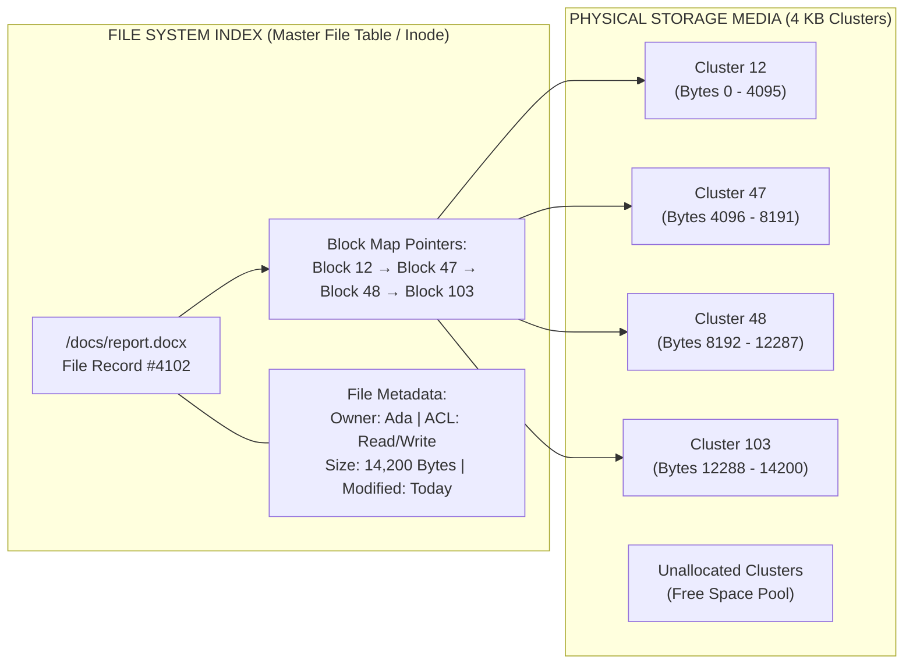
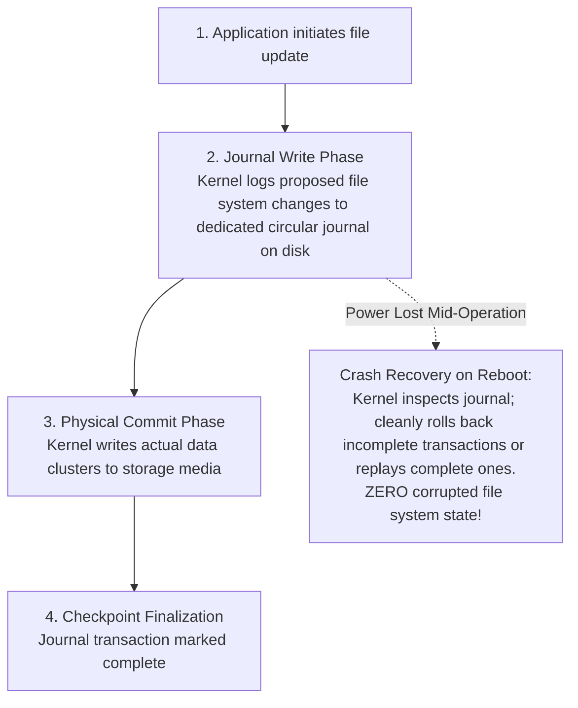

<Concepts items={["file data", "file metadata", "file system", "data blocks", "clusters", "file extensions", "NTFS", "ext4", "APFS", "FAT32", "exFAT", "journaling", "ACLs"]} />

<LessonIntro>

Ticket #3102: "I saved the report, but Word says the file is corrupted — and my USB stick refuses a 5 GB video." Two symptoms, one lesson. 

The bytes you typed (**file data**), the timestamps and permissions attached to them (**file metadata**), and the on-disk database mapping names to physical sectors (**file system**) are three separate layers, and each fails in a distinct way. This lesson separates them, shows how block allocation works, explains journaled fault recovery, and maps which file system you will support on Windows, Linux, Mac, and removable media.

</LessonIntro>

## Why this matters

Storage management is a core category of first-contact IT support tickets:

* **The 4 GB FAT32 Wall:** When a user with a brand-new 64 GB USB flash drive complains that Windows reports "The file is too large for the destination file system" while attempting to copy a 5.2 GB ISO or video, the drive is formatted with legacy FAT32. Reformatting to **exFAT** resolves the issue in seconds.
* **Journaling vs Catastrophic Corruption:** When power is abruptly disconnected while files are writing, non-journaled file systems (like FAT32) suffer cross-linked clusters and data loss. Journaled systems (**NTFS**, **ext4**, **APFS**) log operations to a circular transaction journal, allowing the kernel to replay or discard uncommitted writes on next mount without running hours of disk recovery.
* **Access Denied Tickets:** Resolving file access issues requires understanding Access Control Lists (ACLs) and security descriptors in metadata, rather than assuming drive corruption.
* **Forensic Recovery Reality:** Deleting a file in modern operating systems does not overwrite the physical data blocks; it merely marks the index entry in the MFT or inode table as unallocated. Understanding this explains why sensitive data must be cryptographically wiped, and why accidentally deleted files can be recovered if addressed immediately.

---

## 01 — The Three Storage Layers: Data, Metadata & File System

When an operating system stores a document, it coordinates three distinct operational tiers:

<ConceptCard name="File Data" category="Content Layer">

**What it is.** The raw binary content of the file — text characters, image pixels, video frames, machine-code bytes — written physically across storage media.

**How it works.** Data is split into fixed-size chunks and scattered across available sectors rather than laid down in one unbroken strip, so the kernel must consult an index to reassemble the file on every read.

</ConceptCard>

<ConceptCard name="File Metadata" category="Descriptor Layer">

**What it is.** The structural descriptor that profiles a file without parsing its contents: creation and modification timestamps, owner ID, security permissions, size, and extension.

**How it works.** Stored alongside the index, metadata answers every question the OS asks before opening a file — "who may read this?", "how big is it?", "which program opens it?", "has it changed since the last backup?" — and backup, forensic, and security tools read metadata first.

</ConceptCard>

<ConceptCard name="File System" category="Index Layer">

**What it is.** The database and data structure — directory hierarchy, index table, journaling engine — that maps human-readable paths to physical storage sectors.

**How it works.** When an app asks for `/photos/trip.jpg`, the file system looks up the path in its index, collects the list of data blocks belonging to that file, and orders the driver to read exactly those sectors.

</ConceptCard>

### Core File Metadata Fields

| Metadata Attribute | Technical Definition | Primary Support & Systems Relevance |
| :--- | :--- | :--- |
| **Creation & Modification Timestamps** | High-precision record of file creation, last write, and last access (MAC times). | Essential for incremental backup engines (`robocopy`, `rsync`) and incident response forensic audits. |
| **Access Control Lists (ACLs / Permissions)** | Granular user and security group rights (Read, Write, Execute, Modify, Full Control). | Controls resource sharing; misconfigurations cause `403 Forbidden` and `Access Denied` tickets. |
| **File Size & Allocated Space** | Logical size in bytes vs physical disk clusters consumed on media. | Explains why a 100-byte file still consumes 4 KB of physical disk space on a standard formatted drive. |
| **File Extension (`.ext`)** | Suffix appended to filename indicating data type (`.docx`, `.png`, `.ps1`, `.exe`). | Tells the OS desktop shell which registered application should open the file by default. |

---

## 02 — Data Blocks & Cluster Allocation Architecture

Operating systems do not write files to disks byte-by-byte in single continuous strips. Storage is divided into uniform allocation units:

<ConceptCard name="Data Blocks (Clusters)" category="Allocation Unit">

**What it is.** Uniform chunks (commonly 4 KB) into which every file is partitioned for storage.

**How it works.** Spreading a file across blocks gives two wins: the file system can read blocks in parallel through multiple I/O channels for speed, and a growing file simply claims new free blocks anywhere on disk instead of forcing every neighbouring file to move.

</ConceptCard>

*Figure 13.1 — File system block map: the index record links metadata with a non-contiguous list of physical 4 KB storage clusters.*

### The File Save and Read Lifecycle

1. **Application saves a document:** The OS kernel receives user-space bytes via a `write()` system call and divides the payload into $4\text{ KB}$ clusters.
2. **Cluster allocation:** The file system allocates available free clusters from its allocation bitmap, scattering blocks wherever space exists.
3. **Writing the metadata record:** An index entry is generated in the **Master File Table (MFT)** on NTFS or the **Inode table** on Linux ext4, recording permissions, timestamps, and the ordered cluster pointer chain.
4. **Application reopens the document:** The file system resolves the directory path, validates user permissions against the ACL, traverses the cluster pointer chain, and streams data blocks into RAM.

---

## 03 — Major File Systems Compared: NTFS, ext4, APFS & FAT/exFAT

Different operating systems deploy specialized file systems optimized for their underlying storage and enterprise features:

<ConceptCard name="NTFS" category="Windows File System">

**What it is.** New Technology File System, the default file system on Windows.

**How it works.** Journals every change before committing it (so a power cut mid-write replays or rolls back instead of corrupting), enforces granular NTFS ACL permissions, and supports BitLocker encryption and volume shadow copies.

</ConceptCard>

<ConceptCard name="ext4" category="Linux File System">

**What it is.** Fourth Extended Filesystem, the default on most Linux distributions.

**How it works.** A journaled, rock-solid design supporting volumes up to 1 exabyte, backward compatible with ext2/ext3, and tuned for the server workloads where Linux dominates.

</ConceptCard>

<ConceptCard name="APFS" category="Apple File System">

**What it is.** Apple File System, the modern 64-bit default on macOS and iOS, replacing legacy HFS+.

**How it works.** Built for flash storage with native strong encryption, space sharing between volumes, and instantaneous file cloning — duplicating a file's index entry instead of copying all its bytes.

</ConceptCard>

<ConceptCard name="FAT32 and exFAT" category="Universal File Systems">

**What it is.** Cross-platform file systems readable by Windows, Mac, and Linux, standard on removable media.

**How it works.** FAT32 trades features for universal compatibility but caps any single file at 4 GB; exFAT removes that ceiling for high-capacity SD cards and USB drives while staying broadly compatible.

</ConceptCard>

### Enterprise File Systems Comparison

| File System | Native Operating System | Maximum Volume Size | Maximum Single File Size | Key Enterprise Feature |
| :--- | :--- | :--- | :--- | :--- |
| **NTFS** | Microsoft Windows | $8\text{ Petabytes}$ | $8\text{ Petabytes}$ | Full transaction journaling, NTFS security ACLs, BitLocker, Volume Shadow Copy. |
| **ext4** | Linux (Ubuntu, RHEL) | $1\text{ Exabyte}$ | $16\text{ Terabytes}$ | Linux server standard, POSIX permissions, metadata checksumming, ext3 backward-compatible. |
| **APFS** | Apple macOS & iOS | $9.2\text{ Exabytes}$ | $8\text{ Exabytes}$ | Optimized for SSD flash, space sharing across partitions, instantaneous zero-copy file cloning. |
| **FAT32** | Universal (Win, Mac, Linux) | $2\text{ TB}$ ($16\text{ TB}$ theoretical) | **$4\text{ GB}$ (Hard Limit)** | Legacy universal format; lacks journaling and file-level permissions. |
| **exFAT** | Universal (Win, Mac, Linux) | $128\text{ Petabytes}$ | $128\text{ Petabytes}$ | Modern format for high-capacity SDXC cards and external USB SSDs; removes the 4 GB limit. |

---

## 04 — Journaling & Fault Tolerance: Surviving Sudden Power Loss

A major milestone in storage reliability was the implementation of **journaling**:

*Figure 13.2 — Journaling transaction lifecycle: preventing file-system structure corruption.*

On modern journaled file systems (NTFS, ext4, APFS), a sudden power failure or bluescreen during a write operation will not corrupt the entire drive. On the subsequent mount, the kernel reads the transaction log, discards incomplete transactions, and restores the volume to a mathematically consistent state in seconds.

---

## 05 — Support-Desk Triage: Storage Tickets & Diagnostics

### Storage Triage Matrix

| Helpdesk Ticket Symptom | Root Cause Subsystem | Support Resolution Action |
| :--- | :--- | :--- |
| **"File too large for destination" on 64 GB USB drive.** | USB drive formatted with legacy FAT32, which caps single files at $4\text{ GB}$. | Backup existing files; reformat flash drive to **exFAT** with 128 KB allocation units. |
| **User receives `Access Denied` opening shared team document.** | User lacks appropriate NTFS ACL permission or group membership. | Verify user AD group membership; check NTFS Permissions tab in folder properties. |
| **Hard drive shows `RAW` partition after dirty shutdown.** | File-system metadata corrupted; journal unable to replay automatically. | Run `chkdsk /f` on Windows or `fsck` on Linux to rebuild file system tables. |
| **All PDF documents open in Microsoft Paint instead of Acrobat.** | File association for `.pdf` extension incorrectly configured in user profile. | Open Default Apps settings in Windows/macOS; reassign `.pdf` handler to Adobe Acrobat. |

### Practical Support Scenarios

* **Obvious — Chunky Cluster Allocation:** A user writes a small 100-byte text file. Checking the file properties shows: *Size: 100 bytes; Size on disk: 4,096 bytes*. Because storage is allocated in fixed 4 KB clusters, the remaining 3,996 bytes in that cluster cannot be used by other files (known as **slack space**).
* **Counter-intuitive — File Extensions are Mere Hints:** Renaming `contract.pdf` to `contract.txt` changes neither the binary data bytes nor the underlying file format; it merely causes the OS shell to attempt to launch Notepad. Attackers exploit this behavior by distributing executable malware disguised as double extensions like `payroll_update.pdf.exe`.
* **Edge case — The Forensic Recovery of "Deleted" Files:** When a user empties the Recycle Bin or executes `rm report.docx`, the operating system does not physically erase the magnetic or flash sectors. It simply marks the MFT record or inode as free. As long as new files have not yet been written over those clusters, forensic recovery tools can restore the file completely. To securely wipe confidential corporate data, a multi-pass overwrite or cryptographic erase must be executed.

<AnalogyCard name="A Library Card Catalogue">

**The concept.** File data is the book pages, metadata is the catalogue card (author, date, shelf rules), and the file system is the catalogue itself mapping titles to shelf positions.

**The analogy.** Tearing pages out and filing them wherever shelf space is free (blocks) works fine as long as the catalogue card lists every shelf in order. Lose the book and you lose one story; lose the catalogue and you lose the whole library.

</AnalogyCard>

<LessonNote variant="myth" title="What people get wrong about files">

**Myth:** "Deleting a file wipes its data off the disk."

**Truth:** Deletion usually removes only the index entry and marks the blocks free; the bytes linger until overwritten. That is why undelete tools and forensic recovery work — and why "deleted" sensitive data is not truly gone without a secure wipe.

</LessonNote>

<LessonNote variant="why">

Metadata is what backups, audits, and permission errors actually run on. When a ticket says "corrupted," train yourself to ask: is the data bad, the metadata wrong, or the index lost? Each answer leads somewhere different.

</LessonNote>

---

## Summary Checklist: File Systems & Storage Mental Model

1. **Storage separates into three layers:** Raw file data (bytes), file metadata (attributes and ACLs), and the file system (the directory index and cluster map).
2. **Data allocates in 4 KB clusters:** Files are divided into uniform blocks scattered across available sectors and tracked via pointer chains.
3. **FAT32 carries a 4 GB file barrier:** Always format modern removable flash drives as exFAT to support files larger than 4 GB across Windows, macOS, and Linux.
4. **Journaling protects against sudden power loss:** NTFS, ext4, and APFS log operations to a circular journal before modifying disk sectors, guaranteeing fault recovery.
5. **Deleting a file leaves data on disk:** File deletion only unlinks the metadata index entry; sensitive data requires explicit cryptographic sanitization.

---

<QuickRecall title="Quick Recall — File Systems and Storage">

Before moving on, try to answer these from memory:

1. A user cannot copy a 5 GB file to an empty 64 GB USB stick. What is the most likely cause?
2. Which metadata field does incremental backup software depend on most?
3. Why does block allocation let a growing file avoid moving its neighbours?

Reveal answers

1. The stick is formatted FAT32, which caps single files at 4 GB — reformat to exFAT.
2. Creation and modification timestamps, which identify what changed since the last backup.
3. New data claims any free blocks anywhere on disk, and the file-system index simply extends the block pointer list.

</QuickRecall>

This connects to the next lesson because files sitting on disk are inert — and the moment a program loads one into RAM and the scheduler gives it CPU time, it becomes a process with very different failure modes.
