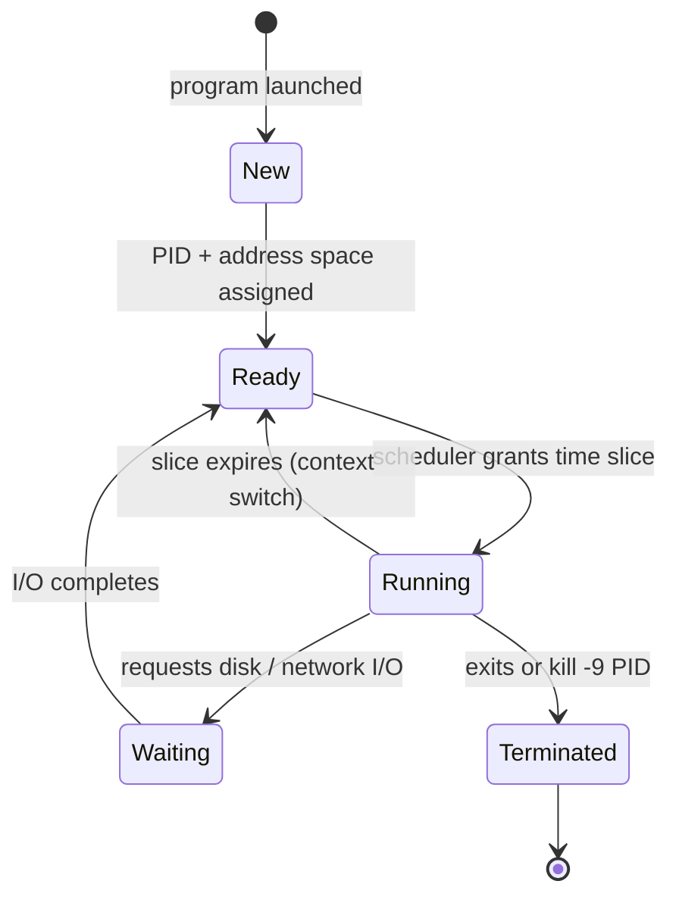

<Concepts items={["program","process","PID","scheduler","time slice","context switch","virtual memory","paging","swapping","Pagefile.sys","thrashing","device drivers","I/O bottleneck"]} />

<LessonIntro>

Ticket #1188: "The computer is slow!" That sentence is a symptom, not a diagnosis. Somewhere underneath, one of three things is exhausted: CPU time, physical memory, or I/O bandwidth. To find which, you need the kernel's two great illusions — many programs running "at once" on a CPU that does one thing at a time, and more memory than the RAM sticks actually hold. This lesson covers programs versus processes, the scheduler's time slices, virtual memory paging, and the triage flow that turns "slow" into an answer.

</LessonIntro>

A program on disk is inert. A process in RAM is alive — holding memory, consuming CPU slices, and holding a unique Process ID the kernel uses to manage and, when necessary, terminate it. Everything in this lesson follows from that one distinction.

## Concept Breakdown: What It Is & How It Works

<ConceptCard name="Program" category="Passive Code">

**What it is.** A static set of compiled instructions stored on persistent secondary storage (e.g. `chrome.exe` or `/usr/bin/bash`).

**How it works.** It consumes disk space but executes nothing and uses no CPU cycles until the kernel loads it into RAM. Deleting the program removes the template; it touches no running state.

</ConceptCard>

<ConceptCard name="Process" category="Active Instance">

**What it is.** An actively executing instance of a program loaded into system RAM.

**How it works.** The kernel assigns each process a unique **Process ID (PID)**, a dedicated memory address space, and scheduled CPU time. One program can spawn many independent processes — three browser windows means three isolated instances, each with its own PID and memory.

</ConceptCard>

<ConceptCard name="Process Scheduler" category="CPU Arbitration">

**What it is.** A core kernel algorithm that decides the order, priority, and duration for each process to run on the CPU.

**How it works.** Because one CPU core executes one instruction at a time, the scheduler rapidly rotates processes onto the core. Priorities, fairness rules, and wake-up events decide who runs next; everything else waits in a queue.

</ConceptCard>

<ConceptCard name="Time Slices and Context Switching" category="Multitasking Mechanism">

**What it is.** Microscopic CPU intervals (often 10 to 50 milliseconds, also called quantums) granted to one process before the scheduler suspends it and switches to the next.

**How it works.** Each switch saves the outgoing process's registers and loads the incoming one's — a context switch — thousands of times per second. The result is preemptive multitasking: the convincing illusion of simultaneity. When a rogue app monopolises the CPU, support intervenes via Task Manager (Windows), Activity Monitor (macOS), or `kill -9 <PID>` (Linux).

</ConceptCard>

<ConceptCard name="Virtual Memory" category="Capacity Illusion">

**What it is.** A scheme that simulates additional RAM by combining physical RAM with dedicated disk space — `Pagefile.sys` on Windows, a swap partition or file on Linux.

**How it works.** Every process gets a large private virtual address space; the kernel maps the hot parts onto physical RAM and parks the cold parts on disk. Programs behave as if RAM were plentiful even when it is not.

</ConceptCard>

<ConceptCard name="Memory Paging and Swapping" category="Capacity Mechanism">

**What it is.** The kernel's method of moving memory in uniform pages (commonly 4 KB) between RAM and disk swap space.

**How it works.** When RAM fills, the kernel identifies inactive background pages, writes them to swap, and frees high-speed RAM for the foreground app. Accessing a swapped-out page triggers a page fault: the kernel reads it back from disk and resumes the process.

</ConceptCard>

<ConceptCard name="Thrashing and Disk Latency" category="Failure Mode">

**What it is.** The collapse that follows excessive swapping, when the system spends more time shuttling pages than executing work.

**How it works.** Even fast NVMe storage is thousands of times slower than RAM, so heavy swapping shows up as latency — every click lags. Push further and the system thrashes: near-zero useful throughput with the disk light permanently on.

</ConceptCard>

<ConceptCard name="I/O Management and Bottlenecks" category="Device Coordination">

**What it is.** The kernel subsystem coordinating all data transfers to and from peripherals through device drivers.

**How it works.** When the storage queue saturates or a network adapter stalls, processes queue up waiting for reads and writes that never arrive — a bottleneck that looks like CPU or memory slowness but is neither, so diagnosis must check all three subsystems.

</ConceptCard>

## Step-by-step breakdown

1. **Program launches.** The kernel reads `chrome.exe` from disk, allocates a private address space in RAM, assigns a PID, and the program becomes a process.
2. **Scheduler rotates.** The process waits in the ready queue, receives 10–50 ms time slices on a core, gets context-switched out, and repeats — appearing to run continuously.
3. **Memory pressure grows.** More processes launch; free RAM shrinks. The kernel pages idle background pages out to `Pagefile.sys` or swap.
4. **A page is needed back.** A background tab wakes, faults on its swapped page, and the kernel reads it in from disk — a pause thousands of times longer than a RAM access.
5. **Limits hit.** If CPU pins at 100%, RAM is exhausted, or the disk queue saturates, the symptom is identical ("slow") but the fix differs — which is why triage measures all three.

## Process lifecycle

*Figure 14.1 — Process lifecycle. The scheduler moves processes between ready, running, and waiting states; only one process per core is running at any instant.*

## Examples

- **Obvious —** Opening three browser windows spawns three isolated processes. Killing one tab's PID leaves the other two untouched — process isolation working as designed.
- **Counter-intuitive —** Adding RAM can make a "slow CPU" ticket vanish. The CPU was never saturated; it was idling while the system thrashed pages to disk, and extra RAM eliminated the swapping that looked like processor slowness.
- **Edge case —** A single runaway thread at 100% on one core can freeze an app's whole window while overall CPU reads "25%" on a quad-core machine. Per-process, per-core readings matter more than the headline average.

## Support-desk triage: "the computer is slow"

1. **Check CPU first.** Sustained 100% on a core with one process on top points at a runaway loop or cryptominers — kill, update, or scan the offender.
2. **Check memory second.** RAM fully consumed plus constant disk activity means swapping: close heavy tabs, add RAM, or find the memory leak. Thrashing (disk light solid, every click delayed) is the smoking gun.
3. **Check I/O third.** Low CPU, free RAM, still slow? Inspect disk queue depth, drive health (SMART), and network latency — a dying HDD or saturated link stalls everything waiting on reads.
4. **Intervene precisely.** End the exact PID rather than rebooting blindly; note whether relief is instant (CPU), gradual (paging draining), or absent (I/O still blocked) to confirm the diagnosis.

<AnalogyCard name="A Single-Cashier Food Court">

**The concept.** One CPU core serves hundreds of processes in millisecond turns; virtual memory is the overflow waiting area spilling onto slower pavement outside.

**The analogy.** The cashier (core) serves each customer (process) for ten seconds (time slice), then calls next — everyone feels served at once. When the indoor queue (RAM) overflows onto the street (swap), every order takes ten times longer, and the cashier looks slow while actually waiting on the crowd.

</AnalogyCard>

<LessonNote variant="myth" title="What people get wrong about slowness">

**Myth:** "High CPU usage in Task Manager always means the processor is too weak."

**Truth:** Sustained 100% CPU often means one stuck thread, and near-zero CPU with a frozen system often means memory thrashing or I/O blockage. The bottleneck is whichever resource queues longest — measure all three before recommending a hardware upgrade.

</LessonNote>

<LessonNote variant="why">

"Slow" is the most common ticket in IT and the least informative. The scheduler, paging, and I/O queue give you three meters to read — and whichever meter is pegged tells you the fix before you touch anything.

</LessonNote>

This connects to the next lesson because once processes run, humans need ways to see and steer them — the graphical desktop for consumers and the command-line shell plus system logs for you.

<QuickRecall title="Quick Recall — Processes and Memory">

Before moving on, try to answer these from memory:

1. What does `kill -9 <PID>` do, and why does it need a PID rather than a program name?
2. Why does a RAM shortage show up as disk activity?
3. CPU reads 20% but the machine is frozen with the disk light solid. What is your leading hypothesis?

Reveal answers

1) It force-terminates one specific running process instance; program names are ambiguous because one program can own many PIDs. 2) The kernel pages idle memory to swap to free RAM, so every access to paged-out data becomes a disk read. 3) Memory thrashing or an I/O bottleneck — the CPU is idle waiting on pages or reads, not overloaded.

</QuickRecall>
