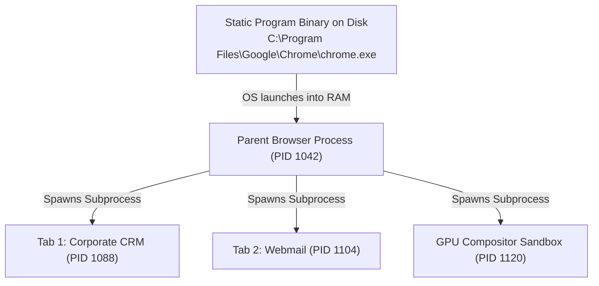
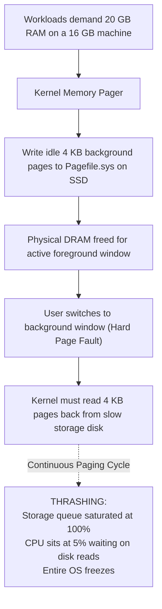
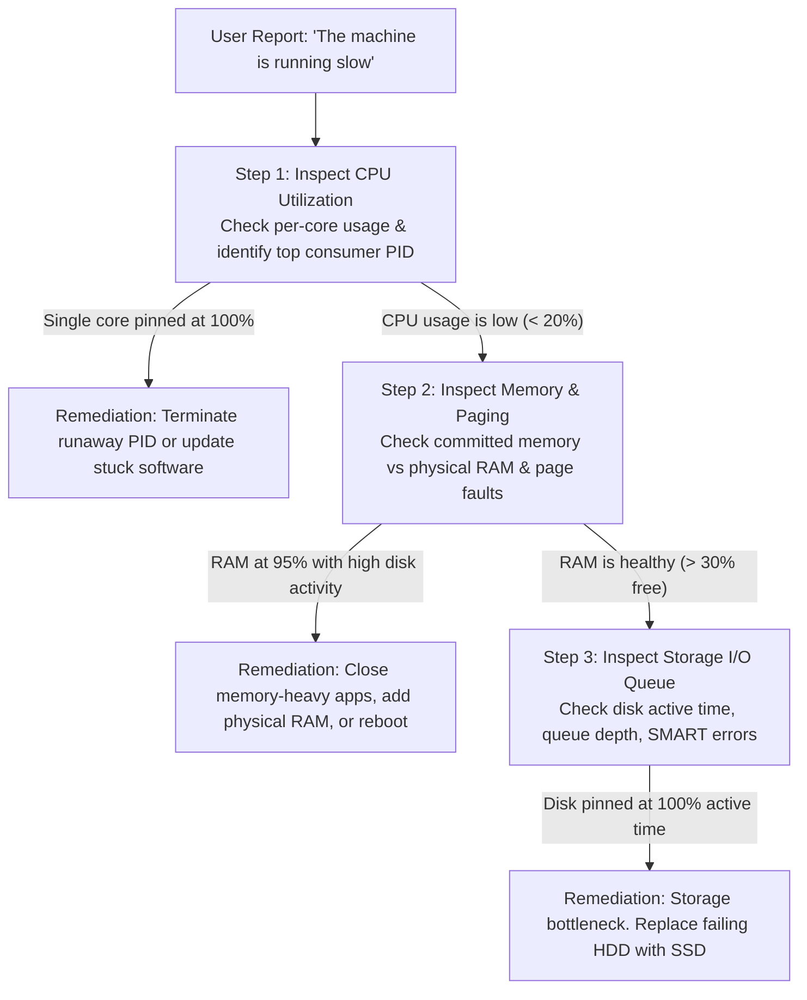

<Concepts items={["program", "process", "PID", "scheduler", "time slice", "context switch", "virtual memory", "paging", "swapping", "Pagefile.sys", "thrashing", "device drivers", "I/O bottleneck"]} />

<LessonIntro>

Ticket #1188: "The computer is slow!" That sentence is a generic symptom, not a diagnosis. 

Underneath that complaint, one of three physical hardware resources is exhausted: CPU time slices, physical RAM capacity, or storage I/O bandwidth. To diagnose which subsystem failed, you must understand the kernel's two great architectural illusions: running dozens of programs "simultaneously" on physical cores that execute one instruction at a time, and simulating more memory than the motherboard DIMM slots actually hold. This lesson covers programs versus processes, scheduler time slices, virtual memory paging, and the exact triage method that turns "slow" into a definitive fix.

</LessonIntro>

## Why this matters

"The machine is running slowly" is the single most common ticket in enterprise IT support:

* **Surgical Process Intervention:** Novice technicians reboot servers and workstations whenever performance degrades, interrupting active user workflows. A skilled technician inspects process resource consumption and terminates the specific runaway **Process ID (PID)** via PowerShell, Terminal, or Task Manager.
* **Diagnosing Invisible Thrashing:** When a machine freezes, the CPU utilization often registers at only $10\%$. Without understanding virtual memory, technicians assume the processor is healthy. In reality, the machine is suffering from **thrashing** — the CPU is completely idle because it is stalled waiting on slow disk swap files.
* **Per-Core Saturation Detection:** On an 8-core CPU, a single-threaded program caught in an infinite loop pegs one core at $100\%$ while overall CPU usage registers as only $12.5\%$. Looking at the aggregate CPU percentage masks the bottleneck.
* **Memory Leak Identification:** Software bugs that continuously allocate RAM without releasing it gradually force the kernel to page other running applications to disk, causing progressive system slowdowns over days.

---

## 01 — Program vs Process: From Passive Binary to Active Memory

At the operating system level, software transitions from inert disk storage into dynamic execution:

<ConceptCard name="Program" category="Passive Code">

**What it is.** A static set of compiled instructions stored on persistent secondary storage (e.g. `chrome.exe` or `/usr/bin/bash`).

**How it works.** It consumes disk space but executes nothing and uses no CPU cycles until the kernel loads it into RAM. Deleting the program removes the template; it touches no running state.

</ConceptCard>

<ConceptCard name="Process" category="Active Instance">

**What it is.** An actively executing instance of a program loaded into system RAM.

**How it works.** The kernel assigns each process a unique **Process ID (PID)**, a dedicated memory address space, and scheduled CPU time. One program can spawn many independent processes — three browser windows means three isolated instances, each with its own PID and memory.

</ConceptCard>

### The Multi-Process Architecture

Consider a web browser: when you launch Google Chrome, the operating system does not create one monolithic process. It spawns an orchestrator browser process, separate processes for each open browser tab, dedicated processes for GPU compositing, and isolated sandbox processes for extensions. 

*Figure 14.1 — Multi-process isolation: killing one crashed tab leaves the parent browser and adjacent tabs running.*

If a poorly coded JavaScript application crashes Tab 1, only **PID 1088** terminates. The parent process and all other tabs remain unaffected.

---

## 02 — The Process Scheduler & Preemptive Multitasking

Because a single physical CPU core can only execute instructions sequentially, the kernel fakes simultaneity through high-speed scheduling:

<ConceptCard name="Process Scheduler" category="CPU Arbitration">

**What it is.** A core kernel algorithm that decides the order, priority, and duration for each process to run on the CPU.

**How it works.** Because one CPU core executes one instruction at a time, the scheduler rapidly rotates processes onto the core. Priorities, fairness rules, and wake-up events decide who runs next; everything else waits in a queue.

</ConceptCard>

<ConceptCard name="Time Slices and Context Switching" category="Multitasking Mechanism">

**What it is.** Microscopic CPU intervals (often 10 to 50 milliseconds, also called quantums) granted to one process before the scheduler suspends it and switches to the next.

```mermaid
stateDiagram-v2
    [*] --> New: Program binary launched from disk
    New --> Ready: OS allocates PID and virtual memory
    Ready --> Running: Scheduler dispatches CPU time slice (quantum)
    Running --> Ready: Time slice expires (Preemptive Context Switch)
    Running --> Waiting: Process blocks on storage disk or network I/O
    Waiting --> Ready: I/O operation completes; interrupt raised
    Running --> Terminated: Process finishes or receives SIGKILL (kill -9)
    Terminated --> [*]
```

**How it works.** Each switch saves the outgoing process's registers and loads the incoming one's — a context switch — thousands of times per second. The result is preemptive multitasking: the convincing illusion of simultaneity. When a rogue app monopolises the CPU, support intervenes via Task Manager (Windows), Activity Monitor (macOS), or `kill -9 <PID>` (Linux).

</ConceptCard>

*Figure 14.2 — The complete process lifecycle state machine.*

### Context Switching Mechanics

When the scheduler rotates execution:
1. The CPU generates a hardware timer interrupt.
2. The kernel pauses the running thread and saves its hardware registers, Program Counter (PC), and stack pointer into its **Process Control Block (PCB)** in RAM.
3. The kernel selects the next high-priority process from the Ready queue.
4. The incoming process's register state is restored into physical CPU registers, and execution resumes. This transition takes microseconds.

---

## 03 — Virtual Memory Paging & The Thrashing Catastrophe

To allow systems to run workloads larger than physically installed RAM, the operating system kernel coordinates physical DRAM with secondary storage:

<ConceptCard name="Virtual Memory" category="Capacity Illusion">

**What it is.** A scheme that simulates additional RAM by combining physical RAM with dedicated disk space — `Pagefile.sys` on Windows, a swap partition or file on Linux.

**How it works.** Every process gets a large private virtual address space; the kernel maps the hot parts onto physical RAM and parks the cold parts on disk. Programs behave as if RAM were plentiful even when it is not.

</ConceptCard>

<ConceptCard name="Memory Paging and Swapping" category="Capacity Mechanism">

**What it is.** The kernel's method of moving memory in uniform pages (commonly 4 KB) between RAM and disk swap space.

**How it works.** When RAM fills, the kernel identifies inactive background pages, writes them to swap, and frees high-speed RAM for the foreground app. Accessing a swapped-out page triggers a page fault: the kernel reads it back from disk and resumes the process.

</ConceptCard>

<ConceptCard name="Thrashing and Disk Latency" category="Failure Mode">

**What it is.** The collapse that follows excessive swapping, when the system spends more time shuttling pages than executing work.

**How it works.** Even fast NVMe storage is thousands of times slower than RAM, so heavy swapping shows up as latency — every click lags. Push further and the system thrashes: near-zero useful throughput with the disk light permanently on.

</ConceptCard>

*Figure 14.3 — Memory pressure progression from normal paging to system thrashing.*

---

## 04 — I/O Management & Storage Bottlenecks

System performance depends heavily on the speed of peripheral data transfers:

<ConceptCard name="I/O Management and Bottlenecks" category="Device Coordination">

**What it is.** The kernel subsystem coordinating all data transfers to and from peripherals through device drivers.

**How it works.** When the storage queue saturates or a network adapter stalls, processes queue up waiting for reads and writes that never arrive — a bottleneck that looks like CPU or memory slowness but is neither, so diagnosis must check all three subsystems.

</ConceptCard>

When a storage drive encounters bad sectors or a network interface drops packets, processes enter the **Waiting (Blocked)** state. The CPU cannot advance their instructions, and the user interface freezes waiting for I/O completion. In Linux `top`, this surfaces as high **`%wa` (I/O Wait)**; in Windows Performance Monitor, it appears as **Avg. Disk Queue Length** $> 2$.

---

## 05 — Support-Desk Triage: "The Computer is Slow!" Method

When resolving system slowness tickets, follow this structured 4-step diagnostic sequence:

*Figure 14.4 — The three-tier performance triage decision tree.*

1. **Check CPU first:** Sustained 100% on a core with one specific process on top points to an infinite execution loop or malware. Terminate the offending PID via Task Manager or `kill -9 <PID>`.
2. **Check memory second:** If RAM is fully saturated and storage activity is continuous, the machine is thrashing. Close unused applications or install higher-capacity DIMMs.
3. **Check storage I/O third:** If CPU is low ($<20\%$) and RAM has free capacity, inspect disk active time and SMART telemetry. A failing mechanical drive retrying bad sectors will freeze the entire operating system.
4. **Intervene precisely:** Kill the specific PID rather than power-cycling the machine; observe whether responsiveness recovers immediately (CPU bottleneck), drains gradually (paging backlog clearing), or remains stalled (I/O hardware failure).

### Diagnostic Scenarios

* **Obvious — Process Isolation in Action:** When a user opens three separate browser windows, the kernel allocates three distinct PIDs with isolated virtual memory spaces. Force-killing one unresponsive tab leaves the other two windows completely operational.
* **Counter-intuitive — Why Adding RAM Cures "Slow CPUs":** A user complains that their Intel Core i7 CPU feels slow. Upgrading the machine from 8 GB to 32 GB of RAM resolves the problem instantly. The CPU was never weak; it was idling in I/O wait states while the kernel struggled to swap memory pages to a slow mechanical disk.
* **Edge case — Single-Core Saturation Masked by Quad-Core Averages:** On an 8-core CPU, a single runaway thread consumes 100% of Core 3. The aggregate CPU meter in Task Manager reports only $12.5\%$ utilization, misleading junior technicians. Checking per-core utilization reveals the locked thread immediately.

<AnalogyCard name="A Single-Cashier Food Court">

**The concept.** One CPU core serves hundreds of processes in millisecond turns; virtual memory is the overflow waiting area spilling onto slower pavement outside.

**The analogy.** The cashier (core) serves each customer (process) for ten seconds (time slice), then calls next — everyone feels served at once. When the indoor queue (RAM) overflows onto the street (swap), every order takes ten times longer, and the cashier looks slow while actually waiting on the crowd.

</AnalogyCard>

<LessonNote variant="myth" title="What people get wrong about slowness">

**Myth:** "High CPU usage in Task Manager always means the processor is too weak."

**Truth:** Sustained 100% CPU often means one stuck thread, and near-zero CPU with a frozen system often means memory thrashing or I/O blockage. The bottleneck is whichever resource queues longest — measure all three before recommending a hardware upgrade.

</LessonNote>

<LessonNote variant="why">

"Slow" is the most common ticket in IT and the least informative. The scheduler, paging, and I/O queue give you three meters to read — and whichever meter is pegged tells you the fix before you touch anything.

</LessonNote>

---

## Summary Checklist: Process & Memory Management Mental Model

1. **Programs are passive files; processes are active instances:** Programs sit on disk; processes hold allocated RAM, CPU scheduling priority, and a unique Process ID (PID).
2. **Multitasking is time-sliced scheduling:** The kernel scheduler grants 10–50 ms quantums, saving and restoring registers across rapid context switches.
3. **Virtual memory combines RAM and disk swap:** The kernel pages idle 4 KB memory chunks to disk (`pagefile.sys` or swap) to free physical RAM for active foreground tasks.
4. **Thrashing is the failure state of virtual memory:** When memory demand heavily outstrips physical RAM, disk queues hit 100% and system throughput collapses.
5. **Always measure CPU, RAM, and I/O independently:** Slowness can stem from stuck CPU loops, memory thrashing, or saturated disk queues; measure all three meters before prescribing upgrades.

---

<QuickRecall title="Quick Recall — Processes and Memory">

Before moving on, try to answer these from memory:

1. What does `kill -9 <PID>` do, and why does it need a PID rather than a program name?
2. Why does a RAM shortage show up as disk activity?
3. CPU reads 20% but the machine is frozen with the disk light solid. What is your leading hypothesis?

Reveal answers

1. It force-terminates one specific running process instance; program names are ambiguous because one program can own multiple PIDs.
2. The kernel pages idle memory to swap to free physical RAM, converting memory access into slow disk I/O.
3. Memory thrashing or an I/O bottleneck — the CPU is idle waiting on disk page faults, not overloaded with computation.

</QuickRecall>

This connects to the next lesson because once processes run, humans need ways to see and steer them — the graphical desktop for consumers and the command-line shell plus system logs for you.
