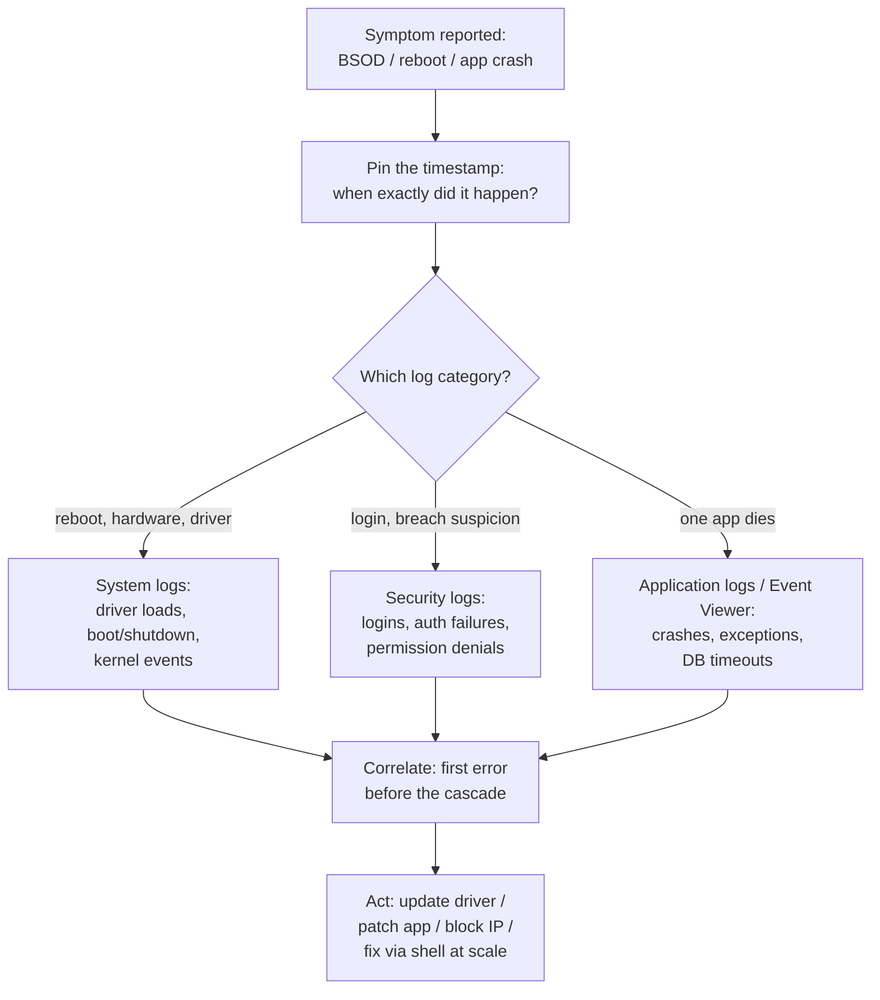

<Concepts items={["GUI","CLI","shell","Bash","PowerShell","cmd.exe","system logs","security logs","application logs","Event Viewer","root-cause analysis"]} />

<LessonIntro>

Ticket #1520: "The app crashed again — it just closed, no error." The user saw the GUI moment; the truth is in the logs. Every operating system offers two steering wheels — the point-and-click **Graphical User Interface (GUI)** for consumers and the typed **Command Line Interface (CLI)** for administrators — and both leave trails in **system logs**. This lesson compares GUI versus CLI, maps the Bash and PowerShell shell families, classifies the four log categories, and builds the root-cause flow you will use on every mysterious crash.

</LessonIntro>

The GUI and the CLI are both user-space programs issuing the same system calls underneath. The difference is leverage: the GUI shows one machine's state beautifully, while a shell command can query a hundred machines identically — and the logs remember what neither operator wrote down.

## Concept Breakdown: What It Is & How It Works

<ConceptCard name="Graphical User Interface (GUI)" category="Visual Interaction">

**What it is.** The mouse-driven layer of windows, icons, menus, and touch gestures most users call "the computer."

**How it works.** Every click translates into the same system calls a shell would issue, wrapped in visual metaphors — dragging a file triggers copy calls, clicking Wi-Fi triggers network calls. Examples: Windows Desktop and File Explorer, macOS Finder and Dock, GNOME/KDE on Linux. Ideal for consumers, kiosks, ATMs, and smartphones.

</ConceptCard>

<ConceptCard name="Command Line Interface (CLI) / Shell" category="Text Interaction">

**What it is.** A text prompt where typed commands are interpreted and executed, the primary tool of IT specialists, systems engineers, cloud architects, and automation scripts.

**How it works.** The operator types a command; the shell parses it and issues the corresponding system calls to the kernel. No thumbnails, no drag-and-drop — but every action is repeatable, scriptable, and identical across a fleet of machines.

</ConceptCard>

<ConceptCard name="The Shell" category="Command Interpreter">

**What it is.** A specialised user-space program that reads text commands from users or scripts, parses them, and requests kernel execution.

**How it works.** It sits between the terminal and the system call interface: expanding wildcards, chaining programs with pipes, handling permissions and exit codes, and returning text output. Bash, PowerShell, Zsh, and cmd.exe are all shells with different philosophies.

</ConceptCard>

<ConceptCard name="Bash" category="Unix Shell">

**What it is.** The Bourne Again Shell, the universal standard on Linux servers and macOS terminals.

**How it works.** Built on the Unix philosophy of text streams: small tools chained with pipes (`|`), filtered with `grep`, reshaped with `awk`. A one-liner can scan thousands of log lines across hundreds of servers identically.

</ConceptCard>

<ConceptCard name="PowerShell" category="Windows Shell">

**What it is.** Windows' object-oriented shell and scripting language.

**How it works.** Instead of passing raw text between commands, cmdlets pass structured .NET objects with named properties — so `Get-Process | Stop-Process` acts on real process objects, not on screen-scraped columns. The modern choice for Windows fleet administration.

</ConceptCard>

<ConceptCard name="System and Security Logs" category="Log Categories">

**What it is.** Persistent chronological files documenting what the machine did: hardware and kernel events (system logs) versus authentication and permission events (security logs).

**How it works.** System logs record driver loads, startup and shutdown times, and kernel errors. Security logs record who logged in, which passwords failed, and which permission checks were denied — the first place to look for intrusions or brute-force attempts.

</ConceptCard>

<ConceptCard name="Application Logs and Event Viewer" category="Log Categories">

**What it is.** Per-software crash and exception records (application logs), centralised on Windows in Event Viewer (`eventvwr.msc`) under Application, Security, Setup, and System.

**How it works.** When an enterprise app throws an exception or a database connection times out, the application log captures the stack trace and error code with a timestamp. Event Viewer unifies all four Windows categories behind one searchable console.

</ConceptCard>

## Step-by-step breakdown

1. **Reproduce or timestamp the symptom.** Ask exactly when the crash, reboot, or Blue Screen happened — log forensics starts from a clock time.
2. **Pick the log category.** Unexpected reboot points at System logs; failed logins at Security; one app dying at Application (or Event Viewer's Application node).
3. **Correlate.** Match the user's timestamp against recorded error codes and the events immediately before it — the culprit is usually the first error in the cascade, not the last.
4. **Identify the component.** A driver that failed to initialise, a service that timed out, or an IP spraying password attempts each names its owner in the log entry.
5. **Act through the right interface.** Fix one machine in the GUI; fix fifty with a shell one-liner or script so the remediation is identical everywhere.

## Shell environments compared

| Shell Environment | Operating System | Key Strengths & Features |
| --- | --- | --- |
| **Bash (Bourne Again Shell)** | Linux & macOS | Universal standard on Unix/Linux servers. Text stream pipeline processing via UNIX philosophy (`\|`, `grep`, `awk`). |
| **PowerShell** | Windows | Object-oriented shell and scripting language. Passes structured .NET objects between commands (cmdlets) rather than raw text streams. |
| **Command Prompt (cmd.exe)** | Windows (Legacy) | Legacy DOS-compatible command interpreter for basic batch scripting and backward compatibility. |

## Root-cause flow with logs

*Figure 15.1 — Root-cause analysis with logs. Start from the user's timestamp, choose the matching log category, and treat the first error in the sequence as the prime suspect.*

## Examples

- **Obvious —** A user reports a 2:14 PM crash; the Application log shows the database client timing out at 2:13:58 PM. Timestamp correlation turns a vague complaint into a network ticket in one step.
- **Counter-intuitive —** The GUI shows "no errors" while the logs overflow with warnings. Healthy-looking screens hide failing drivers and retry storms — absence of popups is not absence of faults, which is why support reads logs before believing screenshots.
- **Edge case —** A laptop crashes only on Tuesdays at 9 AM. Logs reveal a scheduled backup agent colliding with antivirus scans — an intermittent fault no interactive test would catch, visible only as a weekly pattern in timestamps.

## Support-desk triage: crashes and mysteries

1. **Get the exact time first.** "This morning" is not a timestamp — narrow it to the minute before opening any log.
2. **Check the matching category.** Boot loop goes to System; lockout goes to Security; single-app death goes to Application/Event Viewer.
3. **Read backward from the failure.** Scroll above the crash entry: the driver that failed to initialise or the service that timed out first is usually the cause; everything after is collateral.
4. **Prefer the shell for scale.** One `grep` across rotated logs, or one PowerShell query across fifty Event Viewer remotes, beats clicking through fifty GUIs.

<AnalogyCard name="A Flight Data Recorder">

**The concept.** Logs are the aircraft black box: the GUI is what passengers saw, the shell is the cockpit controls, and the log is what the instruments recorded second by second.

**The analogy.** Passengers (users) report "a bang"; investigators (support) ignore opinions and read the recorder — altitude, warnings, and the exact second the engine (driver) failed. Fix the engine, not the passengers' story.

</AnalogyCard>

<LessonNote variant="myth" title="What people get wrong about interfaces">

**Myth:** "The command line is obsolete now that GUIs are so good."

**Truth:** GUIs optimise one machine for one human; shells optimise a thousand machines for one script. Cloud fleets, CI pipelines, and remote servers often have no screen at all — the CLI is the only interface that scales, which is why every support role still tests it.

</LessonNote>

<LessonNote variant="why">

Users describe symptoms; logs record causes. The habit of asking "what time did it happen?" before "what did you click?" separates technicians who guess from technicians who diagnose.

</LessonNote>

This connects to the next lesson because the earliest logs a machine ever writes appear during startup — and reading them requires understanding the six-step boot sequence that produces a login screen.

<QuickRecall title="Quick Recall — Shells and Logs">

Before moving on, try to answer these from memory:

1. A server reboots overnight with no one logged in. Which log category do you open first?
2. Why does PowerShell's object pipeline beat text scraping for fleet scripts?
3. What two facts must you extract from the user before opening any log?

Reveal answers

1) System logs — they record kernel events, driver loads, and startup/shutdown times. 2) Cmdlets pass typed .NET objects with named properties, so filtering and action are exact rather than dependent on column spacing. 3) The exact timestamp of the failure and which component visibly failed, so you pick the right log category and correlation window.

</QuickRecall>
