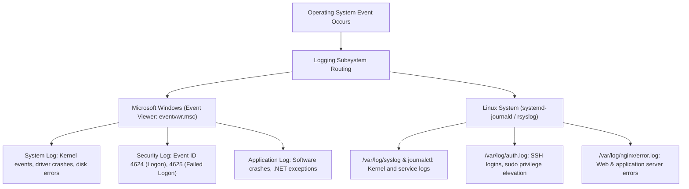
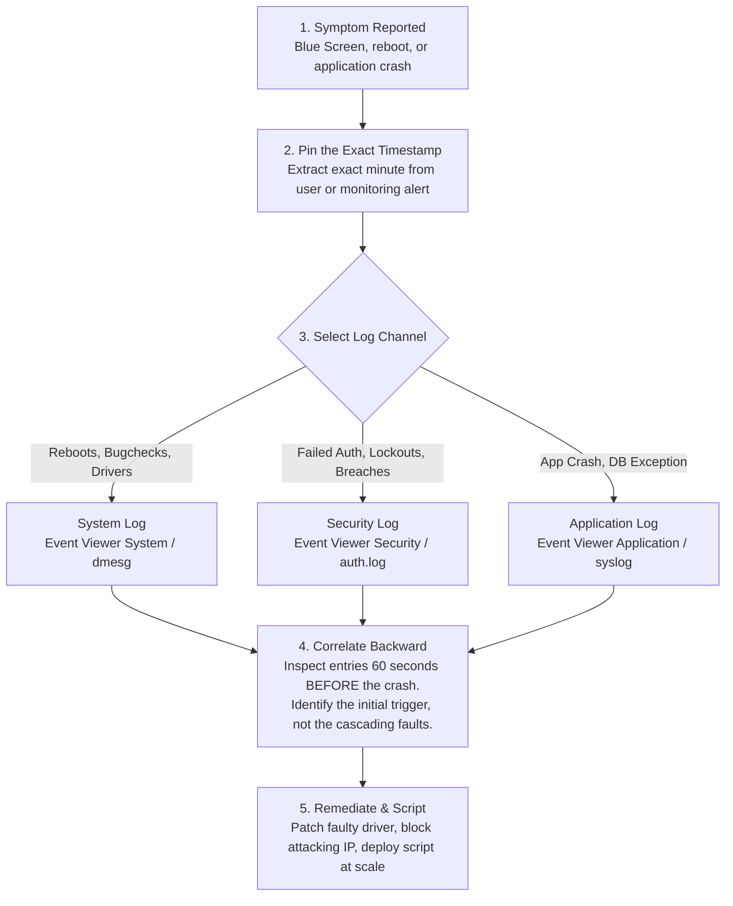

<Concepts items={["GUI", "CLI", "shell", "Bash", "PowerShell", "cmd.exe", "system logs", "security logs", "application logs", "Event Viewer", "root-cause analysis"]} />

<LessonIntro>

Ticket #1520: "The app crashed again — it just closed, no error." The user experienced the sudden GUI disappearance; the truth sits recorded in the system logs. 

Every operating system provides two steering wheels: the point-and-click **Graphical User Interface (GUI)** for end-user productivity, and the typed **Command Line Interface (CLI)** for system administration and automation. When software fails, both interfaces leave an immutable audit trail in **system logs**. This lesson compares GUI versus CLI interaction models, maps the Bash and PowerShell shell architectures, categorizes enterprise logging systems, and establishes the root-cause triage workflow you will use on every crash.

</LessonIntro>

## Why this matters

In IT support and systems engineering, the ability to read logs and command the shell separates amateur guess-and-check technicians from true diagnostic engineers:

* **No-Error App Disappearances:** When an enterprise application vanishes from the screen without displaying a dialog box, the graphical shell cannot explain why. Opening Windows Event Viewer (`eventvwr.msc`) or inspecting Linux `/var/log/syslog` immediately exposes the unhandled .NET null-pointer exception or kernel Out-Of-Memory (OOM) kill.
* **Managing Fleets at Scale:** Clicking through the GUI to verify a registry key or update a driver on one machine takes three minutes. Querying a fleet of 500 remote workstations with a PowerShell script (`Invoke-Command`) takes ten seconds.
* **Forensic Timestamp Correlation:** System stability issues frequently produce cascading failures: a network timeout triggers a database connection pool crash, which crashes the web server. Technicians who look at the latest error fix the wrong component; technicians who correlate by timestamp identify the root cause that started the chain.
* **Brute-Force & Security Auditing:** Identifying suspicious login bursts or privilege escalation attempts requires inspecting the Security log (such as Windows Event ID 4625: An account failed to log on).

---

## 01 — Interaction Paradigms: GUI vs CLI

Both the Graphical User Interface and the Command Line Interface run in unprivileged User Space (Ring 3), issuing the identical system calls to the operating system kernel:

<ConceptCard name="Graphical User Interface (GUI)" category="Visual Interaction">

**What it is.** The mouse-driven layer of windows, icons, menus, and touch gestures most users call "the computer."

**How it works.** Every click translates into the same system calls a shell would issue, wrapped in visual metaphors — dragging a file triggers copy calls, clicking Wi-Fi triggers network calls. Examples: Windows Desktop and File Explorer, macOS Finder and Dock, GNOME/KDE on Linux. Ideal for consumers, kiosks, ATMs, and smartphones.

</ConceptCard>

<ConceptCard name="Command Line Interface (CLI) / Shell" category="Text Interaction">

**What it is.** A text prompt where typed commands are interpreted and executed, the primary tool of IT specialists, systems engineers, cloud architects, and automation scripts.

**How it works.** The operator types a command; the shell parses it and issues the corresponding system calls to the kernel. No thumbnails, no drag-and-drop — but every action is repeatable, scriptable, and identical across a fleet of machines.

</ConceptCard>

<ConceptCard name="The Shell" category="Command Interpreter">

**What it is.** A specialised user-space program that reads text commands from users or scripts, parses them, and requests kernel execution.

**How it works.** It sits between the terminal and the system call interface: expanding wildcards, chaining programs with pipes, handling permissions and exit codes, and returning text output. Bash, PowerShell, Zsh, and cmd.exe are all shells with different philosophies.

</ConceptCard>

| Interaction Dimension | Graphical User Interface (GUI) | Command Line Interface (CLI) |
| :--- | :--- | :--- |
| **Primary Input Modality** | Mouse clicks, touch gestures, drag-and-drop. | Typed text strings, shell script pipelines. |
| **Resource Overhead** | High (loads GPU textures, window compositors, font caches). | Minimal (pure text memory buffers; runs over 22-port SSH). |
| **Fleet Scalability** | Low (operates on 1 physical screen at a time). | Exponential (executes across thousands of nodes in parallel). |
| **Automation Capability** | Difficult (requires fragile UI click-automation tools). | Native (fully scriptable with deterministic exit codes). |

---

## 02 — Shell Environments: Bash vs PowerShell vs cmd.exe

Different operating systems deploy distinct shell architectures based on text-stream or object-oriented philosophies:

<ConceptCard name="Bash" category="Unix Shell">

**What it is.** The Bourne Again Shell, the universal standard on Linux servers and macOS terminals.

**How it works.** Built on the Unix philosophy of text streams: small tools chained with pipes (`|`), filtered with `grep`, reshaped with `awk`. A one-liner can scan thousands of log lines across hundreds of servers identically.

</ConceptCard>

<ConceptCard name="PowerShell" category="Windows Shell">

**What it is.** Windows' object-oriented shell and scripting language.

**How it works.** Instead of passing raw text between commands, cmdlets pass structured .NET objects with named properties — so `Get-Process | Stop-Process` acts on real process objects, not on screen-scraped columns. The modern choice for Windows fleet administration.

</ConceptCard>

### Shell Environments Compared

| Shell Environment | Default Platform | Data Pipeline Model | Example Administration Command |
| :--- | :--- | :--- | :--- |
| **Bash (Bourne Again Shell)** | Linux, macOS | **Raw Text Streams:** Pipes (`\|`) pass ASCII/UTF-8 byte streams filtered via `grep`, `awk`, `sed`. | `grep "Failed password" /var/log/auth.log \| awk '{print $11}' \| sort \| uniq -c` |
| **PowerShell** | Windows 10/11, Server | **Structured .NET Objects:** Cmdlets pass rich objects with strongly typed properties and methods. | `Get-Process \| Where-Object CPU -gt 50 \| Stop-Process -Force` |
| **Command Prompt (`cmd.exe`)** | Windows (Legacy) | **Legacy MS-DOS Strings:** Flat batch scripts with basic string substitution; maintained for backward compatibility. | `chkdsk C: /f && ipconfig /flushdns` |

---

## 03 — System Logging Architecture & Categories

Operating systems maintain persistent, chronological audit logs documenting every hardware, kernel, and software event:

<ConceptCard name="System and Security Logs" category="Log Categories">

**What it is.** Persistent chronological files documenting what the machine did: hardware and kernel events (system logs) versus authentication and permission events (security logs).

**How it works.** System logs record driver loads, startup and shutdown times, and kernel errors. Security logs record who logged in, which passwords failed, and which permission checks were denied — the first place to look for intrusions or brute-force attempts.

</ConceptCard>

<ConceptCard name="Application Logs and Event Viewer" category="Log Categories">

**What it is.** Per-software crash and exception records (application logs), centralised on Windows in Event Viewer (`eventvwr.msc`) under Application, Security, Setup, and System.

**How it works.** When an enterprise app throws an exception or a database connection times out, the application log captures the stack trace and error code with a timestamp. Event Viewer unifies all four Windows categories behind one searchable console.

</ConceptCard>

### Windows Event Viewer vs Linux Syslog

*Figure 15.1 — Enterprise logging channels across Windows and Linux.*

---

## 04 — Root-Cause Analysis: The Log Forensic Method

When diagnosing an unexplained outage, never guess. Follow this 5-step forensic investigative workflow:

*Figure 15.2 — Root-cause analysis methodology with logs.*

1. **Pin the timestamp to the minute:** Never begin searching with "sometime this morning." Confirm the exact minute the user observed the failure.
2. **Select the log channel:** Hardware and kernel restarts go to **System**; authentication and lockouts go to **Security**; application exceptions go to **Application**.
3. **Correlate events chronologically:** Find the timestamp and read backward. The driver or database timeout that occurred 2 seconds before the crash is the true root cause.
4. **Isolate the responsible component:** The log entry explicitly records the faulting module (e.g. `nvlddmkm.sys` for Nvidia drivers or `kernelbase.dll` for Windows runtime).
5. **Remediate at scale:** Fix the issue using a PowerShell or Bash one-liner deployed across all workstations rather than manually touching each individual PC.

---

## 05 — Helpdesk Scenarios & Diagnostic Workflows

### Triage Matrix

| User Complaint | Target Log Location | Diagnostic Event ID / Log Indicator | Remediation Action |
| :--- | :--- | :--- | :--- |
| **Server spontaneously restarted overnight with no users logged in.** | Windows System Log | **Event ID 41 (Kernel-Power)** preceded by **Event ID 1001 (BugCheck)** | Analyze memory dump (`C:\Windows\MEMORY.DMP`) with WinDbg to identify faulting driver. |
| **Executive locked out of account; insists password was typed correctly.** | Windows Security Log | **Event ID 4625 (An account failed to log on)** from an external IP | Account targeted by brute-force attack or cached stale credentials on a mobile device. |
| **Accounting software crashes instantly on launch with zero error message.** | Windows Application Log | **Event ID 1000 (Application Error)** citing `clr.dll` (.NET Framework) | Reinstall or repair the Microsoft .NET Framework runtime package. |

### Practical Support Scenarios

* **Obvious — The Correlated Timeout:** A user reports that their accounting software crashed at 2:14 PM. Checking the Application log reveals a database timeout recorded at 2:13:58 PM. Correlating the timestamp proves the software did not have a bug; the backend database server briefly dropped network connectivity.
* **Counter-intuitive — Silent Failures in the GUI:** A laptop shows no error messages, popups, or warnings on the desktop. Inspecting the System log reveals 4,000 disk controller timeout warnings over the past two hours. The mechanical drive is failing and retrying sector reads silently behind the scenes.
* **Edge case — The Intermittent Scheduled Task Collision:** A workstation crashes every Tuesday morning at exactly 9:02 AM, but passes all diagnostic tests when inspected in person. System logs reveal that a corporate antivirus full scan was scheduled for Tuesday at 9:00 AM, colliding with an uncompressed automated backup agent, exhausting disk I/O and tripping watchdog timers.

<AnalogyCard name="A Flight Data Recorder">

**The concept.** Logs are the aircraft black box: the GUI is what passengers saw, the shell is the cockpit controls, and the log is what the instruments recorded second by second.

**The analogy.** Passengers (users) report "a bang"; investigators (support) ignore opinions and read the recorder — altitude, warnings, and the exact second the engine (driver) failed. Fix the engine, not the passengers' story.

</AnalogyCard>

<LessonNote variant="myth" title="What people get wrong about interfaces">

**Myth:** "The command line is obsolete now that GUIs are so good."

**Truth:** GUIs optimise one machine for one human; shells optimise a thousand machines for one script. Cloud fleets, CI pipelines, and remote servers often have no screen at all — the CLI is the only interface that scales, which is why every support role still tests it.

</LessonNote>

<LessonNote variant="why">

Users describe symptoms; logs record causes. The habit of asking "what time did it happen?" before "what did you click?" separates technicians who guess from technicians who diagnose.

</LessonNote>

---

## Summary Checklist: Shells & System Logs Mental Model

1. **Both GUI and CLI run in user space:** Both interfaces issue the exact same system calls to Ring 0; the CLI provides scalable, reproducible automation.
2. **Bash streams text; PowerShell passes objects:** Bash chains raw text via Unix pipes (`|`); PowerShell passes typed .NET objects with accessible properties.
3. **Logs divide into four core channels:** System (kernel/drivers), Security (authentication/privilege), Application (software crashes), and Setup (patches).
4. **Log forensics starts with a timestamp:** Pin down the exact minute of failure and scroll backward to identify the primary root cause before the cascade.
5. **Always prefer CLI remediation at scale:** Diagnose individual machines using logs, but deploy solutions across the fleet using automated shell scripts.

---

<QuickRecall title="Quick Recall — Shells and Logs">

Before moving on, try to answer these from memory:

1. A server reboots overnight with no one logged in. Which log category do you open first?
2. Why does PowerShell's object pipeline beat text scraping for fleet scripts?
3. What two facts must you extract from the user before opening any log?

Reveal answers

1. System logs — they record kernel events, driver loads, and startup/shutdown times.
2. Cmdlets pass typed .NET objects with named properties, so filtering and action are exact rather than dependent on text column spacing.
3. The exact timestamp of the failure and which component visibly failed, so you pick the right log category and correlation window.

</QuickRecall>

This connects to the next lesson because the earliest logs a machine ever writes appear during startup — and reading them requires understanding the six-step boot sequence that produces a login screen.
