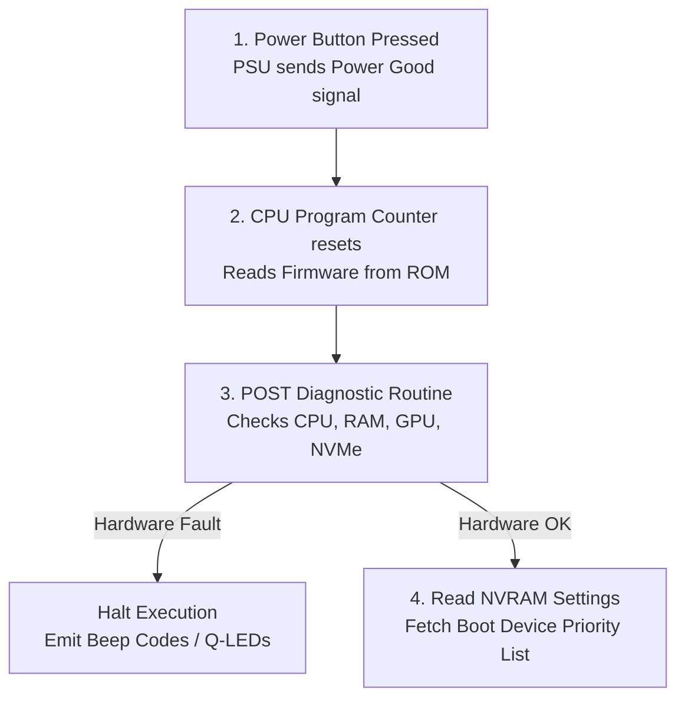
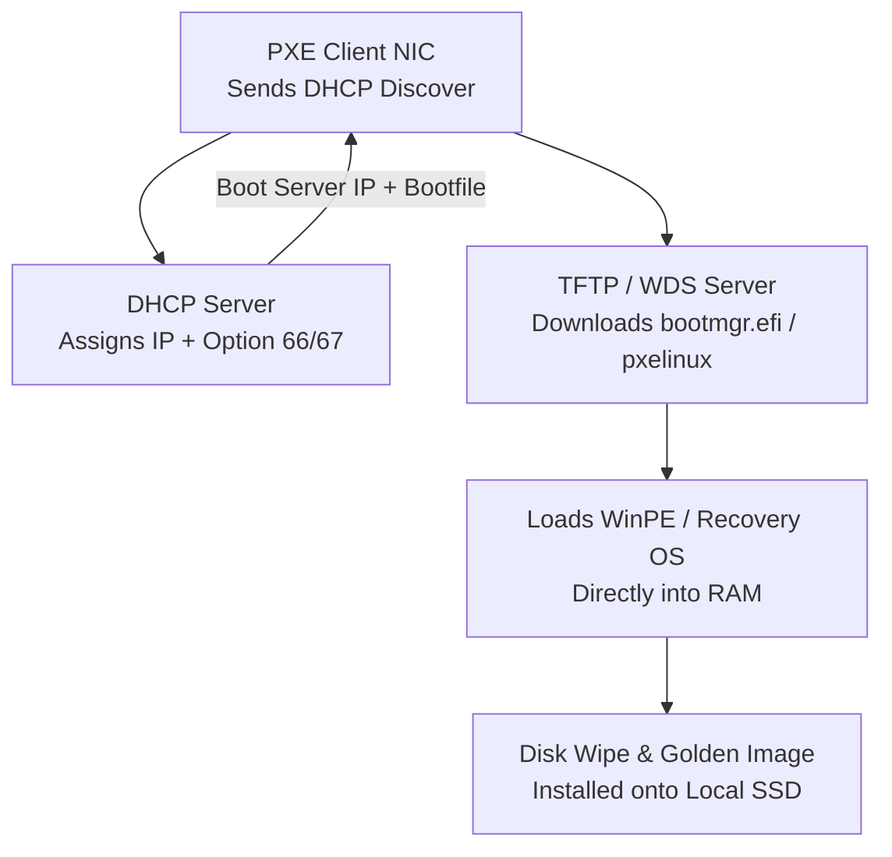

<Concepts items={["boot process", "BIOS", "UEFI", "POST", "boot priority", "bootloader", "GRUB", "kernel loading", "systemd", "partitions", "dual boot", "PXE", "Etcher"]} />

<LessonIntro>

Ticket #0901: "PC won't start — black screen, no Windows." The user reports one catastrophic failure; an IT technician must locate it across six precise sequential stages. When electricity first arrives, RAM is completely empty and the CPU knows nothing — the machine must literally pull itself up by its bootstraps, executing progressively smarter layers of code until the kernel claims Ring 0. This lesson breaks down that six-stage relay race, arms you with boot triage forensics, and explores rescue routes — partitioning, dual-boot setups, USB recovery environments, and enterprise PXE network deployment.

</LessonIntro>

## Why this matters

In IT support, "My PC won't turn on" is simultaneously the most common and most ambiguous ticket submitted to the helpdesk. Users conflate a loose power cable, a failed RAM stick, a corrupted partition table, and a stuck Windows update into the exact same sentence.

- **Elimination by stage:** If you understand the boot chain, the last visual or audible signal emitted by the computer tells you exactly which stage succeeded and which stage failed.
- **Data salvage:** When internal OS files corrupt, knowing how to boot into alternate media (Live USB or PXE) lets you salvage mission-critical files before re-imaging.
- **Fleet deployment:** Enterprise IT doesn't install Windows by walking around with USB sticks; they use PXE network booting to push standardized OS images across hundreds of workstations simultaneously.
- **Security enforcement:** UEFI Secure Boot guards against kernel-level rootkits, ransomware that modifies the Master Boot Record, and unauthorized bootable devices.

---

## 01 — Firmware Initialization & POST (Steps 1 & 2)

Booting begins at the silicon level. The instant power stabilises, the CPU's program counter resets to a hardcoded memory address mapped directly to motherboard non-volatile ROM containing firmware (legacy BIOS or modern UEFI).

<ConceptCard name="BIOS / UEFI Firmware" category="Boot Step 1">

**What it is.** Low-level firmware stored in motherboard non-volatile ROM/Flash chip that runs the instant power stabilises.

**How it works.** The CPU resets into this firmware, which initialises core motherboard controllers, chipset buses, and exposes the hardware setup utility and Boot Priority Order. UEFI (Unified Extensible Firmware Interface) is the modern 64-bit standard with mouse navigation, GPT support, and cryptographic Secure Boot.

</ConceptCard>

### The Power-On Self-Test (POST)

Before any storage drive is queried, the firmware must verify that the underlying physical hardware is mathematically capable of computing.

<ConceptCard name="Power-On Self-Test (POST)" category="Boot Step 2">

**What it is.** The firmware's internal diagnostic scan of mission-critical hardware — CPU, system RAM, GPU, and primary bus controllers — executed before loading any storage device.

**How it works.** Each component is probed in sequence. If all critical tests pass, the motherboard issues a single short confirmation beep (or illuminates a green status LED) and proceeds. If a critical component fails, execution halts immediately with audible beep patterns or numeric POST hex codes.

</ConceptCard>



> [!TIP]
> **Reading POST Indicators Without a Display:**
> Modern motherboards include 4 color-coded "Q-LEDs" labeled `CPU`, `DRAM`, `VGA`, and `BOOT`. If a machine powers on with black screens and fans spinning at 100%, observe the motherboard LEDs. If the LED stops at `DRAM`, reseat or test the memory sticks. If it stops at `BOOT`, the hardware is healthy but no bootable OS was found.

---

## 02 — Boot Device Selection & Bootloaders (Steps 3 & 4)

Once POST clears, the firmware interrogates the **Boot Priority Order** stored in CMOS/NVRAM. Candidates typically include NVMe drives, SATA SSDs, USB flash drives, and Network PXE adapters.

<ConceptCard name="Boot Device Selection" category="Boot Step 3">

**What it is.** The firmware's sequential search down its configured priority list for a storage medium containing a recognized boot signature.

**How it works.** In legacy BIOS, the firmware checks the first sector (LBA 0) of each drive for the hex signature `0x55AA`. In UEFI, the firmware checks the EFI System Partition (ESP) for a registered `.efi` executable file. The first valid device wins execution priority.

</ConceptCard>

<ConceptCard name="Bootloader Execution" category="Boot Step 4">

**What it is.** A lightweight binary located on the chosen drive that bridges the gap between primitive motherboard firmware and a massive, complex operating system kernel.

**How it works.** Firmware cannot parse complex multi-gigabyte filesystems. The bootloader contains just enough filesystem logic (FAT32, ext4, NTFS) to locate the OS kernel, load kernel parameters, and present an operating system selection menu if multiple systems are installed.

</ConceptCard>

### Common Bootloaders Across Operating Systems

| Operating System | Primary Bootloader | Config File / Storage | Key Function |
| :--- | :--- | :--- | :--- |
| **Windows 10/11** | Windows Boot Manager (`bootmgfw.efi`) | `\EFI\Microsoft\Boot\BCD` | Reads Boot Configuration Data (BCD) hive; launches `winload.efi`. |
| **Linux (Ubuntu, RHEL)** | GRUB 2 (`grubx64.efi`) | `/boot/grub/grub.cfg` | Displays boot menu, loads initial RAM disk (`initrd`), hands off to `vmlinuz`. |
| **macOS** | Apple BootLoader (`boot.efi`) | Preboot volume (APFS) | Mounts sealed system snapshot, verifies signature with Apple T2/Silicon secure enclave. |

> [!WARNING]
> **The Forgotten USB Stick Trap:**
> If a desktop's BIOS is configured with `USB Drive` higher than `Internal SSD` in the boot priority order, leaving an unbootable external backup drive or USB camera card plugged into the rear I/O will cause the computer to display `"No bootable operating system found"`. Unplugging the USB drive immediately restores normal boot.

---

## 03 — Kernel Loading & System Initialization (Steps 5 & 6)

The final leg of the relay race transitions control from temporary boot code to the permanent operating system kernel.

<ConceptCard name="Kernel Loading and System Init" category="Boot Steps 5–6">

**What it is.** The handoff where the bootloader copies the compressed kernel image into system RAM, decompresses it, switches the CPU into protected 64-bit Long Mode (Ring 0), and launches system daemon trees.

**How it works.** Once the kernel takes over, the bootloader is discarded from RAM. The kernel detects all peripheral hardware, binds drivers, mounts the root filesystem, and launches PID 1 (`systemd` on Linux, `smss.exe` / `csrss.exe` on Windows). PID 1 spawns background services and the display manager.

</ConceptCard>


### Visual Symptoms by Failure Stage

| Step Number | Stage Name | Visual Symptom on Screen | Likely Root Cause |
| :--- | :--- | :--- | :--- |
| **Step 1** | Firmware ROM | Completely dark screen, no fans, no LEDs | Faulty power supply, dead motherboard, dead CMOS battery. |
| **Step 2** | POST | Fans spin up, repetitive beeps or blinking Q-LEDs, black screen | Unseated RAM stick, GPU not seated, CPU socket pin damage. |
| **Step 3** | Boot Selection | `"Reboot and Select proper Boot device"`, black screen | Corrupted drive cable, dead SSD, misconfigured boot order. |
| **Step 4** | Bootloader | `grub rescue>`, `"BCD file missing or contains errors"` | Damaged EFI System Partition, overwritten bootloader after update. |
| **Step 5** | Kernel Load | Immediate Blue Screen of Death (BSOD), `INACCESSIBLE_BOOT_DEVICE` | Missing storage controller driver, disk controller mode flipped (RAID/AHCI). |
| **Step 6** | System Init | Spinning dots animation freezes forever, login prompt never renders | Stuck background service, corrupt display driver, dead audio daemon. |

---

## 04 — Partitioning, Dual-Booting & Alternate Boot Methods

A computer is not limited to booting its internal storage drive. IT technicians frequently manipulate partition schemes and utilize alternate boot pathways to recover lost systems.

<ConceptCard name="Partitions and Dual Boot" category="Multi-OS Booting">

**What it is.** Dividing a single physical drive into isolated logical containers so multiple independent operating systems (e.g. Windows 11 and Ubuntu) coexist on the same drive.

**How it works.** The drive contains a unified EFI System Partition (ESP) holding bootloaders for both systems. During boot, GRUB presents a timed selection screen. Dual-booting provides a powerful IT troubleshooting sandbox: if Windows crashes into an unbootable boot loop, you can boot into Ubuntu to access and backup your NTFS files.

</ConceptCard>

<ConceptCard name="External Boot Media and PXE" category="Alternate Boot Routes">

**What it is.** Booting an endpoint without touching its internal storage drive: bootable USB sticks (created using Rufus or Balena Etcher), external recovery enclosures, Apple Internet Recovery, or Preboot Execution Environment (PXE).

**How it works.** The firmware reads the alternate device directly into RAM. In PXE network booting, the client's network card obtains an IP address via DHCP, contacts a TFTP/WDS server, and downloads a minimal Windows PE (Preinstallation Environment) or Linux image over Ethernet.

</ConceptCard>

### Recovery & Boot Selection Keys Across Hardware

| Vendor / Platform | Hotkey (Tap repeatedly at cold start) | Utility Loaded |
| :--- | :--- | :--- |
| **Standard PC / Custom Motherboards** | <kbd>DEL</kbd> or <kbd>F2</kbd> | UEFI / BIOS Setup Utility |
| **Dell Desktops & Laptops** | <kbd>F12</kbd> | One-Time Boot Menu & ePSA Hardware Diagnostics |
| **HP Computers** | <kbd>ESC</kbd> followed by <kbd>F9</kbd> | Startup Menu & Boot Device Options |
| **Lenovo ThinkPads** | <kbd>Enter</kbd> followed by <kbd>F12</kbd> | Interrupt Normal Startup & Boot Device List |
| **Apple Mac (Intel)** | Hold <kbd>Option</kbd> (Alt) | Startup Disk Selection Manager |
| **Apple Mac (Intel)** | Hold <kbd>Cmd</kbd> + <kbd>R</kbd> | macOS Recovery Environment (Disk Utility / Reinstall) |
| **Apple Mac (Apple Silicon M1/M2/M3)** | Press and Hold Power Button | "Loading startup options" screen |



---

## 05 — Helpdesk Triage Playbook: "PC Won't Boot"

When a user submits a ticket stating their computer is unbootable, execute this structured 4-step triage methodology:

```
                          [ Black Screen / Won't Boot ]
                                        │
                    Does the PC show any power / fan spin?
                                   /         \
                              [NO]             [YES]
                                │                │
                   Check wall outlet, PSU    Does it beep / flash Q-LEDs?
                   switch, AC adapter cable.             /         \
                                                    [YES]           [NO]
                                                      │               │
                                              Hardware Fault:   Can you see manufacturer
                                              Reseat RAM/GPU    logo / text on screen?
                                                                      /         \
                                                                 [NO]             [YES]
                                                                   │                │
                                                           Display / Cable    Where does it stop?
                                                           Faulty             ┌─────┴─────┐
                                                                              │           │
                                                                       "No Boot Device"  Spinning Logo
                                                                              │           Freeze
                                                                       Check Boot Order    │
                                                                       Fix BCD / ESP     Safe Mode / SFC
```

### Essential Windows Command-Line Boot Repair Tools

When booting into the Windows Recovery Environment (WinRE) command prompt:

```powershell
# 1. Scan and verify integrity of core Windows system files
sfc /scannow /offbootdir=C:\ /offwindir=C:\windows

# 2. Rebuild the Master Boot Record and partition boot sectors
bootrec /fixmbr
bootrec /fixboot

# 3. Scan all disks for Windows installations and rebuild Boot Configuration Data (BCD)
bootrec /rebuildbcd

# 4. Recreate the EFI system partition boot files from scratch (UEFI systems)
bcdboot C:\Windows /s S: /f UEFI
```

<AnalogyCard name="Opening a Restaurant Each Morning">

**The concept.** Firmware unlocks the building, POST inspects the gas lines and refrigeration, the priority list chooses which kitchen floor opens, the bootloader reads the daily menu binder, the kernel hires the staff, and init seats the first customer.

**The analogy.** A completely dark building (no electrical power) differs fundamentally from a failed health inspection (POST beeps), a locked entrance door (wrong boot order), a shredded recipe binder (corrupt bootloader), or a kitchen that cooks food but never seats guests (stuck user-space service). Each failure demands a different specialist.

</AnalogyCard>

<LessonNote variant="myth" title="What people get wrong about booting">

**Myth:** "If Windows fails to boot, the internal SSD or hard drive is completely dead and must be replaced."

**Truth:** Physical drive failure is only one possible cause out of dozens. Loose SATA/M.2 connections, accidental boot order changes, corrupt EFI system partitions caused by interrupted updates, and driver initialization crashes all prevent booting while leaving your stored data 100% intact and recoverable via a live USB.

</LessonNote>

<LessonNote variant="why">

Boot troubleshooting is the ultimate discipline of scientific elimination: the last visible screen or audible tone identifies the last successful handoff in the chain. Everything before that point works; everything after it is under investigation.

</LessonNote>

This connects directly to the next lesson: once you understand how hardware successfully loads an operating system into memory, the next question is deciding which OS belongs on which machine — comparing Windows, macOS, Linux, ChromeOS, and enterprise mobile platforms.

---

## Summary Checklist: Boot Process Mental Model

1. **Firmware is the first runner:** The CPU begins execution from motherboard ROM running BIOS or UEFI; it configures fundamental hardware buses and exposes boot priorities.
2. **POST enforces hardware validity:** Power-On Self-Test checks the CPU, RAM, and GPU. Hardware failures halt the machine here with beep codes or motherboard diagnostic LEDs long before any disk is read.
3. **Boot selection checks signatures:** The firmware walks down the Boot Priority Order, locating the first drive with an MBR signature (`0x55AA`) or an EFI System Partition (ESP).
4. **Bootloaders hand off to kernels:** GRUB or Windows Boot Manager loads kernel binaries into RAM, switches the CPU to protected Ring 0 mode, and passes control to system init (PID 1).
5. **Alternate boot bypasses internal failures:** USB flash media (Rufus/Etcher) and PXE network booting allow IT professionals to diagnose hardware, rescue personal data, and reimage workstations over Ethernet.

---

<QuickRecall title="Quick Recall — Boot Process">

Before moving on, try to answer these from memory:

1. The screen remains completely black while the motherboard emits three long beeps and never displays a vendor logo. Which boot stage failed?
2. A user's desktop displays "No bootable device found" immediately after they plugged in an external USB backup drive. What is the most likely cause?
3. When is dual boot an IT repair tool rather than just a convenience?

<details>
<summary>Reveal answers</summary>

1) **POST (Step 2)** — A critical hardware fault (typically unseated or defective RAM or GPU) halted the computer before any storage drive or bootloader was queried.
2) **Boot Priority Misconfiguration (Step 3)** — The BIOS/UEFI boot order had USB storage ranked higher than the internal SSD. The firmware attempted to boot from the unbootable backup drive and stopped.
3) **Offline System Recovery** — If one OS suffers driver corruption or an unbootable registry hive, booting into the secondary OS allows full read/write access to the damaged filesystem to recover user data or replace corrupt configuration files.

</details>

</QuickRecall>
