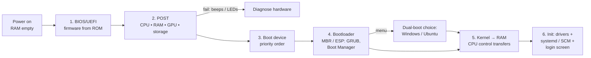

<Concepts items={["boot process","BIOS","UEFI","POST","boot priority","bootloader","GRUB","kernel loading","systemd","partitions","dual boot","PXE","Etcher"]} />

<LessonIntro>

Ticket #0901: "PC won't start — black screen, no Windows." The user reports one failure; you must locate it across six stages. When power arrives, RAM is empty and the CPU knows nothing — the machine must pull itself up by its bootstraps, loading ever-smarter software until the kernel takes control. This lesson traces that six-step boot sequence, then covers the alternate routes — partitions, dual boot, USB media, and network boot — you will use when the normal path breaks.

</LessonIntro>

Booting is a relay race where each runner wakes the next: firmware wakes the self-test, the self-test picks a device, the device offers a bootloader, the bootloader loads the kernel, and the kernel starts the system. A failure at any handoff looks like "won't start" but means something completely different per stage.

## Concept Breakdown: What It Is & How It Works

<ConceptCard name="Boot Process" category="Startup Sequence">

**What it is.** The self-starting sequence that loads primitive firmware, tests hardware, and ultimately places the OS kernel into RAM — named for "pulling oneself up by one's bootstraps."

**How it works.** Because RAM starts empty, the CPU executes fixed firmware from motherboard ROM first; each stage is just smart enough to find and launch the next, ending with a fully interactive login screen.

</ConceptCard>

<ConceptCard name="BIOS / UEFI Firmware" category="Boot Step 1">

**What it is.** Low-level firmware stored in motherboard non-volatile ROM that runs the instant power stabilises.

**How it works.** The CPU resets into this firmware, which initialises core controllers and exposes the Boot Priority Order and setup screens. UEFI is the modern successor to legacy BIOS with mouse-driven setup, Secure Boot, and large-disk support.

</ConceptCard>

<ConceptCard name="Power-On Self-Test (POST)" category="Boot Step 2">

**What it is.** The firmware's integrity scan of critical hardware — CPU, RAM, GPU, storage controllers — before any OS loads.

**How it works.** Each component is probed in turn; a critical failure halts the boot with audible beep codes or motherboard diagnostic LEDs naming the faulty part. No beeps and no display points here, not at Windows.

</ConceptCard>

<ConceptCard name="Boot Device Selection" category="Boot Step 3">

**What it is.** The firmware's search down its configured Boot Priority Order (e.g. USB first, NVMe SSD second, network PXE third) for a bootable device.

**How it works.** Each candidate is checked for a valid boot signature; the first valid device wins. Wrong order is why a forgotten USB stick can hijack a boot — the firmware obeyed its list faithfully.

</ConceptCard>

<ConceptCard name="Bootloader" category="Boot Step 4">

**What it is.** The small program the firmware executes from the chosen device's Master Boot Record (MBR) or EFI System Partition (ESP) — e.g. GRUB on Linux, Windows Boot Manager on Windows.

**How it works.** It understands file systems just well enough to find kernels, and on multi-OS machines it paints the OS selection menu. A missing-bootloader error ("no bootable device", GRUB rescue prompt) isolates the fault to this handoff.

</ConceptCard>

<ConceptCard name="Kernel Loading and System Init" category="Boot Steps 5–6">

**What it is.** The bootloader copies the OS kernel from storage into RAM and transfers CPU control; the kernel then loads drivers, starts services, and renders login.

**How it works.** The kernel claims Ring 0, loads essential device drivers, launches background daemons and services (`systemd` on Linux, the Service Control Manager on Windows), and only then presents the login screen — which is why a spinning logo means the kernel lives but a service may be stuck.

</ConceptCard>

<ConceptCard name="Partitions and Dual Boot" category="Multi-OS Booting">

**What it is.** Dividing one physical drive into isolated partitions so two independent operating systems (e.g. Windows 11 and Ubuntu) coexist, chosen from the bootloader menu at startup.

**How it works.** Each partition carries its own file system and OS; the bootloader simply points at a different kernel per menu entry. IT advantage: when one OS corrupts its drivers or boot files, boot the second OS to repair the first from the inside.

</ConceptCard>

<ConceptCard name="External Boot Media and PXE" category="Alternate Boot Routes">

**What it is.** Ways to start a machine without its internal drive: bootable USB sticks (ISO written with Etcher.io or Rufus), external SSDs and recovery discs, Apple Internet Recovery, or Preboot Execution Environment (PXE) network boot.

**How it works.** The firmware treats USB, optical, or network images as ordinary boot devices per its priority list. PXE goes further: a diskless client downloads its boot image from a LAN server, letting IT reimage whole labs without touching a single drive.

</ConceptCard>

## Step-by-step breakdown

1. **BIOS/UEFI initialisation.** Power stabilises, the CPU resets into motherboard ROM firmware and initialises core hardware.
2. **POST.** Firmware tests CPU, RAM, GPU, and storage controllers; failures surface as beep codes or diagnostic LEDs.
3. **Boot device selection.** Firmware walks the Boot Priority Order until a device answers with a valid boot signature.
4. **Bootloader execution.** Code from the MBR or EFI System Partition (GRUB, Windows Boot Manager) takes control and optionally offers an OS menu.
5. **Kernel loading.** The bootloader copies the kernel into RAM and jumps to it.
6. **System initialisation.** The kernel loads drivers, starts daemons and services (`systemd`, Service Control Manager), and shows the login screen.

## Boot sequence timeline

*Figure 16.1 — The six-step boot sequence. Each stage hands control to the next; the failure's stage determines whether you reseat RAM, fix boot order, repair the bootloader, or troubleshoot services.*

## Examples

- **Obvious —** Pressing the power button and seeing the manufacturer's logo means steps 1–2 passed: firmware lives and POST cleared. The fault lies further down the chain.
- **Counter-intuitive —** Removing a forgotten USB stick can "repair" a dead PC. The machine was never broken — the firmware correctly honoured a boot order listing USB first and tried to boot a non-bootable flash drive.
- **Edge case —** A machine boots Windows perfectly but GRUB never appears after an update. The update rewrote the EFI System Partition and demoted the Linux bootloader entry — both OSes are intact, only the menu pointer moved, fixable from a live USB.

## Firmware and recovery keys

| Platform | Keys (tap or hold immediately at power-on) | Opens |
| --- | --- | --- |
| **Windows / PC firmware** | `F2`, `F12`, `DEL`, or `ESC` | BIOS/UEFI Setup or the one-time Boot Menu |
| **Apple macOS startup** | Hold `Option` (Alt) | Startup Manager (choose boot device) |
| **Apple macOS recovery** | Hold `Cmd` + `R` | Recovery Mode (Disk Utility, reinstall, Internet Recovery) |

## Support-desk triage: "won't boot"

1. **Nothing on screen, beeps or LEDs** — POST failure. Reseat RAM and GPU, check power connectors, read the beep/LED code before suspecting software.
2. **"No bootable device" or GRUB rescue** — steps 3–4. Enter the boot menu key, verify the right drive tops the order, then repair the bootloader (Windows Recovery, `bootrec`, or a live-USB GRUB reinstall).
3. **Logo spins forever, no login** — steps 5–6. Boot Safe Mode / recovery, read the boot logs, disable the last-installed driver or service.
4. **Need data off a dead internal OS** — bypass it: Etcher/Rufus USB, external SSD, or PXE into a rescue image, then copy files or run scans from outside.

<AnalogyCard name="Opening a Restaurant Each Morning">

**The concept.** Firmware unlocks the building, POST checks gas and fridges, the priority list picks which kitchen opens, the bootloader reads the menu binder, the kernel hires the staff, and init seats the first customers.

**The analogy.** A dark building (no power/firmware) differs from a failed health inspection (POST beeps), a locked front door (wrong boot device), a missing recipe binder (bootloader), or a kitchen that never seats anyone (stuck services) — and each needs a different fixer.

</AnalogyCard>

<LessonNote variant="myth" title="What people get wrong about booting">

**Myth:** "If Windows won't load, the hard drive is dead."

**Truth:** A dead drive is only one of six possible stages. Beep codes, boot-order hijacks, rewritten EFI entries, and stuck services all mimic drive failure exactly — and all leave the drive perfectly readable from external media.

</LessonNote>

<LessonNote variant="why">

Boot troubleshooting is elimination by stage: the last message on screen names the last successful handoff, and everything after it is suspect. Memorise the six steps and "won't start" stops being one problem and becomes six small, solvable ones.

</LessonNote>

This connects to the next lesson because once machines boot reliably, the real question returns: which operating system should be on them in the first place — Windows, macOS, Linux, ChromeOS, or a phone OS?

<QuickRecall title="Quick Recall — Boot Process">

Before moving on, try to answer these from memory:

1. The screen is black with repeated beeps and never shows a logo. Which stage failed?
2. A PC tries to boot from an empty USB stick instead of its SSD. What is the fix?
3. When is dual boot an IT repair tool rather than just a convenience?

Reveal answers

1) POST (step 2) — a critical hardware fault halted the boot before any device was tried. 2) Enter the boot menu or setup key and move the SSD above USB in the Boot Priority Order (or remove the stick). 3) When one OS is unbootable, booting the second OS gives a working platform to repair the first one's drivers and boot files.

</QuickRecall>
