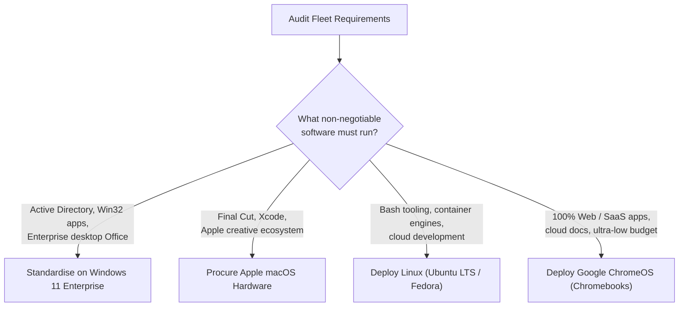
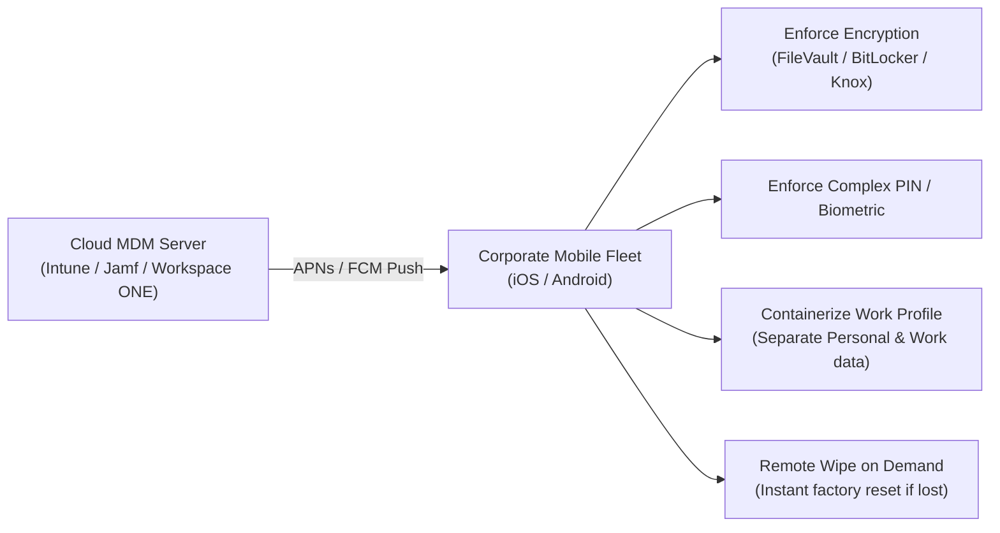

<Concepts items={["OS selection", "Windows", "macOS", "Linux", "ChromeOS", "Android", "iOS", "sandboxing", "remote wipe", "32-bit", "64-bit", "4 GB limit"]} />

<LessonIntro>

Ticket #2204: "We need twenty machines for the call centre — what should we buy?" In enterprise IT, there is no single "best" operating system; there is only the best fit for specific workflow requirements, total cost of ownership (TCO), peripheral ecosystems, and systems administration skillsets. This lesson equips you with an analytical selection framework, dives into the zero-maintenance architecture of ChromeOS, breaks down the harsh physics and security sandboxing of mobile operating systems (iOS and Android), and settles the 32-bit versus 64-bit memory ceiling with binary arithmetic.

</LessonIntro>

## Why this matters

Purchasing the wrong operating system for an enterprise fleet creates multi-year technical debt, security compliance nightmares, and massive budget waste.

- **Procurement accuracy:** Recommending high-end Windows laptops for users who only run a web CRM wastes thousands of dollars; conversely, buying Chromebooks for financial analysts reliant on complex desktop Excel macros guarantees immediate operational paralysis.
- **Hardware lifecycle unlocks:** Deploying a 32-bit OS onto 64-bit hardware silences 75% or more of your installed physical RAM, suffocating productivity.
- **Data protection on mobile:** Mobile devices routinely leave the perimeter firewall. Understanding application sandboxing and Mobile Device Management (MDM) remote wiping prevents corporate data breaches when employees lose devices.
- **TCO & administrative overhead:** License costs are only the tip of the iceberg — fleet patching frequency, image deployment workflows, and administrative expertise dominate long-term costs.

---

## 01 — The Enterprise OS Evaluation Matrix

Operating systems are tools built with contrasting engineering philosophies and business models. Choosing an OS requires mapping client software dependencies against support overhead.

<ConceptCard name="Microsoft Windows" category="Desktop Commercial">

**What it is.** The dominant desktop operating system in global enterprise, offering the most extensive third-party software catalogue and enterprise management tools.

**How it works.** Natively binds with Microsoft Active Directory and Microsoft Entra ID (formerly Azure AD) for Group Policy Object (GPO) and Intune centralized management. Excellent backwards compatibility with legacy Win32 software. Trade-offs include a substantial disk and memory footprint, per-workstation licensing fees, and continuous update orchestration requirements.

</ConceptCard>

<ConceptCard name="Apple macOS" category="Unix Commercial">

**What it is.** Apple's proprietary Unix-certified desktop OS, engineered to run exclusively on Apple Silicon (M-series) hardware.

**How it works.** Built on the Mach kernel and BSD userland (Darwin). Offers exceptional power efficiency, native Unix POSIX terminal environments, and deep integration with the Apple ecosystem. Preferred choice for creative industries (Final Cut, Adobe Creative Cloud) and iOS software engineering. Trade-offs include higher upfront capital expenditure per workstation and strict hardware lock-in.

</ConceptCard>

<ConceptCard name="Linux Distributions (Ubuntu, Fedora, RHEL)" category="Open Source / Enterprise">

**What it is.** Modular, open-source operating systems combining the Linux kernel with GNU userland and modular desktop environments (GNOME, KDE).

**How it works.** Completely free of licensing costs (for community distros), extremely lightweight, highly scriptable via Bash, and virtually immune to traditional Windows PE executable malware. Dominates servers, supercomputers, cloud infrastructure, and software development pipelines. Trade-offs include a steeper end-user learning curve and lack of native support for proprietary desktop suites.

</ConceptCard>

### Desktop Operating System Comparison

| Operating System | Primary Kernel | Enterprise Management | Best Suited Workloads | Major Trade-Offs |
| :--- | :--- | :--- | :--- | :--- |
| **Microsoft Windows** | Windows NT (Hybrid) | Active Directory, GPO, Intune, MECM | General enterprise, legacy Win32 apps, commercial ERP/CRM, PC gaming. | Higher RAM/disk overhead, per-seat licensing cost, frequent patching. |
| **Apple macOS** | XNU (Mach/BSD Hybrid) | Apple Business Manager, Jamf Pro | Creative production, video editing, UI design, iOS/macOS software engineering. | Premium hardware pricing, zero hardware modularity or upgradeability. |
| **Linux (Ubuntu, RHEL)** | Linux (Monolithic) | Ansible, Puppet, Red Hat Satellite | Backend development, DevOps, scientific simulation, web/database hosting. | End-user friction, missing native proprietary enterprise suites (Office, Adobe). |
| **Google ChromeOS** | Linux (Hardened Monolithic) | Google Admin Console | K-12 education, kiosk terminals, web-first frontline workers, call centres. | Relies heavily on internet connectivity; no native legacy desktop software. |

---

## 02 — Cloud-First Architecture: Google ChromeOS

ChromeOS challenges traditional desktop computing assumptions by replacing complex local file storage with a stateless, cloud-synchronized browser environment.

<ConceptCard name="Google ChromeOS" category="Cloud-First Architecture">

**What it is.** Google's minimalist operating system built on top of a customized Linux kernel, using the Google Chrome browser as its primary user interface.

**How it works.** User profiles, settings, bookmarks, and local files sync instantaneously to Google Drive cloud storage. If a Chromebook is physically destroyed, the employee can open a replacement spare, sign in with their Google Workspace identity, and be fully operational within two minutes without any disk imaging or driver installation.

</ConceptCard>

### Architectural Pillars of ChromeOS Security

1. **A/B Dual-Partition Seamless Updates:** ChromeOS maintains two root OS partitions (Kernel A and Kernel B). System updates download silently in the background into the inactive partition. Upon reboot, the system swaps boot flags instantly to the updated partition. If boot fails, it rolls back automatically without administrative intervention.
2. **Cryptographic Verified Boot:** Every time the machine powers on, hardware fuses verify the cryptographic digital signature of the firmware and kernel against Google's root certificate. If malicious tampering or rootkits are detected, the system self-repairs from a read-only recovery partition.
3. **Multi-Layered Sandboxing:** Every browser tab, web extension, and web app runs in an isolated Linux process with restricted system calls.
4. **Nested Container Support (Crostini & ARC):** Modern ChromeOS runs Android applications within an Android Runtime Container (ARC) and complete Debian Linux CLI tools inside a lightweight virtual machine container (Crostini).

---

## 03 — Mobile Operating Systems: iOS vs Android

Mobile operating systems operate under physical constraints that desktop operating systems never face: strict battery envelopes, tight thermal dissipation boundaries without fans, dynamic cellular handover, and non-stop physical exposure to theft or loss.

<ConceptCard name="Mobile OS Architecture" category="Mobile Engineering">

**What it is.** Specialized operating systems engineered from the ground up for energy conservation, touch capacitive interfaces, sensor fusion, and zero-trust security postures.

**How it works.** Mobile kernels implement ultra-aggressive memory management: background applications are suspended in RAM or dumped to flash within seconds of being minimized. Display refreshes and touch responsiveness are assigned top priority in CPU scheduling queues to ensure zero perceptible touch latency.

</ConceptCard>

<ConceptCard name="Application Sandboxing" category="Mobile Security">

**What it is.** Isolating every installed application into an impenetrable digital sandbox with a dedicated unique User ID (UID) and walled-off file directory.

**How it works.** On mobile, no app can read another app's internal database, inspect browser cookies, or log keystrokes. Access to hardware sensors (camera, microphone, GPS location, bluetooth, contacts) requires explicit, granular, runtime permission prompts presented to the end user.

</ConceptCard>

### Architectural Comparison: iOS vs Android

| Feature Dimension | Apple iOS | Google Android |
| :--- | :--- | :--- |
| **Underlying Kernel** | Darwin / XNU (Mach + BSD derived) | Modified Linux Kernel (Monolithic) |
| **App Execution Runtime** | Native compiled machine code (Objective-C, Swift) | Android Runtime (ART) with Ahead-of-Time (AOT) & JIT compilation |
| **Ecosystem Model** | Closed "Walled Garden" — strictly curated App Store | Open Source (AOSP) — sideloading permitted, multiple app repositories |
| **Hardware Fleet Diversity** | Homogeneous — Apple controls silicon, SoC, and board | Extremely heterogeneous — hundreds of OEMs, chipsets, display ratios |
| **Enterprise Provisioning** | Apple Business Manager (ABM) + Supervised Mode | Android Enterprise + Zero-Touch Enrollment |

---

## 04 — The Memory Ceiling: 32-Bit vs 64-Bit Architecture

In enterprise support, one of the most common architectural mistakes when refurbishing or deploying legacy machines is mismatching the OS bitness to the underlying hardware.

<ConceptCard name="32-bit Architecture (x86)" category="Memory Ceiling">

**What it is.** Processor architectures and OS compiles whose internal registers and physical memory address buses are exactly 32 bits wide.

**How it works.** A 32-bit integer can produce at most $2^{32}$ unique binary combinations:
$$2^{32} = 4,294,967,296 \text{ bytes} = 4 \text{ GiB}$$
Because hardware devices (PCIe memory-mapped I/O, BIOS firmware, and GPU addresses) map into this exact same address space, a 32-bit OS can practically only use between **3.1 GB and 3.5 GB of system RAM**, regardless of how much physical RAM is inserted into motherboard slots.

</ConceptCard>

<ConceptCard name="64-bit Architecture (x86-64 / ARM64)" category="Modern Standard">

**What it is.** Modern computing standard featuring 64-bit-wide memory registers and multi-terabyte address buses.

**How it works.** A 64-bit architecture can address $2^{64}$ unique memory locations:
$$2^{64} = 18,446,744,073,709,551,616 \text{ bytes} \approx 16 \text{ Exabytes}$$
This removes system RAM capacity as an architectural constraint for intensive enterprise workloads, multi-gigabyte virtual machines, database servers, and modern operating systems.

</ConceptCard>

### 32-Bit vs 64-Bit Compatibility Rules

| Component Layer | 32-Bit Software | 64-Bit Software |
| :--- | :--- | :--- |
| **32-Bit Hardware CPU** | Runs natively. Maximum 4 GB RAM addressable. | **Cannot run.** CPU lacks 64-bit registers; crashes immediately. |
| **64-Bit Hardware CPU** | Runs natively via backward-compatibility translation (e.g. `WoW64` subsystem on Windows). | Runs natively with maximum hardware performance and full RAM utilization. |

> [!WARNING]
> **The Silent RAM Trap:**
> If you insert a 16 GB DDR4 RAM kit into an older desktop that has a 32-bit edition of Windows installed, Windows System Information will report: `"Installed RAM: 16.0 GB (3.24 GB usable)"`. The remaining 12.76 GB of RAM is completely unaddressable. The only solution is formatting the drive and installing a 64-bit OS build.

---

## 05 — Mobile Device Management (MDM) & Fleet Deployment

When corporate smartphones and tablets leave the building, IT control shifts from physical perimeter firewalls to cloud-based Mobile Device Management (MDM).

### Critical Mobile Triage & Administration Procedures

1. **Zero-Touch Pre-Enrollment:** Organizations enroll hardware serial numbers into Apple Business Manager (ABM) or Google Zero-Touch before unboxing. When an employee turns on the new device, it connects to Wi-Fi and automatically downloads corporate policies, certificates, and VPNs before rendering the home screen.
2. **Work Profile Partitioning:** BYOD (Bring Your Own Device) policies create a cryptographically separated "Work Profile" on employee phones. The company can remotely wipe corporate emails and files without touching the employee's personal photos or messages.
3. **The Lost Device Protocol:** The moment a device is reported lost or stolen:
   - Initiate a remote cryptographic wipe command from the MDM portal.
   - Revoke the user's active cloud session tokens and multi-factor authentication (MFA) tokens in Entra ID / Google Workspace.
   - Flag the device IMEI number on carrier registries to prevent network re-activation.

<AnalogyCard name="Choosing a Vehicle Fleet">

**The concept.** OS selection matches the vehicle type to the cargo, road conditions, and maintenance resources.

**The analogy.** A flatbed tractor-trailer (Windows) hauls any heavy industrial cargo anywhere but consumes high fuel and maintenance; a finely tuned sports car (macOS) dominates on its designated track but rejects generic aftermarket parts; a kit off-road vehicle (Linux) costs nothing for parts and is beloved by custom mechanics; and an electric city scooter (ChromeOS) is cheap, lightweight, and perfect for quick downtown hops with charging stations everywhere. And the 32-bit bridge has a strict 4-ton weight limit that no engine horsepower can bypass.

</AnalogyCard>

<LessonNote variant="myth" title="What people get wrong about OS choice">

**Myth:** "Our enterprise should standardize on exactly one single operating system across every single department to simplify support."

**Truth:** Rigid uniformity often costs more than supporting two distinct, well-chosen platforms. Forcing video editors onto Windows machines requires expensive third-party color calibration tools and plugins; forcing call-centre agents onto full Windows licenses when they only use a browser multiplies licensing and patching costs tenfold compared to Chromebooks. Optimal fit beats blind uniformity.

</LessonNote>

<LessonNote variant="why">

Every operating system examined in this course shares the identical architectural primitives explored in our earlier modules — CPU scheduling, virtual memory management, filesystem cluster allocation, and kernel ring isolation. Once you grasp these fundamental mechanics, each new OS is merely a different user-space skin over the same core engine.

</LessonNote>

This connects directly to the final lesson: in modern corporate enterprise, operating systems rarely run directly on bare metal alone — they run inside virtual machines, are administered across secure remote protocols, and are managed across Windows enterprise feature editions.

---

## Summary Checklist: OS Selection Mental Model

1. **Software dependencies dictate the OS:** Identify non-negotiable software packages first. If the team requires Active Directory GPOs, Xcode, or specialized Linux daemons, the software makes the decision for you.
2. **Total Cost of Ownership includes administration:** Software license fees are only one component. Calculate hardware cost, management licensing (Intune, Jamf), update disruption, and helpdesk staffing expertise.
3. **ChromeOS eliminates endpoint management:** Stateless, cloud-synced architecture combined with verified boot and seamless A/B updates makes ChromeOS ideal for browser-centric, high-turnover environments.
4. **Mobile security defaults to deny:** iOS and Android protect devices through hardware-enforced application sandboxing, fine-grained runtime permission grants, and MDM zero-touch enrollment.
5. **32-bit hardware caps memory at 4 GB:** $2^{32}$ addressable memory bytes creates a hard 4 GB RAM ceiling. Never deploy a 32-bit OS on modern endpoints with more than 4 GB of installed memory.

---

<QuickRecall title="Quick Recall — OS Selection and Mobile">

Before moving on, try to answer these from memory:

1. A school district needs 200 low-cost, self-updating laptops for students who only work within Google Workspace. Which OS is optimal, and what is its primary operational limitation?
2. Why can a smartphone safely run a third-party flashlight app that on an unmanaged desktop could potentially harvest sensitive user files?
3. An older refurbished PC has 16 GB of physical RAM installed, but Windows System properties states that only 3.2 GB is usable. What is the root cause and remedy?

Reveal answers

1) **Google ChromeOS** — It delivers low upfront cost, seamless A/B partition updates, and instant cloud profile syncing. Its primary limitation is heavy dependency on internet connectivity and inability to run native legacy offline desktop applications.
2) **Application Sandboxing** — Mobile operating systems isolate every application inside its own security container with unique UIDs. An app cannot read storage files, contacts, or network data belonging to another app without explicit runtime permissions.
3) **32-Bit OS Architecture** — The machine has a 32-bit operating system installed, which is mathematically incapable of addressing more than $2^{32}$ bytes (4 GB) of RAM. The remedy is formatting the storage drive and installing a 64-bit edition of the OS.

</QuickRecall>
