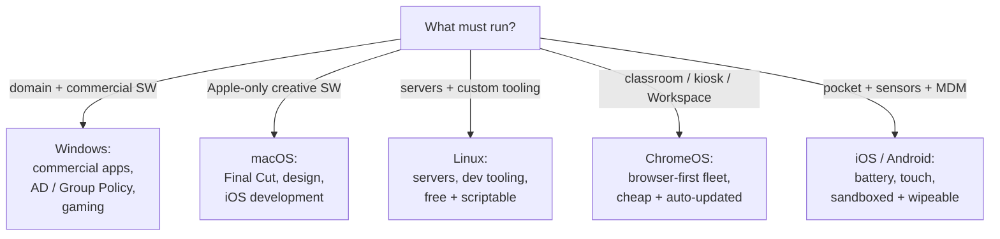

<Concepts items={["OS selection","Windows","macOS","Linux","ChromeOS","Android","iOS","sandboxing","remote wipe","32-bit","64-bit","4 GB limit"]} />

<LessonIntro>

Ticket #2204: "We need twenty machines for the call centre — what should we buy?" There is no best operating system, only the best fit for software needs, budget, hardware, and admin skill. This lesson gives you the selection framework support teams actually use, tours the lightweight contender ChromeOS, explains why phone operating systems play by different rules, and settles the 32-bit versus 64-bit question with arithmetic.

</LessonIntro>

Desktop choice is a trade-off between compatibility, cost, control, and connectivity. Mobile choice is a trade-off under harsher physics: a phone kernel must sip battery, fuse touch and sensors into every API, and treat every app as potentially hostile. The bitness question underlies both: it caps how much memory any OS build can ever see.

## Concept Breakdown: What It Is & How It Works

<ConceptCard name="Microsoft Windows" category="Desktop Option">

**What it is.** The universal commercial desktop OS with the broadest software catalogue.

**How it works.** Best when the org needs commercial apps, gaming, or domain joining with Active Directory and Group Policy. Consider the trade-offs: larger resource footprint, per-seat licensing fees, and a steady cadence of feature updates to manage.

</ConceptCard>

<ConceptCard name="Apple macOS" category="Desktop Option">

**What it is.** Apple's Unix-based desktop OS, pre-installed exclusively on Apple hardware.

**How it works.** Best for design, video editing (Final Cut), and iOS development with a real Unix terminal underneath. Consider the trade-off: it runs only on Apple hardware at a higher upfront cost, so fleet budgets feel it immediately.

</ConceptCard>

<ConceptCard name="Linux Distributions" category="Desktop Option">

**What it is.** Free, open-source, highly customisable operating systems sharing the Linux kernel.

**How it works.** Best for cloud servers, supercomputers, and developer tooling where security, scripting, and cost matter most. Consider the trade-offs: a steeper learning curve for staff raised on Windows, and some proprietary commercial apps with no native Linux port.

</ConceptCard>

<ConceptCard name="Google ChromeOS" category="Desktop Option">

**What it is.** Google's lightweight, cloud-first OS for Chromebooks, introduced in 2009 and built on the Linux kernel for ARM and Intel x86.

**How it works.** Best for classrooms and browser-centred workflows: fast boot, sandboxed security, silent automatic updates that swap boot partitions on restart, verified boot that cryptographically checks OS integrity, and profiles synced via Google Drive. Modern releases also run Android apps via the Play Store and Linux CLI tools in isolated containers. Consider the trade-off: the primary workflow assumes internet connectivity, with limited traditional offline desktop apps.

</ConceptCard>

<ConceptCard name="Mobile OS Design (iOS and Android)" category="Phone Constraints">

**What it is.** Operating systems engineered for strict power, thermal, and mobility budgets.

**How it works.** Mobile kernels aggressively suspend background processes and throttle network polling to save battery; touch gestures, GPS, accelerometers, gyroscopes, and biometrics (Face ID, fingerprint) are first-class APIs rather than add-ons; and enterprise fleets can remote-wipe a lost phone instantly.

</ConceptCard>

<ConceptCard name="Application Sandboxing" category="Mobile Security">

**What it is.** The confinement of each mobile app inside a restricted container with explicitly granted permissions.

**How it works.** An app cannot read contacts, files, camera, or location unless the user consents, and malware escaping one sandbox still cannot reach other apps' data. This default-deny posture is why phones tolerate app-store scale while desktops rely more on antivirus.

</ConceptCard>

<ConceptCard name="32-bit Architecture (x86)" category="Memory Ceiling">

**What it is.** CPUs and OS builds whose registers and address bus are 32 bits wide.

**How it works.** They address at most 2^32 locations = 4,294,967,296 bytes (4 GB) of RAM. Any physical memory beyond 4 GB is invisible and unusable — installing 16 GB under a 32-bit OS wastes 12 GB silently.

</ConceptCard>

<ConceptCard name="64-bit Architecture (x86-64 / ARM64)" category="Modern Standard">

**What it is.** CPUs and OS builds with 64-bit-wide registers and addressing.

**How it works.** They address 2^64 locations = 18.4 quintillion bytes (16 exabytes) of RAM, removing memory as a practical ceiling for video rendering, databases, and virtualisation. IT rule: always match the OS build to 64-bit hardware to unlock modern RAM capacities.

</ConceptCard>

## Step-by-step breakdown

1. **List the must-run software.** If the workflow needs Active Directory, Final Cut, or a Linux-only toolchain, the software picks the OS before you do.
2. **Price the whole fleet.** Hardware cost plus licensing plus admin training — ChromeOS and Linux win on price, Windows and macOS win on commercial compatibility.
3. **Check connectivity and mobility.** Browser-only classroom with strong Wi-Fi leans ChromeOS; field phones lean Android/iOS with remote-wipe enrolled.
4. **Match bitness and memory.** Any machine with over 4 GB of RAM gets a 64-bit OS on 64-bit hardware — no exceptions.
5. **Plan updates and lockdown.** Silent auto-updates (ChromeOS), Group Policy (Windows), MDM profiles (phones) — choose the control plane you can actually staff.

## Choosing an operating system

| Operating System | Core Strengths & Best Use Cases | Key Considerations |
| --- | --- | --- |
| **Microsoft Windows** | Universal commercial software support, gaming, enterprise domain joining, Active Directory, Group Policy. | Hardware resource footprint, licensing fees, frequent updates. |
| **Apple macOS** | Pre-installed on Apple hardware, Unix terminal foundation, optimized for design, video editing (Final Cut), and iOS development. | Exclusive to Apple hardware; higher upfront hardware cost. |
| **Linux Distributions** | Free & open-source, highly customizable, strong security, dominates cloud servers, supercomputers, and developer tooling. | Steeper learning curve; some proprietary commercial software lacks native Linux ports. |
| **Google Chrome OS** | Lightweight, fast boot, sandboxed security, automated silent updates, seamless cloud collaboration (Google Workspace). | Requires internet connectivity for primary workflow; limited offline traditional desktop apps. |

## OS selection decision flow

*Figure 17.1 — OS selection flow. Start from the non-negotiable software and constraints; the matching OS usually selects itself.*

## chromeOS in depth

ChromeOS deserves special attention because it breaks desktop assumptions: the Chrome browser is the primary interface, apps launch as high-speed web apps, Android apps arrive sandboxed through the Play Store, Linux tools run in isolated containers, updates install silently and swap partitions on restart, verified boot re-checks OS integrity every power-on, and the user's profile follows them through Google Drive sync.

## Examples

- **Obvious —** A video-editing studio buys Macs for Final Cut, a call centre buys Windows for its CRM and Group Policy, a school buys Chromebooks for price and zero-touch updates. Each fleet is optimal for its software, foolish for the others'.
- **Counter-intuitive —** Installing more RAM can do literally nothing. A 32-bit OS on a 16 GB machine addresses 4 GB and ignores the rest — the upgrade was real, the ceiling was architectural.
- **Edge case —** A "light" Chromebook outperforms a "powerful" Windows laptop on flaky hotel Wi-Fi duties. Verified boot plus cloud sync means a dead Chromebook is replaced by signing into any spare in minutes, while the Windows machine waits on drivers and restores.

## Support-desk triage: selection and phones

1. **Quote the constraint, not the brand.** Answer "which OS?" with software, budget, connectivity, and admin skill — never with personal preference.
2. **Enrol phones before they leave.** MDM profiles, sandbox permissions review, and remote-wipe testing happen at issue time, not after a loss.
3. **Audit bitness on old machines.** Any 32-bit OS install on 64-bit hardware with 4+ GB RAM is a free upgrade waiting to happen — reinstall 64-bit during the next refresh.
4. **Treat offline needs as disqualifiers.** If the workflow must run in dead zones, ChromeOS's cloud dependence rules it out regardless of price.

<AnalogyCard name="Choosing a Vehicle Fleet">

**The concept.** OS selection matches vehicle to route: software is the cargo, budget is fuel, connectivity is road quality, and bitness is the bridge weight limit.

**The analogy.** Semis (Windows) haul any commercial cargo but drink fuel; sports cars (macOS) are brilliant on their track and useless off it; kit trucks (Linux) are cheap and customisable for skilled mechanics; e-scooters (ChromeOS) are perfect for short city hops with charging everywhere; and every bridge (32-bit) has a posted weight limit no engine can argue with.

</AnalogyCard>

<LessonNote variant="myth" title="What people get wrong about OS choice">

**Myth:** "One operating system is objectively best, so standardise everything on it."

**Truth:** Standardising on the wrong OS is worse than supporting two right ones. A Linux-only shop that needs a Windows-only accounting package, or a Windows fleet doing cloud-native development, pays the mismatch daily — fit beats uniformity.

</LessonNote>

<LessonNote variant="why">

Every OS in this lesson shares the same kernel ideas from earlier modules — scheduling, memory, file systems — dressed in different user spaces and business models. Recognise the common skeleton and each new platform becomes a dialect, not a new language.

</LessonNote>

This connects to the final lesson because chosen operating systems rarely run alone anymore — they run virtualised, administered remotely, and compared feature-by-feature across Windows generations.

<QuickRecall title="Quick Recall — OS Selection and Mobile">

Before moving on, try to answer these from memory:

1. A school wants 200 cheap, self-updating machines for Google Workspace. Which OS fits, and what is its main caveat?
2. Why can a phone safely run a flashlight app that a desktop would sandbox less strictly?
3. A PC has 16 GB of RAM but the OS reports 3.5 GB usable. What happened?

Reveal answers

1) ChromeOS — lightweight with silent updates and cloud sync; caveat is dependence on internet connectivity with limited offline desktop apps. 2) Mobile apps run sandboxed with explicit permission grants, so the flashlight cannot reach contacts or files uninvited. 3) A 32-bit OS (or 32-bit build) is installed, capping addressable RAM at 4 GB — reinstall 64-bit.

</QuickRecall>
