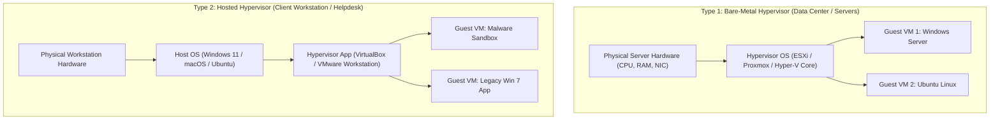
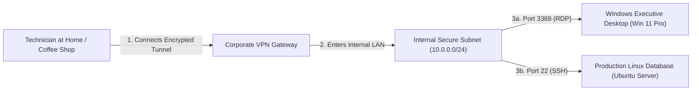
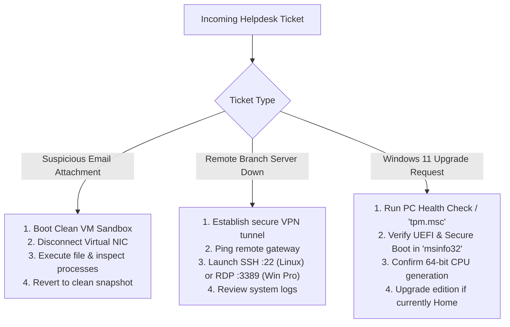

<Concepts items={["virtual machine", "hypervisor", "VirtualBox", "sandboxing", "RDP", "SSH", "VPN", "Windows 10", "Windows 11", "TPM 2.0", "BitLocker", "Ubuntu terminal"]} />

<LessonIntro>

Ticket #3307: "I need to test this suspicious attachment, fix a server in another city, and tell the leadership team whether our desktop fleet is eligible for Windows 11." One ticket, three distinct operational disciplines — and this lesson delivers all three. **Virtual machines** allow you to execute untrusted code in an isolated sandbox, **remote access protocols** (RDP, SSH, VPN) give you responsive control over distant infrastructure across the globe, the **Windows 10 vs. 11 matrix** settles upgrade hardware audits, and an interactive **Ubuntu terminal** walkthrough builds the daily CLI reflexes required of every tier-2 support technician.

</LessonIntro>

## Why this matters

Modern enterprise IT administration is built on abstraction: technicians rarely sit physically in front of the servers, firewalls, and endpoints they maintain.

- **Risk containment:** Detonating a suspicious email attachment on a physical workstation can trigger an enterprise-wide ransomware attack; detonating it in a non-persistent virtual machine snapshot neutralizes the threat in seconds.
- **Geographic reach:** Technicians manage distributed global branch offices from a central operations center using secure cryptographic remote shells (SSH) and desktop streams (RDP).
- **Perimeter defense:** Exposing raw management ports directly to the public internet invite automated botnet brute-force attacks; establishing an encrypted VPN tunnel first ensures zero-trust access.
- **Lifecycle planning:** Understanding hardware security prerequisites (TPM 2.0, Secure Boot, CPU instruction sets) prevents costly fleet purchase mistakes and failed enterprise OS rollouts.

---

## 01 — Virtualization Fundamentals: Type 1 vs Type 2 Hypervisors

Virtualization breaks the traditional 1:1 bond between hardware and the operating system by inserting a software layer that arbitrates physical resources.

<ConceptCard name="Virtual Machine (VM)" category="Virtualisation">

**What it is.** A software emulation of a complete physical computer system, running an isolated guest operating system on top of a host platform.

**How it works.** A hypervisor intercepts the guest OS's CPU instructions, memory allocations, and disk I/O, redirecting them safely to the physical host hardware. The guest OS behaves as if it has dedicated physical motherboards, network interface cards, and storage controllers.

</ConceptCard>

### The Hypervisor Architecture Taxonomy



| Dimension | Type 1 (Bare-Metal Hypervisor) | Type 2 (Hosted Hypervisor) |
| :--- | :--- | :--- |
| **Examples** | VMware ESXi, Proxmox VE, Microsoft Hyper-V Server | Oracle VirtualBox, VMware Workstation, Parallels Desktop |
| **Installed Directly On** | Bare physical server hardware (no intermediary OS) | On top of a pre-existing host operating system |
| **Performance Overhead** | Near-zero (direct hardware hardware-assisted virtualization: Intel VT-x, AMD-V) | Modest overhead (must pass calls through host OS kernel scheduler) |
| **Primary Use Case** | Cloud data centers, enterprise production server clusters | IT helpdesk testing, software sandboxing, running Linux on a Windows laptop |

> [!TIP]
> **The Power of Hypervisor Snapshots:**
> Before running a high-risk registry tweak or opening an untrusted file, take a **Snapshot** of the VM. A snapshot records the exact state of the virtual disk and RAM. If the action corrupts the OS or infects it with malware, click "Revert to Snapshot" to reset the machine back to a pristine state in seconds.

---

## 02 — Remote Access Protocols: RDP vs SSH vs VPN

Remote administration requires choosing the correct protocol for the target operating system, network topology, and bandwidth conditions.

<ConceptCard name="Remote Desktop Protocol (RDP)" category="Remote GUI">

**What it is.** Microsoft's proprietary display and input remoting protocol running on TCP/UDP port 3389.

**How it works.** Connected via the Microsoft Terminal Services Client (`mstsc.exe`), RDP packages drawing commands, mouse events, and clipboard buffers across the network. RDP host functionality is exclusive to Windows Pro, Enterprise, and Server editions — Windows Home editions cannot accept incoming RDP connections.

</ConceptCard>

<ConceptCard name="Secure Shell (SSH)" category="Remote CLI">

**What it is.** The universal, cryptographically secured network protocol for managing remote Linux servers, cloud instances, and network switches on TCP port 22.

**How it works.** Clients such as OpenSSH, PuTTY, or Windows Terminal negotiate an encrypted asymmetric session using RSA or Ed25519 cryptographic keypairs. Because SSH transmits pure text rather than graphic pixels, it maintains instant responsiveness even across satellite links with high latency.

</ConceptCard>

<ConceptCard name="Virtual Private Network (VPN)" category="Secure Tunnel">

**What it is.** An encrypted virtual tunnel running across the public internet that assigns a remote worker's computer an internal IP address inside the corporate LAN.

**How it works.** Protocols such as WireGuard, IPsec, or OpenVPN encapsulate and encrypt all network traffic leaving the endpoint. Once connected to the VPN, internal database servers, private intranet portals, and target RDP/SSH hosts become reachable just as if the technician plugged into a physical office Ethernet wall jack.

</ConceptCard>



> [!CAUTION]
> **Never Port-Forward RDP Port 3389 Directly to the Internet:**
> Exposing port 3389 directly through an external router firewall invites automated internet crawlers to launch brute-force password attacks and exploit BlueKeep vulnerabilities. Enterprise protocol mandates connecting through a VPN or an RDP Gateway equipped with Multi-Factor Authentication (MFA).

---

## 03 — Windows Enterprise Feature Matrix: Windows 10 vs 11

When auditing client fleets for upgrades, IT technicians must evaluate both the hardware security baseline and operating system edition tiers.

### Architectural & Security Requirements

| Feature / Hardware Spec | Windows 10 | Windows 11 |
| :--- | :--- | :--- |
| **Minimum CPU Architecture** | 32-bit (x86) or 64-bit (x64) | **Strictly 64-bit only** (x64 or ARM64) |
| **Minimum RAM** | 1 GB (32-bit) / 2 GB (64-bit) | **4 GB minimum** (8+ GB enterprise recommended) |
| **Firmware Baseline** | Legacy BIOS or UEFI | **UEFI with Secure Boot enabled** |
| **Hardware Cryptoprocessor** | Optional | **Mandatory TPM 2.0** (Trusted Platform Module) |
| **Supported CPU Generations** | Intel 5th Gen+ / AMD FX+ | Intel 8th Gen Core+ / AMD Ryzen 2000+ |
| **Security by Default** | Optional | Virtualization-Based Security (VBS) & Hypervisor-Protected Code Integrity (HVCI) on by default |

### Windows Edition Capabilities: Home vs Pro vs Enterprise

| Feature | Windows Home | Windows Pro | Windows Enterprise |
| :--- | :---: | :---: | :---: |
| **Active Directory / Entra ID Domain Join** | ❌ | ✅ | ✅ |
| **Group Policy Management (`gpedit.msc`)** | ❌ | ✅ | ✅ |
| **BitLocker Drive Encryption** | ❌ (Device Encryption only) | ✅ | ✅ |
| **Remote Desktop (RDP) Host Server** | ❌ (Client only) | ✅ | ✅ |
| **Windows Sandbox & Hyper-V** | ❌ | ✅ | ✅ |
| **DirectAccess & AppLocker Application Whitelisting** | ❌ | ❌ | ✅ |

---

## 04 — Hands-On Linux CLI Administration: Ubuntu Terminal Essentials

Because production web servers, networking appliances, and cloud instances run Linux, every IT technician must master navigating the Bash terminal.

### Deconstructing the Terminal Prompt

```bash
techadmin@lon-srv-db01:~$
```

- `techadmin` — The username of the currently authenticated account.
- `lon-srv-db01` — The hostname (network name) of the host computer.
- `:` — Separator character.
- `~` — Current working directory (`~` represents the user's personal home directory `/home/techadmin`).
- `$` — Privilege indicator: `$` indicates a standard unprivileged user; `#` indicates the root superuser.

### Foundational Linux Administration Commands

```bash
# 1. Identify current active shell environment
echo $SHELL
# Output: /bin/bash

# 2. Check current working directory path
pwd
# Output: /home/techadmin

# 3. Create a new empty configuration file
touch network_audit.conf

# 4. List directory contents with file permissions and hidden files
ls -la

# 5. Synchronize package catalog and install administrative tools
sudo apt update && sudo apt install -y curl htop net-tools

# 6. Check status of a critical system service
sudo systemctl status ssh
```

---

## 05 — Helpdesk Playbook: Remote Support & Virtual Sandbox Forensics

When resolving tickets involving unverified software, remote branch offices, or upgrade audits, execute this four-stage standard operating procedure:



<AnalogyCard name="A Commercial Bank Branch">

**The concept.** VMs serve as the reinforced training vault, the VPN acts as the armored underground courier tunnel, RDP provides the full transparent teller window, and SSH provides the high-speed pneumatic tube for exact written instructions.

**The analogy.** You rehearse explosive vault breaches in an isolated simulation facility (VM snapshot) so the active customer bank is never jeopardized; remote branch managers enter through an armored private expressway (VPN), and then either sit at the customer terminal window (RDP) or send precise signed paper dockets through the vacuum tube (SSH). Meanwhile, the enterprise banking charter (Windows Edition Matrix) dictates exactly which branches are authorized to open commercial corporate accounts.

</AnalogyCard>

<LessonNote variant="myth" title="What people get wrong about remote work">

**Myth:** "RDP, SSH, and VPN are interchangeable tools that accomplish the same task: controlling another computer."

**Truth:** The VPN builds a secure cryptographic road into the private corporate network; RDP and SSH are vehicles that drive along that road to communicate with specific computers. Exposing an RDP or SSH server directly to the open internet without a VPN or gateway tunnel invites credential brute-forcing and ransomware penetration. Tunnel first, manage second.

</LessonNote>

<LessonNote variant="why">

Virtualization combined with secure remote access is the ultimate force multiplier for modern technical support: a single systems administrator seated with a modest laptop can maintain, test, update, and restore thousands of workstations and servers distributed across continents.

</LessonNote>

This concludes our comprehensive study of modern operating systems: from the low-level duties of the kernel, filesystem cluster allocations, process scheduling trees, and boot sequences, to desktop fleet management and enterprise virtualization. The next module is our comprehensive **IT Glossary**, indexing every technical term covered across the curriculum.

---

## Summary Checklist: Virtualization & Remote Access Mental Model

1. **Type 1 Hypervisors run on bare silicon:** Bare-metal hypervisors (ESXi, Proxmox) deliver line-rate performance for data centers; Type 2 hosted hypervisors (VirtualBox) run inside a desktop OS for helpdesk sandboxing.
2. **Snapshots protect the host:** Detonate malware, test untrusted scripts, and perform risky software updates inside a virtual machine snapshot so you can revert the state in seconds if corruption occurs.
3. **Tunnel before you control:** Always establish an encrypted VPN tunnel into the private corporate network before connecting via RDP (port 3389) or SSH (port 22). Never port-forward RDP directly to the public web.
4. **SSH outpaces RDP on slow links:** SSH transmits encrypted text characters while RDP streams desktop graphic frames; SSH is faster, more scriptable, and ideal for headless Linux administration.
5. **Windows 11 mandates hardware security:** Windows 11 enforces 64-bit-only CPUs, 4 GB+ RAM, UEFI Secure Boot, and physical TPM 2.0 cryptoprocessors. Active Directory and Group Policy require Pro or Enterprise editions.

---

<QuickRecall title="Quick Recall — VMs, Remote Access, Windows">

Before moving on, try to answer these from memory:

1. Where should an IT technician safely open a suspicious password-protected ZIP archive received via email, and how do they clean up afterward?
2. A remote Linux web server requires a configuration fix over an unstable, high-latency satellite cellular link. Should you use RDP or SSH, and why?
3. Which three hardware and firmware prerequisites prevent most older computers from qualifying for a Windows 11 upgrade?

<details>
<summary>Reveal answers</summary>

1) **Inside an Isolated Virtual Machine Snapshot** — Open the file inside a Type 2 VM (e.g. VirtualBox) with host network adapters disabled. After inspection, revert the VM to its clean pre-execution snapshot, leaving the host system completely uncontaminated.
2) **SSH (Secure Shell)** — SSH transmits lightweight text terminal commands across port 22 with negligible bandwidth requirements, whereas RDP streams graphical desktop bitmap tiles that freeze and stutter across unstable links.
3) **TPM 2.0, UEFI Secure Boot, and Supported 64-bit Processor** — Windows 11 strictly requires a Trusted Platform Module (TPM 2.0), motherboard UEFI firmware with Secure Boot enabled, and a supported 64-bit processor (Intel 8th Gen+ / AMD Ryzen 2000+).

</details>

</QuickRecall>
