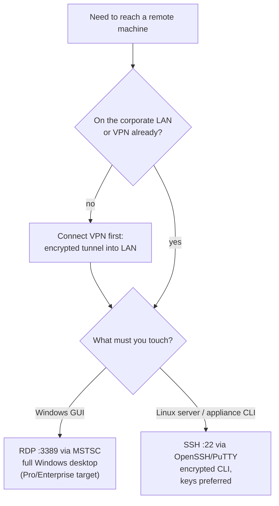

<Concepts items={["virtual machine","hypervisor","VirtualBox","sandboxing","RDP","SSH","VPN","Windows 10","Windows 11","TPM 2.0","BitLocker","Ubuntu terminal"]} />

<LessonIntro>

Ticket #3307: "I need to test this suspicious attachment, fix a server in another city, and tell the boss whether our PCs can take Windows 11." One ticket, three skills — and this lesson is all three. **Virtual machines** let you run risky or legacy systems in a padded cell, **remote protocols** (RDP, SSH, VPN) put distant machines under your hands, the **Windows 10 vs. 11 matrix** settles upgrade questions, and a short **Ubuntu terminal** session gives you the commands every support hire must type without thinking.

</LessonIntro>

Virtualisation and remote access share one idea: the machine in front of you is not the limit. A VM pretends to be hardware for a guest OS; RDP and SSH export a distant machine's interface to your screen; a VPN stretches the office LAN across the internet so those remote sessions stay private.

## Concept Breakdown: What It Is & How It Works

<ConceptCard name="Virtual Machine (VM)" category="Virtualisation">

**What it is.** A software emulation of a complete physical computer, running a guest operating system independently on top of a host OS.

**How it works.** A hypervisor (VirtualBox, VMware Workstation, Microsoft Hyper-V) carves virtual CPU, RAM, disk, and NICs out of the host's real resources. The guest believes it owns hardware; the host enforces the boundaries. Uses: isolation and sandboxing for malware and beta software, multi-OS efficiency (Linux, Windows, and legacy systems on one workstation), and legacy software support without maintaining ageing hardware.

</ConceptCard>

<ConceptCard name="Remote Desktop Protocol (RDP)" category="Remote GUI">

**What it is.** Microsoft's proprietary protocol for viewing and controlling a remote Windows desktop, on port 3389.

**How it works.** Connected via Microsoft Terminal Services Client (MSTSC), it streams the distant screen, keyboard, and mouse to your desk. Requires Windows Pro, Enterprise, or Education on the target — Home editions cannot host it.

</ConceptCard>

<ConceptCard name="Secure Shell (SSH)" category="Remote CLI">

**What it is.** The encrypted text-based protocol for managing remote Linux servers and network appliances, on port 22.

**How it works.** Clients such as OpenSSH and PuTTY/Plink open an encrypted channel, authenticate by password or public/private key pair, and deliver a remote shell. No pixels cross the wire — only characters — so it stays fast over thin links.

</ConceptCard>

<ConceptCard name="Virtual Private Network (VPN)" category="Secure Tunnel">

**What it is.** An encrypted tunnel over the public internet that enrols a remote worker's machine into the corporate LAN.

**How it works.** All traffic inside the tunnel is encrypted and addressed as if local, so RDP and SSH sessions to internal-only servers work from a café exactly as from a desk. The VPN provides the road; RDP and SSH are the vehicles.

</ConceptCard>

<ConceptCard name="Windows 10 vs. 11 Platform" category="Upgrade Matrix">

**What it is.** The two Windows generations support must compare feature-by-feature for upgrade and procurement decisions.

**How it works.** Windows 11 moves to a centred taskbar with rounded corners, requires 4 GB minimum on strictly 64-bit builds, and mandates TPM 2.0 with Secure Boot. Domain join, Group Policy (`gpedit.msc`), and BitLocker stay Pro/Enterprise-only on both. See the full matrix below before promising any upgrade.

</ConceptCard>

<ConceptCard name="Ubuntu Terminal Prompt" category="CLI Essentials">

**What it is.** The shell prompt `username@hostname:~$` that orients every Linux administration session.

**How it works.** `username` is the logged-in account, `hostname` the machine's network name, `~` the user's home directory, and `$` a standard unprivileged prompt (`#` means root administrator). Reading the prompt before typing prevents running host-destructive commands on the wrong machine.

</ConceptCard>

## Step-by-step breakdown

1. **Isolate the risk.** Detonate the suspicious file in a VM snapshot, not on the host — revert the snapshot when done and the host never knew.
2. **Join the network privately.** Connect the VPN first so the remote LAN becomes reachable and every later session is encrypted.
3. **Pick the right vehicle.** Windows desktop to fix goes over RDP (MSTSC, port 3389); Linux server or switch goes over SSH (port 22, keys preferred).
4. **Check upgrade eligibility.** Read the Windows matrix row by row — RAM, TPM 2.0, Secure Boot, edition — before scheduling the Windows 11 rollout.
5. **Prove Linux basics.** Verify the shell, create a file, and install a package from the terminal so the next SSH session feels routine.

## Remote access compared

| Protocol / Tool | Port / Model | Function & IT Support Workflow |
| --- | --- | --- |
| **Remote Desktop Protocol (RDP)** | Port 3389 (GUI) | Microsoft proprietary protocol allowing administrators to view and control a remote Windows desktop. Connected via **Microsoft Terminal Services Client (MSTSC)**. Requires Windows Pro/Enterprise on the target server. |
| **Secure Shell (SSH)** | Port 22 (CLI) | Encrypted text-based protocol for managing remote Linux servers and network appliances. Clients include **OpenSSH** and **PuTTY / Plink**. Authenticates via passwords or public/private SSH cryptographic key pairs. |
| **Virtual Private Network (VPN)** | Encrypted Tunnel | Establishes a secure, encrypted tunnel over public internet, allowing remote workers to securely join the internal corporate Local Area Network (LAN). |

## Which remote tool? Decision flow



*Figure 18.1 — RDP versus SSH versus VPN. The VPN is the road into the LAN; RDP carries the Windows desktop and SSH carries the Linux command line.*

## Windows 10 and 11 feature matrix

| Feature / Component | Windows 10 | Windows 11 |
| --- | --- | --- |
| **UI & Taskbar Layout** | Start menu & icons pinned to bottom-left corner. | Centered taskbar, rounded window corners, modern pastel aesthetics. |
| **Base RAM Requirement** | 1 GB (32-bit) / 2 GB (64-bit) | **4 GB minimum** (Strictly 64-bit only). |
| **Security Hardware** | Standard Legacy/UEFI | Mandatory **TPM 2.0** & **Secure Boot** enabled. |
| **Mobile App Integration** | Manual install / Windows Store only. | Native Android app support via Windows Subsystem for Android. |
| **Domain & Workgroup Join** | Supported in Pro / Enterprise / Education. | Supported in Pro / Enterprise / Education. |
| **Group Policy Editor (gpedit.msc)** | Included in Pro & Enterprise (Not in Home). | Included in Pro & Enterprise (Not in Home). |
| **BitLocker Drive Encryption** | Included in Pro & Enterprise. | Included in Pro & Enterprise. |

## Hands-on: Ubuntu Linux terminal essentials

Understand the prompt first — every character orients you before you type anything destructive:

```bash
username@hostname:~$
```

- **username:** current logged-in user account.
- **hostname:** the network identification name of the computer.
- **~ (tilde):** the user's home directory.
- **$ (dollar sign):** a standard unprivileged user prompt (changes to `#` for the root administrator).

Essential Linux commands — type these exactly:

```bash
# 1. Verify your active shell interpreter:
echo $SHELL
# Output: /bin/bash

# 2. Create a new empty file in the current directory:
touch my_super_cool_file.txt

# 3. Update software repositories and install packages (Debian / Ubuntu):
sudo apt update && sudo apt install curl -y
```

## Examples

- **Obvious —** A Windows user needs a forgotten setting changed now: VPN in, MSTSC over RDP to their Pro desktop, fix it live while they watch — no drive across town.
- **Counter-intuitive —** The fastest fix for a Linux server is text, not graphics. SSH delivers a full administration session over a link too thin for a single RDP frame — pixels are the luxury, characters are the tool.
- **Edge case —** A Windows 11 upgrade fails on an otherwise new PC with 16 GB of RAM. The matrix names the culprit: TPM 2.0 disabled in firmware, or a Home edition that cannot join the domain anyway — hardware fine, eligibility failed.

## Support-desk triage: virtual and remote work

1. **Never test the unknown on iron.** Suspicious attachments, beta installers, and registry experiments belong in a VM snapshot you can revert in seconds.
2. **VPN before RDP/SSH.** If the target is internal-only, the tunnel comes first — unreachable usually means un-tunnelled, not down.
3. **Match protocol to target.** Graphical Windows problem goes RDP (check the edition hosts it); Linux or appliance goes SSH (prefer key pairs over passwords).
4. **Read the matrix before promising.** Windows 11 needs 4 GB, 64-bit-only, TPM 2.0, Secure Boot, and the right edition for domain, Group Policy, and BitLocker — check all five.

<AnalogyCard name="A Bank Branch">

**The concept.** VMs are the test vault, the VPN is the armoured tunnel, RDP is the teller window with a full view, and SSH is the pneumatic tube for exact written instructions.

**The analogy.** You rehearse robberies in the training vault (VM) so the real branch never risks it; staff reach the vault through the tunnel (VPN), then either sit at the window (RDP) or send precise written orders (SSH) — while the branch charter (Windows matrix) says which services each location may offer.

</AnalogyCard>

<LessonNote variant="myth" title="What people get wrong about remote work">

**Myth:** "RDP, SSH, and VPN do the same thing — remote control."

**Truth:** The VPN carries your machine onto the distant network; RDP and SSH drive machines already on it. Skipping the VPN and exposing RDP directly to the internet is how brute-force intrusions begin — tunnel first, control second.

</LessonNote>

<LessonNote variant="why">

Virtualisation plus remote access is the support desk's force multiplier: one technician, one laptop, a hundred machines — with every risky experiment reversible and every distant desktop reachable. The Windows matrix and three terminal commands are simply the admission ticket.

</LessonNote>

This closes the operating-systems arc: from the kernel's four duties, through files, processes, shells, boots, and platforms, to running any OS anywhere. The next module's glossary collects every term in one searchable place.

<QuickRecall title="Quick Recall — VMs, Remote Access, Windows">

Before moving on, try to answer these from memory:

1. Where do you open a suspicious attachment, and how do you undo the test?
2. A remote Linux server needs a config fix over a slow link. RDP or SSH, and why?
3. Which three checks block most Windows 11 upgrades on capable-looking PCs?

<details>
<summary>Reveal answers</summary>

1) Inside a VM snapshot — revert the snapshot and the host is untouched. 2) SSH — encrypted text on port 22 stays fast where RDP's pixels would stall. 3) TPM 2.0 plus Secure Boot enabled, 64-bit-only 4 GB minimum met, and a Pro/Enterprise/Education edition for domain, Group Policy, and BitLocker.

</details>

</QuickRecall>
