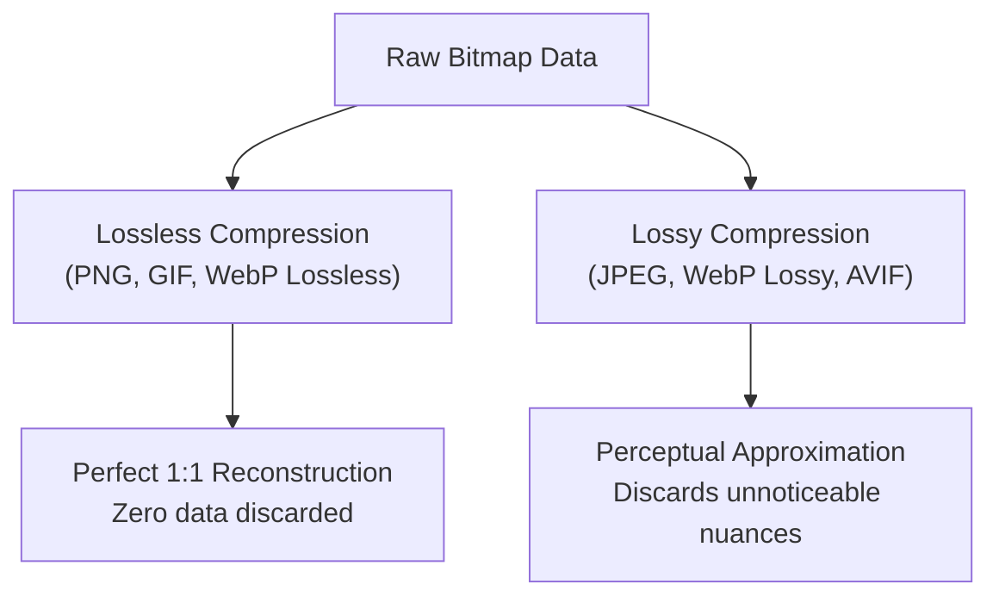
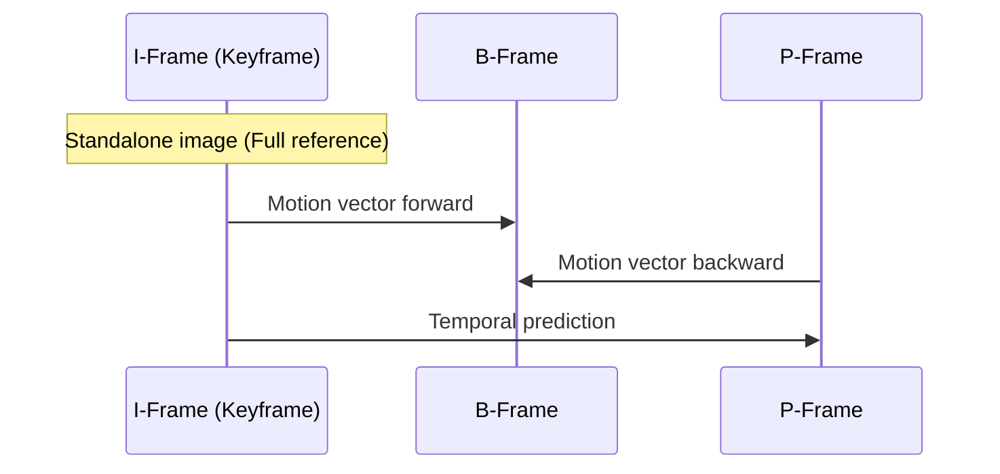

<Concepts items={["pixels & 24-bit RGB", "lossy vs lossless", "sampling rate & bit depth", "codecs vs containers", "keyframes & temporal compression"]} />

<LessonIntro>

To a computer hardware circuit, there is no music, no painting, and no cinema. The CPU and memory buses deal exclusively in voltages, transistors, and bit patterns (`0`s and `1`s). 

Meaning only emerges when software agrees on a **file format specification** — a shared protocol defining how sequences of bits map onto sound frequencies, display pixels, and sequential animation frames. Understanding this transformation demystifies digital media, explains web performance bottlenecks, and dispels Hollywood myths about digital imagery.

</LessonIntro>

## Why this matters

As a software engineer, you encounter media files everywhere: web assets, user uploads, streaming pipelines, CDN configurations, and responsive images. If you do not understand the trade-offs between lossless and lossy compression, container formats versus codecs, or why resizing a low-res image cannot "enhance" detail, your applications will either suffer massive bandwidth penalties or serve corrupted, slow-rendering assets.

---

## 01 — Digital Audio: From Waves to Bits

Real-world sound is an analog acoustic wave — continuous variations in air pressure over time. Computers cannot store infinitely fine continuous curves, so they perform **analog-to-digital conversion (ADC)**.


### Sampling Frequency & Bit Depth

Two variables dictate the fidelity and file size of digital audio:

1. **Sampling Frequency (Sample Rate):** How many times per second the computer snapshots the audio wave's amplitude. Measured in Hertz (Hz).
   * **$44.1\text{ kHz}$ ($44,100\text{ samples/sec}$):** The Red Book CD standard. According to the Nyquist-Shannon sampling theorem, capturing frequencies up to the limit of human hearing ($\approx 20\text{ kHz}$) requires sampling at at least double that rate ($> 40\text{ kHz}$).
   * **$48\text{ kHz}$:** Standard for digital video, TV, and professional studio production.
2. **Bit Depth:** How many bits describe the loudness (amplitude) of each individual snapshot.
   * **$16\text{-bit}$:** $2^{16} = 65,536$ discrete volume levels ($96\text{ dB}$ dynamic range).
   * **$24\text{-bit}$:** $2^{24} = 16,777,216$ discrete volume levels ($144\text{ dB}$ dynamic range, studio master quality).

$$\text{Bitrate (Bits/sec)} = \text{Sampling Rate (Hz)} \times \text{Bit Depth} \times \text{Channels (Mono=1, Stereo=2)}$$

For uncompressed CD audio (Stereo, $44.1\text{ kHz}$, $16\text{-bit}$):
$$44,100 \times 16 \times 2 = 1,411,200\text{ bits/second} \approx 10.58\text{ MB per minute}$$

### Synthesized Audio vs Recorded Audio (MIDI)

Digital audio falls into two fundamentally different paradigms:

* **Recorded Audio (PCM Waveforms):** Exact measurements of sound pressure (e.g., WAV, AIFF). Large file size, accurate to live performance.
* **Synthesized Audio (MIDI — Musical Instrument Digital Interface):** Instead of storing audio waves, MIDI files store **sheet music instructions for the computer**: which musical note to play, at what tempo, on which instrument channel, and with how much key velocity.


*Figure 3.1 — GarageBand synthesizing notes from a lightweight MIDI file instead of streaming heavy raw wave recordings.*

Because a MIDI file only stores musical instructions (e.g., "Play note C4 at velocity 80 on instrument 1 for 500ms"), a complete 4-minute orchestral song can be a tiny $25\text{ KB}$ file. However, how good it sounds depends entirely on the synthesizer and soundfont installed on the playback machine.

### Uncompressed vs Compressed Audio Formats

| Format | Compression Type | Characteristics & Best Use |
| :--- | :--- | :--- |
| **WAV / AIFF** | Uncompressed (Raw PCM) | Flawless studio master quality. Very large file size ($\approx 10\text{ MB/minute}$). |
| **MP3** | Lossy (Psychoacoustic) | Discards audio frequencies imperceptible to the human ear (masking). $128\text{--}320\text{ kbps}$. |
| **AAC** | Lossy (Advanced Audio Coding) | Successor to MP3 with higher efficiency, better frequency resolution, and standard for YouTube/Apple. |
| **FLAC / ALAC**| Lossless Compression | Bit-for-bit identical reproduction of original recording, compressed by $40\text{--}60\%$. |

> [!NOTE] Streaming Services (Spotify, Apple Music)
> Modern audio streaming services do not download monolithic audio files. They stream compressed chunks (often $160\text{ kbps}$ or $320\text{ kbps}$ AAC/Ogg Vorbis) over HTTP, allowing playback to begin within milliseconds while buffering ahead dynamically.

---

## 02 — Digital Graphics: Pixels, RGB & Hexadecimal

Every digital image displayed on a screen is a discrete rectangular matrix of microscopic colored squares called **pixels** (picture elements).


*Figure 3.2 — At the lowest level, an image is a numeric 2D grid of rows and columns. In black & white, each cell is just 1 bit ($0=\text{white}, 1=\text{black}$).*

### The Additive RGB Color Model

Computer monitors emit light. To produce the illusion of full color, screens combine varying intensities of three primary light channels: **Red**, **Green**, and **Blue** (RGB).

In modern **24-bit TrueColor**, each pixel is allocated **3 bytes (24 bits)**:
* 1 byte ($8\text{ bits}$, values $0\text{--}255$) for **Red**
* 1 byte ($8\text{ bits}$, values $0\text{--}255$) for **Green**
* 1 byte ($8\text{ bits}$, values $0\text{--}255$) for **Blue**

$$256 \times 256 \times 256 = 2^{24} = 16,777,216\text{ distinct colors}$$

```
Pure Red:    [ 11111111 ] [ 00000000 ] [ 00000000 ] -> rgb(255,   0,   0)
Pure Green:  [ 00000000 ] [ 11111111 ] [ 00000000 ] -> rgb(  0, 255,   0)
Pure Blue:   [ 00000000 ] [ 00000000 ] [ 11111111 ] -> rgb(  0,   0, 255)
Black (off): [ 00000000 ] [ 00000000 ] [ 00000000 ] -> rgb(  0,   0,   0)
White (all): [ 11111111 ] [ 11111111 ] [ 11111111 ] -> rgb(255, 255, 255)
```

### Hexadecimal Notation in Web & Design

Because writing 24 raw binary digits like `111111110000000000000000` is tedious, developers use **hexadecimal (base-16)** notation. 

Each hexadecimal digit represents exactly 4 bits ($1\text{ nibble}$, values `0` through `F`). Therefore, **two hex digits cleanly represent one full byte ($8\text{ bits}$)**:

$$\text{Binary } 1111\,1111 = \text{Decimal } 255 = \text{Hexadecimal } \text{FF}$$

$$\text{Color Red} = \text{RGB}(255, 0, 0) = \mathbf{\#FF0000}$$

$$\text{Color Cyan} = \text{RGB}(0, 255, 255) = \mathbf{\#00FFFF}$$

---

## 03 — Bitmaps, Resolution & Image Compression

### The Raw Bitmap Format (.bmp)

An uncompressed bitmap file stores a header followed by raw bytes for every pixel in every row.


*Figure 3.3 — The iconic Windows XP "Bliss" background wallpaper.*

When we zoom into this continuous-looking landscape, the underlying reality becomes obvious:


*Figure 3.4 — Extreme zoom reveals the pixel grid: individual blocks of uniform RGB values.*

### The Hollywood "Enhance" Fallacy

In television crime dramas (CSI), investigators frequently zoom into a reflection on a car bumper from a blurry security camera, click "Enhance!", and reveal a sharp crystal-clear face.

> [!CAUTION] The Physical Limits of Information
> **A digital image only contains the information captured at exposure time.** 
> Scaling up a $100 \times 100$ pixel crop simply duplicates or interpolates existing adjacent pixels (nearest-neighbor, bilinear, or bicubic). It **cannot invent high-frequency optical information that was never recorded**. Modern AI upscalers "hallucinate" plausible statistical textures based on training data, but they cannot retrieve true historical detail.

### Lossless vs Lossy Compression

Without compression, a simple $12\text{-megapixel}$ smartphone photo ($4000 \times 3000$) would consume:
$$4000 \times 3000 \times 3\text{ bytes} = 36,000,000\text{ bytes} \approx 36\text{ MB per photo!}$$

To make media portable over the internet, we employ two distinct mathematical approaches:



#### 1. Lossless Compression (Run-Length & Dictionary Encoding)
Lossless compression reduces file size by finding repetitive redundancy without discarding a single bit of information.


*Figure 3.5 — Notice the solid blue sky above the apples. Instead of writing 24 bits for every individual blue pixel across a 1000-pixel row, the encoder writes: `REPEAT COLOR(#0077CC) 1000 TIMES`. The exact original image is reconstructed perfectly.*

#### 2. Lossy Compression (Quantization & Frequency Transform)
Lossy compression permanently discards subtle color variations and high-frequency noise that the human eye is poor at noticing.

| Original High-Quality Photo | Aggressively Compressed JPEG |
| :---: | :---: |
|  |  |
| *Smooth gradients, sharp edges* | *Quantization bands, blurry edges around petals* |

In JPEG compression:
1. Colors are converted from RGB to **YCbCr** (separating Luminance/Brightness $Y$ from Chrominance/Color $Cb, Cr$). Because human eyes are far more sensitive to brightness differences than color differences, color channels are downsampled ($4:2:0$).
2. The image is divided into $8 \times 8$ pixel blocks and transformed using the **Discrete Cosine Transform (DCT)**.
3. High-frequency coefficients are rounded off (**quantized**). This reduces file size by $90\%$, but aggressive compression produces visible $8 \times 8$ "macroblock" artifacts.

### Common Image File Formats Comparison

| Format | Max Colors | Compression | Transparency | Animation | Best Used For |
| :--- | :--- | :--- | :--- | :--- | :--- |
| **BMP** | 24-bit ($16.7\text{M}$) | None (Uncompressed) | No | No | OS internal rendering buffers |
| **GIF** | 8-bit ($256$ colors) | Lossless (LZW) | 1-bit (On/Off) | Yes | Simple memes, low-color icons |
| **JPEG** | 24-bit ($16.7\text{M}$) | Lossy (DCT) | No | No | Photographic images, complex scenes |
| **PNG** | 24-bit / 32-bit | Lossless (DEFLATE) | 8-bit Alpha (Smooth) | No | Web UI, screenshots, logos, diagrams |
| **WebP** | 24-bit / 32-bit | Both Lossy & Lossless | 8-bit Alpha | Yes | Modern high-efficiency web replacement |


*Figure 3.6 — The GIF format is restricted to a 256-color palette, but supports simple multi-frame animations.*

---

## 04 — Video Compression: Flipbooks, Codecs & Containers

A video is an optical illusion: a succession of still images displayed so rapidly (typically $24$, $30$, or $60$ frames per second) that the human visual cortex perceives fluid, continuous motion.

### Why Raw Video is Impossible on the Internet

Consider a standard 1080p Full-HD video stream ($1920 \times 1080$) running at $60\text{ fps}$ uncompressed:
$$1920 \times 1080 \times 3\text{ bytes/pixel} \approx 6.22\text{ MB per frame}$$
$$6.22\text{ MB} \times 60\text{ frames/sec} \approx \mathbf{373\text{ MB per second}} \approx \mathbf{1.34\text{ TB per hour!}}$$

No home internet connection or mobile carrier could stream $373\text{ MB/s}$. Modern video compression reduces this bitrate by over **$99\%$** (down to $4\text{--}8\text{ Mbps}$).

### Intra-Frame vs Inter-Frame Compression

Video encoders exploit two distinct dimensions of redundancy:

1. **Intra-frame Coding (Spatial):** Compresses each individual frame like an independent JPEG image.
2. **Inter-frame Coding (Temporal):** Exploits the fact that in most scenes, the background and majority of objects remain stationary between consecutive frames.


*Figure 3.7 — Inter-frame compression: rather than storing entire duplicate backgrounds for frame 2, 3, and 4, the encoder records only the motion vectors of the moving object.*

#### The Three Types of Video Frames (GOP — Group of Pictures)

* **I-Frames (Intra-coded / Keyframes):** Complete, standalone images compressed without reference to any other frame. Essential for seeking or fast-forwarding.
* **P-Frames (Predicted):** Store only the changes and motion vectors relative to the *previous* frame.
* **B-Frames (Bi-directional):** Store differences calculated by interpolating between both the *preceding* and *following* frames, achieving maximum compression efficiency.



### Containers vs Codecs (The Essential Difference)

Beginners frequently confuse video file extensions with video compression methods:

> [!IMPORTANT] The Golden Rule: Container $\neq$ Codec
> * **Codec (COder / DECoder):** The mathematical algorithm that compresses and decompresses the raw video or audio data stream (e.g., **H.264 / AVC**, **H.265 / HEVC**, **VP9**, **AV1**).
> * **Container:** The wrapper format (box) that multiplexes the video stream, audio stream, subtitles, chapters, and metadata into a single playable file (e.g., **`.mp4`**, **`.mkv`**, **`.mov`**, **`.webm`**).

```
+-------------------------------------------------------+
|  MP4 Container (.mp4)                                 |
|  +-------------------------------------------------+  |
|  | Video Stream: Compressed with H.264 or AV1 Codec|  |
|  +-------------------------------------------------+  |
|  | Audio Stream: Compressed with AAC or Opus Codec |  |
|  +-------------------------------------------------+  |
|  | Subtitle Track: WebVTT or SRT text stream       |  |
|  +-------------------------------------------------+  |
|  | Metadata: Title, Artwork, Duration, GPS, Tags   |  |
|  +-------------------------------------------------+  |
+-------------------------------------------------------+
```

An `.mp4` file and a `.mkv` file might contain the exact same H.264 video track inside.

---

## 05 — Emerging Media: 360° Panoramas, 3D & VR

Modern multimedia expands beyond flat 2D planes into immersive 3D and Virtual Reality (VR) formats.


*Figure 3.8 — Equirectangular projection of Harvard's Sanders Theatre. Stored flat, but rendered spherical in VR headsets.*

### How 360° Video Works

1. **Equirectangular Projection:** A spherical $360^\circ \times 180^\circ$ visual capture is mathematically unwrapped onto a 2D rectangular canvas (similar to flattening a 3D Earth globe onto a 2D Mercator map).
2. **Spatial Metadata:** Special metadata tags (e.g., Google Spherical Video Metadata) are embedded in the MP4 container header.
3. **Interactive Viewport:** When opened in a browser or VR headset (Meta Quest, Apple Vision Pro), the graphics engine wraps the 2D video texture onto an internal 3D virtual sphere. Gyroscopes and head trackers dynamically render only the viewport slice the user is currently facing.

---

## Summary Checklist: Multimedia Mental Model

1. **Sound** is continuous pressure; computers sample it at discrete times (Sample Rate e.g. $44.1\text{ kHz}$) with discrete amplitude steps (Bit Depth e.g. $16\text{-bit}$).
2. **Color** on screens is additive RGB light; 24-bit TrueColor devotes 1 byte to Red, 1 to Green, and 1 to Blue ($16.7\text{ million colors}$), written ergonomically in hexadecimal `#RRGGBB`.
3. **Lossless compression** finds mathematical redundancy without discarding data (PNG, Run-Length); **Lossy compression** discards details human biology cannot easily detect (JPEG, MP3).
4. **Video** requires keyframes (I-frames) and differential motion tracking (P/B-frames) to cut raw bandwidth by over $99\%$.
5. A **Container** (`.mp4`, `.mkv`) is just a wrapper; a **Codec** (H.264, AV1, AAC) is the actual compression algorithm inside.
