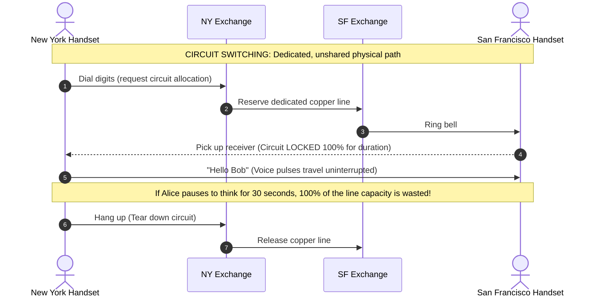

import { Callout } from 'fumadocs-ui/components/callout';
import { Tabs, Tab } from 'fumadocs-ui/components/tabs';
import { Steps, Step } from 'fumadocs-ui/components/steps';
import { Cards, Card } from 'fumadocs-ui/components/card';

## The TravelBuddy Story Begins: The Sneaker-Net Problem

Imagine the year is 1968. You and two engineers have just founded **TravelBuddy**, an automated flight booking system.

You own two mainframe computers located in two separate rooms of your building:

1. **Host-Alpha** (in Room 101) handles user reservation tickets.
2. **Host-Beta** (in Room 304) maintains the airline seat database.

```mermaid
flowchart LR
    A["Host-Alpha<br/>(Room 101)<br/>Ticket Input"] -- "Human running in sneakers<br/>carrying magnetic tape reel" --> B["Host-Beta<br/>(Room 304)<br/>Airline Database"]
    
    style A fill:#0f172a,stroke:#38bdf8,stroke-width:2px
    style B fill:#0f172a,stroke:#34d399,stroke-width:2px
```



Whenever a passenger purchases a ticket at Host-Alpha, a tape drive punches the record onto a physical reel of magnetic tape. An assistant unspools the reel, sprints down three flights of concrete stairs in their sneakers, pushes open the heavy fire doors of Room 304, mounts the tape onto Host-Beta, and loads the data into memory.

Engineers of the era called this **Sneaker-Net**.

Its performance profile was disastrous:
- **Latency**: 4 to 6 minutes (depending on whether the assistant took the stairs or elevator).
- **Throughput**: One magnetic reel per trip (~10 megabytes every 300 seconds = ~33 KB/s).
- **Error Rate**: Catastrophic. If the runner tripped on the stairs, dropped the tape, or exposed it to static electricity, the data was corrupted beyond recovery.
- **Concurrency**: Exactly 1 transfer at a time.

The founders asked a question that founded modern computing:

> *"Instead of converting digital electrons into magnetic tape, physically transporting the medium with human muscles, and converting it back into memory, can we connect the two computers with a copper wire and let the electrons move themselves?"*

The answer to that question is **Computer Networking**.

---

## What Exactly *Is* a Computer Network?

Before diving into packet math, consider how most of us were first introduced to computing:

<Callout type="info" title="The High School Myth: What Does 'COMPUTER' Stand For?">
Many high school textbooks in various parts of the world teach an amusing backronym:
> **C**ommonly **O**riented **M**achine **P**articularly **U**sed for **T**raining, **E**ducation, and **R**esearch.

While this makes for an entertaining classroom memory test, in computer engineering, a computer is strictly an **automated programmable electronic device that accepts raw digital input, processes it via algorithmic CPU cycles, and produces or transmits structured output**.
</Callout>

At its simplest, first-principles foundation:

> **A computer network is an interconnected group of autonomous computing devices capable of exchanging digital information and sharing resources using a mutually agreed-upon set of rules (protocols).**

Notice three words in this definition:

1. **Autonomous**: Each device has its own CPU, memory, and operating system. A dumb keyboard plugged into a computer is *not* a network; two independent computers exchanging files *is* a network.
2. **Interconnected**: A physical or wireless path (copper wire, glass optical fiber, or electromagnetic radio waves) exists between them.
3. **Protocols**: If Host-Alpha sends electrical voltage pulses representing ASCII text, but Host-Beta expects binary telemetry, communication fails. A **protocol** is the shared grammar, syntax, and timing rules that both sides agree to follow.

```mermaid
flowchart TD
    subgraph Network["The 4 Invariant Components of Every Network"]
        direction TB
        N["1. Nodes (Hosts, Servers, Clients, Routers)"]
        M["2. Medium (Copper Cable, Optical Fiber, Radio Waves)"]
        I["3. Network Interface (NIC, Transceiver, Radio Chip)"]
        P["4. Protocols (TCP/IP, Ethernet, Wi-Fi, DNS, HTTP)"]
    end
    
    style Network fill:#020617,stroke:#38bdf8,stroke-width:2px
```



---

## Circuit Switching vs. Packet Switching: The Fundamental Breakthrough

Before computer networks existed, the world had a massive planetary communications network: **the telephone system**.

To make a phone call in 1960 from New York to San Francisco, electro-mechanical switches in telephone exchanges snapped physical copper relays shut, forming a **continuous, unbroken electrical circuit** between your telephone handset and the receiver's handset 3,000 miles away.

This paradigm is called **Circuit Switching**.



### Why Circuit Switching Fails for Computers

When early computer scientists attempted to connect computers using circuit-switched telephone lines, they discovered three fatal limitations:

1. **Computer Traffic is "Burst-Driven"**: Human voice conversations are steady. Computer communication is violently spiky. A user clicks a link: *burst of 200 KB*. Then the user reads the page for 45 seconds: *0 KB transmitted*. In a circuit-switched model, you pay for and monopolize 100% of the wire's bandwidth during the entire 45 seconds of dead silence.
2. **Extreme Inefficiency & Low Utilization**: If 1,000 users want to share a line that only has 10 physical circuits, user 11 gets a busy signal—even if the first 10 users are transmitting nothing.
3. **Catastrophic Vulnerability to Outages**: In circuit switching, the path is rigidly locked. If a single repeater or cable along that 3,000-mile circuit is cut or knocked offline, the connection instantly terminates.

### The Invention of Packet Switching

In the early 1960s, three independent researchers—**Paul Baran** at the RAND Corporation (US), **Donald Davies** at the National Physical Laboratory (UK), and **Leonard Kleinrock** at MIT/UCLA—proposed an entirely different model: **Packet Switching**.

Instead of dedicating an entire physical highway to one vehicle, **chop the data into small, self-contained parcels called Packets (or Datagrams)**.

```mermaid
flowchart LR
    Msg["Original Data Payload<br/>(1,000 KB Flight Manifest)"]
    
    Msg --> P1["Packet #1 (1.5 KB)<br/>Dst: 203.0.113.10 | Seq: 1"]
    Msg --> P2["Packet #2 (1.5 KB)<br/>Dst: 203.0.113.10 | Seq: 2"]
    Msg --> P3["Packet #3 (1.5 KB)<br/>Dst: 203.0.113.10 | Seq: 3"]
    Msg --> Pn["Packet #N (1.5 KB)<br/>Dst: 203.0.113.10 | Seq: N"]

    subgraph Mesh["Mesh of Shared Routers"]
        R1((Router A))
        R2((Router B))
        R3((Router C))
    end

    P1 --> R1 --> Dst["Destination Server<br/>Reassembles by Seq #"]
    P2 --> R2 --> Dst
    P3 --> R1 --> Dst
    Pn --> R3 --> Dst

    style Msg fill:#1e293b,stroke:#94a3b8
    style Dst fill:#0f172a,stroke:#34d399,stroke-width:2px
```



### The Postcard Analogy

Think of Circuit Switching like renting a private helicopter from Chicago to Miami. The entire helicopter is yours, nobody else can step foot in it, and if the engine sputters over Kentucky, you crash.

Think of Packet Switching like sending a 20-page letter written on **20 numbered postcards**:
- Each postcard has the recipient's home address written on the front.
- Each postcard has a sequence number (`Page 1 of 20`, `Page 2 of 20`).
- You drop all 20 postcards into a public mailbox.
- Postcard #1 might travel on an airplane through Atlanta.
- Postcard #2 might travel in a mail truck through St. Louis because Atlanta was experiencing a storm.
- Postcards arrive at the destination house **out of order** (Postcard #2 arrives before #1).
- The recipient doesn't care! They look at the sequence numbers, sort them in numerical order from 1 to 20, and read the complete letter without missing a single sentence.

| Feature | Circuit Switching (Legacy Telephony) | Packet Switching (The Modern Internet) |
| :--- | :--- | :--- |
| **Path Allocation** | Dedicated physical path set up before transfer | Dynamic hop-by-hop forwarding per packet |
| **Bandwidth Use** | Reserved / monopolized (wasteful during pauses) | Dynamically multiplexed across millions of users |
| **Failure Tolerance** | If any link drops, the whole session collapses | If a link drops, subsequent packets take alternate routes |
| **Store and Forward** | No; real-time continuous electrical signal | Yes; intermediate switches buffer and inspect headers |
| **Primary Metric** | Constant latency, guaranteed throughput | Best-effort delivery, statistical multiplexing |

---

## The Birth of the Internet: From ARPANET to TCP/IP

The transition from theory to planetary infrastructure occurred through key historical milestones:

<Steps>
<Step>
### 1957–1958: The Cold War Catalyst (Sputnik & ARPA)
On **October 4, 1957**, the Soviet Union shocked the Western world by launching **Sputnik 1**, the first human-made satellite, into orbit. The realization that the USSR possessed superior rocket telemetry rattled the United States military establishment.

In response, President Dwight D. Eisenhower founded **ARPA (Advanced Research Projects Agency)** in 1958 inside the Department of Defense. ARPA's mandate was straightforward: prevent strategic technological surprise and fund ambitious, visionary research projects.

By the mid-1960s, ARPA's Information Processing Techniques Office (IPTO), directed by J.C.R. Licklider, Bob Taylor, and Larry Roberts, realized that the US military and scientific research communities were spending millions buying duplicate supercomputers for separate university laboratories. They conceived a revolutionary plan: connect these computers together so researchers could share code, hardware power, and data across telephone lines.
</Step>

<Step>
### 1969: ARPANET and the World's First Message
Four universities were selected to form the foundational core of the world's first packet-switched network:

1. **UCLA** (University of California, Los Angeles) — Led by Leonard Kleinrock with an SDS Sigma 7 mainframe; served as the first Network Measurement Center.
2. **SRI** (Stanford Research Institute) — Led by Douglas Engelbart (inventor of the computer mouse and hypertext) with an SDS 940 running the NLS ("oN-Line System").
3. **UCSB** (University of California, Santa Barbara) — Led by Glen Culler with an IBM 360/75.
4. **University of Utah** — Led by Ivan Sutherland and David Evans with a DEC PDP-10 specializing in 3D computer graphics.

These mainframe computers communicated through custom-built ruggedized minicomputers called **IMPs (Interface Message Processors)** built by Bolt Beranek and Newman (BBN)—the direct ancestors of today's network routers.

On **October 29, 1969, at 10:30 PM**, UCLA student programmer **Charley Kline** sat at a teletype terminal to log into the SRI mainframe in Menlo Park, California, 350 miles away. Kline was on a voice telephone line with Bill Duvall at SRI to verify each transmitted character:
- Kline typed `'L'`. Duvall checked the monitor: *"Got the L."*
- Kline typed `'O'`. Duvall verified: *"Got the O."*
- Kline typed `'G'`. Suddenly, the memory buffer on SRI's SDS 940 overflowed and the entire mainframe **crashed**.

Thus, the first message ever transmitted across the infant Internet was **`"LO"`**—serendipitously prophetic, as in *"Lo and behold!"* Within an hour, Duvall and Kline patched the code, typed the full word **`"LOGIN"`**, and launched the era of networked computing.
</Step>

<Step>
### 1969–1992: RFCs and the Open Internet Architecture (ISOC)
Unlike proprietary corporate technologies, the Internet was deliberately founded on an **open, democratic culture of engineering collaboration**:

- **Steve Crocker & RFC 1 (1969)**: When graduate students were documenting network protocols for ARPANET, Crocker wrote the very first **RFC (Request for Comments)** titled *"Host Software"*. He intentionally titled it *"Request for Comments"* to avoid sounding authoritative or imposing rules on fellow researchers.
- **The RFC Standard Today**: Every fundamental protocol powering the modern world—from IP (RFC 791) and TCP (RFC 793) to HTTP/1.1 (RFC 2616) and DNS (RFC 1035)—is published as a publicly accessible, immutable RFC document maintained by the **IETF (Internet Engineering Task Force)**.
- **The Internet Society (ISOC)**: Formed in 1992 by Vint Cerf and Bob Kahn, ISOC provides organizational leadership for internet standards, education, and policy.
- **The Core Credo**: As computer scientist David Clark famously declared at the 1992 IETF meeting:
  > *"We reject: kings, presidents and voting. We believe in: rough consensus and running code."*
</Step>

<Step>
### 1973–1974: Vint Cerf, Bob Kahn, and the TCP/IP Lingua Franca
By the mid-1970s, researchers had built multiple independent packet networks:
- **ARPANET** (terrestrial leased telephone lines across universities)
- **PRNET** (Packet Radio Network using mobile van radios in Hawaii and the San Francisco Bay Area)
- **SATNET** (Atlantic satellite packet network)

The crisis: **None of these networks could speak to each other**. ARPANET had a 1,000-bit packet limit; satellite packets were massive; packet radio suffered high interference.

Vinton Cerf and Robert Kahn designed an open, protocol-agnostic abstraction layer: **The Transmission Control Protocol / Internet Protocol (TCP/IP)**.

TCP/IP treated the physical network as a "dumb pipe." It did not care whether the bits traveled over copper, radio, or satellite. As long as a device could parse an IP header, it could communicate with any other device across any number of interconnected networks. This "inter-networking" was shortened to **The Internet**.
</Step>

<Step>
### January 1, 1983: "Flag Day"
ARPANET had previously run on an early protocol called NCP (Network Control Program). On **January 1, 1983**, all ARPANET nodes were required to simultaneously turn off NCP and boot up TCP/IP. This day is celebrated as the official birth date of the operational Internet.
</Step>

<Step>
### 1989–1991: Tim Berners-Lee Invents the World Wide Web
A critical distinction beginners often miss:

<Callout type="warn" title="The Internet is NOT the Web!">
- **The Internet** is the underlying global infrastructure: physical cables, ocean fiber, routers, switches, IP addresses, and TCP packets.
- **The World Wide Web (WWW)** is merely *one application* running on top of the Internet, invented in 1989 by Tim Berners-Lee at CERN (the European Organization for Nuclear Research). It uses HTTP to request HTML documents hyperlinked across the Internet. Other applications running on the Internet include Email (SMTP), File Transfer (SFTP), Voice-over-IP (SIP), and Git.
</Callout>

In December 1990, Berners-Lee published the **world's first website** hosted on his NeXT computer workstation at CERN:
```
http://info.cern.ch/hypertext/WWW/TheProject.html
```

In those early days, **there were no search engines**. If you wanted to visit a webpage, you had to manually type the exact URI into the address bar or click a blue hyperlink embedded within an existing document.
</Step>

<Step>
### 1994–1998: The Evolution of Search Engines
As millions of web pages emerged, finding information without knowing raw URLs became impossible. The industry solved discovery in three successive evolutionary waves:

1. **Human-Curated Web Directories (1994)**: Stanford graduate students Jerry Yang and David Filo created *"Jerry and David's Guide to the World Wide Web"*, soon renamed **Yahoo!**. It was not a search algorithm—it was a giant, manually categorized tree of websites curated by human editors (e.g., `Computers and Internet > Software > Operating Systems`).
2. **Early Keyword Web Crawlers (1994–1996)**: Engines like **Lycos**, **WebCrawler**, and **AltaVista** introduced automated web bots ("spiders") that downloaded HTML files and indexed words found directly on the page. However, they were easily spammed by webmasters repeating popular keywords hundreds of times in hidden text.
3. **The PageRank Algorithmic Revolution (1998)**: Stanford PhD students Larry Page and Sergey Brin founded **Google**. Their breakthrough algorithm, **PageRank**, analyzed the *hyperlink graph* of the web. It treated every incoming link from another webpage as an academic citation or vote of trust. Pages linked to by reputable institutions ranked higher, solving search relevance and unlocking the modern web economy.
</Step>
</Steps>

---

## How the Internet Actually Operates Today: Autonomous Systems & Tiered ISPs

Nobody owns the Internet. There is no central CEO, no central mainframe, and no single power switch.

Instead, the global Internet is a **cooperative federation of over 100,000 independent networks** called **Autonomous Systems (AS)**. Each Autonomous System is assigned a globally unique **ASN (Autonomous System Number)** by IANA (Internet Assigned Numbers Authority). For example:
- Google: `AS15169`
- Cloudflare: `AS13335`
- Amazon AWS: `AS16509`
- Comcast: `AS7922`

These Autonomous Systems negotiate with each other using a hierarchy of **Internet Service Providers (ISPs)**:

```mermaid
flowchart TD
    subgraph T1["Tier 1 ISPs (The Planetary Backbone)"]
        direction LR
        Lumen["Lumen (CenturyLink)"] <--> ATandT["AT&T"]
        ATandT <--> Telia["Arelion (Telia)"]
        Telia <--> NTT["NTT Communications"]
        NTT <--> Cogent["Cogent"]
    end

    subgraph IXP["Internet Exchange Points (IXPs)"]
        direction LR
        Equinix["Equinix Ashburn / AMS-IX / DE-CIX"]
    end

    subgraph T2["Tier 2 Regional ISPs & CDNs"]
        Vodafone["Vodafone UK"]
        Comcast["Comcast US"]
        Cloudflare["Cloudflare CDN (AS13335)"]
        Google["Google Edge (AS15169)"]
    end

    subgraph T3["Tier 3 Local Access & Consumers"]
        HomeA["Home User Laptop"]
        TravelBuddyOffice["TravelBuddy Headquarters"]
        PhoneUser["Mobile 5G User"]
    end

    T1 -->|Paid Transit| T2
    T2 <-->|Settlement-Free Peering| IXP
    T2 -->|Last-Mile Access| T3
    
    style T1 fill:#0f172a,stroke:#f59e0b,stroke-width:2px
    style IXP fill:#1e1b4b,stroke:#a855f7,stroke-width:2px
    style T2 fill:#022c22,stroke:#10b981,stroke-width:2px
    style T3 fill:#1e293b,stroke:#38bdf8,stroke-width:2px
```



### The Three Tiers of the Internet

1. **Tier 1 ISPs (The Backbone)**: A small, elite club of around 15 multinational telecommunications giants (e.g., Lumen/Level 3, Telia/Arelion, NTT, AT&T, Cogent, Tata Communications). They own hundreds of thousands of miles of terrestrial and subsea fiber.
   - **Key Property**: Tier 1 ISPs **never pay anyone for transit**. They enter into **Settlement-Free Peering** agreements with one another: *"I will carry your traffic across my North American fiber for free, if you carry my traffic across your European fiber for free."*
2. **Tier 2 ISPs (Regional Providers)**: Large telecom companies (e.g., Comcast, British Telecom, Orange). They own regional fiber, peer with other Tier 2s at exchange points, but must **purchase transit** from Tier 1 providers to reach the rest of the planet.
3. **Tier 3 ISPs (Last Mile)**: The local providers who physically run copper coax or fiber optic cables into your house or office building. They connect end users directly to the network.
4. **Internet Exchange Points (IXPs)**: Massive carrier-neutral datacenters (such as AMS-IX in Amsterdam, DE-CIX in Frankfurt, or Equinix in Ashburn, VA) where ISPs, Netflix, Cloudflare, and Google install high-speed optical switches to swap gigabits of traffic locally for free, bypassing expensive transit providers.

---

## The Physical Planet: Submarine Fiber Optic Cables

When people hear "the cloud" or see wireless Wi-Fi icons, they assume international traffic beams through satellites in space. 

**This is a myth.** In reality, **over 99% of all transoceanic internet traffic travels through physical fiber optic cables resting on the ocean floor**.

<div className="my-6 rounded-xl border border-fd-border overflow-hidden bg-fd-card">
  
  <div className="p-3 text-xs text-fd-muted-foreground bg-fd-muted/30">
    <strong>Global Submarine Fiber Optic Cable Highway:</strong> Over 500 subsea cable systems stretch across more than 1.4 million kilometers of ocean floor, interlinking planetary continents at the speed of light.
  </div>
</div>

You can explore the live, interactive planetary network anytime at [submarinecablemap.com](https://www.submarinecablemap.com/).

### Subsea Engineering Marvels & Physical Realities

1. **Extreme Distances**: Individual submarine cable systems stretch thousands of kilometers across ocean chasms. For example, systems like **SEA-ME-WE 3** (South-East Asia - Middle East - Western Europe 3) span up to **28,000 kilometers** (over 17,000 miles) and touch dozens of landing stations.
2. **Key Landing Stations (The Global Anchors)**: 
   - Transoceanic fiber cables emerge from the surf zone at specialized, heavily fortified facilities known as **Cable Landing Stations (CLS)**.
   - For example, in the Indian subcontinent, **Tata Communications** (historically VSNL) operates vital global landing stations in **Mumbai** and **Chennai**. The Mumbai landing station anchors high-capacity transcontinental highways connecting east toward the UAE, Middle East, Egypt, and Western Europe, while Chennai anchors express optical links southeast to Singapore, Malaysia, and East Asia.
3. **High-Voltage DC Power & Optical Repeaters**:
   - Photons traveling through silica glass lose intensity over distance due to scattering and absorption (attenuation). Every 50 to 100 kilometers along the ocean bed, the cable integrates an **EDFA (Erbium-Doped Fiber Amplifier)** optical repeater to regenerate laser pulses.
   - Because these repeaters rest at depths of up to 8,000 meters (26,000 feet) under the ocean, they cannot run on batteries. Instead, a central copper conductor inside the cable transmits **thousands of volts of High-Voltage Direct Current (HVDC)**—supplied by Power Feed Equipment (PFE) at the terrestrial landing stations—powering repeaters along the entire journey.
4. **Shark Bites & Physical Armoring**:
   - Near shallow coastlines, cables face constant danger from commercial fishing trawlers, dredging ships, and boat anchors. In these shallow zones (down to 1,500 meters), cables are heavily armored with double layers of galvanized steel wire and buried several feet into the seabed using specialized underwater robotic plows.
   - In deep waters, cables are thinner (barely the diameter of a garden hose) but wrapped in high-density polyethylene and protective copper shielding. Why? Deep-sea sharks are drawn to the minute electromagnetic leakage emitted by the copper power conductors (detected by their *Ampullae of Lorenzini* sensory organs). Modern submarine cables feature bite-resistant steel tape and aramid/Kevlar reinforcement to survive curious marine life.

### Why Submarine Cables Beat Satellites in Throughput and Latency

Students often ask: *"Why lay expensive glass across the ocean when satellites orbit above us?"*

| Metric | Submarine Optical Fiber | Satellite Constellations (GEO / LEO) |
| :--- | :--- | :--- |
| **Propagation Latency** | **Ultra-Low**: Photons travel ~200,000 km/s in glass. Transatlantic round-trip delay is only **~60 to 75 milliseconds**. | **High / Variable**: Geostationary (GEO) satellites sit 35,786 km in orbit, adding **~500 to 600 ms** round-trip delay. Low Earth Orbit (LEO, e.g., Starlink) achieves 30–50 ms locally, but inter-satellite laser links across oceans are still nascent and subject to satellite constellation handoffs. |
| **Total Capacity (Bandwidth)** | **Hundreds of Terabits/sec**: Modern multicore subsea cables deliver **250+ Tbps** per cable system using Dense Wavelength Division Multiplexing (DWDM). | **Constrained**: Radio frequency (RF) spectrum is strictly limited by international physics and orbital slot allocation; shared among all receivers in a footprint. |
| **Weather & Environmental Interference** | **Zero atmospheric impact**: Resting miles beneath ocean swells, deep-sea cables are immune to rain fade, storms, cloud cover, and solar flares. | **Susceptible to atmospheric conditions**: Heavy rainfall, cyclones, and atmospheric moisture degrade high-frequency Ka/Ku microwave bands (*rain fade*). |
| **Economic Longevity** | High upfront capital expenditure, but cables operate reliably on the ocean floor for **25+ years**. | Satellites de-orbit or run out of station-keeping thruster fuel in **5 to 7 years**, requiring continuous, expensive rocket re-launches. |

---

## Core Characteristics of Modern Network Performance

When evaluating any computer network, engineers measure five physical characteristics:

### 1. Bandwidth vs. Throughput

- **Bandwidth**: The maximum theoretical information-carrying capacity of the communication channel, measured in bits per second (e.g., `1 Gbps` = $1,000,000,000$ bits per second).
- **Throughput**: The *actual, real-world rate* at which useful data payloads are delivered from sender to receiver, factoring in protocol headers, packet drops, retransmissions, and TCP congestion throttling (e.g., your 1 Gbps fiber line delivering an actual download throughput of `840 Mbps`).

### 2. Latency (Delay)

The total time required for a bit to travel from sender to receiver. Latency is the sum of four physical delays:

$$\text{Total Latency} = D_{\text{propagation}} + D_{\text{transmission}} + D_{\text{queuing}} + D_{\text{processing}}$$

1. **Propagation Delay ($D_{\text{prop}}$)**: The time it takes for an electromagnetic wave or photon to travel through the physical medium. Light in a vacuum travels at $300,000\text{ km/s}$; inside silica optical fiber, light slows down to $\approx 200,000\text{ km/s}$ (~$5\ \mu\text{s}$ per kilometer).
2. **Transmission Delay ($D_{\text{trans}}$)**: The time it takes for a network interface card (NIC) to push all bits of a packet onto the physical wire:
   $$D_{\text{trans}} = \frac{\text{Packet Size (bits)}}{\text{Link Bandwidth (bps)}}$$
3. **Queuing Delay ($D_{\text{queue}}$)**: The time a packet sits in a router's memory buffer waiting for an outgoing line to become free during congestion.
4. **Processing Delay ($D_{\text{proc}}$)**: The microseconds a router's ASIC CPU takes to inspect the packet header, verify the checksum, and look up the destination IP in the routing table.

### 3. Jitter

The statistical variation in packet arrival delay. If Packet #1 arrives in 20ms, Packet #2 in 85ms, and Packet #3 in 22ms, the connection suffers high jitter. High jitter causes audio stuttering in Zoom calls and character rubber-banding in multiplayer gaming.

### 4. Packet Loss

The percentage of transmitted packets that fail to arrive at their destination. Packet loss occurs when a router's hardware buffer overflows during congestion (buffer overrun), or when physical noise on a wireless or copper medium corrupts the frame checksum.

---

## Hands-on Lab: Tracing the Global Packet Path in Real Time

You can observe packet switching, autonomous systems, and intermediate routing hops right now from your own terminal.

<Tabs items={['Windows (PowerShell)', 'macOS / Linux']}>
<Tab value="Windows (PowerShell)">
```powershell
# Trace the packet path from your computer to an international server
tracert 1.1.1.1
```
</Tab>
<Tab value="macOS / Linux">
```bash
# Trace the route with ICMP or UDP packets
traceroute 1.1.1.1
```
</Tab>
</Tabs>

### Dissecting the Output

A typical traceroute output reveals the real-world hops your data takes:

```text
Tracing route to one.one.one.one [1.1.1.1] over a maximum of 30 hops:

  1    <1 ms    <1 ms    <1 ms  192.168.1.1           [Local Wi-Fi Router / Default Gateway]
  2     4 ms     3 ms     3 ms  10.240.0.1            [ISP Local Aggregation Switch]
  3     8 ms     7 ms     8 ms  96.120.45.13          [ISP Regional Center (Tier 3)]
  4    12 ms    11 ms    13 ms  68.86.92.14           [Comcast Regional Backbone (Tier 2)]
  5    15 ms    14 ms    15 ms  be-302-cr11.ashburn.va.ibone.comcast.net [162.158.100.1]
  6    14 ms    15 ms    14 ms  equinix-ashburn.cloudflare.com [206.126.236.69] [IXP Peering]
  7    14 ms    14 ms    14 ms  one.one.one.one [1.1.1.1] [Cloudflare Anycast Destination]

Trace complete.
```

Notice what happened:
- **Hop 1**: Your packet hopped from your laptop over radio waves to your living room router (`192.168.1.1`) in less than 1 millisecond.
- **Hops 2–4**: Your packet traveled over copper coax or fiber through your ISP's local neighborhood node.
- **Hop 5**: It traversed a high-capacity fiber backbone line directly into Ashburn, Virginia (the datacenter capital of the world).
- **Hop 6**: At the **Equinix Ashburn IXP**, your ISP handed off the packet directly to Cloudflare's network switch over a peering link.
- **Hop 7**: Cloudflare's server received the packet and returned an echo reply.

Your packet crossed hundreds of miles of physical cables, negotiated half a dozen independent routing devices, and returned in just **14 milliseconds**.

---

## Chapter Summary & Quick Recall

<Cards>
  <Card title="Circuit Switching vs. Packet Switching" href="#circuit-switching-vs-packet-switching-the-fundamental-breakthrough">
    Circuit switching dedicates an unshared physical line for an entire call. Packet switching divides data into addressed, numbered postcards that independently traverse shared infrastructure.
  </Card>
  <Card title="The Origin: ARPANET & TCP/IP" href="#the-birth-of-the-internet-from-arpanet-to-tcpip">
    Launched in 1969 with 4 nodes. The TCP/IP open standard, created by Vint Cerf and Bob Kahn, unified disparate radio, satellite, and wire networks into one global Internetwork.
  </Card>
  <Card title="Autonomous Systems & Tier 1 Peering" href="#how-the-global-internet-operates-today-autonomous-systems--tiered-isps">
    The Internet is a federation of 100,000+ Autonomous Systems. Tier 1 backbones connect the world via settlement-free peering, while IXPs let networks exchange traffic directly.
  </Card>
</Cards>

<Callout type="info" title="Next Up: Lesson 02">
Now that you understand what a network is and how packets move across the planetary backbone, let's explore **[Network Types & Topologies: From PAN to WAN, Topologies, VPNs, and VLANs](/docs/computer-networking/01-foundations/02-network-types-topologies)** to see how networks are structured from personal wearables to multinational datacenters.
</Callout>
