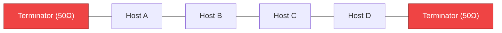

import { Callout } from 'fumadocs-ui/components/callout';
import { Tabs, Tab } from 'fumadocs-ui/components/tabs';
import { Steps, Step } from 'fumadocs-ui/components/steps';
import { Cards, Card } from 'fumadocs-ui/components/card';

## The TravelBuddy Scaling Dilemma: A Network That Outgrows Its Room

In [Lesson 01](/docs/computer-networking/01-foundations/01-what-is-network-internet-history), TravelBuddy connected its two mainframe computers with a single copper cable, eliminating the sneaker-net.

Fast forward three years. The startup has exploded into a global travel conglomerate. Notice how the physical shape and scale of their network changes as they grow:

```mermaid
flowchart TD
    subgraph Growth["The 7 Scale Milestones of TravelBuddy"]
        direction TB
        M1["1. Founder connects smartwatch & phone via Bluetooth (PAN)"]
        M2["2. 15 engineers share an office switch & local NAS (LAN / WLAN)"]
        M3["3. Company leases 3 buildings in an office tech park (CAN)"]
        M4["4. Offices across downtown Chicago linked by dark fiber (MAN)"]
        M5["5. Datacenters in North America, Europe & Tokyo linked globally (WAN)"]
        M6["6. Database cluster demanding high-speed NVMe block storage (SAN)"]
        M7["7. Remote workers dialing in securely (VPN) & department segmentation (VLAN)"]
        
        M1 --> M2 --> M3 --> M4 --> M5 --> M6 --> M7
    end

    style Growth fill:#020617,stroke:#38bdf8,stroke-width:2px
```

Networks are classified primarily by two dimensions:
1. **Geographic Scope & Purpose** (PAN, LAN, CAN, MAN, WAN, SAN, WLAN, VPN, VLAN).
2. **Topological Layout** (Bus, Star, Ring, Mesh, Tree, and Datacenter Spine-and-Leaf).

Let us unpack both from first principles.

---

## Network Types: Scope & Architecture

### 1. PAN (Personal Area Network)

A PAN is a network centered around a single person within a personal operating space, typically with a radius of **under 10 meters (33 feet)**.

```mermaid
flowchart LR
    Phone["Smartphone<br/>(Central Hub)"] <-->|Bluetooth 5.3| Watch["Smartwatch"]
    Phone <-->|BLE| Buds["Wireless Earbuds"]
    Phone <-->|NFC| Terminal["Payment Terminal"]
    Laptop["Laptop"] <-->|USB-C / Wi-Fi Direct| Phone

    style Phone fill:#0f172a,stroke:#38bdf8,stroke-width:2px
```

- **Primary Technologies**: Bluetooth, Bluetooth Low Energy (BLE), Zigbee, Near-Field Communication (NFC), Ultra-Wideband (UWB), and USB-C tethering.
- **Characteristics**: Low power consumption, modest bandwidth (e.g. 1–3 Mbps for Bluetooth, up to 480 Mbps for USB 2.0), extremely short range, zero infrastructure (no routers or external switches needed).
- **TravelBuddy Example**: The flight gate agent tapping an NFC-enabled smartphone against a passenger's smartwatch to validate a boarding pass.

---

### 2. LAN (Local Area Network)

A LAN connects computers and peripheral devices within a **geographically limited, contiguous private area**—such as a single office room, a home, or a single floor of a building.

- **Coverage**: Typically 10 meters to a few hundred meters.
- **Physical Media**: Category 6/6A unshielded twisted pair copper cables (RJ-45) plugged into Layer 2 Ethernet switches, or short-range multi-mode fiber.
- **Performance**: High bandwidth (**1 Gbps to 10 Gbps** per desktop, up to 100 Gbps for server links), ultra-low latency (**under 1 millisecond**), and virtually nonexistent error rates.
- **Ownership**: 100% privately owned and maintained by the organization. No public telecom carrier is involved.

---

### 3. WLAN (Wireless Local Area Network)

A WLAN is simply a LAN that uses **high-frequency radio waves** (IEEE 802.11 Wi-Fi) instead of physical cables to connect endpoints to the network.

- **Central Device**: An **Access Point (AP)**, which acts as a bridge converting 802.11 wireless radio frames into 802.3 wired Ethernet frames.
- **Crucial Architectural Difference from Wired LAN**:
  - In a wired switched LAN, every host has its own dedicated wire and operates in **Full-Duplex** (transmitting and receiving simultaneously without collisions).
  - In a WLAN, all devices on a given radio channel share the same open airwaves. Wireless is inherently **Half-Duplex** and relies on **CSMA/CA (Carrier Sense Multiple Access with Collision Avoidance)**. Only one device (client or AP) can transmit on a channel at any single instant.

---

### 4. CAN (Campus Area Network)

When TravelBuddy grew from a single office suite into an entire technology park, it occupied three distinct multi-story buildings: Engineering in Building A, Customer Operations in Building B, and the Executive Suites in Building C.

A **Campus Area Network (CAN)** spans multiple buildings situated within a contiguous, walking-distance geographic property.

```mermaid
flowchart TD
    subgraph CAN["TravelBuddy Campus Area Network (CAN)"]
        subgraph BldgA["Building A: Engineering"]
            SW_A["Distribution Switch A"]
        end
        subgraph BldgB["Building B: Operations"]
            SW_B["Distribution Switch B"]
        end
        subgraph BldgC["Building C: Executive"]
            SW_C["Distribution Switch C"]
        end
        
        CoreSW["Central Campus Core Switch<br/>(High-Capacity 40G Optical Backbone)"]
        
        SW_A <-->|Underground Fiber Trench| CoreSW
        SW_B <-->|Underground Fiber Trench| CoreSW
        SW_C <-->|Underground Fiber Trench| CoreSW
    end

    style CoreSW fill:#0f172a,stroke:#34d399,stroke-width:2px
```

- **Physical Media**: Armored multi-strand fiber optic cables laid through underground PVC conduit pipes between buildings.
- **Management**: Still privately owned by the enterprise. The company owns the private land between buildings, so it does not need to pay public telecom monopolies for easement rights.

---

### 5. MAN (Metropolitan Area Network)

TravelBuddy expands across the city of Chicago: a corporate headquarters in the Loop, a reservations center in Fulton Market, and a private disaster recovery site near O'Hare Airport (25 miles away).

Because public streets, parks, and rivers separate these facilities, TravelBuddy cannot legally dig up the city streets to lay its own private cables.

It subscribes to a **Metropolitan Area Network (MAN)**:
- **Coverage**: An entire city or metropolitan municipality (typically 5 to 50 kilometers).
- **Underlying Technology**: **Metro Ethernet**, **Dark Fiber** leasing, and **DWDM (Dense Wavelength Division Multiplexing)** rings operated by regional telecom providers.
- **Speed**: 10 Gbps to 100 Gbps with dedicated service-level agreements (SLAs).

---

### 6. WAN (Wide Area Network)

A WAN connects computers across **vast geographic distances**—spanning cities, countries, continents, or the entire planet.

- **The Ultimate WAN**: The public **Internet** is the world's largest, universally accessible WAN.
- **Enterprise WAN**: A private, closed network connecting an enterprise's global branches (e.g., TravelBuddy Chicago headquarters connecting to TravelBuddy London and TravelBuddy Singapore).
- **Technologies**:
  - **MPLS (Multiprotocol Label Switching)**: High-cost, carrier-managed circuits offering guaranteed latency and bandwidth.
  - **SD-WAN (Software-Defined WAN)**: Modern approach that bonds multiple cheap public internet lines (commercial fiber, 5G, Starlink satellite) using encrypted tunnels, dynamically steering packets over the fastest path.
  - **Subsea Fiber Cables**: Glass strands running along ocean beds carrying over 99% of all intercontinental traffic.

---

### 7. SAN (Storage Area Network)

As TravelBuddy's database grew, its MySQL cluster started choking. The issue was not CPU or RAM; it was **disk I/O bottlenecks**.

Engineers could not use regular LAN file sharing (like NFS or Windows SMB) because:
1. Standard LAN traffic experiences latency spikes, congestion, and packet drops.
2. File-level protocols add heavy operating system abstraction. A high-performance database needs to write **raw disk sectors (blocks)** directly to storage controllers with zero operating system translation.

The solution is a **SAN (Storage Area Network)**:

```mermaid
flowchart LR
    subgraph Compute["Application Servers"]
        Srv1["App Server 1"]
        Srv2["App Server 2"]
    end

    subgraph SAN_Fabric["Dedicated High-Speed SAN Fabric (Fibre Channel / NVMe-oF)"]
        FCSwitch["Fibre Channel Switch<br/>(32 Gbps / 64 Gbps)"]
    end

    subgraph StorageArray["Enterprise Storage Array"]
        LUN1[("LUN 0: High-Speed NVMe Flash SSDs")]
        LUN2[("LUN 1: RAID-10 Disk Shelves")]
    end

    Srv1 -->|Dedicated HBA Card| FCSwitch
    Srv2 -->|Dedicated HBA Card| FCSwitch
    FCSwitch --> LUN1
    FCSwitch --> LUN2

    style SAN_Fabric fill:#1e1b4b,stroke:#a855f7,stroke-width:2px
```

- **Protocol**: **Fibre Channel (FC)**, **iSCSI** (SCSI blocks encapsulated inside TCP packets), or **NVMe-oF (NVMe over Fabrics)**.
- **Characteristics**: Sub-millisecond latency, lossless transmission fabrics, physically separated from general employee office traffic.

---

### 8. Virtual Networks: VLANs vs. VPNs

Never confuse a VLAN with a VPN:

| Feature | VLAN (Virtual Local Area Network) | VPN (Virtual Private Network) |
| :--- | :--- | :--- |
| **Layer** | **Layer 2 (Data Link)** | **Layer 3 / 4 (Network / Transport)** |
| **Standard** | IEEE 802.1Q (4-byte tag in Ethernet frame) | IPsec (IKEv2/ESP), WireGuard, OpenVPN, TLS |
| **Purpose** | Logically slice a physical switch into isolated broadcast domains (e.g. isolate Guest Wi-Fi from Payroll) | Encrypt and tunnel private network traffic over an insecure public network (the Internet) |
| **Encryption** | None. Plaintext frames tagged with a 12-bit VLAN ID | Strong cryptographic ciphers (AES-256-GCM, ChaCha20-Poly1305) |
| **Scope** | Local building switch / campus infrastructure | Global; remote employees connecting from coffee shops |

---

### Exhaustive Network Comparison Matrix

| Type | Full Name | Typical Range | Typical Speed | Latency | Ownership | Key Protocols / Standards |
| :--- | :--- | :--- | :--- | :--- | :--- | :--- |
| **PAN** | Personal Area Network | $< 10\text{ m}$ | 1–480 Mbps | 10–50 ms | Individual | Bluetooth 5.x, BLE, Zigbee, NFC, UWB |
| **LAN** | Local Area Network | $< 300\text{ m}$ | 1–10 Gbps | $< 1\text{ ms}$ | Private Enterprise | IEEE 802.3 Ethernet, Cat6A, ARP, IPv4/v6 |
| **WLAN** | Wireless LAN | 10–50 m | 50–9600 Mbps | 2–15 ms | Private Enterprise | IEEE 802.11a/b/g/n/ac/ax/be (Wi-Fi 6/7) |
| **CAN** | Campus Area Network | 1–5 km | 10–40 Gbps | 1–3 ms | University / Corp | 10G/40G Multi-mode/Single-mode Fiber |
| **MAN** | Metropolitan Area Network | 5–50 km | 1–100 Gbps | 2–10 ms | Telecom / City | Metro Ethernet, DWDM, Dark Fiber |
| **WAN** | Wide Area Network | 50–20,000 km | 10 Mbps – 100 Gbps | 20–250 ms | Multi-Carrier / Public | MPLS, BGP, SD-WAN, Subsea Cables |
| **SAN** | Storage Area Network | Datacenter Rack | 32–128 Gbps | $< 0.5\text{ ms}$ | Private Enterprise | Fibre Channel, iSCSI, FCoE, NVMe-oF |
| **VPN** | Virtual Private Network | Global Overlay | Dependent on ISP | $+ 5-15\text{ ms}$ | Software Overlay | IPsec (ESP/AH), WireGuard, OpenVPN |
| **VLAN** | Virtual LAN | Switch Domain | Native Switch Speed | $0\text{ ms}$ added | Network Admin | IEEE 802.1Q (VLAN Tagging) |

---

## Network Topologies: Physical vs. Logical Architecture

A **topology** defines how nodes in a network are arranged and how they communicate with each other.

There is a vital distinction between:
- **Physical Topology**: How the cables, patch cords, racks, and hardware devices are physically laid out on the floor.
- **Logical Topology**: The actual path that electronic signals or data frames take through the circuits. For example, a legacy network may look physically like a Star (cables running into a central box), but behave logically like a Bus (because the central box is a dumb hub that broadcasts every electrical pulse to all ports).

Let us analyze the classic topologies, their mathematical trade-offs, and why certain topologies went extinct while others dominate the planet.

---

### 1. Bus Topology

In a Bus topology, every host is tapped into a **single continuous central backbone cable** (historically 10BASE2 "thinnet" or 10BASE5 "thicknet" coaxial cable).

#### How It Operates
When Host A transmits data, electrical pulses travel in both directions down the copper wire. Every single machine on the bus inspects the destination address in the header. If the address matches its own, it processes the packet; if not, it ignores it.

To prevent the electrical wave from hitting the end of the wire and bouncing back (causing signal reflection and severe waveform corruption), **50-ohm terminating resistors** must be screwed into both physical ends of the cable.

#### Pros and Cons
- **Pros**: Minimal cabling required. In 1980, running one cable through the wall was vastly cheaper than running 50 individual home-run lines.
- **Fatal Flaw (Single Point of Failure)**: If anyone trips over the cable, loosens a BNC T-connector, or cuts the wire anywhere along the run, the entire bus loses its termination. Electrical signals bounce violently, creating instant standing waves that **knock out 100% of devices on the network**.
- **Collision Hell**: Only one device can transmit at a time. As nodes increase, collision rates spike exponentially.

---

### 2. Ring Topology

In a Ring topology, each computer is connected to **exactly two neighboring computers**, forming a closed, circular loop.

```mermaid
flowchart TD
    A["Node A"] -->|Token Direction| B["Node B"]
    B --> C["Node C"]
    C --> D["Node D"]
    D --> A

    style A fill:#0f172a,stroke:#38bdf8,stroke-width:2px
    style B fill:#0f172a,stroke:#38bdf8,stroke-width:2px
    style C fill:#0f172a,stroke:#38bdf8,stroke-width:2px
    style D fill:#0f172a,stroke:#38bdf8,stroke-width:2px
```

#### How Token Passing Works (IBM Token Ring, IEEE 802.5)
Unlike the chaotic "shout-and-hope" collision model of the early bus, a ring topology is **strictly deterministic**:
1. A special electronic bit sequence called a **Token** circulates continuously around the ring in one direction.
2. If Host A wants to transmit, it must wait until the token passes by. It captures the token, changes one bit (turning it into a frame header), appends its data, and releases it onto the ring.
3. The frame travels from Node B to Node C to Node D. Each node acts as an active repeater, regenerating the signal.
4. When the intended recipient (Node C) receives the frame, it copies the payload, flips an "acknowledged" flag in the frame trailer, and sends it back around.
5. When the frame completes the loop and returns to Host A, Host A verifies delivery, strips the data, and releases a new empty token.

#### Pros and Cons
- **Pros**: **Zero collisions**. Bandwidth utilization remains stable even under 95% network saturation.
- **Fatal Flaw**: If a single workstation shuts down, unplugs, or suffers a faulty NIC, the physical ring breaks, halting the token and killing the entire network.
- **The Modern Dual-Ring Savior (FDDI / SONET)**: Telecom providers solved this by deploying **Dual Counter-Rotating Rings** (Fiber Distributed Data Interface). If one cable is cut, the switches on either side loop the secondary ring back into the primary ring (called *ring wrapping*), healing the network in milliseconds.

---

### 3. Star Topology: The Undisputed King of the LAN

In a Star topology, **every device connects via a dedicated point-to-point cable directly to a central multiport switch**.

```mermaid
flowchart TD
    CentralSwitch["Central Layer 2 Switch<br/>(CAM Table Memory)"]
    
    CentralSwitch <--> HostA["Host A (Engineering)"]
    CentralSwitch <--> HostB["Host B (Accounting)"]
    CentralSwitch <--> HostC["Host C (Database)"]
    CentralSwitch <--> HostD["Host D (Printer)"]
    CentralSwitch <--> Router["Internet Router"]

    style CentralSwitch fill:#022c22,stroke:#10b981,stroke-width:2px
```

#### Why Star Won the Architectural War
Look around any modern office, school, or datacenter: **every wired network is a Star**.

Why?
1. **Fault Isolation**: If Host A's cable is damaged, or its network card fails, only Host A goes offline. Host B, C, D, and the printer experience zero packet loss.
2. **Ease of Troubleshooting**: Network engineers simply look at the LED link lights on the switch faceplate. A dark port pinpoints the exact cable run or room that has failed.
3. **Dedicated Bandwidth**: When paired with a modern switch, each port receives a dedicated collision-free link (e.g. 1 Gbps full-duplex both ways).
4. **Vulnerability**: The central switch is the single point of failure. If the central switch loses power, the entire star goes down. In enterprise environments, this is mitigated by deploying **Redundant Switch Pairs** (using protocols like MLAG or Cisco VSS).

---

### 4. Mesh Topology: Maximum Resilience

In a Mesh topology, nodes are interconnected with redundant physical links.

```mermaid
flowchart TD
    subgraph FullMesh["Full Mesh (4 Nodes = 6 Links)"]
        N1((A)) <--> N2((B))
        N1 <--> N3((C))
        N1 <--> N4((D))
        N2 <--> N3
        N2 <--> N4
        N3 <--> N4
    end

    subgraph PartialMesh["Partial Mesh (Redundant Core)"]
        P1((R1)) <--> P2((R2))
        P1 <--> P3((R3))
        P2 <--> P4((R4))
        P3 <--> P4
        P2 <--> P3
    end

    style FullMesh fill:#0f172a,stroke:#38bdf8
    style PartialMesh fill:#0f172a,stroke:#34d399
```

#### Mathematical Reality of Full Mesh
In a **Full Mesh**, every node maintains a direct, physical connection to every other node in the network.

The formula for calculating the required physical links ($L$) for $N$ nodes is:

$$L = \frac{N(N - 1)}{2}$$

Let us observe what happens to cabling and interface card requirements as nodes scale:

| Number of Nodes ($N$) | Total Physical Links Required ($L$) | Ports Required Per Node ($N - 1$) |
| :--- | :--- | :--- |
| **4** | 6 links | 3 ports |
| **8** | 28 links | 7 ports |
| **20** | 190 links | 19 ports |
| **100** | 4,950 links | 99 ports |
| **1,000** | 499,500 links | 999 ports |

<Callout type="warn" title="The Cabling Explosion">
A full mesh of 1,000 servers would require half a million cables and each server would need 999 network cards! Full mesh is physically impossible at scale for general endpoints.
</Callout>

#### Where Mesh Is Actually Used
- **Partial Mesh**: Used across the global Internet backbone (Tier 1 ISPs) and enterprise WAN core routers. High-traffic nodes have 3 or 4 redundant paths, ensuring that if a backhoe cuts one fiber conduit, dynamic routing protocols (like BGP and OSPF) divert traffic around the failure in sub-seconds.
- **Wireless Mesh**: Modern smart home networks (Google Nest Wi-Fi, Amazon Eero, Zigbee/Z-Wave light switches) where nodes dynamically relay wireless packets across each other without running copper lines.

---

### 5. Tree Topology (Hierarchical Enterprise Model)

A Tree topology combines multiple Star topologies into a hierarchical structure. It is codified in the **Cisco Three-Tier Hierarchical Campus Design**:

```mermaid
flowchart TD
    subgraph CoreLayer["1. Core Layer (High-Speed Backbone)"]
        Core1["Core Switch 1"] <--> Core2["Core Switch 2"]
    end

    subgraph DistLayer["2. Distribution Layer (Policy, Routing, ACLs)"]
        Dist1["Dist Switch 1"]
        Dist2["Dist Switch 2"]
        Dist3["Dist Switch 3"]
        Dist4["Dist Switch 4"]
    end

    subgraph AccessLayer["3. Access Layer (Workstation & AP Ports)"]
        Acc1["Access Switch A"]
        Acc2["Access Switch B"]
        Acc3["Access Switch C"]
        Acc4["Access Switch D"]
    end

    Core1 <--> Dist1
    Core1 <--> Dist2
    Core2 <--> Dist3
    Core2 <--> Dist4
    
    Dist1 <--> Acc1
    Dist2 <--> Acc2
    Dist3 <--> Acc3
    Dist4 <--> Acc4

    style CoreLayer fill:#1e1b4b,stroke:#a855f7,stroke-width:2px
    style DistLayer fill:#0f172a,stroke:#38bdf8,stroke-width:2px
    style AccessLayer fill:#022c22,stroke:#10b981,stroke-width:2px
```

1. **Access Layer**: Switches located in wiring closets on each office floor. Desktops, VoIP phones, printers, and Wi-Fi Access Points plug in here. Operates at Layer 2. Enforces port security, 802.1X authentication, and VLAN assignments.
2. **Distribution Layer**: Aggregates traffic from dozens of access switches. Performs inter-VLAN routing, applies security firewalls and Access Control Lists (ACLs), and determines the best path to the core.
3. **Core Layer**: The enterprise high-speed highway. Its sole job is to move raw bits between distribution blocks and the outside internet gateway as fast as physically possible. **No packet filtering, no ACLs, no bottlenecking allowed at the core.**

---

## Modern Cloud Datacenters: The Spine-and-Leaf (Clos) Architecture

For twenty years, the traditional 3-tier tree topology was sufficient because 80% of traffic was **North-South** (a client on the Internet sending a request down through the core to a single web server, and the server replying back up).

Then the cloud happened.

In modern systems like Netflix, Amazon, and TravelBuddy, a single user search triggers **East-West traffic**:
- The web server contacts 14 microservice pods,
- Which query 8 distributed Redis caches,
- Which talk to a Cassandra cluster across 30 nodes,
- Which replicate transaction logs to a backup array.

In a 3-tier tree, all this lateral East-West traffic has to funnel upward through distribution switches to the core, creating massive congestion and buffer exhaustion. Furthermore, the legacy **Spanning Tree Protocol (STP)** disables redundant links to prevent broadcast loops, leaving half of your expensive fiber links completely idle!

### The Clos / Spine-and-Leaf Architecture

Invented by Charles Clos in telecommunications and popularized by cloud giants (Google, Meta, AWS), modern datacenter networks use **Spine-and-Leaf**:

```mermaid
flowchart TD
    subgraph Spines["Spine Layer (High-Capacity 400G Optical Switches)"]
        direction LR
        S1["Spine 1"]
        S2["Spine 2"]
        S3["Spine 3"]
        S4["Spine 4"]
    end

    subgraph Leafs["Leaf Layer (Top-of-Rack Switches)"]
        direction LR
        L1["Leaf 1<br/>(Rack 101)"]
        L2["Leaf 2<br/>(Rack 102)"]
        L3["Leaf 3<br/>(Rack 103)"]
        L4["Leaf 4<br/>(Rack 104)"]
    end

    subgraph Servers["Datacenter Bare-Metal & Kubernetes Worker Nodes"]
        SRV1["Kubernetes Nodes"]
        SRV2["Database Cluster"]
        SRV3["Redis In-Memory"]
        SRV4["Object Storage"]
    end

    L1 --- S1
    L1 --- S2
    L1 --- S3
    L1 --- S4

    L2 --- S1
    L2 --- S2
    L2 --- S3
    L2 --- S4

    L3 --- S1
    L3 --- S2
    L3 --- S3
    L3 --- S4

    L4 --- S1
    L4 --- S2
    L4 --- S3
    L4 --- S4

    SRV1 --- L1
    SRV2 --- L2
    SRV3 --- L3
    SRV4 --- L4

    style Spines fill:#1e1b4b,stroke:#a855f7,stroke-width:2px
    style Leafs fill:#022c22,stroke:#10b981,stroke-width:2px
```

### The Architectural Rules of Spine-and-Leaf
1. **Every Leaf connects to every single Spine**.
2. **Spines never connect to other Spines**.
3. **Leafs never connect directly to other Leafs**.
4. **Endpoints (servers, storage arrays) only connect to Leaf switches**.
5. **Deterministic Latency**: Any server in the datacenter is **exactly 2 hops away** from any other server! (Server A $\rightarrow$ Leaf 1 $\rightarrow$ Any Spine $\rightarrow$ Leaf 3 $\rightarrow$ Server B).
6. **No Spanning Tree Waste**: Instead of blocking links, the network runs Layer 3 routing (e.g. BGP) with **ECMP (Equal-Cost Multi-Path)**. Traffic is dynamically sprayed across all four spines in parallel, providing 100% active bandwidth utilization and instant failover if any single spine switch explodes.

---

## Topology Troubleshooting Scenario

<Callout type="error" title="Production Incident at TravelBuddy">
**The Alert**: At 2:14 PM, a facilities technician working in the electrical riser closet on Floor 4 accidentally cuts a bundle of 12 copper cables with heavy wire shears.

**The Diagnostic**:
- 12 developer workstations on Floor 4 immediately lose network connectivity.
- Meanwhile, 340 other users across Floors 1, 2, 3, and 5 continue browsing, database queries continue processing, and the public website experiences 0 dropped requests.

**The Analysis**:
- What topology is deployed? **Star Topology** (hierarchical star).
- Because each workstation connects over an isolated point-to-point link to an access switch, the failure was localized strictly to the severed cable runs.
- If the office had been running a legacy **Bus Topology**, that single cut would have destroyed the termination resistance, causing electrical reflections that would have immediately knocked out all 352 computers in the entire company.
</Callout>

---

## Chapter Summary & Quick Recall

<Cards>
  <Card title="The Scale Spectrum" href="#network-types-scope--architecture">
    PAN ($< 10\text{m}$) for wearables, LAN ($< 300\text{m}$) for high-speed offices, MAN ($5-50\text{ km}$) for metropolitan dark fiber, and WAN for intercontinental transit.
  </Card>
  <Card title="SAN vs. LAN" href="#7-san-storage-area-network">
    Storage Area Networks isolate lossless block-level I/O (Fibre Channel, NVMe-oF) away from noisy client TCP/IP traffic.
  </Card>
  <Card title="Star vs. Spine-and-Leaf" href="#modern-cloud-datacenters-the-spine-and-leaf-clos-architecture">
    Star topology rules enterprise office floors for fault isolation. Spine-and-Leaf (Clos) rules modern cloud datacenters, providing deterministic 2-hop East-West latency with ECMP.
  </Card>
</Cards>

<Callout type="info" title="Next Up: Lesson 03">
Now that you master the geographic classifications and structural topologies, let's drill down into the physical reality: **[Networking Devices, Transmission Media & Internet Speed](/docs/computer-networking/01-foundations/03-devices-media-speed)** to inspect real fiber optics, copper twists, switches, routers, and the speed of light.
</Callout>
