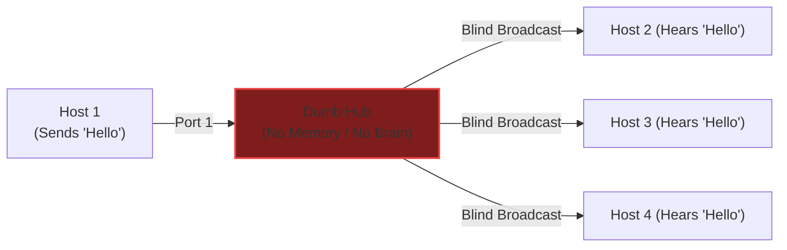

import { Callout } from 'fumadocs-ui/components/callout';
import { Tabs, Tab } from 'fumadocs-ui/components/tabs';
import { Steps, Step } from 'fumadocs-ui/components/steps';
import { Cards, Card } from 'fumadocs-ui/components/card';

## The Physical Reality: "There Is No Cloud"

During a TravelBuddy board meeting, an investor asks: *"Where does our application actually live?"*

The marketing answer is *"in the cloud."*

The engineering answer is vastly more fascinating:

> **There is no cloud. There are only millions of computers connected by twisted copper wires, laser pulses traveling through microscopically thin glass tubes on the ocean floor, and silicon switches making billionth-of-a-second routing decisions.**

Every digital experience—a booking confirmation, a credit card swipe, a 4K video stream—is fundamentally an electromagnetic wave or a packet of photons racing through physical matter.

In this chapter, we inspect the physical hardware, transmission media, and mathematical constraints of speed that make the global Internet possible.

---

## Visualizing the Physical Layer

Before examining their internal logic, observe the actual hardware components deployed across enterprise networks and datacenters:

<div className="grid grid-cols-1 md:grid-cols-2 gap-4 my-6">
  <div className="rounded-xl border border-fd-border overflow-hidden bg-fd-card">
    
    <div className="p-3 text-xs text-fd-muted-foreground">
      <strong>Category 6 Twisted Copper Pair with RJ-45 (8P8C) Connector</strong>: The backbone of horizontal office wiring, delivering 1 to 10 Gbps up to 100 meters.
    </div>
  </div>
  <div className="rounded-xl border border-fd-border overflow-hidden bg-fd-card">
    
    <div className="p-3 text-xs text-fd-muted-foreground">
      <strong>Duplex LC Optical Fiber Patch Cable</strong>: Pulses of laser light travel inside hair-thin silica glass cores at over 200,000 km/s.
    </div>
  </div>
  <div className="rounded-xl border border-fd-border overflow-hidden bg-fd-card">
    
    <div className="p-3 text-xs text-fd-muted-foreground">
      <strong>Enterprise Layer 2/3 Switch</strong>: Hardware ASICs forward frames between ports in nanoseconds using internal CAM MAC address tables.
    </div>
  </div>
  <div className="rounded-xl border border-fd-border overflow-hidden bg-fd-card">
    
    <div className="p-3 text-xs text-fd-muted-foreground">
      <strong>Carrier-Grade Edge Router</strong>: Connects distinct IP subnets, decrements TTL, and makes dynamic path decisions across the global Internet.
    </div>
  </div>
</div>

---

## Network Hardware Devices & Their Layer Boundaries

Why do we need so many different boxes in a server room? Why can't a single device do everything?

Because each device operates at a **different layer of abstraction** and was engineered to solve a specific physical or logical bottleneck.

<div className="my-6 rounded-xl border border-fd-border overflow-hidden bg-fd-card">
  
  <div className="p-3 text-xs text-fd-muted-foreground bg-fd-muted/30">
    <strong>Network Devices Taxonomy & OSI Hierarchy:</strong> From Layer 1 physical bit regenerators (Repeaters/Hubs) to Layer 2 switches, Layer 3 routers, hybrid Brouters, and Layers 4–7 Gateways.
  </div>
</div>



```mermaid
flowchart TD
    subgraph L7["Layers 4–7: Gateways & Proxies"]
        Gateway["Gateway / Reverse Proxy<br/>(Translates Disparate Protocols & Formats)"]
    end

    subgraph L3["Layer 3: Network Layer (IP Packets)"]
        Router["Router / Layer 3 Switch<br/>(Inspects IP, Decides Routes, Blocks Broadcasts)"]
    end

    subgraph Hybrid["Layer 2/3 Hybrid"]
        Brouter["Brouter<br/>(Bridges Non-Routable Protocols, Routes IP)"]
    end

    subgraph L2["Layer 2: Data Link Layer (Ethernet Frames)"]
        Switch["Layer 2 Switch / Bridge<br/>(Inspects MAC, Dedicated Collision Domains)"]
    end

    subgraph L1["Layer 1: Physical Layer (Raw Electrical Bits / Photons)"]
        Hub["Hub / Repeater<br/>(Dumb Electrical Splitter, Shared Collisions)"]
    end

    L7 --> L3
    L3 --> Hybrid
    Hybrid --> L2
    L2 --> L1

    style L7 fill:#312e81,stroke:#818cf8,stroke-width:2px
    style L3 fill:#1e1b4b,stroke:#a855f7,stroke-width:2px
    style Hybrid fill:#0e7490,stroke:#06b6d4,stroke-width:2px
    style L2 fill:#0f172a,stroke:#38bdf8,stroke-width:2px
    style L1 fill:#1c1917,stroke:#78716c,stroke-width:2px
```

Let us examine each device from the bottom up.

---

### 1. Repeaters & Hubs (Layer 1: Physical)

#### Repeaters (Signal Regenerators)
Because electrical voltages and laser light attenuate (decay in amplitude) over distance due to resistance and absorption, long cable runs eventually degrade below the receiver's detection threshold.
- A **Repeater** is a 2-port Layer 1 device that receives an attenuated, distorted physical signal, cleans the waveform, amplifies or regenerates it bit-by-bit to full amplitude, and transmits it down the next cable segment.
- **Crucial Technical Distinction**: A pure analog amplifier blindly multiplies both the signal *and* background noise. A digital repeater reads the binary waveform, eliminates the noise, and outputs a crisp, pristine reconstructed square wave. It has zero knowledge of MAC addresses, IP addresses, or packet headers.

#### Hubs (Multiport Dumb Repeaters)
A **Hub** is simply a **multiport repeater**. When a bit enters Port 1, the hub's internal electrical bus replicates that voltage onto Ports 2, 3, and 4 simultaneously.



#### Why Hubs Are Completely Extinct
1. **Single Shared Collision Domain**: All connected devices share one physical electrical channel. If Host 1 and Host 3 transmit simultaneously, their electrical voltages smash into each other, destroying both transmissions.
2. **Half-Duplex Only**: Hosts cannot transmit and receive at the same time.
3. **Severe Security Vulnerability**: Anyone running Wireshark on Host 4 can promiscuously capture every byte transmitted between Host 1 and Host 2.

---

### 2. Bridges & Switches (Layer 2: Data Link)

#### Bridges (Software-Based Segmenters)
Historically, when early LANs grew too congested with collisions, engineers placed a **Bridge** between two bus segments.
- A bridge is typically a 2-port Layer 2 device that inspects the destination MAC address of incoming frames.
- If Host A on Segment 1 sends a frame to Host B on Segment 1, the bridge drops the frame from crossing over, keeping Segment 2 quiet.
- Because early bridges processed frame headers in software using general-purpose microprocessors, their throughput was limited to a few megabits per second.

#### Switches (Hardware ASIC Multiport Bridges)
A **Switch** is a high-speed, multiport hardware evolution of the bridge.
- Instead of using a slow software CPU, switches use specialized silicon hardware chips called **ASICs (Application-Specific Integrated Circuits)**.
- ASICs inspect MAC addresses and switch traffic across ports in nanoseconds at wire speed.
- **Microsegmentation**: Every single port on a switch is its own private, isolated **Collision Domain**. Combined with full-duplex twisted pair wiring, collisions are completely eliminated from the modern wired LAN.
- The switch learns MAC locations automatically by inspecting incoming frames and storing them in its **CAM (Content Addressable Memory) Table**.

```mermaid
flowchart TD
    Frame["Incoming Frame on Port 1<br/>Src: AA:AA:AA:AA:AA:AA | Dst: CC:CC:CC:CC:CC:CC"] --> Switch
    
    subgraph Switch["Layer 2 Switch (CAM Table Memory)"]
        direction TB
        CAM["CAM Table:<br/>Port 1: AA:AA:AA:AA:AA:AA<br/>Port 2: BB:BB:BB:BB:BB:BB<br/>Port 3: CC:CC:CC:CC:CC:CC"]
    end

    Switch -->|Transmits ONLY to Port 3| DstHost["Destination Host C<br/>(Port 3)"]
    Switch -.->|SILENCE on Port 2| HostB["Host B (Port 2)"]

    style Switch fill:#064e3b,stroke:#10b981,stroke-width:2px
```



#### Switch Forwarding Techniques
1. **Store-and-Forward**: The switch receives the entire frame into a buffer, validates the 32-bit CRC (Cyclic Redundancy Check) Frame Check Sequence to ensure no bits were corrupted, and only then forwards it. If corrupt, it silently drops the frame.
2. **Cut-Through**: The switch reads only the first 6 bytes of the incoming frame (the Destination MAC address) and immediately starts transmitting bits out of the target egress port before the rest of the frame has arrived! Forwarding latency drops to under 1 microsecond.

---

### 3. Routers (Layer 3: Network)

While switches connect computers within the same local network subnet, **Routers connect disparate, heterogeneous networks across the world**.



```mermaid
flowchart LR
    subgraph LAN1["Office LAN (Subnet 192.168.1.0/24)"]
        PC1["Host 1"] --> SW1["Switch 1"]
    end

    SW1 <-->|Gateway Interface G0/0| R["Router<br/>(Separates Broadcast Domains)"]

    subgraph LAN2["Cloud Datacenter (Subnet 10.0.0.0/16)"]
        R <-->|WAN Interface G0/1| SW2["Switch 2"]
        SW2 --> Srv1["Database Server"]
    end

    style R fill:#1e1b4b,stroke:#a855f7,stroke-width:2px
```

#### How a Router Operates
1. **Separates Broadcast Domains**: A router will **never forward a Layer 2 broadcast frame** across its interfaces by default. This eliminates broadcast storms.
2. **Connects Disparate Networks**: Each router interface belongs to a distinct IP subnet with its own network address.
3. **Inspects Layer 3 IP Headers**: It strips off incoming Layer 2 Ethernet headers, inspects the destination IP, consults its internal **Routing Table** (built via OSPF, BGP, or static routes), decrements the **TTL (Time-To-Live)** field by 1, and encapsulates the packet inside a *new* Layer 2 frame targeting the next-hop router.

---

### 4. Brouters (Bridge + Router Hybrids)

In complex corporate networks, administrators occasionally run into legacy protocols:
- Protocols like **IPv4 and IPv6** are **routable**—they contain logical hierarchical network addressing that routers can parse and forward.
- Protocols like **NetBEUI** (NetBIOS Extended User Interface) and legacy IBM **LAT / SNA** lack logical network layer addresses—they are strictly **non-routable** and only understand Layer 2 MAC addresses.

A **Brouter (Bridge Router)** is a hybrid networking device:
- When a packet arrives, the brouter inspects its protocol header.
- If the packet belongs to a routable protocol (such as IP or IPX), the brouter **acts as a router** and forwards it based on Layer 3 IP tables.
- If the packet belongs to a non-routable protocol (such as NetBEUI), the brouter **falls back to acting as a bridge**, forwarding the raw frame using Layer 2 MAC address tables.
- Modern enterprise routers (like Cisco IOS routers) perform brouter capabilities using **Integrated Routing and Bridging (IRB)**.

---

### 5. Gateways (Layers 4 to 7: Protocol Translators)

Never confuse a default router gateway with a true **Protocol Gateway**:
- A router merely forwards packets between different subnets within the *same* overall protocol family (e.g. IP).
- A **Gateway** is an advanced inter-networking device that performs **full translation between completely incompatible network architectures, data formats, and protocol stacks** across Layers 4 through 7.

```mermaid
flowchart LR
    subgraph NetA["VoIP Enterprise Network (SIP / RTP over IP)"]
        IP_Phone["IP Softphone<br/>VoIP Packet: G.711 Audio in UDP"]
    end

    GW["VoIP Telephony Gateway<br/>(Translates Packets into Analog/TDM Circuits)"]

    subgraph NetB["Telco PSTN Network (TDM Circuit Switched)"]
        Landline["Traditional Landline / Cell Tower<br/>ISDN PRI / SS7 Signaling"]
    end

    IP_Phone <--> GW
    GW <--> Landline

    style GW fill:#431407,stroke:#f97316,stroke-width:2px
```



#### Prominent Gateway Types
1. **VoIP Telephony Gateways**: Translates VoIP SIP signaling and RTP UDP packets into circuit-switched SS7 / ISDN PRI signaling on legacy telephone company networks.
2. **Payment Gateways**: Converts web application REST/JSON e-commerce requests into legacy ISO 8583 financial interchange message formats required by inter-bank mainframe clearinghouses.
3. **Cloud API Gateways**: Sits at the edge of Kubernetes clusters (e.g. Kong, Envoy, AWS API Gateway), translating external public HTTPS/REST requests into internal high-performance binary gRPC protocols, enforcing OAuth2 authentication, rate limiting, and SSL termination.

---

### Hardware Device Comparison Matrix

| Device | Primary OSI Layer | Data Unit (PDU) | Addressing Used | Collision Domains | Broadcast Domains | Primary Purpose |
| :--- | :--- | :--- | :--- | :--- | :--- | :--- |
| **Repeater** | Layer 1 (Physical) | Bits | None (Waveforms) | 1 (Shared) | 1 (Shared) | Regenerates attenuated electrical/optical signals |
| **Hub** | Layer 1 (Physical) | Bits | None (Raw Voltage) | 1 (Shared across all ports) | 1 (Shared across all ports) | Multiport electrical splitter (Obsolete) |
| **Bridge** | Layer 2 (Data Link) | Frames | 48-bit MAC Address | 1 per port (Software) | 1 (Shared across all ports) | Filters traffic between 2 LAN segments |
| **Layer 2 Switch** | Layer 2 (Data Link) | Frames | 48-bit MAC (CAM Table) | 1 per port (Dedicated ASICs) | 1 per configured VLAN | High-speed microsegmented local frame forwarding |
| **Layer 3 Switch (MLS)** | Layer 2 & 3 | Frames / Packets | MAC and IP Addresses | 1 per port (Dedicated) | 1 per configured VLAN | Hardware wire-speed routing between VLANs |
| **Router** | Layer 3 (Network) | Packets | 32-bit / 128-bit IP | 1 per interface | **1 per interface (Breaks Domains)** | Interconnects subnets and routes packets globally |
| **Brouter** | Layer 2 & 3 | Frames / Packets | MAC & IP Addresses | 1 per port | 1 per bridged segment | Bridges non-routable frames; routes routable IP |
| **Access Point (AP)** | Layer 1 & 2 | Frames / Radio | MAC / 802.11 BSSID | 1 per radio frequency channel | 1 (Bridged to Ethernet) | Converts 802.11 wireless to 802.3 wired Ethernet |
| **Gateway** | Layers 4–7 | Segments / Data | Protocol Specific | Dependent on interfaces | Dependent on interfaces | Translates between completely incompatible protocols |
| **Stateful Firewall** | Layers 3, 4 & 7 | Packets / Sessions | IP, Port, State Table | 1 per interface | 1 per security zone | Inspects connection state and deep packet payloads |

---

## Transmission Media: Guided vs. Unguided

Transmission media form the physical pathway over which raw bits travel. They fall into two fundamental classes:

1. **Guided Media (Bounded / Wired)**: Electromagnetic energy is physically constrained within a tangible material conduit (copper wire or silica glass).
2. **Unguided Media (Unbounded / Wireless)**: Electromagnetic waves propagate freely through the atmosphere, vacuum, or water without physical boundaries.

<div className="my-6 rounded-xl border border-fd-border overflow-hidden bg-fd-card">
  
  <div className="p-3 text-xs text-fd-muted-foreground bg-fd-muted/30">
    <strong>Transmission Media Architecture:</strong> Comparing Guided physical conduits (Twisted Pair, Coax, Optical Fiber) against Unguided wireless propagation (Bluetooth, Wi-Fi, Cellular, Microwave, Satellite).
  </div>
</div>

---

### Part A: Guided Transmission Media (Cables)

Physical data cables fall into three distinct families: **Twisted Pair**, **Coaxial**, and **Optical Fiber**.

---

### 1. Twisted Pair Copper (UTP / STP)

Twisted pair is the most ubiquitous cable on planet Earth. Inside an Ethernet cable, you will find **8 color-coded copper wires arranged into 4 pairs**.

#### Why Are the Wires Twisted? (The Physics of Noise Cancellation)
When an electrical signal travels down a copper wire, it acts as an antenna: it emits electromagnetic radiation and absorbs electromagnetic noise from nearby elevator motors, power lines, and fluorescent lights.

Worse, adjacent wires inside the same cable bleed signals into each other—a phenomenon called **Crosstalk**.

To cancel this out, engineers use **Differential Signaling** combined with **Twisting**:

```mermaid
flowchart LR
    subgraph Transmitter["Transmitter"]
        V_pos["Wire A: +V (Signal)"]
        V_neg["Wire B: -V (Inverted Signal)"]
    end

    subgraph Channel["Physical Twisted Pair (Noise N hits both wires equally)"]
        WireA["Wire A carries: (+V + N)"]
        WireB["Wire B carries: (-V + N)"]
    end

    subgraph Receiver["Receiver (Differential Amplifier)"]
        Sub["Subtracts: (Wire A) - (Wire B)<br/>= (+V + N) - (-V + N)<br/>= 2V (Noise N completely cancelled!)"]
    end

    V_pos --> WireA --> Sub
    V_neg --> WireB --> Sub

    style Transmitter fill:#0f172a,stroke:#38bdf8
    style Receiver fill:#022c22,stroke:#10b981
```



By tightly twisting the two wires around each other (typically 2 to 3 twists per inch), external electromagnetic interference hits both wires equally. The receiver subtracts the negative wire from the positive wire: **the external noise cancels out to absolute zero**, leaving a clean, pristine digital pulse.

#### The Ethernet Categories (Cat5e to Cat8)

| Category | Max Bandwidth | Max Frequency | Max Distance | Shielding | Primary Real-World Application |
| :--- | :--- | :--- | :--- | :--- | :--- |
| **Cat 5e** | 1 Gbps | 100 MHz | 100 meters | UTP (Unshielded) | Legacy residential, basic office workstations |
| **Cat 6** | 1 Gbps / 10 Gbps | 250 MHz | 100m (1G) / 55m (10G) | UTP or STP | Modern office desktop horizontal wiring |
| **Cat 6A** | 10 Gbps | 500 MHz | **100 meters (full 10G)** | STP (Shielded) | Enterprise datacenters, Wi-Fi 6/7 AP uplinks |
| **Cat 7** | 10 Gbps | 600 MHz | 100 meters | Individually Shielded | Industrial plants with heavy electromagnetic noise |
| **Cat 8** | **25 / 40 Gbps** | **2,000 MHz** | **30 meters** | Fully Shielded (S/FTP) | Short Top-of-Rack server-to-switch links |

<Callout type="info" title="The 100-Meter Rule">
Standard Ethernet over twisted copper pair has an unyielding physical distance limit: **100 meters (328 feet)**. This is split into 90 meters of solid-core structural cable inside the walls plus two 5-meter flexible patch cords on each end. Beyond 100 meters, electrical signal attenuation and timing skew prevent the receiver from distinguishing binary ones from zeros.
</Callout>

#### Wiring Standards: T568A vs. T568B
When terminating an RJ-45 plug with a crimper, the 8 color-coded wires must follow a standardized pinout:

```text
Pin 1: White/Orange  (Tx+)
Pin 2: Orange        (Tx-)
Pin 3: White/Green   (Rx+)
Pin 4: Blue          (Unused in 100Base-TX)
Pin 5: White/Blue    (Unused in 100Base-TX)
Pin 6: Green         (Rx-)
Pin 7: White/Brown   (Unused in 100Base-TX)
Pin 8: Brown         (Unused in 100Base-TX)
```

- **Straight-Through Cable**: Both ends wired as T568B. Used to connect different devices (e.g., Computer $\rightarrow$ Switch).
- **Crossover Cable**: One end T568A, the other T568B (swapping Tx and Rx pins). Historically required to connect like-to-like devices (e.g., Switch $\rightarrow$ Switch or PC $\rightarrow$ PC).
- **Auto-MDIX (Automatic Medium-Dependent Interface Crossover)**: Modern network cards automatically detect pin wiring electronically and swap transmit/receive paths in silicon. Today, **crossover cables are obsolete**.

---

### 2. Fiber Optic Cable (Light in Glass)

When data must travel further than 100 meters, or at speeds of 100 Gbps to 800 Gbps, copper cable fails. We turn to **Fiber Optics**.

#### The Physics: Total Internal Reflection
A fiber optic cable consists of three layers:
1. **Core**: An ultra-pure, flexible strand of silica glass through which light pulses travel.
2. **Cladding**: A glass layer with a **lower index of refraction** ($n_2 < n_1$) surrounding the core.
3. **Buffer Jacket**: Protective Kevlar yarn and PVC plastic coating.

Because the cladding has a lower refractive index, light rays entering the core at an angle greater than the **critical angle** reflect completely off the boundary: **Total Internal Reflection**. Not a single photon escapes; the light bounces down the glass tube with virtually zero loss.

```mermaid
flowchart LR
    subgraph FiberCylinder["Total Internal Reflection inside Optical Fiber"]
        Core["Core Glass (Index n1 = 1.48)"]
        Cladding["Cladding Glass (Index n2 = 1.46)"]
        Ray["Light Ray Bouncing Continuously at Critical Angle"]
    end
    
    style FiberCylinder fill:#0f172a,stroke:#38bdf8,stroke-width:2px
```



#### Single-Mode Fiber (SMF) vs. Multi-Mode Fiber (MMF)

Never mix up Single-Mode and Multi-Mode fiber:

```mermaid
flowchart TD
    subgraph SMF["Single-Mode Fiber (Yellow Jacket)"]
        CoreSMF["Tiny Core: 9 µm"] --> Laser["Single Laser Beam (1310nm / 1550nm)"]
        Laser --> DistSMF["Zero Modal Dispersion · Range: 10 km to 100 km"]
    end

    subgraph MMF["Multi-Mode Fiber (Aqua Jacket)"]
        CoreMMF["Wider Core: 50 µm"] --> LED["Multiple Light Angles (850nm VCSEL)"]
        LED --> DistMMF["Modal Dispersion Spreads Pulses · Range: Max 300–500m"]
    end

    style SMF fill:#451a03,stroke:#f59e0b,stroke-width:2px
    style MMF fill:#083344,stroke:#06b6d4,stroke-width:2px
```



| Feature | Single-Mode Fiber (SMF) | Multi-Mode Fiber (MMF) |
| :--- | :--- | :--- |
| **Core Diameter** | **$9\ \mu\text{m}$** (fraction of a human hair) | **$50\ \mu\text{m}$ or $62.5\ \mu\text{m}$** |
| **Light Source** | Precision Solid-State Infrared Laser | Inexpensive VCSEL Laser or LED |
| **Wavelength** | $1310\text{ nm}$ or $1550\text{ nm}$ | $850\text{ nm}$ or $1300\text{ nm}$ |
| **Modal Dispersion** | **Zero** (Only 1 straight mode travels) | **High** (Different modes arrive at different times) |
| **Max Distance** | **Up to 80–100 km without repeater** | **300 to 500 meters** |
| **Cost** | Cable is cheap; SFP laser transceivers are expensive | Cable is slightly higher; optical transceivers are very cheap |
| **Color Code** | **Yellow** | **Aqua (OM3/OM4) or Lime Green (OM5)** |
| **Use Case** | Campus backbones, telecom MAN/WAN, subsea cables | Inside a single datacenter room, rack-to-rack |

---

### Part B: Unguided Transmission Media (Wireless)

Unguided media convey electromagnetic signals through the air, vacuum, or water without using a physical conductor. They are classified by transmission range and frequency spectrum:

#### 1. Bluetooth & BLE (Short-Range PAN)
- **Frequency**: 2.4 GHz unlicensed ISM (Industrial, Scientific, and Medical) radio band.
- **Operating Mechanics**: Utilizes **FHSS (Frequency Hopping Spread Spectrum)**, hopping across 79 distinct 1-MHz channels (or 40 channels in BLE) up to 1,600 times per second to avoid interference from Wi-Fi and microwave ovens.
- **Range & Throughput**: Up to 10 meters (Class 2); throughput ranges from 1 Mbps to 3 Mbps (Bluetooth 5.0 EDR).
- **Bluetooth Low Energy (BLE)**: Designed for coin-cell battery Internet-of-Things (IoT) sensors and smart wearables that sleep 99% of the time, operating for years on a single watch battery.

#### 2. Wi-Fi (Mid-Range WLAN)
- **Standard**: IEEE 802.11 family (802.11b/g/n/ac/ax/be).
- **Frequencies**: Operates across 2.4 GHz (longer range, high wall penetration, crowded), 5 GHz (faster throughput, lower wall penetration), and 6 GHz (Wi-Fi 6E/7, pristine wide channels).
- **Duplex Mode & Contention**: Wi-Fi is inherently **Half-Duplex**. Because radio transceivers cannot transmit and listen on the same frequency without dazzling their own receivers, Wi-Fi uses **CSMA/CA (Carrier Sense Multiple Access with Collision Avoidance)** with Request to Send / Clear to Send (RTS/CTS) frames.
- **Speeds**: From 54 Mbps (802.11g) up to **9.6 Gbps** (Wi-Fi 6) and **46 Gbps** (Wi-Fi 7 with 320 MHz channel widths and 4096-QAM modulation).

#### 3. Cellular Mobile Networks (Long-Range WAN)
- **Spectrum**: Heavily regulated, licensed carrier frequencies ranging from 600 MHz to mmWave (24–39 GHz).
- **Architectural Mechanics**: Geographic areas are divided into hexagonal "cells," each serviced by a base transceiver station (cell tower). 
- **Generational Evolution**:
  - **3G (UMTS/HSPA)**: Introduced mobile packet data (up to ~7 Mbps).
  - **4G LTE**: All-IP architecture, Orthogonal Frequency Division Multiple Access (OFDMA), providing 100 Mbps to 1 Gbps.
  - **5G NR (New Radio)**: Sub-6 GHz and Millimeter Wave (mmWave) delivering gigabit mobile data, massive machine-type communications (mMTC), and ultra-reliable low latency communications (URLLC, under 1 ms radio latency).
- **Seamless Handoff**: As a mobile client travels at 100 km/h down a highway, the cellular core network executes seamless hard and soft handoffs from tower to tower without dropping active TCP connections or voice calls.

#### 4. Terrestrial Microwave & Satellite (Long-Distance Line-of-Sight)
- **Terrestrial Microwave**: High-gain parabolic dish antennas mounted on mountain ridges and towers relay data over line-of-sight distances (30 to 50 km), bypassing rivers, ravines, and rugged terrain where laying fiber is cost-prohibitive.
- **Geostationary Satellites (GEO)**: Orbit at 35,786 km above the equator. While providing vast continental footprints, the astronomical distance introduces a crushing latency penalty (**~500 to 600 ms RTT**).
- **Low Earth Orbit (LEO)**: Constellations like Starlink and Kuiper orbit at 500–1,200 km, reducing round-trip latency to 25–40 ms.

---

### WAN Fiber Backbone Transport: SONET/SDH & Frame Relay

How did early enterprise networks link their campus LANs across continental optical backbones before modern IP MPLS networks?

#### 1. SONET / SDH (Synchronous Optical Network)
Developed by ANSI (SONET in North America) and ITU-T (SDH in Europe/Asia), **SONET** is the foundational physical transport standard for high-speed digital transmission over optical fiber:
- **Synchronous Timing**: All devices across the entire telco network synchronize to a master atomic clock. Individual telephone or data channels can be extracted from a multiplexed optical stream using byte pointers without demultiplexing the entire high-speed signal.
- **Self-Healing Dual Rings**: SONET uses dual counter-rotating fiber rings (Working Ring and Protection Ring). If a backhoe severs the fiber cable, the adjacent SONET Add/Drop Multiplexers (ADMs) execute **Automatic Protection Switching (APS)** within **less than 50 milliseconds**, wrapping the ring around the break with zero disruption to active phone calls or data sessions.
- **Speed Hierarchy**: Defined in Optical Carrier (OC) levels based on the base STS-1 rate ($51.84\text{ Mbps}$):
  - **OC-3**: $155.52\text{ Mbps}$
  - **OC-12**: $622.08\text{ Mbps}$
  - **OC-48**: $2.488\text{ Gbps}$
  - **OC-192**: $9.953\text{ Gbps}$ (foundational backbone rate)

#### 2. Frame Relay (The Packet-Switched WAN Revolution)
Before the 1990s, linking branch offices required expensive, dedicated point-to-point leased lines (like T1/E1 lines) paid on a flat monthly rate regardless of whether traffic was flowing.

**Frame Relay** replaced expensive private circuits with a shared, packet-switched WAN service:
- **Virtual Circuits**: Multiple enterprise customers share the same physical telecom fiber infrastructure using **PVCs (Permanent Virtual Circuits)**.
- **DLCI (Data Link Connection Identifier)**: Frame Relay switches identify distinct customer connections using a local 10-bit DLCI number in the frame header.
- **CIR (Committed Information Rate)**: Customers pay for a guaranteed bandwidth baseline (e.g. 2 Mbps) but can burst up to full physical line capacity when the network is uncongested. If the provider's network becomes congested, frames marked with the **Discard Eligibility (DE)** bit are dropped first.
- **Successor**: In modern enterprise networking, Frame Relay has been superseded by **MPLS (Multiprotocol Label Switching)**, **Carrier Ethernet**, and software-defined **SD-WAN**.

---

## Subsea Cables: The Hidden Arteries of Planet Earth

Many people believe satellite constellations (like Starlink or GPS) carry the global Internet.

That is an absolute myth:

<Callout type="warn" title="Planetary Truth">
**Over 99% of all intercontinental data traffic travels across cables laid on the bottom of the ocean floor.** Satellites handle less than 1% of international bandwidth.
</Callout>

There are currently over **550 active subsea fiber optic cables** spanning 1.4 million kilometers across the Atlantic, Pacific, and Indian Oceans.

```mermaid
flowchart TD
    subgraph CableAnatomy["Anatomy of a Deep-Sea Submarine Cable (Outside to Inside)"]
        direction TB
        L1["1. Outer Polyethylene Protective Jacket"]
        L2["2. Mylar Barrier Tape"]
        L3["3. Stranded High-Tensile Steel Wires (Resisting Ocean Pressure)"]
        L4["4. Continuous Aluminum Water Barrier"]
        L5["5. Solid Copper Tube (Carrying 10,000 Volts DC to Repeaters)"]
        L6["6. Thixotropic Petroleum Jelly (Water Blocking)"]
        L7["7. Polycarbonate Core Tube"]
        L8["8. 16 to 48 Optical Glass Fibers (The actual data carriers)"]
        
        L1 --> L2 --> L3 --> L4 --> L5 --> L6 --> L7 --> L8
    end

    style CableAnatomy fill:#020617,stroke:#38bdf8,stroke-width:2px
```



### Optical Repeaters (EDFA) on the Ocean Floor
Even in the purest synthetic silica glass, light attenuates by approximately $0.18\text{ dB}$ per kilometer. Over a 6,000-kilometer transatlantic crossing, the optical signal would decay into imperceptible blackness without amplification.

Every **50 to 80 kilometers**, subsea cables incorporate heavy titanium cylinders called **Optical Repeaters**.
- Inside each repeater is an **EDFA (Erbium-Doped Fiber Amplifier)**.
- A high-power semiconductor pump laser energizes erbium ions doped into the glass.
- When the weakened data photons pass through the energized erbium, they stimulate emission, creating identical clones of themselves.
- **The photons are amplified purely in the optical domain—never converted into electricity!**
- To power these hundreds of amplifiers sitting 15,000 feet under the sea, the cable's inner copper tube carries up to **10,000 Volts of direct current (DC)** from landing stations on the coast.

---

## Internet Speed: Bandwidth, Latency & The Speed of Light

Why does a webpage take 80 milliseconds to load from London to New York, no matter how fast your home internet connection is?

Because of Einstein's Special Theory of Relativity.

### The Speed of Light Constraint

The speed of light in a vacuum ($c$) is:

$$c = 299,792\text{ km/s} \approx 300,000\text{ km/s}$$

However, photons in a fiber optic cable do not travel through a vacuum; they travel through solid silica glass. The **refractive index ($n$)** of silica glass is approximately $1.468$.

The actual speed of light in optical fiber ($v$) is:

$$v = \frac{c}{n} = \frac{299,792\text{ km/s}}{1.468} \approx 204,218\text{ km/s}$$

This translates to a physical constant every network engineer must memorize:

$$\text{Propagation Speed in Glass} \approx 204\text{ meters per microsecond} \approx 4.9\ \mu\text{s per kilometer}$$

#### The Unbreakable Transatlantic Limit
The Great Circle distance between London and New York is approximately $5,585\text{ km}$. Subsea cables zigzag around oceanic trenches, making the physical cable length roughly $6,600\text{ km}$.

The minimum physical round-trip propagation time ($RTT$) is:

$$RTT_{\text{physics}} = \frac{2 \times 6,600\text{ km}}{204,218\text{ km/s}} \approx 64.6\text{ milliseconds}$$

No amount of money, no quantum computing algorithm, and no software optimization can ever reduce a London-to-New York ping below **~65 milliseconds**. It is a fundamental law of physics.

---

### The Bandwidth-Delay Product (BDP)

The most critical mathematical concept connecting speed, latency, and throughput is the **Bandwidth-Delay Product (BDP)**:

$$\text{BDP (bits)} = \text{Bandwidth (bits/sec)} \times \text{Round-Trip Time (sec)}$$

$$\text{BDP (bytes)} = \frac{\text{BDP (bits)}}{8}$$

#### The Pipe Analogy
Think of a network link like a water pipe:
- **Bandwidth** is the diameter of the pipe.
- **Latency (RTT)** is the length of the pipe.
- **BDP** is the **total volume of water currently inside the pipe in transit**.


#### Why High Latency Destroys Throughput
Suppose TravelBuddy purchases a high-speed **10 Gbps** transatlantic connection between New York and London ($RTT = 70\text{ ms} = 0.07\text{ s}$).

Let us calculate the volume of data that must be in-flight across the ocean:

$$\text{BDP} = 10,000,000,000\text{ bps} \times 0.07\text{ s} = 700,000,000\text{ bits} = 87.5\text{ Megabytes}$$

If your operating system's TCP receive buffer window is configured to the legacy default of $64\text{ KB}$ ($0.064\text{ MB}$):
1. The sender transmits 64 KB in $0.05$ milliseconds.
2. The sender's buffer is empty! It must now **freeze and wait 70 milliseconds** for the receiver's acknowledgment (ACK) to cross the ocean and return.
3. Your 10 Gbps fiber line sits 99.9% idle!
4. Real-world throughput collapses from 10,000 Mbps down to **7.3 Mbps**!

<Callout type="tip" title="TCP Window Scaling (RFC 7323)">
This is why modern operating systems support **TCP Window Scaling**, allowing TCP windows to expand up to 1 Gigabyte, ensuring high-bandwidth links remain saturated even across transoceanic latencies.
</Callout>

---

## Hands-on Lab: Inspecting Physical Interfaces & Errors

Let us inspect the physical layer on your machine.

<Tabs items={['Linux', 'Windows (PowerShell)']}>
<Tab value="Linux">
```bash
# Check link status, duplex mode, and port speed
ip link show

# Deep inspection of physical transceiver (requires ethtool)
ethtool eth0
```
Look for:
- `Speed: 1000Mb/s` (or `10000Mb/s`)
- `Duplex: Full`
- `Auto-negotiation: on`
- `Link detected: yes`
</Tab>
<Tab value="Windows (PowerShell)">
```powershell
# Inspect physical network adapters, link speeds, and connection status
Get-NetAdapter | Select-Object Name, InterfaceDescription, Status, LinkSpeed
```
</Tab>
</Tabs>

### Interpreting CRC Errors
If you run `netstat -i` or inspect a switch interface and notice **CRC (Cyclic Redundancy Check) Errors** or **FCS Errors** climbing:
- Do not blame the software or the operating system.
- CRC errors mean bits are being corrupted **on the physical wire** due to a damaged pin, a kinked fiber patch cord with high bend radius attenuation, or an unshielded copper cable routed too close to a high-voltage air conditioner compressor.

---

## Chapter Summary & Quick Recall

<Cards>
  <Card title="Hub vs. Switch vs. Router" href="#network-hardware-devices--their-layer-boundaries">
    Hubs blindly repeat electricity (1 shared collision domain). Switches forward frames based on MAC tables (microsegmented collision domains). Routers route packets between subnets and break broadcast domains.
  </Card>
  <Card title="Copper Cancellation & Fiber Optics" href="#guided-transmission-media-cables">
    Twisted pair cancels noise using differential signaling. Single-Mode fiber ($9\mu\text{m}$) uses precision lasers for 80km+ spans with zero modal dispersion; Multi-Mode ($50\mu\text{m}$) uses VCSELs for cheap 300m datacenter runs.
  </Card>
  <Card title="Speed of Light & BDP" href="#internet-speed-bandwidth-latency--the-speed-of-light">
    Light travels at $\approx 204\text{ km/ms}$ in glass ($5\mu\text{s/km}$). The Bandwidth-Delay Product ($\text{Bandwidth} \times \text{RTT}$) dictates how much data must remain in-flight to prevent TCP starvation.
  </Card>
</Cards>

<Callout type="info" title="Next Up: Lesson 04">
With physical media, devices, and speed constraints mastered, we ascend into the structural architecture of networking: **[The OSI 7-Layer Reference Model & The TCP/IP Internet Architecture](/docs/computer-networking/02-switching-and-data-link/01-osi-model)**.
</Callout>
