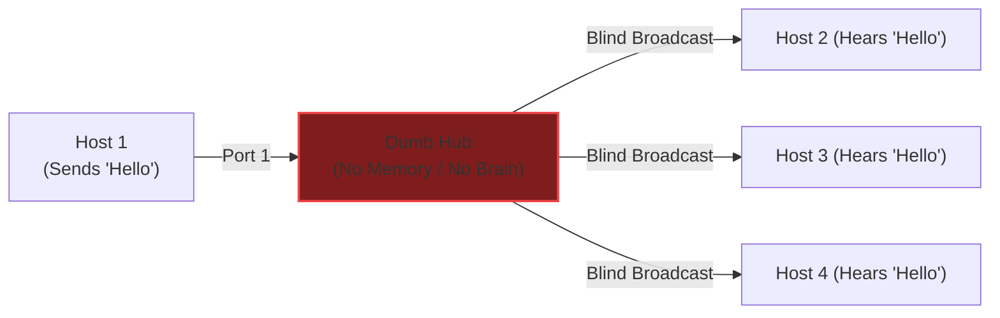

import { Callout } from 'fumadocs-ui/components/callout';
import { Tabs, Tab } from 'fumadocs-ui/components/tabs';
import { Steps, Step } from 'fumadocs-ui/components/steps';
import { Cards, Card } from 'fumadocs-ui/components/card';

## The Physical Reality: "There Is No Cloud"

During a TravelBuddy board meeting, an investor asks: *"Where does our application actually live?"*

The marketing answer is *"in the cloud."*

The engineering answer is vastly more fascinating:

> **There is no cloud. There are only millions of computers connected by twisted copper wires, laser pulses traveling through microscopically thin glass tubes on the ocean floor, and silicon switches making billionth-of-a-second routing decisions.**

Every digital experience—a booking confirmation, a credit card swipe, a 4K video stream—is fundamentally an electromagnetic wave or a packet of photons racing through physical matter.

In this chapter, we inspect the physical hardware, transmission media, and mathematical constraints of speed that make the global Internet possible.

---

## Visualizing the Physical Layer

Before examining their internal logic, observe the actual hardware components deployed across enterprise networks and datacenters:

<div className="grid grid-cols-1 md:grid-cols-2 gap-4 my-6">
  <div className="rounded-xl border border-fd-border overflow-hidden bg-fd-card">
    
    <div className="p-3 text-xs text-fd-muted-foreground">
      <strong>Category 6 Twisted Copper Pair with RJ-45 (8P8C) Connector</strong>: The backbone of horizontal office wiring, delivering 1 to 10 Gbps up to 100 meters.
    </div>
  </div>
  <div className="rounded-xl border border-fd-border overflow-hidden bg-fd-card">
    
    <div className="p-3 text-xs text-fd-muted-foreground">
      <strong>Duplex LC Optical Fiber Patch Cable</strong>: Pulses of laser light travel inside hair-thin silica glass cores at over 200,000 km/s.
    </div>
  </div>
  <div className="rounded-xl border border-fd-border overflow-hidden bg-fd-card">
    
    <div className="p-3 text-xs text-fd-muted-foreground">
      <strong>Enterprise Layer 2/3 Switch</strong>: Hardware ASICs forward frames between ports in nanoseconds using internal CAM MAC address tables.
    </div>
  </div>
  <div className="rounded-xl border border-fd-border overflow-hidden bg-fd-card">
    
    <div className="p-3 text-xs text-fd-muted-foreground">
      <strong>Carrier-Grade Edge Router</strong>: Connects distinct IP subnets, decrements TTL, and makes dynamic path decisions across the global Internet.
    </div>
  </div>
</div>

---

## Network Hardware Devices & Their Layer Boundaries

Why do we need so many different boxes in a server room? Why can't a single device do everything?

Because each device operates at a **different layer of abstraction** and was engineered to solve a specific physical or logical bottleneck.

```mermaid
flowchart TD
    subgraph L3["Layer 3: Network Layer (IP Packets)"]
        Router["Router / Layer 3 Switch<br/>(Inspects IP, Decides Routes, Blocks Broadcasts)"]
    end

    subgraph L2["Layer 2: Data Link Layer (Ethernet Frames)"]
        Switch["Layer 2 Switch / Bridge<br/>(Inspects MAC, Dedicated Collision Domains)"]
    end

    subgraph L1["Layer 1: Physical Layer (Raw Electrical Bits / Photons)"]
        Hub["Hub / Repeater<br/>(Dumb Electrical Splitter, Shared Collisions)"]
    end

    L3 -->|Strips Frame, Forwards Packet| L2
    L2 -->|Pushes Voltage / Photons| L1

    style L3 fill:#1e1b4b,stroke:#a855f7,stroke-width:2px
    style L2 fill:#0f172a,stroke:#38bdf8,stroke-width:2px
    style L1 fill:#1c1917,stroke:#78716c,stroke-width:2px
```



Let us examine each device from the bottom up.

---

### 1. Repeaters & Hubs (Layer 1: Physical)

A **Repeater** is a simple physical device with two ports. Because electrical signals attenuate (lose voltage strength) as they travel along long copper cables, a repeater cleans, amplifies, and regenerates the physical electrical waveform, extending the physical reach of a cable run.

A **Hub** is simply a **multiport repeater**.



#### Why Hubs Are Completely Extinct
If you plug four computers into a hub, the hub does not know what a MAC address is, what an IP address is, or what data is being sent.
1. When Host 1 sends an electrical voltage pulse on Port 1, the hub's internal circuitry **blindly echoes that voltage out of every other port (Ports 2, 3, and 4)**.
2. **Single Collision Domain**: If Host 1 and Host 3 transmit at the exact same microsecond, their voltages collide on the shared wire, creating an unintelligible mangled signal. Both hosts must detect the collision, back off for a random number of milliseconds, and retry.
3. **Severe Security Vulnerability**: Any employee running a packet sniffer (like Wireshark) on Host 4 can passively capture every password and credit card transmitted by Host 1, because the hub sends all electrical signals to everyone.
4. **Half-Duplex Only**: Devices can either transmit or receive, but never both simultaneously.

---

### 2. Bridges & Switches (Layer 2: Data Link)

A **Switch** is an intelligent, high-speed multiport bridge. It possesses CPU, memory, and specialized silicon chips called **ASICs (Application-Specific Integrated Circuits)**.

Instead of repeating raw electricity, a switch buffers the incoming bits, parses the **Layer 2 Ethernet Frame**, and reads the **MAC (Media Access Control) Addresses**.



#### The Breakthrough: Microsegmentation
The switch revolutionized computer networking by introducing **Microsegmentation**:
- **Every single switch port is an isolated, independent Collision Domain**.
- Host A can transmit to Host C at 1 Gbps, while Host B simultaneously transmits to Host D at 1 Gbps, with **zero collisions**.
- **Full-Duplex Operation**: Because the transmit ($Tx$) and receive ($Rx$) wires inside twisted pair copper are physically separated, a host can transmit at 1 Gbps and download at 1 Gbps at the exact same instant (delivering 2 Gbps aggregated bidirectional bandwidth).

```mermaid
flowchart TD
    Frame["Incoming Frame on Port 1<br/>Src: AA:AA:AA:AA:AA:AA | Dst: CC:CC:CC:CC:CC:CC"] --> Switch
    
    subgraph Switch["Layer 2 Switch (CAM Table Memory)"]
        direction TB
        CAM["CAM Table:<br/>Port 1: AA:AA:AA:AA:AA:AA<br/>Port 2: BB:BB:BB:BB:BB:BB<br/>Port 3: CC:CC:CC:CC:CC:CC"]
    end

    Switch -->|Transmits ONLY to Port 3| DstHost["Destination Host C<br/>(Port 3)"]
    Switch -.->|SILENCE on Port 2| HostB["Host B (Port 2)"]

    style Switch fill:#064e3b,stroke:#10b981,stroke-width:2px
```

#### Switch Forwarding Techniques
1. **Store-and-Forward**: The switch receives the entire frame into a memory buffer, validates the 32-bit CRC (Cyclic Redundancy Check) Frame Check Sequence to ensure no bits were corrupted on the wire, and only then forwards it. If corrupt, it drops the frame immediately. (Standard enterprise behavior).
2. **Cut-Through**: The switch reads only the first 6 bytes of the incoming frame (the Destination MAC address) and immediately starts spitting the bits out of the target egress port before the rest of the packet has even arrived! Latency drops to under 1 microsecond (critical for high-frequency trading and AI GPU training clusters).

---

### 3. Routers (Layer 3: Network)

If switches are so fast and efficient, why can't we connect all 5 billion computers on Earth using one giant switch?

Because of **Broadcast Storms**.

In Layer 2 networking, devices constantly emit broadcast frames (e.g. *"Who has IP 192.168.1.1? Tell me!"* via ARP). Switches **must flood all broadcasts out of every single port**. If the whole planet were on one switched network, millions of broadcast frames per second would saturate 100% of everyone's bandwidth, causing every computer's CPU to freeze processing ARP requests.

The device that stops broadcasts in their tracks is a **Router**.

```mermaid
flowchart LR
    subgraph LAN1["Office LAN (Subnet 192.168.1.0/24)"]
        PC1["Host 1"] --> SW1["Switch 1"]
    end

    SW1 <-->|Gateway Interface G0/0| R["Router<br/>(Separates Broadcast Domains)"]

    subgraph LAN2["Cloud Datacenter (Subnet 10.0.0.0/16)"]
        R <-->|WAN Interface G0/1| SW2["Switch 2"]
        SW2 --> Srv1["Database Server"]
    end

    style R fill:#1e1b4b,stroke:#a855f7,stroke-width:2px
```



#### How a Router Operates
1. **Separates Broadcast Domains**: A router will **never forward a Layer 2 broadcast frame** across its interfaces by default.
2. **Connects Disparate Networks**: A router has multiple interfaces, each assigned an IP address in a completely different network subnet (e.g., `192.168.1.1/24` on Port G0/0 and `203.0.113.1/30` on Port G0/1).
3. **Inspects Layer 3 IP Headers**: It strips off the incoming Ethernet frame, looks up the destination IP address in its **Routing Table**, decrements the **TTL (Time-To-Live)** field by 1, and encapsulates the packet inside a *new* Layer 2 header with the MAC address of the next router.

---

### Hardware Device Comparison Matrix

| Device | Primary OSI Layer | Data Unit (PDU) | Addressing Used | Collision Domains | Broadcast Domains |
| :--- | :--- | :--- | :--- | :--- | :--- |
| **Hub / Repeater** | Layer 1 (Physical) | Bits | None (Raw Voltage) | 1 (Shared across all ports) | 1 (All ports) |
| **Bridge** | Layer 2 (Data Link) | Frames | MAC Address | 1 per port | 1 (All ports) |
| **Layer 2 Switch** | Layer 2 (Data Link) | Frames | MAC Address (CAM Table) | 1 per port (Dedicated) | 1 (All ports in VLAN) |
| **Layer 3 Switch (MLS)** | Layer 2 & 3 | Frames / Packets | MAC and IP Addresses | 1 per port (Dedicated) | 1 per configured VLAN |
| **Router** | Layer 3 (Network) | Packets | IP Address (Routing Table) | 1 per interface | **1 per interface (Breaks Domains)** |
| **Access Point (AP)** | Layer 1 & 2 | Frames / Radio | MAC / 802.11 BSSID | 1 per radio frequency channel | 1 (Bridged to LAN) |
| **Stateful Firewall** | Layer 3, 4 & 7 | Packets / Sessions | IP, Port, Connection State | 1 per interface | 1 per interface / Security Zone |

---

## Guided Transmission Media (Cables)

Physical data cables fall into three distinct families: **Twisted Pair**, **Coaxial**, and **Optical Fiber**.

---

### 1. Twisted Pair Copper (UTP / STP)

Twisted pair is the most ubiquitous cable on planet Earth. Inside an Ethernet cable, you will find **8 color-coded copper wires arranged into 4 pairs**.

#### Why Are the Wires Twisted? (The Physics of Noise Cancellation)
When an electrical signal travels down a copper wire, it acts as an antenna: it emits electromagnetic radiation and absorbs electromagnetic noise from nearby elevator motors, power lines, and fluorescent lights.

Worse, adjacent wires inside the same cable bleed signals into each other—a phenomenon called **Crosstalk**.

To cancel this out, engineers use **Differential Signaling** combined with **Twisting**:

```mermaid
flowchart LR
    subgraph Transmitter["Transmitter"]
        V_pos["Wire A: +V (Signal)"]
        V_neg["Wire B: -V (Inverted Signal)"]
    end

    subgraph Channel["Physical Twisted Pair (Noise N hits both wires equally)"]
        WireA["Wire A carries: (+V + N)"]
        WireB["Wire B carries: (-V + N)"]
    end

    subgraph Receiver["Receiver (Differential Amplifier)"]
        Sub["Subtracts: (Wire A) - (Wire B)<br/>= (+V + N) - (-V + N)<br/>= 2V (Noise N completely cancelled!)"]
    end

    V_pos --> WireA --> Sub
    V_neg --> WireB --> Sub

    style Transmitter fill:#0f172a,stroke:#38bdf8
    style Receiver fill:#022c22,stroke:#10b981
```



By tightly twisting the two wires around each other (typically 2 to 3 twists per inch), external electromagnetic interference hits both wires equally. The receiver subtracts the negative wire from the positive wire: **the external noise cancels out to absolute zero**, leaving a clean, pristine digital pulse.

#### The Ethernet Categories (Cat5e to Cat8)

| Category | Max Bandwidth | Max Frequency | Max Distance | Shielding | Primary Real-World Application |
| :--- | :--- | :--- | :--- | :--- | :--- |
| **Cat 5e** | 1 Gbps | 100 MHz | 100 meters | UTP (Unshielded) | Legacy residential, basic office workstations |
| **Cat 6** | 1 Gbps / 10 Gbps | 250 MHz | 100m (1G) / 55m (10G) | UTP or STP | Modern office desktop horizontal wiring |
| **Cat 6A** | 10 Gbps | 500 MHz | **100 meters (full 10G)** | STP (Shielded) | Enterprise datacenters, Wi-Fi 6/7 AP uplinks |
| **Cat 7** | 10 Gbps | 600 MHz | 100 meters | Individually Shielded | Industrial plants with heavy electromagnetic noise |
| **Cat 8** | **25 / 40 Gbps** | **2,000 MHz** | **30 meters** | Fully Shielded (S/FTP) | Short Top-of-Rack server-to-switch links |

<Callout type="info" title="The 100-Meter Rule">
Standard Ethernet over twisted copper pair has an unyielding physical distance limit: **100 meters (328 feet)**. This is split into 90 meters of solid-core structural cable inside the walls plus two 5-meter flexible patch cords on each end. Beyond 100 meters, electrical signal attenuation and timing skew prevent the receiver from distinguishing binary ones from zeros.
</Callout>

#### Wiring Standards: T568A vs. T568B
When terminating an RJ-45 plug with a crimper, the 8 color-coded wires must follow a standardized pinout:

```text
Pin 1: White/Orange  (Tx+)
Pin 2: Orange        (Tx-)
Pin 3: White/Green   (Rx+)
Pin 4: Blue          (Unused in 100Base-TX)
Pin 5: White/Blue    (Unused in 100Base-TX)
Pin 6: Green         (Rx-)
Pin 7: White/Brown   (Unused in 100Base-TX)
Pin 8: Brown         (Unused in 100Base-TX)
```

- **Straight-Through Cable**: Both ends wired as T568B. Used to connect different devices (e.g., Computer $\rightarrow$ Switch).
- **Crossover Cable**: One end T568A, the other T568B (swapping Tx and Rx pins). Historically required to connect like-to-like devices (e.g., Switch $\rightarrow$ Switch or PC $\rightarrow$ PC).
- **Auto-MDIX (Automatic Medium-Dependent Interface Crossover)**: Modern network cards automatically detect pin wiring electronically and swap transmit/receive paths in silicon. Today, **crossover cables are obsolete**.

---

### 2. Fiber Optic Cable (Light in Glass)

When data must travel further than 100 meters, or at speeds of 100 Gbps to 800 Gbps, copper cable fails. We turn to **Fiber Optics**.

#### The Physics: Total Internal Reflection
A fiber optic cable consists of three layers:
1. **Core**: An ultra-pure, flexible strand of silica glass through which light pulses travel.
2. **Cladding**: A glass layer with a **lower index of refraction** ($n_2 < n_1$) surrounding the core.
3. **Buffer Jacket**: Protective Kevlar yarn and PVC plastic coating.

Because the cladding has a lower refractive index, light rays entering the core at an angle greater than the **critical angle** reflect completely off the boundary: **Total Internal Reflection**. Not a single photon escapes; the light bounces down the glass tube with virtually zero loss.

```mermaid
flowchart LR
    subgraph FiberCylinder["Total Internal Reflection inside Optical Fiber"]
        Core["Core Glass (Index n1 = 1.48)"]
        Cladding["Cladding Glass (Index n2 = 1.46)"]
        Ray["Light Ray Bouncing Continuously at Critical Angle"]
    end
    
    style FiberCylinder fill:#0f172a,stroke:#38bdf8,stroke-width:2px
```



#### Single-Mode Fiber (SMF) vs. Multi-Mode Fiber (MMF)

Never mix up Single-Mode and Multi-Mode fiber:

```mermaid
flowchart TD
    subgraph SMF["Single-Mode Fiber (Yellow Jacket)"]
        CoreSMF["Tiny Core: 9 µm"] --> Laser["Single Laser Beam (1310nm / 1550nm)"]
        Laser --> DistSMF["Zero Modal Dispersion · Range: 10 km to 100 km"]
    end

    subgraph MMF["Multi-Mode Fiber (Aqua Jacket)"]
        CoreMMF["Wider Core: 50 µm"] --> LED["Multiple Light Angles (850nm VCSEL)"]
        LED --> DistMMF["Modal Dispersion Spreads Pulses · Range: Max 300–500m"]
    end

    style SMF fill:#451a03,stroke:#f59e0b,stroke-width:2px
    style MMF fill:#083344,stroke:#06b6d4,stroke-width:2px
```



| Feature | Single-Mode Fiber (SMF) | Multi-Mode Fiber (MMF) |
| :--- | :--- | :--- |
| **Core Diameter** | **$9\ \mu\text{m}$** (fraction of a human hair) | **$50\ \mu\text{m}$ or $62.5\ \mu\text{m}$** |
| **Light Source** | Precision Solid-State Infrared Laser | Inexpensive VCSEL Laser or LED |
| **Wavelength** | $1310\text{ nm}$ or $1550\text{ nm}$ | $850\text{ nm}$ or $1300\text{ nm}$ |
| **Modal Dispersion** | **Zero** (Only 1 straight mode travels) | **High** (Different modes arrive at different times) |
| **Max Distance** | **Up to 80–100 km without repeater** | **300 to 500 meters** |
| **Cost** | Cable is cheap; SFP laser transceivers are expensive | Cable is slightly higher; optical transceivers are very cheap |
| **Color Code** | **Yellow** | **Aqua (OM3/OM4) or Lime Green (OM5)** |
| **Use Case** | Campus backbones, telecom MAN/WAN, subsea cables | Inside a single datacenter room, rack-to-rack |

---

## Subsea Cables: The Hidden Arteries of Planet Earth

Many people believe satellite constellations (like Starlink or GPS) carry the global Internet.

That is an absolute myth:

<Callout type="warn" title="Planetary Truth">
**Over 99% of all intercontinental data traffic travels across cables laid on the bottom of the ocean floor.** Satellites handle less than 1% of international bandwidth.
</Callout>

There are currently over **550 active subsea fiber optic cables** spanning 1.4 million kilometers across the Atlantic, Pacific, and Indian Oceans.

```mermaid
flowchart TD
    subgraph CableAnatomy["Anatomy of a Deep-Sea Submarine Cable (Outside to Inside)"]
        direction TB
        L1["1. Outer Polyethylene Protective Jacket"]
        L2["2. Mylar Barrier Tape"]
        L3["3. Stranded High-Tensile Steel Wires (Resisting Ocean Pressure)"]
        L4["4. Continuous Aluminum Water Barrier"]
        L5["5. Solid Copper Tube (Carrying 10,000 Volts DC to Repeaters)"]
        L6["6. Thixotropic Petroleum Jelly (Water Blocking)"]
        L7["7. Polycarbonate Core Tube"]
        L8["8. 16 to 48 Optical Glass Fibers (The actual data carriers)"]
        
        L1 --> L2 --> L3 --> L4 --> L5 --> L6 --> L7 --> L8
    end

    style CableAnatomy fill:#020617,stroke:#38bdf8,stroke-width:2px
```



### Optical Repeaters (EDFA) on the Ocean Floor
Even in the purest synthetic silica glass, light attenuates by approximately $0.18\text{ dB}$ per kilometer. Over a 6,000-kilometer transatlantic crossing, the optical signal would decay into imperceptible blackness without amplification.

Every **50 to 80 kilometers**, subsea cables incorporate heavy titanium cylinders called **Optical Repeaters**.
- Inside each repeater is an **EDFA (Erbium-Doped Fiber Amplifier)**.
- A high-power semiconductor pump laser energizes erbium ions doped into the glass.
- When the weakened data photons pass through the energized erbium, they stimulate emission, creating identical clones of themselves.
- **The photons are amplified purely in the optical domain—never converted into electricity!**
- To power these hundreds of amplifiers sitting 15,000 feet under the sea, the cable's inner copper tube carries up to **10,000 Volts of direct current (DC)** from landing stations on the coast.

---

## Internet Speed: Bandwidth, Latency & The Speed of Light

Why does a webpage take 80 milliseconds to load from London to New York, no matter how fast your home internet connection is?

Because of Einstein's Special Theory of Relativity.

### The Speed of Light Constraint

The speed of light in a vacuum ($c$) is:

$$c = 299,792\text{ km/s} \approx 300,000\text{ km/s}$$

However, photons in a fiber optic cable do not travel through a vacuum; they travel through solid silica glass. The **refractive index ($n$)** of silica glass is approximately $1.468$.

The actual speed of light in optical fiber ($v$) is:

$$v = \frac{c}{n} = \frac{299,792\text{ km/s}}{1.468} \approx 204,218\text{ km/s}$$

This translates to a physical constant every network engineer must memorize:

$$\text{Propagation Speed in Glass} \approx 204\text{ meters per microsecond} \approx 4.9\ \mu\text{s per kilometer}$$

#### The Unbreakable Transatlantic Limit
The Great Circle distance between London and New York is approximately $5,585\text{ km}$. Subsea cables zigzag around oceanic trenches, making the physical cable length roughly $6,600\text{ km}$.

The minimum physical round-trip propagation time ($RTT$) is:

$$RTT_{\text{physics}} = \frac{2 \times 6,600\text{ km}}{204,218\text{ km/s}} \approx 64.6\text{ milliseconds}$$

No amount of money, no quantum computing algorithm, and no software optimization can ever reduce a London-to-New York ping below **~65 milliseconds**. It is a fundamental law of physics.

---

### The Bandwidth-Delay Product (BDP)

The most critical mathematical concept connecting speed, latency, and throughput is the **Bandwidth-Delay Product (BDP)**:

$$\text{BDP (bits)} = \text{Bandwidth (bits/sec)} \times \text{Round-Trip Time (sec)}$$

$$\text{BDP (bytes)} = \frac{\text{BDP (bits)}}{8}$$

#### The Pipe Analogy
Think of a network link like a water pipe:
- **Bandwidth** is the diameter of the pipe.
- **Latency (RTT)** is the length of the pipe.
- **BDP** is the **total volume of water currently inside the pipe in transit**.


#### Why High Latency Destroys Throughput
Suppose TravelBuddy purchases a high-speed **10 Gbps** transatlantic connection between New York and London ($RTT = 70\text{ ms} = 0.07\text{ s}$).

Let us calculate the volume of data that must be in-flight across the ocean:

$$\text{BDP} = 10,000,000,000\text{ bps} \times 0.07\text{ s} = 700,000,000\text{ bits} = 87.5\text{ Megabytes}$$

If your operating system's TCP receive buffer window is configured to the legacy default of $64\text{ KB}$ ($0.064\text{ MB}$):
1. The sender transmits 64 KB in $0.05$ milliseconds.
2. The sender's buffer is empty! It must now **freeze and wait 70 milliseconds** for the receiver's acknowledgment (ACK) to cross the ocean and return.
3. Your 10 Gbps fiber line sits 99.9% idle!
4. Real-world throughput collapses from 10,000 Mbps down to **7.3 Mbps**!

<Callout type="tip" title="TCP Window Scaling (RFC 7323)">
This is why modern operating systems support **TCP Window Scaling**, allowing TCP windows to expand up to 1 Gigabyte, ensuring high-bandwidth links remain saturated even across transoceanic latencies.
</Callout>

---

## Hands-on Lab: Inspecting Physical Interfaces & Errors

Let us inspect the physical layer on your machine.

<Tabs items={['Linux', 'Windows (PowerShell)']}>
<Tab value="Linux">
```bash
# Check link status, duplex mode, and port speed
ip link show

# Deep inspection of physical transceiver (requires ethtool)
ethtool eth0
```
Look for:
- `Speed: 1000Mb/s` (or `10000Mb/s`)
- `Duplex: Full`
- `Auto-negotiation: on`
- `Link detected: yes`
</Tab>
<Tab value="Windows (PowerShell)">
```powershell
# Inspect physical network adapters, link speeds, and connection status
Get-NetAdapter | Select-Object Name, InterfaceDescription, Status, LinkSpeed
```
</Tab>
</Tabs>

### Interpreting CRC Errors
If you run `netstat -i` or inspect a switch interface and notice **CRC (Cyclic Redundancy Check) Errors** or **FCS Errors** climbing:
- Do not blame the software or the operating system.
- CRC errors mean bits are being corrupted **on the physical wire** due to a damaged pin, a kinked fiber patch cord with high bend radius attenuation, or an unshielded copper cable routed too close to a high-voltage air conditioner compressor.

---

## Chapter Summary & Quick Recall

<Cards>
  <Card title="Hub vs. Switch vs. Router" href="#network-hardware-devices--their-layer-boundaries">
    Hubs blindly repeat electricity (1 shared collision domain). Switches forward frames based on MAC tables (microsegmented collision domains). Routers route packets between subnets and break broadcast domains.
  </Card>
  <Card title="Copper Cancellation & Fiber Optics" href="#guided-transmission-media-cables">
    Twisted pair cancels noise using differential signaling. Single-Mode fiber ($9\mu\text{m}$) uses precision lasers for 80km+ spans with zero modal dispersion; Multi-Mode ($50\mu\text{m}$) uses VCSELs for cheap 300m datacenter runs.
  </Card>
  <Card title="Speed of Light & BDP" href="#internet-speed-bandwidth-latency--the-speed-of-light">
    Light travels at $\approx 204\text{ km/ms}$ in glass ($5\mu\text{s/km}$). The Bandwidth-Delay Product ($\text{Bandwidth} \times \text{RTT}$) dictates how much data must remain in-flight to prevent TCP starvation.
  </Card>
</Cards>

<Callout type="info" title="Next Up: Lesson 04">
With physical media, devices, and speed constraints mastered, we ascend into the structural architecture of networking: **[The OSI 7-Layer Reference Model & The TCP/IP Internet Architecture](/docs/computer-networking/02-switching-and-data-link/01-osi-model)**.
</Callout>
