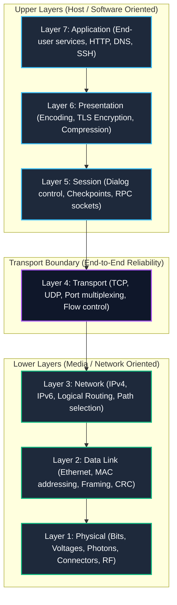

# The OSI 7-Layer Reference Model & Layer Boundaries

When two electronic devices exchange information—whether a temperature sensor reporting telemetry across a factory floor or a smartphone streaming 4K video from a CDN edge server across the planet—they face hundreds of concurrent engineering problems simultaneously. 

How do we convert binary ones and zeros into physical electrical pulses or laser flickers? How do we identify which computer on a wire should receive a signal? How do we route across millions of interconnected intermediate networks? How do we detect packet corruption, guarantee delivery, handle congestion, encrypt payloads, and parse application data?

Attempting to solve all of these problems inside a single monolithic software program or hardware chip would produce an unmaintainable nightmare. The solution is **layered architectural abstraction**.

---

## 1. First Principles: Why Decompose a Network into Layers?

In computer science, modular abstraction is the primary defense against overwhelming complexity. A network protocol stack applies this principle directly to telecommunications.

```
       Monolithic Design (Brittle)                  Layered Modular Architecture (Resilient)
   ┌──────────────────────────────────┐            ┌────────────────────────────────────────┐
   │        Application Logic         │            │  Application / Presentation / Session  │
   │                +                 │            ├────────────────────────────────────────┤
   │      Encryption & Formatting     │            │        Transport (TCP / UDP)           │
   │                +                 │   vs.      ├────────────────────────────────────────┤
   │       Host-to-Host Routing       │            │         Network (IPv4 / IPv6)          │
   │                +                 │            ├────────────────────────────────────────┤
   │   Physical Media Wire Drivers    │            │        Data Link (Ethernet / Wi-Fi)    │
   └──────────────────────────────────┘            ├────────────────────────────────────────┤
   (Any cable change breaks the app!)              │         Physical (Copper / Fiber / RF) │
                                                   └────────────────────────────────────────┘
                                                   (Swap Wi-Fi for 10G Fiber: App never cares!)
```

### The Three Axioms of Protocol Layering

1. **Information Hiding & Separation of Concerns:**
   Each layer is dedicated to solving one specific class of problem. The Web browser operating at the Application Layer (`HTTP/3`) does not know—and should never need to know—whether the underlying physical link is an unshielded twisted-pair Cat6 copper cable, a single-mode transatlantic fiber cable, or a 5G cellular radio frequency carrier.
2. **Standardized Interfaces Between Adjacent Layers:**
   A layer provides services to the layer immediately above it (as a *Service Provider*) and consumes services from the layer immediately below it (as a *Service User*). As long as the interface between Layer $N$ and Layer $N-1$ remains stable, engineers can rewrite, optimize, or replace the entire implementation of Layer $N-1$ without breaking Layer $N$.
3. **Interoperability Across Independent Vendors:**
   Before standardized layering, early computer networks were proprietary vendor silos. An IBM Systems Network Architecture (SNA) terminal could not communicate with a Digital Equipment Corporation DECnet host. Layered international standards enabled independent hardware and software vendors to construct hardware, operating systems, and network equipment that interconnect seamlessly.

---

### The Real-World Delivery Analogy: How to Intuitively Grasp Layering

Imagine you order a gift online from an overseas supplier (e.g. Amazon US to your home in another country):

```mermaid
flowchart TD
    subgraph SenderSide ["Sender / Origin (Packaging & Hand-off)"]
        A1["1. Application: You order a book on the Amazon mobile app"]
        A2["2. Presentation: Amazon formats invoice, translates currency, encrypts payment"]
        A3["3. Session: Amazon verifies login credentials & establishes order session"]
        A4["4. Transport: Warehouse packs goods into boxes, assigns tracking numbers"]
        A5["5. Network: Logistics assigns global postal route & destination country address"]
        A6["6. Data Link: Local courier puts package in delivery van; tracks vehicle hop"]
        A7["7. Physical: Airplane / ship moves actual cargo across the ocean"]
        A1 --> A2 --> A3 --> A4 --> A5 --> A6 --> A7
    end

    subgraph TransitMedium ["Physical Ocean / Air Corridor"]
        A7 ==> B7["Cargo arrives at destination port / international airport"]
    end

    subgraph ReceiverSide ["Receiver / Destination (Unpacking & Delivery)"]
        B7["1. Physical: Cargo unloaded at regional distribution hub"]
        B6["2. Data Link: Local city van loads box; scans local delivery barcode"]
        B5["3. Network: Regional hub reads street address and postal ZIP code"]
        B4["4. Transport: Customer verifies tracking ID; checks box for damage"]
        B3["5. Session: Delivery driver confirms identity, signs off delivery receipt"]
        B2["6. Presentation: Recipient tears open gift wrapping, reads invoice"]
        B1["7. Application: Customer opens the book and reads the chapters"]
        B7 --> B6 --> B5 --> B4 --> B3 --> B2 --> B1
    end

    style SenderSide fill:#0f172a,stroke:#38bdf8,stroke-width:2px
    style TransitMedium fill:#1e1b4b,stroke:#a855f7,stroke-width:2px
    style ReceiverSide fill:#022c22,stroke:#10b981,stroke-width:2px
```



When you click "Buy" on the app, you do not need to know which pilot will fly the cargo plane across the Atlantic, what tire pressure the delivery van is using, or what cargo ship container standard was used. Each tier does its job, relies on standardized handoffs, and hands the cargo to the next layer down.

---

## 2. The OSI 7-Layer Model Architecture

In 1984, the **International Organization for Standardization (ISO)** published ISO/IEC 7498, formalizing the **Open Systems Interconnection (OSI) Reference Model**. It breaks the entire communication process down into seven distinct functional planes.


Here is how the seven layers organize from highest abstraction (software applications) to lowest abstraction (physical physics):



---

## 3. Deep-Dive: Layer Duties, Protocols, and Boundaries

Let us examine each of the seven layers from the bottom up—starting from the raw physical universe of electrons and photons up to human-facing applications.

```
+-----------------------------------------------------------------------------------------+
|                                  THE 7 OSI LAYERS                                       |
+---+--------------+--------------------------------+-----------------+-------------------+
| # | Layer Name   | Primary Responsibility         | PDU Name        | Key Protocols     |
+---+--------------+--------------------------------+-----------------+-------------------+
| 7 | Application  | User interface & app services  | Data / Message  | HTTP, DNS, SSH    |
| 6 | Presentation | Syntax, encryption, formatting | Data            | TLS, JSON, ASCII  |
| 5 | Session      | Inter-host session management  | Data            | RPC, NetBIOS, SIP |
| 4 | Transport    | End-to-end delivery & ports    | Segment/Datagram| TCP, UDP, QUIC    |
| 3 | Network      | Logical addressing & routing   | Packet          | IPv4, IPv6, ICMP  |
| 2 | Data Link    | Hop-to-hop framing & MAC       | Frame           | Ethernet, 802.11  |
| 1 | Physical     | Raw bit transmission over media| Bits / Symbols  | 1000BASE-T, NRZ   |
+---+--------------+--------------------------------+-----------------+-------------------+
```

---

### Layer 1: The Physical Layer

The Physical Layer does not understand packets, addresses, bytes, or checksums. It is responsible solely for the transmission and reception of **unstructured raw bit streams** over a physical transmission medium.

- **Primary Duties:**
  - Converts logical binary digits (`0` and `1`) into physical signals: voltage levels on copper wire, laser/LED optical pulses down fiber glass, or electromagnetic wave modulations across radio frequency spectrums.
  - Dictates physical connector specifications (RJ-45, LC/SC fiber connectors, SFP+ transceivers) and pin assignments.
  - Governs bit synchronization: transmitter and receiver must agree on clock timing to sample incoming signals accurately.
  - Defines line coding schemes (e.g., Manchester encoding, NRZ, PAM4 for 100G/400G Ethernet).
- **Physical Layer Devices:**
  - **Cables:** Cat6a UTP, Single-Mode and Multimode Fiber.
  - **Repeaters & Passive Hubs:** Devices that blindly amplify or regenerate incoming electrical signals and rebroadcast them out of every other port without inspecting frames.
- **PDU:** **Bit** (or physical symbol).

---

### Layer 2: The Data Link Layer

While Layer 1 moves raw bits down a wire, it cannot tell where one message begins and another ends, nor can it detect if electrical noise corrupted a pulse. The **Data Link Layer** provides reliable node-to-node hop transmission across a shared local medium.

- **Sublayers:**
  1. **Logical Link Control (LLC, IEEE 802.2):** Interfaces with the Network Layer above, multiplexing different network protocols (IPv4, IPv6) and managing link-level flow control.
  2. **Media Access Control (MAC, IEEE 802.3 / 802.11):** Governs access to the physical transmission medium. Resolves who gets to talk when two nodes share the same physical cable or radio frequency (CSMA/CD on legacy half-duplex Ethernet, CSMA/CA on Wi-Fi).
- **Primary Duties:**
  - **Framing:** Encapsulates Layer 3 packets into discrete frames by prepending a header (with source and destination MAC addresses) and appending a trailer.
  - **Physical Addressing:** Uses 48-bit burned-in Media Access Control (MAC) addresses (e.g., `52:54:00:12:34:56`) unique to the network interface card (NIC).
  - **Error Detection:** Appends a 32-bit **Frame Check Sequence (FCS)** using a Cyclic Redundancy Check (CRC-32) algorithm. If a bit flips in transit, the receiving NIC's hardware detects the mismatch and silently drops the corrupted frame.
- **Data Link Layer Devices:**
  - **Network Interface Cards (NICs)**
  - **Layer 2 Ethernet Switches:** Hardware devices that maintain a Content Addressable Memory (CAM) MAC table to selectively forward frames only to the specific port where the destination MAC resides, eliminating collision domains.
- **PDU:** **Frame**.

---

### Layer 3: The Network Layer

Layer 2 MAC addresses only function within a single broadcast domain or local link. A MAC address contains no hierarchical geographic information—it cannot tell a computer in London how to route a packet to Tokyo. The **Network Layer** provides logical, hierarchical addressing and end-to-end routing across arbitrary interconnected networks.

- **Primary Duties:**
  - **Logical Addressing:** Assigns hierarchical IP addresses (IPv4 32-bit addresses like `192.0.2.1` or IPv6 128-bit addresses like `2001:db8::1`) that partition networks into network prefixes and host identifiers.
  - **Routing & Path Determination:** Routers inspect destination IP addresses, query internal routing tables populated by dynamic routing protocols (OSPF, BGP, IS-IS) or static routes, and forward the packet toward its destination.
  - **Hop Limiting / Loop Mitigation:** Implements a Time-to-Live (TTL in IPv4) or Hop Limit (IPv6) counter. Each router decrements this value by 1. If it hits zero, the packet is discarded and an ICMP "Time Exceeded" message is sent back to the sender, preventing permanent routing loops.
  - **Fragmentation & Reassembly:** If an outbound packet is larger than the next link's Maximum Transmission Unit (MTU), IPv4 routers may break the packet into smaller fragments (though modern IPv6 mandates path MTU discovery instead).
- **Network Layer Devices:**
  - **Routers** and **Layer 3 Multi-Layer Switches**.
- **Key Protocols:** IPv4, IPv6, ICMP, IPsec, IGMP.
- **PDU:** **Packet** (or Datagram).

---

### Layer 4: The Transport Layer

Layer 3 delivers packets between host machines (IP to IP). However, a modern host machine is not a single process; it simultaneously runs hundreds of processes: a web browser, an SSH terminal, a background database sync, and a video call. The **Transport Layer** provides process-to-process communication.

- **Primary Duties:**
  - **Port Multiplexing & Demultiplexing:** Uses 16-bit **Port Numbers** (ranging from $0$ to $65,535$) so the operating system kernel can deliver incoming data to the exact listening socket process.
  - **Segmentation & Reassembly:** Splits large blocks of application data into manageable chunks that fit within the Maximum Segment Size (MSS) and reassembles them at the receiver in exact chronological order.
  - **Reliability & Error Recovery (TCP):** Uses sequence numbers, positive acknowledgments (ACKs), and retransmission timers to guarantee that lost or out-of-order packets are re-sent.
  - **Flow Control:** Uses sliding window algorithms to prevent a fast transmitter from overflowing a slow receiver's internal kernel buffer.
  - **Congestion Control:** Monitors network transit delays and packet drop rates to adjust transmission rates, preventing collapse of intermediate router queues.
- **Key Protocols:**
  - **TCP (Transmission Control Protocol):** Connection-oriented, ordered, reliable, heavyweight.
  - **UDP (User Datagram Protocol):** Connectionless, unordered, unreliable, ultralightweight.
  - **QUIC / SCTP:** Modern advanced transport protocols.
- **PDU:** **Segment** (for TCP) or **Datagram** (for UDP).

---

### Layer 5: The Session Layer

Once a reliable transport pipe exists, software systems frequently need to coordinate structured, persistent dialogs between distributed applications. The **Session Layer** establishes, manages, synchronizes, and terminates sessions between cooperating systems.

- **Primary Duties:**
  - **Authentication & Authorization:** Before a communication session is granted, the session layer verifies identity (username/password, biometric tokens) and checks permissions (whether the authenticated user has access rights to the remote resource).
  - **Session Establishment & Teardown:** Coordinates session lifecycle (e.g. logging into an e-commerce platform, maintaining your active shopping cart across multiple page interactions, and cleanly terminating the session when logging out or checking out).
  - **Dialog Control:** Dictates whether communication is half-duplex (two-way alternating, like a walkie-talkie) or full-duplex (two-way simultaneous).
  - **Synchronization Checkpoints:** Injects checkpoints into large data streams. If a multi-gigabyte file transfer drops after 80%, the session layer allows resuming from the last valid checkpoint rather than restarting from byte zero.
  - **Session Re-establishment:** Transparently reconnects severed transport connections without alerting the top-level application.
- **Key Protocols / Standards:**
  - RPC (Remote Procedure Call)
  - NetBIOS (Network Basic Input/Output System)
  - SIP (Session Initiation Protocol - VoIP session setup)
  - SOCKS5 proxy session negotiation.
- **PDU:** **Data**.

---

### Layer 6: The Presentation Layer

Different computer systems represent data differently. An IBM mainframe may store text using EBCDIC encoding, while an x86 Linux server uses UTF-8. One system might use big-endian integer byte ordering, while another uses little-endian. The **Presentation Layer** acts as the translator, compressor, and cryptographic formatter of the network stack.

- **Primary Duties:**
  - **Data Translation & Serialization:** Converts machine-dependent internal data structures into a standardized wire format (e.g., converting legacy EBCDIC characters to ASCII/UTF-8, or serializing objects to JSON, Protocol Buffers, ASN.1).
  - **Cryptographic Encryption & Decryption:** Formats and encapsulates secure payload boundaries (TLS/SSL records), ensuring data is encrypted at the sender so that only the authorized receiver with the private key can decrypt and read it.
  - **Data Compression:** Compresses payloads at the presentation level to minimize bandwidth consumption and accelerate transit:
    - **Lossless Compression:** Ensures 100% of original bits are restored upon decompression (critical for text documents, financial records, and executable files; e.g., gzip, Deflate, Brotli).
    - **Lossy Compression:** Permanently discards imperceptible data to achieve massive compression ratios (acceptable for streaming audio and video where minor fidelity drops do not break comprehension; e.g., MP3, AAC, JPEG, H.264).
- **Key Standards:**
  - TLS / SSL (presentation record framing)
  - ASCII, UTF-8, EBCDIC
  - MIME encoding (Base64)
  - JPEG, PNG, MP4 syntax specifications.
- **PDU:** **Data**.

---

### Layer 7: The Application Layer

The **Application Layer** is closest to the end user. It does *not* refer to the user interface software itself (such as Google Chrome or Microsoft Outlook), but rather to the **application protocols** that software programs invoke to provide network services.

- **Primary Duties:**
  - Exposes standardized communication semantics to user-facing applications.
  - Identifies communication partners, verifies service availability, and coordinates resource authentication.
  - Defines request/response semantics: HTTP verbs (`GET`, `POST`, `PUT`, `DELETE`), SMTP commands (`HELO`, `MAIL FROM`), DNS record lookups (`A`, `AAAA`, `CNAME`).
- **Key Protocols:**
  - Web: `HTTP/1.1`, `HTTP/2`, `HTTP/3`
  - Name Resolution: `DNS`
  - Remote Shell: `SSH`, `Telnet`
  - Email: `SMTP`, `IMAP`, `POP3`
  - Network Management: `SNMP`, `NTP`
  - File Sharing: `SMB`, `NFS`
- **PDU:** **Data / Message**.

---

## 4. The End-to-End Bidirectional Execution Flow

Beginners often imagine that Host A's application layer talks directly through midair to Host B's application layer. In reality, **data must descend all seven layers on the sending machine, travel physically across intermediate routers, and ascend all seven layers on the receiving machine**:

```mermaid
flowchart TD
    subgraph HostA ["Host A (Sender)"]
        direction TB
        A7["Layer 7: Application (User types message)"]
        A6["Layer 6: Presentation (Encrypts & translates to UTF-8)"]
        A5["Layer 5: Session (Establishes session token)"]
        A4["Layer 4: Transport (Segments data, assigns ports)"]
        A3["Layer 3: Network (Assigns Source & Dest IP)"]
        A2["Layer 2: Data Link (Assigns Source & Next-Hop MAC)"]
        A1["Layer 1: Physical (Converts to electrical/optical signals)"]
        A7 --> A6 --> A5 --> A4 --> A3 --> A2 --> A1
    end

    subgraph RouterHop ["Intermediate Router (Layer 3 Device)"]
        direction TB
        R1["Layer 1: Receives physical bit stream"]
        R2["Layer 2: Strips frame; validates FCS CRC"]
        R3["Layer 3: Inspects IP; decrements TTL; queries routing table"]
        R2_out["Layer 2: Rewrites new Layer 2 MAC frame for next hop"]
        R1_out["Layer 1: Pushes bits onto egress wire"]
        R1 --> R2 --> R3 --> R2_out --> R1_out
    end

    subgraph HostB ["Host B (Receiver)"]
        direction BT
        B1["Layer 1: Physical (Samples incoming voltage/photons)"]
        B2["Layer 2: Data Link (Validates MAC & CRC; decapsulates)"]
        B3["Layer 3: Network (Verifies Dest IP matches host)"]
        B4["Layer 4: Transport (Reorders segments; sends ACK)"]
        B5["Layer 5: Session (Validates session credentials)"]
        B6["Layer 6: Presentation (Decrypts TLS; formats message)"]
        B7["Layer 7: Application (Renders message on recipient screen)"]
        B1 --> B2 --> B3 --> B4 --> B5 --> B6 --> B7
    end

    A1 ==>|Physical Cable / Wi-Fi| R1
    R1_out ==>|Undersea Fiber / WAN link| B1

    style HostA fill:#0f172a,stroke:#38bdf8,stroke-width:2px
    style RouterHop fill:#1e1b4b,stroke:#a855f7,stroke-width:2px
    style HostB fill:#022c22,stroke:#10b981,stroke-width:2px
```



Notice that intermediate routers only inspect up to **Layer 3** (Network layer). They never decrypt the presentation layer or read the application payload.

---

## 5. Protocol Data Units (PDUs) & Service Primitives

As data travels down the stack, each layer wraps the payload from the layer above with its own metadata header (and sometimes a trailer). The resulting unit at each level is designated by a formal **Protocol Data Unit (PDU)** name:

```
               Application Layer Data ───────────────────────►  [ Application Data ] (Data)
                                                                       │
           Transport Layer Header ───► [ L4 Header |            Application Data ] (Segment/Datagram)
                                             │                         │
             Network Layer Header ───► [ L3 Header | L4 Header | Application Data ] (Packet)
                                             │                         │
  Data Link Header & FCS Trailer ───► [ L2 Header | L3 Header | L4 Header | Data | L2 Trailer ] (Frame)
                                             │                         │
            Physical Layer Stream ───►  0 1 0 0 1 1 0 1 0 0 1 1 0 0 1 0 1 1 0 1 0 1 (Bits)
```

| Layer | Formal PDU Name | Typical Header Contents |
| :--- | :--- | :--- |
| **L7: Application** | **Data / Message** | HTTP Request line, User-Agent, Cookies, Host header |
| **L6: Presentation**| **Data** | TLS Record Header (Content Type, Version, Length) |
| **L5: Session** | **Data** | RPC Call ID, Session token |
| **L4: Transport** | **Segment** (TCP) / **Datagram** (UDP) | Source Port, Destination Port, Sequence Number, Flags, Window Size |
| **L3: Network** | **Packet** (Datagram) | Source IP Address, Destination IP Address, TTL, Protocol ID (6 or 17) |
| **L2: Data Link** | **Frame** | Preamble, Destination MAC, Source MAC, EtherType, CRC-32 FCS Trailer |
| **L1: Physical** | **Bits / Symbols** | Voltage transitions, light pulses, radio carrier phase shifts |

---

## 5. Classical Mnemonics for Memorization

Engineers memorize the seven layers using two classic mnemonics, depending on whether they traverse the stack top-down or bottom-up:

### Top-Down (Layer 7 down to Layer 1)
> **A**ll **P**eople **S**eem **T**o **N**eed **D**ata **P**rocessing  
> *(Application, Presentation, Session, Transport, Network, Data Link, Physical)*

### Bottom-Up (Layer 1 up to Layer 7)
> **P**lease **D**o **N**ot **T**hrow **S**ausage **P**izza **A**way  
> *(Physical, Data Link, Network, Transport, Session, Presentation, Application)*

### PDU Mnemonic (Top-to-Bottom)
> **D**on't **S**ome **P**eople **F**ly **P**lanes?  
> *(**D**ata $\rightarrow$ **S**egment $\rightarrow$ **P**acket $\rightarrow$ **F**rame $\rightarrow$ **P**hysical Bits)*

---

## 6. Hardware Boundaries: Where Does Each Device Live?

A common failure mode among junior engineers is confusing the layer at which network equipment operates. A device is classified by the **highest layer header it inspects to make forwarding decisions**.

```
           +--------------------------------------------------------+
           |           LAYER OPERATIONAL BOUNDARIES                 |
+----------+--------------------+-----------------------------------+
| Layer    | Network Device     | Inspection Criteria               |
+----------+--------------------+-----------------------------------+
| Layer 7  | WAF, API Gateway   | URL paths, JSON body, HTTP cookies|
| Layer 4  | L4 Load Balancer   | TCP/UDP ports, TCP handshake SYN  |
| Layer 3  | Router, L3 Switch  | Destination IP address & routing  |
| Layer 2  | Switch, Bridge     | Destination MAC address (CAM table|
| Layer 1  | Hub, Repeater      | Raw electrical voltage / photons  |
+----------+--------------------+-----------------------------------+
```

### 1. Layer 1 Devices (Physical Repeaters & Hubs)
- **What they inspect:** Nothing. They see raw electrical analog voltages or light.
- **Behavior:** When an electrical signal arrives on Port 1 of a hub, the electronics amplify the signal and flood it across Ports 2, 3, and 4.
- **Collision Domain:** All ports share a single collision domain. If two devices transmit at once, voltages collide and corrupt both transmissions.

### 2. Layer 2 Devices (Switches & Bridges)
- **What they inspect:** The Layer 2 Ethernet Frame Header (specifically the 48-bit **Destination MAC address**).
- **Behavior:** The switch learns which MAC address resides on which physical port by inspecting the **Source MAC** of incoming frames. When a frame arrives destined for MAC `B`, the switch forwards it **only** to the port connected to MAC `B`.
- **Domain Impact:** Every switch port represents an independent, isolated collision domain. However, all ports still belong to a single **Broadcast Domain** (a broadcast frame destined for `FF:FF:FF:FF:FF:FF` is flooded out all ports).

### 3. Layer 3 Devices (Routers & Layer 3 Switches)
- **What they inspect:** The Layer 3 **Destination IP Address**.
- **Behavior:** Strips off the Layer 2 Ethernet frame, determines which outgoing interface leads toward the destination network prefix via its routing table, decrements the TTL, and wraps the packet in a brand new Layer 2 frame.
- **Domain Impact:** Routers **break broadcast domains**. Broadcast traffic never crosses a router interface unless explicitly configured with an IP helper relay agent.

### 4. Layer 4–7 Devices (Firewalls, Load Balancers, Proxies)
- **Stateful Firewalls (L4):** Inspect TCP SYN/ACK flags, maintain connection state tables, and block unauthorized ports.
- **Reverse Proxies & WAFs (L7):** Terminate the incoming TCP connection and TLS handshake completely. They inspect the decrypted HTTP request method, URL path, headers, and payload body (e.g., searching for SQL injection or Cross-Site Scripting patterns) before establishing a separate upstream connection to backend servers.

---

## 7. The OSI Model vs. Real-World Reality

Why do we study the OSI 7-layer model when every production server on Earth runs the **TCP/IP stack**?

```
      Theoretical ISO OSI Model                       Production TCP/IP Reality
    ┌───────────────────────────┐                    ┌────────────────────────────┐
 7  │     Application Layer     │                    │                            │
    ├───────────────────────────┤                    │     Application Layer      │
 6  │    Presentation Layer     │ ─────────────────► │ (HTTP, DNS, SSH, TLS, etc. │
    ├───────────────────────────┤                    │  handled inside user space)│
 5  │       Session Layer       │                    │                            │
    ├───────────────────────────┤                    ├────────────────────────────┤
 4  │      Transport Layer      │ ─────────────────► │      Transport (TCP/UDP)   │
    ├───────────────────────────┤                    ├────────────────────────────┤
 3  │       Network Layer       │ ─────────────────► │       Internet (IP)        │
    ├───────────────────────────┤                    ├────────────────────────────┤
 2  │      Data Link Layer      │ ─────────────────► │      Link / Network Access │
    ├───────────────────────────┤                    │  (Ethernet, Wi-Fi drivers) │
 1  │      Physical Layer       │                    │                            │
    └───────────────────────────┘                    └────────────────────────────┘
```

1. **Why OSI Failed in Implementation:**
   The ISO committee took a top-down, theoretical approach. They drafted massive, cumbersome specifications (such as CLNP instead of IP, and FTAM instead of FTP) before creating working software implementations. The specifications were overly complex, politically negotiated, and slow to ship.
2. **Why TCP/IP Won:**
   DARPA funded university computer science departments (notably UC Berkeley) to write real, running code into the BSD Unix kernel. The engineering philosophy was formulated by David Clark: *"We reject: kings, presidents, and voting. We believe in: rough consensus and running code."* TCP/IP worked, was freely distributed, and scaled effortlessly.
3. **Why OSI Remains the Lingua Franca:**
   In production operations, systems engineers and cloud architects still diagnose failures using OSI nomenclature every day:
   - *"The link light is amber; we have an **L1** cable issue."*
   - *"The server is sending ARP requests with no reply; check for an **L2** VLAN mismatch."*
   - *"Packets aren't leaving the subnet; we have a missing **L3** default gateway route."*
   - *"The SYN packet gets rejected with RST; the service isn't listening on that **L4** port."*
   - *"The TLS certificate expired or cipher suite mismatched; investigate the **L6** handshake."*

Understanding the OSI model provides you with the mental scaffolding necessary to dissect, isolate, and resolve any networking failure systematically.
