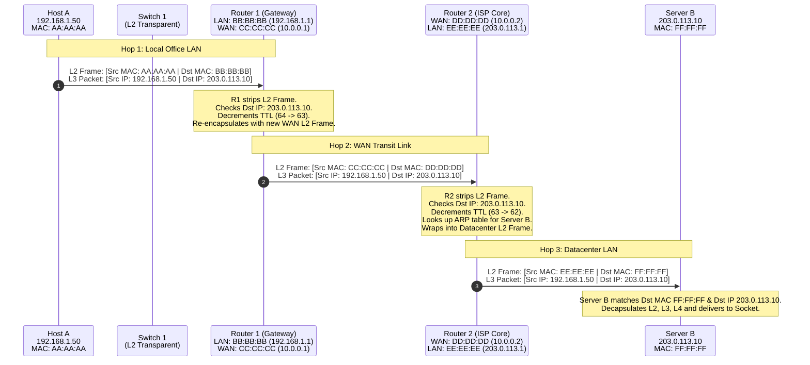

# The TCP/IP Model, Encapsulation & Packet Flow

While the OSI 7-layer model represents the theoretical gold standard for conceptualizing network architectures, the global Internet runs on the **TCP/IP model** (also known as the **DARPA Model** or **Internet Protocol Suite**).

To understand how software actually communicates across the planet, we must explore two fundamental phenomena:
1. **Encapsulation & Decapsulation:** How application payloads are wrapped in nested protocol envelopes as they descend and ascend the operating system stack.
2. **The Routing Invariant:** The critical mechanism where **Layer 2 MAC addresses are stripped and rewritten at every single router hop**, while **Layer 3 IP addresses remain invariant** from source to destination.

---

## 1. The TCP/IP DARPA Model

Developed during the late 1960s and 1970s under funding from the U.S. Defense Advanced Research Projects Agency (DARPA), the TCP/IP suite was designed around a simple, radical design criterion: **the network must survive catastrophic hardware destruction**. If half the physical nodes or transcontinental cables were severed, the remaining nodes had to automatically reroute traffic without human intervention.

```
       ISO / OSI (7 Layers)                      TCP/IP (5 Layers)                    RFC 1122 (4 Layers)
   ┌───────────────────────────┐             ┌─────────────────────────┐          ┌─────────────────────────┐
 7 │     Application Layer     │             │                         │          │                         │
   ├───────────────────────────┤             │    Application Layer    │          │    Application Layer    │
 6 │    Presentation Layer     │ ──────────► │  (HTTP, SSH, DNS, TLS)  │ ───────► │  (HTTP, SSH, DNS, TLS)  │
   ├───────────────────────────┤             │                         │          │                         │
 5 │       Session Layer       │             │                         │          │                         │
   ├───────────────────────────┤             ├─────────────────────────┤          ├─────────────────────────┤
 4 │      Transport Layer      │ ──────────► │  Transport (TCP / UDP)  │ ───────► │  Transport (TCP / UDP)  │
   ├───────────────────────────┤             ├─────────────────────────┤          ├─────────────────────────┤
 3 │       Network Layer       │ ──────────► │  Network / Internet(IP) │ ───────► │      Internet (IP)      │
   ├───────────────────────────┤             ├─────────────────────────┤          ├─────────────────────────┤
 2 │      Data Link Layer      │ ──────────► │ Data Link (MAC/Ethernet)│ ───┐     │  Link / Network Access  │
   ├───────────────────────────┤             ├─────────────────────────┤    ├───► │ (Ethernet, Wi-Fi, Fiber)│
 1 │      Physical Layer       │ ──────────► │ Physical (Cables/Bits)  │ ───┘     │                         │
   └───────────────────────────┘             └─────────────────────────┘          └─────────────────────────┘
```

### The Hourglass Architecture

The secret to the Internet's success is its **narrow-waist hourglass architecture**.

```
                 Applications:  HTTP, DNS, SSH, SMTP, RTP, gRPC, WebSocket
                                 \       |       |       |       /
                                  \      |       |       |      /
                 Transport:            TCP      UDP     QUIC
                                        \        |       /
                                         \       |      /
                 Network (Waist):             [  IP  ]
                                         /       |      \
                                        /        |       \
                 Link / Physical:    Ethernet  Wi-Fi   5G Cellular   Fiber
```

- At the top, hundreds of diverse application protocols can be invented without modifying the core network.
- At the bottom, thousands of distinct physical media (copper, glass fiber, satellite radio, Wi-Fi) can carry data.
- In the exact middle—the narrow waist—lies **Internet Protocol (IP)**. Every packet that traverses the Internet must speak IP. Because intermediate routers only need to understand IP, they do not care what application is running above or what physical medium lies two hops ahead.

---

## 2. The Mechanics of Encapsulation: The Russian Nesting Doll

When your web browser makes an HTTP request, the operating system kernel does not transmit a naked HTTP string down the wire. It wraps the data through a process called **encapsulation**.


Think of encapsulation like mailing a confidential document inside a series of protective, addressed envelopes:
1. You write a letter (**Application Data**).
2. You place the letter into an inner envelope marked with the recipient department's internal office room number (**Transport Header: Port**).
3. You place that into an outer shipping box stamped with the recipient's building postal address (**Network Header: IP Address**).
4. A courier puts the box into a local delivery van carrying a license plate for the next highway segment (**Data Link Header: MAC Address**).

```
+───────────────────────────────────────────────────────────────────────────────────────────+
|                                    PACKET ENCAPSULATION                                   |
+───────────────────────────────────────────────────────────────────────────────────────────+
                                                      ┌──────────────────┐
  Application Layer (L7)                              │ Application Data │
                                                      └────────┬─────────┘
                                                               │
                                         ┌─────────────────────┴─────────┐
  Transport Layer (L4)                   │  TCP Header  │  Application   │
  PDU: Segment                           │  (20 bytes)  │     Data       │
                                         └──────┬────────────────────────┘
                                                │
                                  ┌─────────────┴────────────────────────┐
  Network Layer (L3)              │  IP Header   │ TCP Hdr │ Application │
  PDU: Packet                     │  (20 bytes)  │         │    Data     │
                                  └──────┬───────────────────────────────┘
                                         │
                   ┌─────────────────────┴───────────────────────────────┬───────────────┐
  Data Link (L2)   │ Ethernet MAC Header │ IP Hdr │ TCP Hdr │ App Data   │  FCS Trailer  │
  PDU: Frame       │     (14 bytes)      │        │         │            │   (4 bytes)   │
                   └─────────────────────┴───────────────────────────────┴───────────────┘
                                                 │
  Physical (L1)    0 1 0 1 1 0 0 1 1 0 1 0 1 1 0 0 1 1 0 1 0 1 0 1 0 0 1 1 0 1 0 1 1 0 0
```

### Protocol Demultiplexing Demystified

How does the receiving computer know which protocol to hand the payload to as it strips each layer? Each header contains a **Demultiplexing Field**:

```
[ Ethernet Frame Header ] ── EtherType: 0x0800 ──► Tells NIC to deliver payload to IPv4 Stack
       │
[ IPv4 Packet Header ]   ── Protocol ID: 6      ──► Tells Kernel IP to deliver to TCP Stack
       │
[ TCP Segment Header ]   ── Dest Port: 443      ──► Tells TCP to deliver to HTTPS Web Server Process
```

1. **Ethernet Header $\rightarrow$ EtherType Field:**
   - `0x0800`: IPv4
   - `0x86DD`: IPv6
   - `0x0806`: ARP (Address Resolution Protocol)
2. **IPv4 Header $\rightarrow$ Protocol Field:**
   - `1`: ICMP (Ping)
   - `6`: TCP
   - `17`: UDP
3. **TCP/UDP Header $\rightarrow$ Destination Port Field:**
   - `80`: HTTP
   - `443`: HTTPS
   - `22`: SSH
   - `53`: DNS

---

## 3. Byte Budget: MTU, MSS, and Overhead Calculations

Every physical medium has an upper boundary on how many bytes of Layer 3 data can be accommodated inside a single frame. This limit is the **Maximum Transmission Unit (MTU)**.

On standard Ethernet, the MTU is **1500 bytes**.

```
 ┌─────────────────────────────────────────────────────────────────────────────────────────┐
 │                                   Ethernet MTU (1500 Bytes)                             │
 │                         ┌───────────────────────────────────────────────────────────────┤
 │                         │                    TCP MSS (1460 Bytes)                       │
 ├─────────────────────────┼─────────────────────────┼─────────────────────────────────────┤
 │    IP Header (IPv4)     │       TCP Header        │             TCP Payload             │
 │   20 Bytes (No Options) │   20 Bytes (No Options) │          (Application Data)         │
 └─────────────────────────┴─────────────────────────┴─────────────────────────────────────┘
 ◄────────────────────── 1500 Bytes Total Layer 3 Payload (MTU) ──────────────────────────►
```

### The Math: Deriving the Maximum Segment Size (MSS)

The **Maximum Segment Size (MSS)** is the largest chunk of raw application data that TCP can inject into an IP packet without triggering IP fragmentation:

$$\text{MSS} = \text{MTU} - (\text{Length of IP Header} + \text{Length of TCP Header})$$

Assuming standard baseline headers without optional fields:
- Standard IPv4 Header = $20\text{ bytes}$
- Standard TCP Header = $20\text{ bytes}$
- Standard Total Header Overhead = $40\text{ bytes}$

$$\text{MSS} = 1500 - (20 + 20) = 1460\text{ bytes}$$

If IPv6 is used:
- Baseline IPv6 Header = $40\text{ bytes}$
- Baseline TCP Header = $20\text{ bytes}$
- Total Overhead = $60\text{ bytes}$
- IPv6 MSS on standard Ethernet = $1500 - 60 = 1440\text{ bytes}$

### Total On-the-Wire Frame Size

When analyzing raw wire throughput (e.g., calculating line rate efficiency on a 10Gbps link), we must also factor in Layer 2 and Physical Layer preamble overhead:

| Component | Size (Bytes) | Layer |
| :--- | :--- | :--- |
| **Preamble & Start Frame Delimiter (SFD)** | 8 | Layer 1 |
| **Destination MAC Address** | 6 | Layer 2 |
| **Source MAC Address** | 6 | Layer 2 |
| **EtherType** | 2 | Layer 2 |
| **IPv4 Header** | 20 | Layer 3 |
| **TCP Header** | 20 | Layer 4 |
| **TCP Payload (MSS)** | 1460 | Layer 7 |
| **Frame Check Sequence (CRC-32 FCS)** | 4 | Layer 2 |
| **Inter-Packet Gap (IPG)** | 12 | Layer 1 |
| **Total Bytes Consumed on Wire** | **1538 bytes** | Wire |

**Protocol Efficiency:**

$$\text{Payload Efficiency} = \frac{1460}{1538} \approx 94.93\%$$

Over 5% of all network bandwidth on an unfragmented TCP connection is pure administrative overhead!

---

## 4. The Core Routing Invariant: L2 MAC Rewrites vs. L3 IP Invariant

Now we arrive at the single most critical concept in computer networking. 

> [!IMPORTANT]
> **The Golden Rule of Packet Routing:**  
> As a packet travels across routers and intermediate networks, its **Layer 3 Source and Destination IP addresses remain constant** from origin to destination. In contrast, its **Layer 2 Source and Destination MAC addresses are completely stripped and rewritten at every single router hop**.

### Why Must This Be True?

- **MAC addresses have only local significance:** A MAC address only matters to the local Ethernet switch and network interface card sharing a direct physical broadcast wire. A switch in New York has no idea what MAC address a server in Tokyo possesses.
- **IP addresses have global hierarchical significance:** IP addresses describe logical network locations that routers use to determine which long-haul fiber link gets the packet closer to its destination.

---

### Step-by-Step Packet Journey Across Two Routers

Let us trace a packet sent from **Host A** (laptop on an office LAN) to **Server B** (web server in a remote datacenter) traversing two intermediate enterprise routers:



Let us dissect the exact header values across every segment of this journey:

#### Hop 1: Host A to Router 1 (Local Office LAN)
1. Host A wants to send data to `203.0.113.10`.
2. Host A applies its local subnet mask (`255.255.255.0`) to the destination IP and realizes: *`203.0.113.10` is on a different network! I cannot send to it directly.*
3. Host A must forward the packet to its **Default Gateway** (`192.168.1.1` - Router 1's LAN interface).
4. Host A consults its ARP cache for `192.168.1.1` to obtain Router 1's MAC address (`BB:BB:BB:BB:BB:BB`).
5. Host A encapsulates the packet:
   - **Source IP:** `192.168.1.50` *(Host A)*
   - **Destination IP:** `203.0.113.10` *(Server B - NOT Router 1!)*
   - **Source MAC:** `AA:AA:AA:AA:AA:AA` *(Host A's NIC)*
   - **Destination MAC:** `BB:BB:BB:BB:BB:BB` *(Router 1's LAN interface)*

#### At Router 1:
- Router 1's NIC receives the frame because the Destination MAC matches `BB:BB:BB:BB:BB:BB`.
- Router 1 verifies the CRC-32 trailer (FCS).
- Router 1 **completely discards the Layer 2 Ethernet frame** (stripping `AA:AA:...` and `BB:BB:...`).
- Router 1 inspects the Layer 3 header:
  - Destination IP is `203.0.113.10`.
  - Decrements **TTL** by 1 (e.g., from 64 to 63) and recalculates the IPv4 header checksum.
  - Queries its routing table: *"To reach 203.0.113.0/24, send via next-hop 10.0.0.2 out interface WAN0."*
- Router 1 constructs a **completely new Layer 2 frame** for the WAN link:
  - **Source IP:** `192.168.1.50` *(UNTOUCHED!)*
  - **Destination IP:** `203.0.113.10` *(UNTOUCHED!)*
  - **Source MAC:** `CC:CC:CC:CC:CC:CC` *(Router 1's WAN interface)*
  - **Destination MAC:** `DD:DD:DD:DD:DD:DD` *(Router 2's WAN interface)*

#### At Router 2:
- Router 2 receives the frame on interface WAN0 (`DD:DD:DD:DD:DD:DD`).
- Strips the L2 WAN header.
- Decrements TTL from 63 to 62.
- Queries its routing table: *"203.0.113.0/24 is directly connected to interface LAN0!"*
- Router 2 queries its ARP cache for `203.0.113.10` to get Server B's MAC (`FF:FF:FF:FF:FF:FF`).
- Router 2 wraps the IP packet into a third Layer 2 frame:
  - **Source IP:** `192.168.1.50` *(STILL UNTOUCHED!)*
  - **Destination IP:** `203.0.113.10` *(STILL UNTOUCHED!)*
  - **Source MAC:** `EE:EE:EE:EE:EE:EE` *(Router 2's LAN interface)*
  - **Destination MAC:** `FF:FF:FF:FF:FF:FF` *(Server B's NIC)*

#### Summary Comparison Table

| Segment | Source IP | Destination IP | Source MAC | Destination MAC |
| :--- | :--- | :--- | :--- | :--- |
| **Hop 1: Host A $\rightarrow$ Router 1** | `192.168.1.50` | `203.0.113.10` | `AA:AA:AA:AA:AA:AA` | `BB:BB:BB:BB:BB:BB` |
| **Hop 2: Router 1 $\rightarrow$ Router 2**| `192.168.1.50` | `203.0.113.10` | `CC:CC:CC:CC:CC:CC` | `DD:DD:DD:DD:DD:DD` |
| **Hop 3: Router 2 $\rightarrow$ Server B** | `192.168.1.50` | `203.0.113.10` | `EE:EE:EE:EE:EE:EE` | `FF:FF:FF:FF:FF:FF` |
| **Invariant Status** | **INVARIANT** | **INVARIANT** | **MUTATED** | **MUTATED** |

---

### Exceptions to the Rule: When Does IP Change?

While IP invariance is the foundational design of the Internet, two major technologies deliberately modify IP addresses in flight:

1. **Network Address Translation (NAT / NAPT):**
   Due to the exhaustion of public IPv4 addresses, home and corporate routers rewrite the Source IP of outbound packets from private RFC 1918 addresses (`192.168.x.x`, `10.x.x.x`) to the single public IP assigned by the ISP, keeping track of socket connections via translated source port numbers.
2. **Application Proxies & Reverse Proxies (Envoy, NGINX):**
   A Layer 7 proxy does not forward packets at the network layer. It terminates the TCP connection, reads the HTTP payload, and originates a brand-new TCP connection from its own IP address to backend servers.

---

## 5. Decapsulation: What Happens at the Destination?

When the electrical or optical signals finally hit Server B's network card, the reverse process—**decapsulation**—takes place in reverse chronological order:

```
                  ┌────────────────────────────────────────────────────────┐
                  │ 1. NIC Hardware:                                       │
                  │    - Validates CRC-32 Frame Check Sequence (FCS).      │
                  │    - Confirms Destination MAC == Server B MAC.         │
                  │    - Strips L2 Ethernet Header & FCS Trailer.          │
                  │    - Inspects EtherType (0x0800 -> IPv4).              │
                  │    - Generates hardware interrupt / DMA to Kernel.     │
                  └───────────────────────────┬────────────────────────────┘
                                              │ Passes L3 Packet
                                              ▼
                  ┌────────────────────────────────────────────────────────┐
                  │ 2. Kernel Network Subsystem (IP Layer):                │
                  │    - Verifies IP Header Checksum.                      │
                  │    - Verifies Destination IP == 203.0.113.10.          │
                  │    - Checks TTL > 0.                                   │
                  │    - Strips L3 IPv4 Header.                            │
                  │    - Inspects Protocol ID (6 -> TCP).                  │
                  └───────────────────────────┬────────────────────────────┘
                                              │ Passes L4 Segment
                                              ▼
                  ┌────────────────────────────────────────────────────────┐
                  │ 3. Kernel Transport Subsystem (TCP Layer):             │
                  │    - Verifies TCP Checksum (over pseudo-header).       │
                  │    - Inspects Destination Port: 443.                   │
                  │    - Matches socket table tuple: (SrcIP, SrcPort,      │
                  │      DstIP, DstPort) to a listening socket (PID).      │
                  │    - Tracks Sequence/Ack numbers, buffers in TCP queue.│
                  │    - Strips L4 TCP Header.                             │
                  └───────────────────────────┬────────────────────────────┘
                                              │ Delivers Raw Stream
                                              ▼
                  ┌────────────────────────────────────────────────────────┐
                  │ 4. User Space Application (HTTPS Web Server):          │
                  │    - Nginx reads bytes from socket via read() / recv().│
                  │    - TLS engine decrypts encrypted payload.            │
                  │    - HTTP engine parses: "GET /index.html HTTP/1.1".   │
                  │    - Constructs response and reverses the cycle!       │
                  └────────────────────────────────────────────────────────┘
```

By cleanly segregating network duties into modular encapsulation envelopes, TCP/IP enables billions of heterogeneous devices—from microcontrollers to supercomputing clusters—to exchange information across the planet effortlessly.
