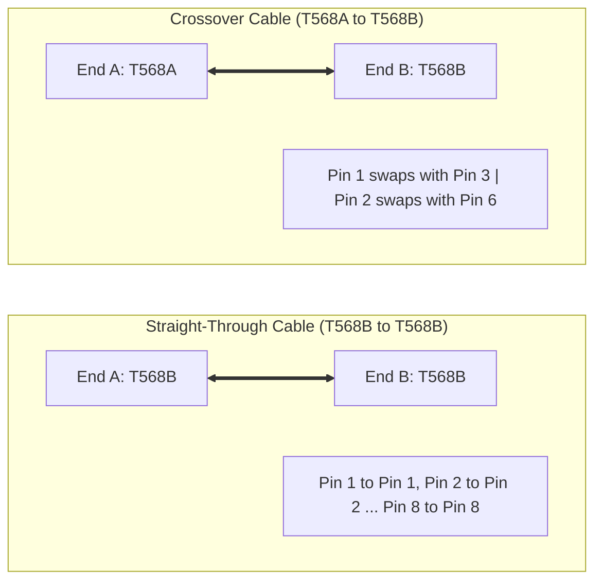
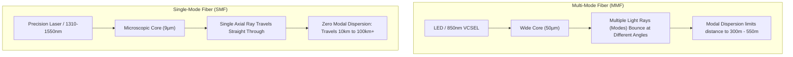
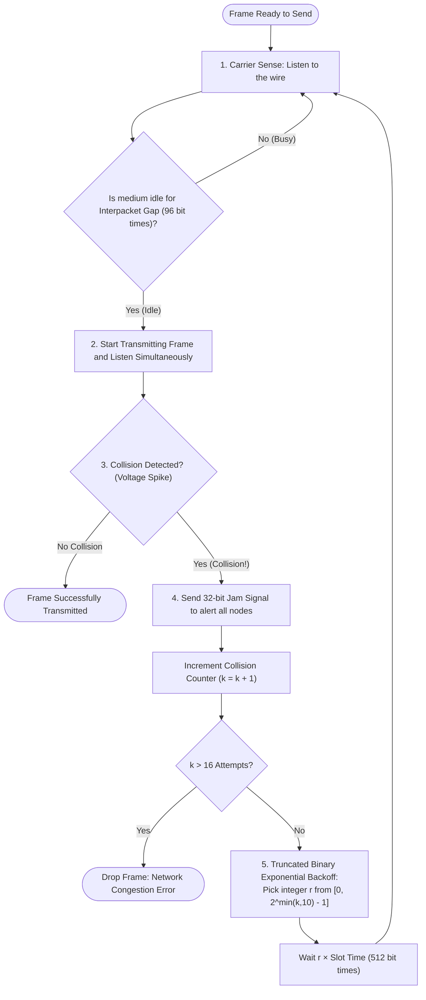

# Ethernet Cabling, Fiber Optics & Duplex Transmission

At the lowest level of computer networking lies Layer 1 of the OSI model: the **Physical Layer**. Before IP addresses, routing tables, or TCP sockets can exist, data must take physical form as electrical voltages pulsing down copper wire, pulses of laser light flickering inside microscopic glass fibers, or electromagnetic radio waves propagating through the atmosphere.

Understanding cabling and physical transmission physics prevents the subtle Layer 1 faults—such as duplex mismatches, excessive crosstalk, or optical attenuation—that silently ruin higher-layer protocols.

---

## 1. Copper Media & Twisted Pair Physics

The overwhelming majority of local area network (LAN) connections terminate in **twisted pair copper cables**.

```
           Twisted Pair Physics: Common-Mode Noise Rejection
           
External Noise (EMI)  ───►  +V_noise                +V_noise
                             │                         │
Wire A (Signal +)    ════════╪═════════════( Twist )═══╪═════════► Signal + V_noise
                             │                         │
Wire B (Signal -)    ════════╪═════════════( Twist )═══╪═════════► -Signal + V_noise
                             ▼                         ▼
   Differential Receiver: V_out = (Signal + V_noise) - (-Signal + V_noise) = 2 × Signal
```

### Why Wires Are Twisted

Copper conductors act as antennas:
1. **Electromagnetic Interference (EMI):** External electric fields (fluorescent ballasts, elevator motors, power lines) induce unwanted voltage spikes in adjacent copper lines.
2. **Crosstalk:** Signals traveling through one pair induce an unwanted signal in an adjacent pair inside the same cable sleeve (**Near-End Crosstalk, NEXT**, and **Far-End Crosstalk, FEXT**).

Twisting pairs together solves this through **differential signaling**:
- Instead of transmitting a signal referenced to ground, the transmitter sends the signal down **Wire A** and the inverted inverse down **Wire B** ($+V$ and $-V$).
- Because both wires are wound symmetrically around each other, external electromagnetic noise couples equally into both conductors ($+V_{\text{noise}}$ on Wire A, $+V_{\text{noise}}$ on Wire B).
- The receiver measures the **voltage difference** between the two wires:
  $$V_{\text{received}} = (V_{\text{signal}} + V_{\text{noise}}) - (-V_{\text{signal}} + V_{\text{noise}}) = 2 \cdot V_{\text{signal}}$$
- The common noise term cancels out completely. This is known as **Common Mode Rejection**.
- Higher category cables specify tighter twists per centimeter (and varying twist rates between pairs) to eliminate mutual induction between adjacent internal pairs.

---

### UTP vs. STP Shielding


```
       UTP (Unshielded Twisted Pair)           STP / S-FTP (Shielded Twisted Pair)
       ┌───────────────────────────┐           ┌───────────────────────────────────┐
       │ Outer Jacket (PVC/LSZH)   │           │ Outer Jacket (PVC/LSZH)           │
       │  ┌───┐ ┌───┐ ┌───┐ ┌───┐  │           │ Overall Braided Screen (S)        │
       │  │ 1 │ │ 2 │ │ 3 │ │ 4 │  │           │  ┌──────┐ ┌──────┐ ┌──────┐ ┌────┐│
       │  └───┘ └───┘ └───┘ └───┘  │           │  │Foil 1│ │Foil 2│ │Foil 3│ │Foil││
       │  4 Unshielded Twisted     │           │  └──────┘ └──────┘ └──────┘ └────┘│
       │  Pairs + Plastic Spline   │           │  Grounding Drain Wire             │
       └───────────────────────────┘           └───────────────────────────────────┘
```

- **UTP (Unshielded Twisted Pair):** Standard office cabling. Relies entirely on differential signaling and precise pair twisting to resist interference. Flexible, thin, inexpensive, and easy to terminate.
- **STP / FTP (Shielded / Foiled Twisted Pair):** Encased in aluminum foil shields per pair (U/FTP) or with an overall outer braided copper shield (S/FTP). Necessary in industrial environments, datacenters near high-voltage busbars, or broadcast studios.
- **Drain Wire:** Shielded cables include a bare tinned copper drain wire that must be properly bonded to shielded metal RJ-45 jacks and grounded switch chassis; an ungrounded shield acts as an antenna, worsening interference.

---

### Copper Cable Category Ratings

The Telecommunications Industry Association (TIA/EIA-568) and ISO/IEC 11801 classify twisted-pair copper cables into performance categories:

| Category | Max Speed | Bandwidth | Max Length | Shielding | Primary Applications |
| :--- | :--- | :--- | :--- | :--- | :--- |
| **Cat 3** | 10 Mbps | 16 MHz | 100 m | UTP | Legacy 10BASE-T Ethernet, analog voice PBX |
| **Cat 5** | 100 Mbps | 100 MHz | 100 m | UTP | Fast Ethernet (100BASE-TX) (Obsolescent) |
| **Cat 5e** | 1 Gbps | 100 MHz | 100 m | UTP / STP | Gigabit Ethernet (1000BASE-T), home LANs |
| **Cat 6** | 1 Gbps / 10 Gbps | 250 MHz | 100 m (1G) / 55 m (10G) | UTP / STP | Modern standard office drop, internal spline divider |
| **Cat 6a** | 10 Gbps | 500 MHz | 100 m (10G) | STP / UTP | Enterprise 10GBASE-T, PoE++ access points |
| **Cat 7** | 10 Gbps | 600 MHz | 100 m | S/FTP (Shielded) | ISO standard, GG45/TERA connectors, datacenters |
| **Cat 8** | 25G / 40 Gbps | 2000 MHz | 30 m | S/FTP | Datacenter top-of-rack switch-to-server interconnects |

> [!NOTE]
> The universal 100-meter distance limit for horizontal copper cabling comprises **90 meters of solid-core structural cable** in walls and conduits, plus **10 meters of stranded flexible patch cables** at the ends.

---

## 2. Pinouts & Wiring Standards: T568A vs. T568B

Ethernet cables terminate in **8P8C (8 Position, 8 Contact)** modular connectors, universally referred to as **RJ-45**. Inside are 8 color-coded conductors arranged into 4 pairs:
- **Pair 1:** Blue / White-Blue
- **Pair 2:** Orange / White-Orange
- **Pair 3:** Green / White-Green
- **Pair 4:** Brown / White-Brown

ANSI/TIA-568 establishes two standardized color-code pinouts: **T568A** and **T568B**.

```
                   RJ-45 Modular Plug Pinout (Tab Facing Down)
                   
          ┌───┬───┬───┬───┬───┬───┬───┬───┐
          │ 1 │ 2 │ 3 │ 4 │ 5 │ 6 │ 7 │ 8 │
          └───┴───┴───┴───┴───┴───┴───┴───┘
            ▲   ▲   ▲   ▲   ▲   ▲   ▲   ▲
            │   │   │   │   │   │   │   └── Pair 4 (Solid)
            │   │   │   │   │   │   └────── Pair 4 (Stripe)
            │   │   │   │   │   └────────── Pair 2/3 (Solid)
            │   │   │   │   └────────────── Pair 1 (Stripe)
            │   │   │   └────────────────── Pair 1 (Solid)
            │   │   └────────────────────── Pair 2/3 (Stripe)
            │   └────────────────────────── Pair 3/2 (Solid)
            └────────────────────────────── Pair 3/2 (Stripe)
```

### Complete Pinout Specification Table

| Pin # | T568A Wire Color | T568B Wire Color | 10/100BASE-TX Signal | 1000BASE-T (Gigabit) Signal |
| :---: | :--- | :--- | :---: | :---: |
| **1** | White / Green Stripe | White / Orange Stripe | **TX+** (Transmit +) | **BI_DA+** (Bidirectional Pair A +) |
| **2** | Green Solid | Orange Solid | **TX-** (Transmit -) | **BI_DA-** (Bidirectional Pair A -) |
| **3** | White / Orange Stripe | White / Green Stripe | **RX+** (Receive +) | **BI_DB+** (Bidirectional Pair B +) |
| **4** | Blue Solid | Blue Solid | *Unused* | **BI_DC+** (Bidirectional Pair C +) |
| **5** | White / Blue Stripe | White / Blue Stripe | *Unused* | **BI_DC-** (Bidirectional Pair C -) |
| **6** | Orange Solid | Green Solid | **RX-** (Receive -) | **BI_DB-** (Bidirectional Pair B -) |
| **7** | White / Brown Stripe | White / Brown Stripe | *Unused* | **BI_DD+** (Bidirectional Pair D +) |
| **8** | Brown Solid | Brown Solid | *Unused* | **BI_DD-** (Bidirectional Pair D -) |

> [!IMPORTANT]
> Notice the split pair on Pins 3 and 6! Pin 3 is the stripe wire, but its solid mate lands on Pin 6 (straddling Pins 4 and 5). This intentional geometry preserves backwards compatibility with analog telephone lines (which used center Pins 4 & 5 for voice line 1).

---

### Straight-Through vs. Crossover Cables

Depending on how the two ends of a cable are crimped:



Historically, networking gear fell into two hardware transmission categories:
- **DTE (Data Terminal Equipment):** End hosts, PCs, Servers, Router Ethernet interfaces. Transmits on Pins 1 & 2; listens on Pins 3 & 6.
- **DCE (Data Circuit-terminating Equipment):** Switches, Hubs, Bridges. Transmits on Pins 3 & 6; listens on Pins 1 & 2.

```
Rule of Thumb:
- Connecting unlike devices (DTE to DCE, e.g., PC to Switch): Straight-Through Cable.
- Connecting like devices (DTE to DTE or DCE to DCE, e.g., PC to PC, Switch to Switch, Router to PC): Crossover Cable.
```

### Auto MDI-X (Medium Dependent Interface Crossover)

In modern networking, physical crossover patch cables are obsolete thanks to **Auto MDI-X** (standardized in IEEE 802.3ab for Gigabit Ethernet).
- During physical link negotiation, the network interface card's PHY transceiver senses whether incoming electrical idle pulses appear on its transmit or receive pins.
- If it detects another DTE transmitting on the same pins, the PHY switches its internal silicon crossbar switch in software, flipping the internal TX and RX paths automatically.
- Any standard straight-through patch cable works between any two modern devices.

---

## 3. Fiber Optic Cabling

Copper cabling encounters severe physical barriers at long distances and multi-gigabit frequencies due to electrical resistance and electromagnetic radiation. **Fiber optic cabling** solves this by transmitting data as pulses of light through ultra-pure silica glass core strands.


### The Physics: Total Internal Reflection

Light rays travel through the central glass **core**. Surrounding the core is glass **cladding** manufactured with a slightly lower refractive index ($n_2 < n_1$):

```
                       Physics of Fiber Light Transmission
                       
       Cladding (Refractive Index n2 = 1.45)
    ───┬───────────────────────────────────────────────────┬───
       │  \   Ray propagates by Total Internal Reflection  │
 Core  │   \         /\         /\         /\              │
(n1=1.47)   \       /  \       /  \       /  \             │
       │     \     /    \     /    \     /    \            │
       │      \   /      \   /      \   /      \           │
    ───┴───────\─/────────\─/────────\─/────────\──────────┴───
       Cladding (Refractive Index n2 = 1.45)
```

By Snell's Law, when light hits the boundary between core and cladding at an angle greater than the **critical angle** ($\theta_c = \arcsin(n_2 / n_1)$), 100% of the optical power is reflected back into the core with zero light escaping outward.

---

### Single-Mode vs. Multi-Mode Fiber

Fiber cables divide into two distinct architectures:



### Detailed Optical Media Comparison

| Specification | Multi-Mode Fiber (MMF) | Single-Mode Fiber (SMF) |
| :--- | :--- | :--- |
| **Core Diameter** | $50\ \mu\text{m}$ (OM2/OM3/OM4) or $62.5\ \mu\text{m}$ (OM1) | $9\ \mu\text{m}$ (OS1/OS2) |
| **Cladding Diameter** | $125\ \mu\text{m}$ | $125\ \mu\text{m}$ |
| **Light Source** | Inexpensive LEDs or 850 nm VCSEL lasers | Tuned Solid-State Lasers (Fabry-Perot / DFB) |
| **Operating Wavelengths**| 850 nm, 1300 nm | 1310 nm, 1550 nm |
| **Distance Capability** | 300 m to 550 m | 10 km, 40 km, up to 100+ km |
| **Jacket Color Standard**| Orange (OM1/OM2), Aqua (OM3/OM4), Lime Green (OM5) | Yellow (OS1/OS2) |
| **Limiting Factor** | **Modal Dispersion** (light modes arriving out of sync) | **Chromatic Dispersion** & attenuation |
| **Typical Deployment** | Intra-datacenter racks, enterprise campus backbones | Long-haul telecommunications, metro ISP rings |

---

### Common Optical Connectors

```
      LC Connector                  SC Connector                  MTP / MPO
     (Lucent / Little)            (Subscriber / Square)       (Multi-Fiber Push-On)
     ┌───────────────┐             ┌─────────────────┐         ┌─────────────────┐
     │  [■]   [■]    │             │   [ ■ ] [ ■ ]   │         │ [ •••••••••••• ]│
     │ Small Form (SFP)            │ Push-Pull Snap  │         │ 12 to 24 Fibers │
     └───────────────┘             └─────────────────┘         └─────────────────┘
```

1. **LC (Lucent Connector / Local Connector):** The reigning datacenter champion. Small form-factor with a RJ-45-style latch. Plugs directly into optical transceivers (**SFP, SFP+, SFP28**).
2. **SC (Subscriber Connector / Standard Connector):** Square, push-pull locking mechanism. Widely used in telco demarcation boxes, GPON / FTTH residential fiber.
3. **ST (Straight Tip):** Round bayonet twist-lock connector (resembling BNC). Found in legacy industrial automation and military installations.
4. **MTP/MPO (Multi-fiber Push-On):** Houses 12 to 24 parallel optical fibers inside a single high-density connector. Powers 40G (40GBASE-SR4), 100G (100GBASE-SR4), and 400G datacenter spine-leaf fabrics.

---

## 4. Transmission Modes: Simplex, Half-Duplex & Full-Duplex

The communication relationship between two connected network endpoints defines its **duplex mode**:

```
1. SIMPLEX (One-Way Street)
   Node A  ────────────────────────────►  Node B
   (e.g., FM Radio, Security Sensor to Alarm)

2. HALF-DUPLEX (One-Lane Bridge with Flagman)
   Node A  ◄───────── Time 1 ───────────  Node B
   Node A  ────────── Time 2 ──────────►  Node B
   (e.g., Walkie-talkies, Legacy Ethernet Hubs, Wi-Fi 802.11)

3. FULL-DUPLEX (Two-Lane Highway)
   Node A  ────────── Transmit ────────►  Node B
   Node A  ◄───────── Receive ──────────  Node B
   (e.g., Switched Ethernet, Modern Telephony)
```

- **Simplex:** Data flows in one direction only. The receiver never sends feedback.
- **Half-Duplex:** Bidirectional data flow, but **only one device can transmit at any given instant**. If both devices transmit simultaneously, their signals collide on the physical medium, corrupting both payloads.
- **Full-Duplex:** Bidirectional data flow simultaneously. The physical medium provides physically separate or frequency-separated channels for transmission and reception (e.g., Pair 1-2 for TX and Pair 3-6 for RX in 100BASE-TX). **Collisions are physically impossible in full-duplex.**

---

## 5. CSMA/CD: Collision Detection in Shared Ethernet

In early Ethernet deployments (such as 10BASE5 thick coax, 10BASE2 thin coax, or multi-port **Ethernet Hubs**), all connected network interfaces shared a single, common physical conductor. This shared medium is known as a **Collision Domain**.

To govern who gets to speak without corrupting the wire, IEEE 802.3 standardized **CSMA/CD** (**Carrier Sense Multiple Access with Collision Detection**).



---

### The 5-Step CSMA/CD Algorithm Explained

#### Step 1: Carrier Sense (Listen Before Talking)
Before keying up the transmitter, the station's PHY listens to the wire. If electrical carrier energy is detected, another node is transmitting. The station defers transmission until the line remains quiet for at least **96 bit times** (the Interpacket Gap, or IFG: $9.6\ \mu\text{s}$ at 10 Mbps).

#### Step 2: Multiple Access (Anyone May Transmit When Quiet)
Any station with pending data has equal right to transmit as soon as the bus becomes idle. There is no central arbiter, token, or time-slot schedule.

#### Step 3: Collision Detection (Listen While Talking)
Because electricity propagates down copper at roughly two-thirds the speed of light ($\approx 200{,}000\ \text{km/s}$), two stations on opposite ends of a 100-meter segment can both perceive the wire as idle simultaneously and begin transmitting at the same instant.

As the two electrical wave fronts meet on the wire, their voltages additively superimpose. The transceiver continuously measures wire voltage while transmitting:
- If measured DC voltage exceeds the expected single-station transmit threshold, a **collision** has occurred.

#### Step 4: Jam Signal Propagation
The instant a transmitting station detects a collision, it aborts normal frame transmission and transmits a **32-bit Jam Signal** (alternating 1s and 0s). This deliberate burst injects sufficient energy into the cable to guarantee that every station on the segment detects the collision and discards whatever garbled fragments they received.

#### Step 5: Truncated Binary Exponential Backoff
If every station retried immediately after the jam signal, they would collide forever. Instead, stations run the **Truncated Binary Exponential Backoff** algorithm:
1. Let $k$ be the number of collisions this frame has suffered ($k = 1, 2, \dots$).
2. Calculate the backoff window range:
   $$r \in \left[0, 2^{\min(k, 10)} - 1\right]$$
3. Choose a random integer $r$ uniformly from that range.
4. The station waits a duration equal to:
   $$\text{Backoff Time} = r \times \text{Slot Time}$$
   - In 10/100 Mbps Ethernet, **Slot Time** is **512 bit times** ($51.2\ \mu\text{s}$ at 10 Mbps).
5. On collision 1 ($k=1$), $r \in \{0, 1\}$.
6. On collision 2 ($k=2$), $r \in \{0, 1, 2, 3\}$.
7. On collision 10 ($k=10$), $r \in \{0, 1, \dots, 1023\}$.
8. After 10 collisions, the window stops expanding (truncated at 1023).
9. If a frame fails **16 consecutive attempts**, it is discarded, and an error is reported up the protocol stack.

---

### The Mathematical Reason Behind Ethernet's 64-Byte Minimum Frame

Why does the Ethernet standard specify a **minimum frame size of 64 bytes (512 bits)**?

```
Station A ────────────────── 100 meters (Propagation Delay τ) ────────────────── Station B
   │                                                                                │
   ├── Transmits bit 1 ────────────────────────────────────────────────────────────►│ (at t = τ - ε,
   │                                                                                │  B starts sending)
   │◄── Collision Wave propagates back (Delay τ) ───────────────────────────────────┤
(Arrives at A at t = 2τ)
```

In the worst-case scenario, Station A transmits a frame, and just before the first bit reaches Station B on the far end of the network segment, Station B starts transmitting.
- The collision occurs at time $t \approx \tau$ (one-way propagation delay).
- The collision wavefront takes another $\tau$ to travel back to Station A.
- Station A discovers the collision at time $t = 2\tau$ (the **Round-Trip Propagation Time**, or RTT).

> [!CAUTION]
> If Station A finished transmitting its entire frame before the collision wavefront arrived at $2\tau$, Station A would assume its frame had been delivered cleanly and would erase it from its transmit buffer! The frame would be lost forever without detection.

Therefore, the **frame transmission duration must be strictly greater than the round-trip propagation time across the maximum allowable network diameter**:
$$\text{Frame Transmission Time} \ge 2 \times \tau_{\text{prop}} + \text{Jam Time}$$

In original 10BASE5 networks (with repeaters), round-trip delay plus repeater latency was bounded within **51.2 microseconds** ($512\ \text{bits} / 10\ \text{Mbps}$). Hence, the minimum frame size was fixed at **512 bits = 64 bytes**. Any payload smaller than 46 bytes must be padded with zeroes to guarantee the frame meets this 64-byte threshold.

---

## 6. Duplex Mismatch: The Silent LAN Killer

In modern enterprise switches, every port can run Full-Duplex. However, network interfaces still support **Autonegotiation** (IEEE 802.3u) to determine link speed and duplex settings automatically.

When autonegotiation fails or an administrator hardcodes one side, a **duplex mismatch** occurs:

```
        Switch Port 1 (Hardcoded)                   Server NIC (Auto-Negotiate)
       ┌────────────────────────┐                  ┌───────────────────────────┐
       │ Speed: 100 Mbps        │◄─ Cat 6 Patch ──►│ Speed: 100 Mbps (Sensed) │
       │ Duplex: FULL-DUPLEX    │     Cable        │ Duplex: HALF-DUPLEX (Def) │
       └────────────────────────┘                  └───────────────────────────┘
```

### What Happens:
1. **The Link Stays Up!** Both devices detect electrical link pulses, so physical link status LEDs illuminate green.
2. The Full-Duplex switch sends and receives simultaneously without running CSMA/CD.
3. The Half-Duplex server listens before transmitting and monitors line voltage while transmitting.
4. When the switch transmits while the server is sending, the server interprets the switch's incoming signal as a **collision**, halts transmission, sends a jam signal, and increments its backoff counter.
5. Meanwhile, the switch sees the server's jam signal as a corrupted frame and increments its **FCS / CRC Error Counter**.

```
Symptoms of Duplex Mismatch:
- Low-traffic ping tests succeed with minimal latency (single small packets rarely collide).
- Large file transfers or iperf throughput tests crawl at 0.05% of rated link speed.
- Server interface stats report rampant "Late Collisions".
- Switch interface stats report surging "CRC Errors", "Runts", and "Frame Check Errors".
```

---

## 7. Hands-On Verification & CLI Commands

Inspect physical layer status and duplex health on operating systems and enterprise switches:

### Linux: Inspecting Physical Layer with `ethtool`
```bash
# Display link speed, duplex mode, and autonegotiation state
sudo ethtool eth0

# Example Output:
#   Supported ports: [ TP ]
#   Supported link modes:   10baseT/Half 10baseT/Full
#                           100baseT/Half 100baseT/Full
#                           1000baseT/Full
#   Speed: 1000Mb/s
#   Duplex: Full
#   Auto-negotiation: on
#   Link detected: yes

# Check for physical errors (CRC, drop, collision counters)
netstat -i
# or
ip -s link show dev eth0
```

### Windows: PowerShell Physical Interface Health
```powershell
# Get link speed and duplex status
Get-NetAdapter | Select-Object Name, InterfaceDescription, Status, LinkSpeed, FullDuplex

# Check for discarded packets and errors
Get-NetAdapterStatistics -Name "Ethernet"
```

### Cisco IOS: Detecting Physical Collisions & Mismatches
```cisco
Switch# show interfaces GigabitEthernet 0/1
GigabitEthernet0/1 is up, line protocol is up 
  Hardware is Gigabit Ethernet, address is 001a.a12b.3c4d
  Full-duplex, 1000Mb/s, media type is 10/100/1000BaseTX
  input flow-control is off, output flow-control is unsupported
  5 minute input rate 12000 bits/sec, 15 packets/sec
  5 minute output rate 8000 bits/sec, 10 packets/sec
     1584920 packets input, 194827104 bytes, 0 no buffer
     Received 120 broadcasts (0 multicast)
     0 runts, 0 giants, 0 throttles
     0 input errors, 0 CRC, 0 frame, 0 overrun, 0 ignored
     0 watchdog, 0 multicast, 0 pause input
     0 input packets with dribble condition detected
     2104921 packets output, 281940192 bytes, 0 underruns
     0 output errors, 0 collisions, 0 interface resets
     0 babbles, 0 late collision, 0 deferred
```

> [!TIP]
> If `late collision` or `CRC` counts are non-zero and incrementing in `show interfaces`, verify physical cable length (must be $\le 100\ \text{m}$), inspect terminations for split pairs, and guarantee both link partners are set to `auto` or both to explicit `full-duplex`.
